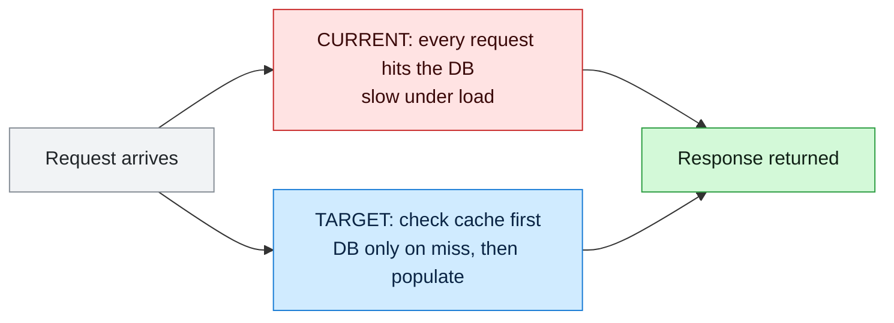
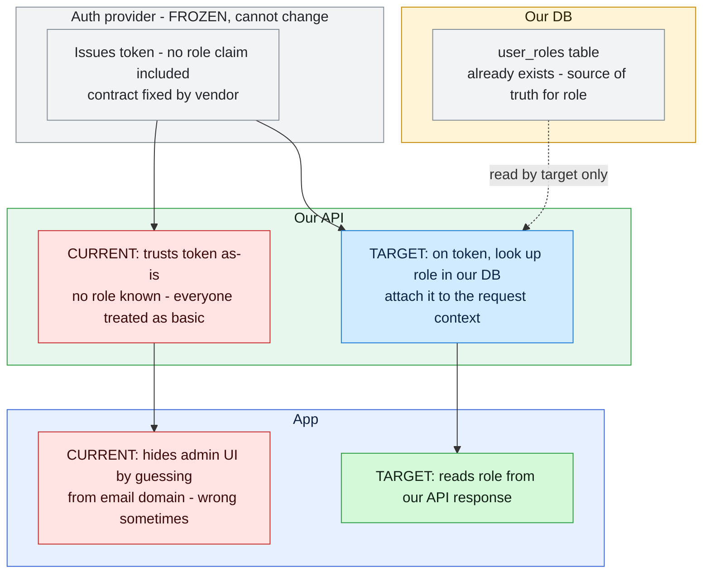
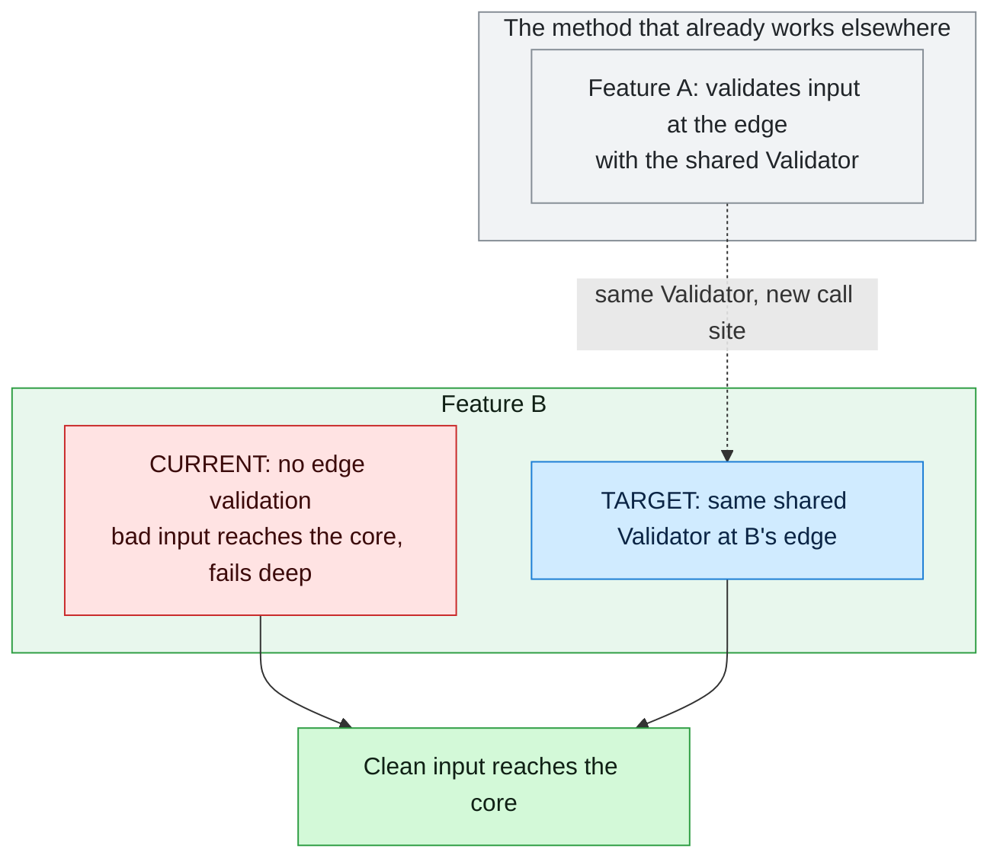

# Current vs Target diagram — a single-diagram delta convention

> **What this is:** a reusable convention for drawing **one** Mermaid diagram that shows a system's **current** state and its **target** state together, with the **delta** (what changes) visually obvious. It is the "parts in play, and what changes in each" picture — the kind that makes a design reviewable at a glance without reading the prose first.
>
> **What this is not:** a full architecture diagram, a sequence diagram, or a per-state set of separate diagrams. The whole point is *one* picture where current and target share the same lanes so the eye reads the change, not two pictures the reader has to diff in their head.
>
> **How it fits the investigation method:** the Investigation Report ([investigation-report.md](../skills/investigation/docs/investigation-report.md)) §5 ("Why it exists + data paths") is the natural home for this diagram — it turns the traced current path and the proposed target path into a single visual. It is equally usable in a spec, a PR description, or a design doc. A workflow rule or skill can reference this file the way `SKILL.md` references [problem-check.md](../skills/investigation/docs/problem-check.md).

---

## When to use it

Use it when **all** of these hold:

1. There is a **before and an after** — you are changing an existing flow, not designing a greenfield one.
2. The change **crosses parts** — multiple components, layers, or owning systems are involved, and the reader needs to see *which part changes and which stays put*.
3. A reader who sees only the diagram should be able to state **what changes, where, and what stays frozen** — without the surrounding text.

Skip it for single-component changes (prose is faster) or pure sequence/timing questions (use a `sequenceDiagram`).

---

## The five rules

1. **One diagram.** Current and target live in the same figure, flowing through the same lanes. If you are tempted to make a second diagram, you are usually missing a color or a lane, not a diagram.
2. **Lanes = owners.** Group nodes into `subgraph` lanes, one per owning system/layer/actor. Give node IDs an owner prefix (`FE_`, `API_`, `DB_`) so the ownership is legible in the source, not just the render.
3. **Color = change status, not owner.** Owner is shown by the lane; the node's *fill* shows whether it is **current** (being replaced), a **target delta** (new/changed), **shared** (unchanged, on both paths), or an **outcome** (the good end state). One color vocabulary, used everywhere — see the legend block below.
4. **Two chains, shared lanes.** Draw the current path and the target path as two edge chains that pass through the same lanes. Nodes that don't change are `shared` and both chains touch them. This is what makes the delta pop: the red chain and the blue chain diverge exactly where the change is.
5. **Name the constraints and the nuance.** If something is **frozen** (must not change), give it its own greyed lane labeled so. Put the load-bearing subtleties — the ones a reviewer would otherwise miss — as short labels on nodes or edges (e.g. "HEAD returns bytes, not seconds", "optional field → old events still parse"). An unexplained box is a box someone will misread.

---

## The legend block (copy-paste)

Paste this at the top of the `flowchart` and apply the classes. The palette is deliberately the same one used across these docs so diagrams read consistently.

```
  classDef current fill:#ffe3e3,stroke:#c92a2a,color:#3b0a0a
  classDef delta   fill:#d0ebff,stroke:#1c7ed6,color:#0b2545
  classDef shared  fill:#f1f3f5,stroke:#868e96,color:#212529
  classDef ok      fill:#d3f9d8,stroke:#2f9e44,color:#102015
```

| Class | Meaning | Read as |
|---|---|---|
| `current` | today's behavior that the change **replaces** | red — "this is going away / is the problem" |
| `delta` | new or changed node introduced by the target | blue — "this is the change" |
| `shared` | on **both** paths, unchanged (incl. **frozen** parts) | grey — "untouched" |
| `ok` | the target's good end state / outcome | green — "this is the win" |

**Owner lane tints** — pick one distinct hue per owning system and reuse it for that system's `subgraph` in every diagram. Suggested set (background / stroke / text):

```
  style SG_FRONTEND fill:#e7f0ff,stroke:#3867d6,color:#10203f
  style SG_BACKEND  fill:#e8f7ed,stroke:#2f9e44,color:#102015
  style SG_DATABASE fill:#fff4d6,stroke:#c98a00,color:#2d2200
  style SG_EXTERNAL fill:#f3f0ff,stroke:#7048e8,color:#1f183d
  style SG_FROZEN   fill:#f1f3f5,stroke:#868e96,color:#212529
```

The lane tint is quiet (it groups); the node class is loud (it signals the change). Don't let the two fight — keep lane tints pale.

---

## Example 1 — minimal (one service gains a cache)

The smallest useful form: same request path, one new node, current vs target diverge at exactly one point.



The eye lands on the one point of divergence. No lanes needed at this size.

---

## Example 2 — cross-layer with a frozen constraint

The common real case: several owners, and one of them is **off-limits**. Here a third-party auth provider is frozen, so the change has to land in the pieces you own. Note the frozen lane (grey), the two chains sharing lanes, and the nuance labels.



A reviewer reads, without the prose: the vendor is untouched, the role already exists in our DB, the API starts reading it, and the app stops guessing. The frozen lane makes the constraint impossible to miss — which is exactly what you want when a constraint is the whole reason for the design.

---

## Example 3 — a "reference lane" (leverage an existing pattern)

When the target **reuses a method the system already has elsewhere**, add a top lane showing that exemplar and connect it to the target with a dotted "same method" edge. This makes "we're not inventing anything, we're applying what already works" visible.



The dotted edge carries the argument: the delta is not novel code, it is an existing pattern pointed at a new place.

---

## Mermaid syntax that will bite you

These break the render (often silently — the block just doesn't draw). Learned the hard way; check them before you ship a diagram:

- **No colons in edge labels.** `-. same method: the holder measures .->` fails. Use a dash: `-. same method - the holder measures .->`.
- **No raw angle brackets in labels.** `length < 0` breaks parsing. Write `length lt 0` or `length below zero`.
- **No unescaped parentheses / commas** inside unquoted node text. Always quote node labels: `ID["text here"]`.
- **Line breaks are `<br/>`,** not real newlines, inside a node label.
- **Node IDs are bare identifiers** (`API_T1`), no spaces or punctuation; put the human text in the quoted label.
- **`subgraph` titles** should be quoted too if they contain anything but letters: `subgraph SG_X["Auth provider - FROZEN"]`.
- **Validate before committing** — render it (artifact preview, or any Mermaid live editor). A diagram that doesn't draw is worse than no diagram.

---

## Anti-patterns

| Don't | Do |
|---|---|
| Two separate diagrams (one "before", one "after") | One diagram, shared lanes, two colored chains |
| Color by owner | Color by change status; owner is the lane |
| A box with no label for a subtle step | Name the nuance on the node or edge |
| Omitting the frozen/unchanged parts | Show them as `shared`/frozen — "what doesn't change" is half the message |
| A wall of 30 nodes | Collapse unchanged plumbing into one `shared` node; the diagram is about the delta, not the whole system |
| Leaving the render unchecked | Preview it — silent parse failures are common |

---

## Wiring it into a rule or skill

To make this a referenced standard (the way the investigation method references `problem-check.md`):

1. Keep this file as the single source in `agents/docs/`.
2. From the rule/skill that should use it, link it: *"When the change has a before/after across parts, include one current-vs-target diagram per [current-vs-target-diagram.md](../docs/current-vs-target-diagram.md)."*
3. If you add it to the investigation flow, the attach point is **Report §5** (data paths) — state "single diagram, current vs target, deltas legible" as the done-when. In orchestrated tickets the diagram lives in the **standalone diagrams artifact** ([investigation-diagrams.md](../skills/investigation/docs/investigation-diagrams.md)) and §5 links out to it rather than embedding it.
4. Regenerate the tool mirrors (`.claude/`, `.cursor/`, `AGENTS.md`) with `agents/scripts/sync-rules.ps1` after editing — never hand-edit the generated copies.
