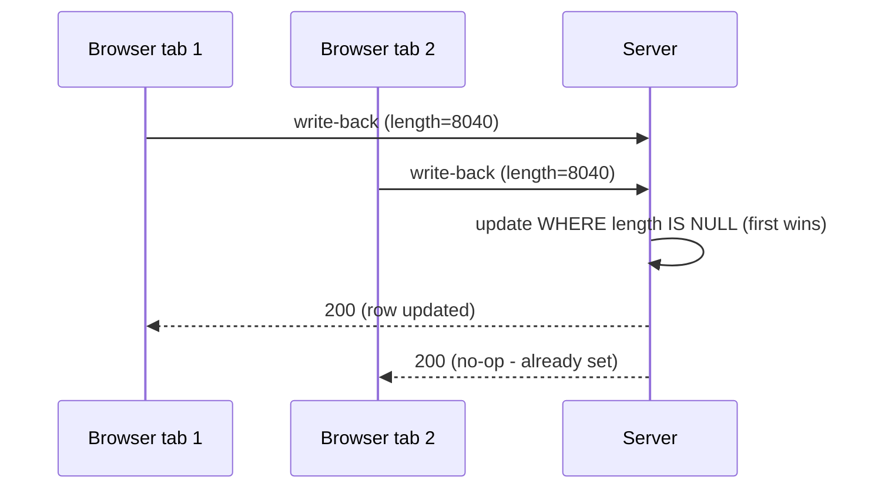

# Investigation diagrams — the standalone visuals artifact

Use this instruction when an investigation's findings need diagrams. Diagrams are a **standalone artifact**, not sections embedded in the investigation report — combining everything into one file creates reference and context-length problems (a single report carrying 70 lines of inline Mermaid is the failure mode this replaces). The report links out; the diagrams file renders.

## Output location

```text
docs/<Project>/tickets/<ticket-slug>/investigations/<ticket-slug>-diagrams.md
```

The investigation report's data-paths section (§5) carries a one-line link to this file instead of an inline diagram.

## When it is produced

The diagrams artifact is a **todo appended to the investigation**: the investigation plan (Phase 1) includes it; the report phase (Phase 2) produces it alongside the report. It can also be created or extended later — during spec review or PR writing — whenever a picture would settle what prose is failing to.

## The three diagram kinds

Include only the kinds the ticket needs; state a one-line N/A for kinds deliberately skipped.

### 1. Current vs target delta (`flowchart`)

The "what changes, where, and what stays frozen" picture. Follow the single-diagram convention in [current-vs-target-diagram.md](./current-vs-target-diagram.md) — one figure, lanes = owners, color = change status, two chains through shared lanes, constraints named. Use when there is a before/after that crosses parts.

### 2. Flow diagrams (`flowchart`)

Data or control paths that the delta diagram doesn't cover: how a request travels, where a value originates and lands, which branch points exist. Use when the investigation traced a path whose shape matters and prose keeps re-explaining it.

### 3. Sequence diagrams (`sequenceDiagram`)

Workflow and timing representations — **hugely beneficial for edge cases like race conditions**: concurrent viewers, retry overlap, double-write windows, event ordering. Use when *when* matters as much as *what*: two actors touching shared state, an idempotency guard, anything where the failure only exists in an interleaving.



## Artifact template

````markdown
# Diagrams — <Project>/<ticket-slug>

> Companion to [<ticket-slug>-investigation.md](./<ticket-slug>-investigation.md). Each diagram states what question it answers.

## Current vs target

<one line: what this shows>  (or: N/A — <reason>)

```mermaid
...
```

## Flows

<one line per diagram: what this shows>  (or: N/A — <reason>)

## Sequences

<one line per diagram: which interleaving / edge case this exposes>  (or: N/A — <reason>)
````

## Rules

- **Every diagram answers a named question.** A diagram nobody can caption is decoration; cut it.
- **Validate the render before committing** — silent Mermaid parse failures are common. The syntax gotchas in [current-vs-target-diagram.md](./current-vs-target-diagram.md) (no colons in edge labels, no raw angle brackets, quote node labels, `<br/>` for line breaks) apply to every diagram kind here.
- **Keep the report lean.** If a diagram earns a place in the report or a spec, link it; do not paste it back inline.
- One diagrams file per ticket; superseded diagrams move to the ticket's `dnu/` folder with the rest of the superseded material.
