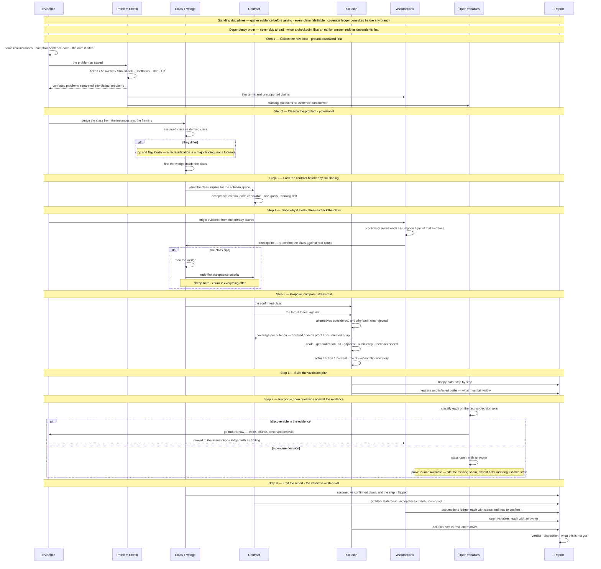

# Investigation sequence

> **What this is:** how the method in [SKILL.md](./SKILL.md) actually operates — the eight steps as a sequence, with the returns drawn in. The steps are ordered by dependency, so the value of the diagram is the **backward** arrows: where a later step flips an earlier answer and forces its dependents to be redone.
>
> **Syntax constraints inside the mermaid block** — use `—` or `·` to set off an aside instead of any of these:
>
> - **No parentheses** — LucidChart's mermaid parser rejects them.
> - **No semicolons** — mermaid reads `;` as a statement separator, so a note ends mid-sentence and the remainder is parsed as a new statement.
> - **No `#`** — it opens an HTML entity code.

## Where the returns are

| Return | Trigger | What gets redone |
| --- | --- | --- |
| Problem Check → Step 1 | conflation found | the problem list splits; each distinct problem restated |
| Step 4 checkpoint → Step 2 | class flips against root-cause evidence | the wedge, then the acceptance criteria |
| Step 5 → Step 3 | a criterion has no coverage | the criterion, or the solution that was supposed to meet it |
| Step 7 → Step 1 | an open question turns out discoverable | trace it now; it becomes an assumption with a finding, not a question |
