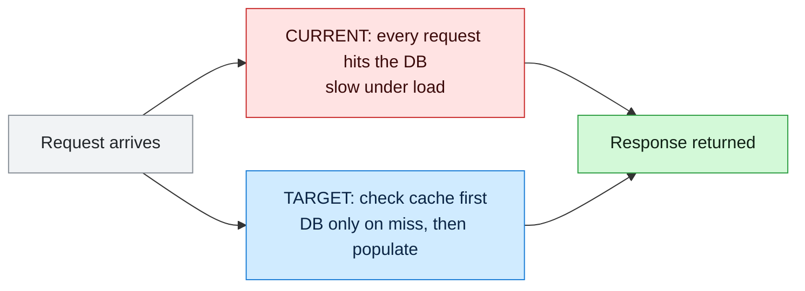
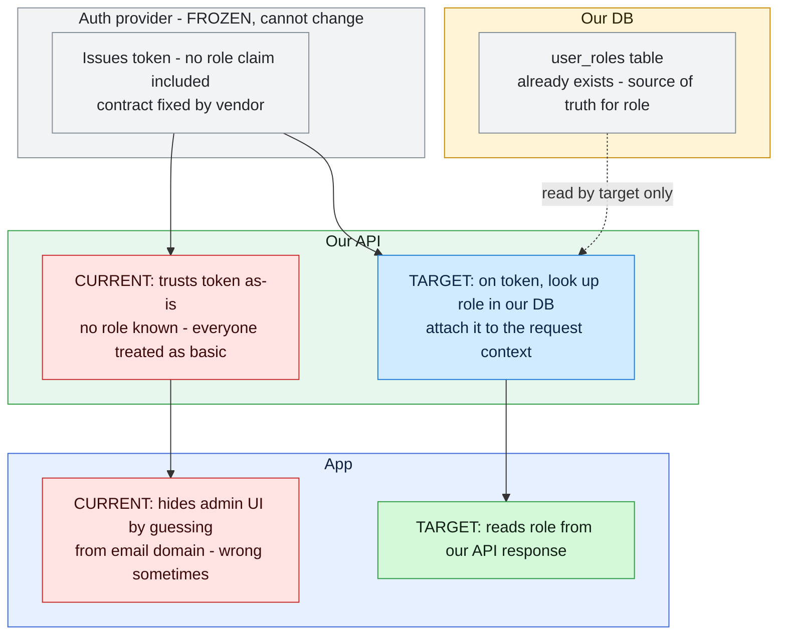
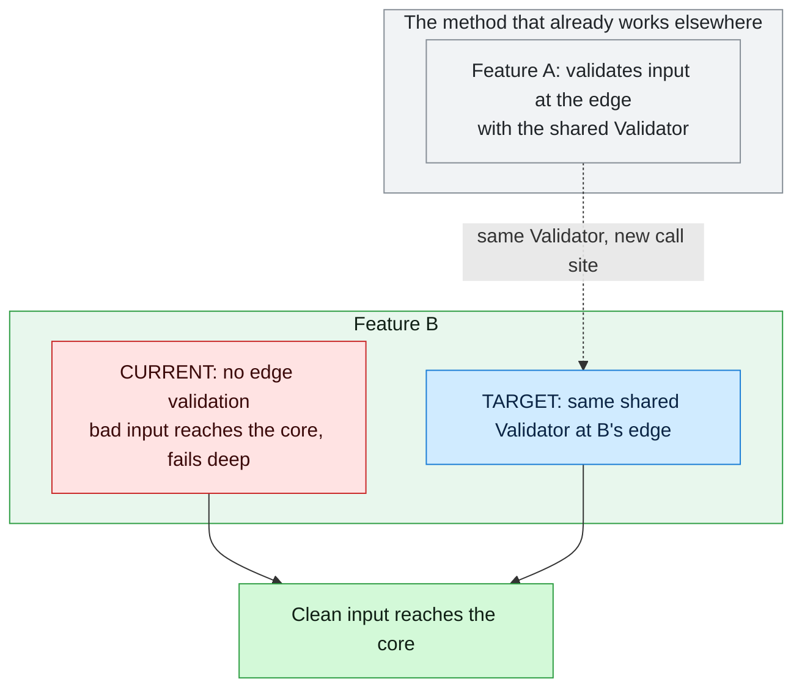
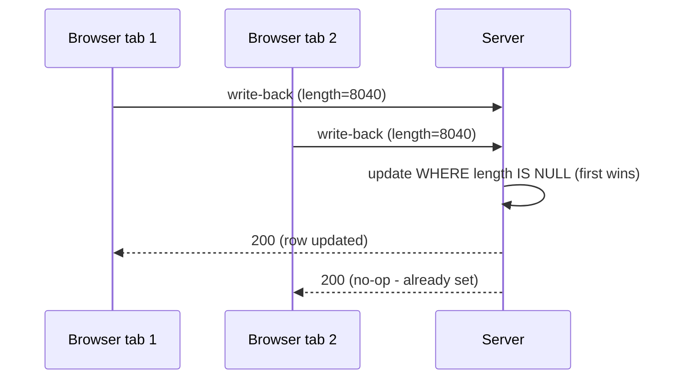

# agents-docs (generated — do not edit)

Source: `agents/docs/**`. Regenerate with `.\agents\scripts\sync-rules.ps1`.

## browser-loop-setup.md

# Browser-loop setup (dustin-thomason)

Task-oriented setup for the runtime browser-observation loop: wiring an agent to observe and drive a live browser during front-end work, so it observes truth (runtime layout, cascade, interaction state) instead of inferring it.

- **Boundary rules (mandatory, load first):** [browser-loop-guardrails.mdc](../rules/browser-loop-guardrails.mdc)
- **Authoritative spec:** [runtime-browser-loop-spec-1.md](../../docs/agents/runtime-browser-loop-spec-1.md)

## When to use

Diagnosing or verifying front-end layout, CSS cascade, or interaction (drag/resize/toggle) at runtime — especially "works at the start and end but breaks in between" bugs, cascade conflicts ("which rule won?"), and flush-to-edge / off-by-N geometry.

## One-time setup

**Stock browser MCP** (drive / screenshot / console / network). This repo ships a project-scoped `.mcp.json` with the Playwright MCP; for availability in **every** project, also register it at user scope:

```
claude mcp add --scope user playwright -- npx @playwright/mcp@latest
```

**Custom CDP tools** (cascade provenance, trajectory sampler, baselines) live in `scripts/browser/`:

```
cd scripts/browser
npm install
npx playwright install chromium
```

(Cursor / other harnesses: add the Playwright MCP to their MCP config. Chrome DevTools MCP is an alternative for driving + console + network.)

## Tools

| Capability | Tool | Status |
| ---------- | ---- | ------ |
| Navigate, click, drag, type; screenshot; console; network bodies | Stock browser MCP (Playwright MCP / Chrome DevTools MCP) | Available now |
| Cascade provenance — which rule won and what it struck through (`CSS.getMatchedStylesForNode`) | `scripts/browser/css-provenance.mjs` | Available |
| Stepped-drag trajectory sampler — per-step `getBoundingClientRect` for many elements + discontinuity flagging | `scripts/browser/trajectory-sampler.mjs` | Available |
| Per-component baseline capture/compare (geometry + visibility + threshold screenshot) | `scripts/browser/baseline.mjs` | Available |

The provenance/trajectory/baseline items are **not** reliably exposed by stock MCP tools; they are thin custom scripts the agent invokes via the shell (they use Playwright + a raw CDP session under the hood). Invocation examples below.

## Invoking the custom tools

Run from `scripts/browser/` (or with the full path). All emit JSON on stdout.

```bash
# Which rule won each property on an element, and what it struck through (spec 3.1):
node css-provenance.mjs --url http://localhost:5173 --selector ".panel"
#   attach to an already-open Chrome instead of launching one:
node css-provenance.mjs --cdp http://localhost:9222 --selector ".panel"

# Stepped drag; capture geometry of many elements per step; flag impossible jumps (spec 3.2-3.3).
# Exits 1 if a discontinuity is flagged. Prefer a --config file for real cases:
node trajectory-sampler.mjs --url http://localhost:5173 --handle ".resize-handle" \
  --dx -240 --dy 0 --steps 12 --watch ".panel,.panel .content,.neighbor" --threshold 50 \
  --trigger-click ".backdrop"

# Per-component baseline: capture once, compare on later changes (spec 3.4, 4).
node baseline.mjs capture  --url http://localhost:5173 --selectors ".panel,.panel .content" \
  --dir ../../docs/<project>/baselines/panel --clip ".panel"
node baseline.mjs compare  --url http://localhost:5173 --selectors ".panel,.panel .content" \
  --dir ../../docs/<project>/baselines/panel --clip ".panel" --max-diff-pixels 100
```

The trajectory sampler takes a `--config <file>` too (fields: `url`, `handle`, `delta:{dx,dy}`, `steps`, `watch:[…]`, `threshold`, `trigger:{action,selector}`) — use it for boundary conditions and multi-step scenarios.

## Method (from the spec)

- **Provenance over guessing.** Use matched styles to get *who won* and *what it overrode*, not just the final computed value.
- **Real interaction, not simulated state.** Dispatch real press -> move-through-intermediate-points -> release. Do not shortcut a resize by setting a width; that skips handle-specific behavior.
- **Sample the trajectory.** Step the interaction in increments; at each checkpoint capture geometry for the target *and* its contents *and* neighbors. Include boundary conditions (fully expanded/collapsed) and follow them with the triggering action (e.g. click-out) plus its assertion. Flag any tracked element that jumps size/position impossibly between adjacent steps.
- **Right tool for the assertion.** Geometry (`getBoundingClientRect`, computed styles) is sub-pixel exact and stable — use it for numeric position/size/spacing checks. Screenshot diffing is noisy — use it for holistic visual regression, always with a pixel tolerance.

## Baselines

Per component, store a baseline and assert future changes against it:

```
docs/<project>/baselines/<component>/
  baseline.json   # geometry (rects) + visibility
  baseline.png    # threshold screenshot
```

Keep the narrative changelog as context, but the baseline is what *tells* a later agent it broke something instead of letting it believe it did not. Note replication conditions (viewport, timing, external state) precisely — clean for deterministic layout/CSS bugs, flakier otherwise.

## Guardrails (always in effect)

The six boundary rules in [browser-loop-guardrails.mdc](../rules/browser-loop-guardrails.mdc) apply the entire time: no specificity band-aids, explain magic constants, keep independent constants independent, a green check is necessary-not-sufficient, fix the rule not the symptom, and **escalate after ~3 non-converging attempts** with a structured account instead of continuing to tune.

## Handoff checklist (spec section 7)

- [x] Claude Code (or equivalent) as the loop; no custom harness.
- [x] Playwright driving + raw `newCDPSession` for hidden domains (DOM/CSS) — used by the scripts below.
- [x] Stock browser MCP for drive / screenshot / console / network — `.mcp.json` (Playwright MCP).
- [x] Thin custom tool: `CSS.getMatchedStylesForNode` cascade/provenance query — `scripts/browser/css-provenance.mjs`.
- [x] Thin custom tool: stepped-drag trajectory sampler capturing multi-element `getBoundingClientRect` + discontinuity flagging — `scripts/browser/trajectory-sampler.mjs`.
- [x] Baseline store per component (geometry + visibility + threshold screenshot) — `scripts/browser/baseline.mjs` + `docs/<project>/baselines/`.
- [x] Boundary rules loaded as enforced agent rules **before** the loop is used — `browser-loop-guardrails` (alwaysApply).

Per-machine activation still required: `npm install` + `npx playwright install chromium` in `scripts/browser/` (see One-time setup).

## cleanup-candidates.md

# Cleanup candidates — archive and consolidation ledger

A running record of outdated references, superseded files, and structural warts across the `agents/` workspace, so cleanup is a worked list instead of a vague intention.

**Sequencing:** cleanup begins **after** the `orchestrate` integration has landed and proven out, using the un-synced index/TOC at `agents/README.md` as the table of contents/map of what exists and why. Until then this file only accumulates candidates.

**Feeding it:** Phase 6 of every orchestrated run performs a cruft check ("did this run surface outdated references, superseded docs, or dead weight?") and appends findings here. Anyone may add a row anytime.

**Rules:** rows are proposals, not decisions — nothing is deleted or moved on the strength of a row alone. When a candidate is resolved, mark the Fate column done with a date; do not delete the row.

## Candidates

| Item | Why it's cruft | Proposed fate | Blocked by |
| --- | --- | --- | --- |
| `agents/docs/ticket-orchestration.md` (stub) | Superseded by the `orchestrate` skill; stub kept only to redirect previously circulated prompts | Delete after the skill proves out over a few real tickets | Skill adoption |
| `agents/docs/investigation-question-coverage.md` | Meta-audit proving the investigation SKILL covers a collected question list — documentation *about* the method, not operational input; not loaded by any flow | Archive (move under a `dnu/` or `archive/` convention for `agents/docs/`) | Decide the archive convention for agents/docs |
| `agents/skills/write-spec/SKILL.md` path references | Contains `.cursor/skills/grill-me/SKILL.md` and `../../rules/spec-writing.mdc` style links that only resolve in the `.cursor` tree — broken in `agents/` and `.claude/` mirrors | Switch to portable relative forms (`../grill-me/SKILL.md`; rules named in prose) | — |
| `agents/skills/investigation/` folder vs `name: investigate` frontmatter | Folder name (the actual invocation name) and frontmatter `name` disagree | Align frontmatter `name` to `investigation` | Confirm nothing keys off `investigate` |
| `agents/scripts/sync-agents-md.ps1` | Backwards-compatible shim to `sync-rules.ps1` | Delete once nothing invokes it | Validator's expected-scripts list includes it |
| `agents/docs/workflow-index.md` hand-written Skills table | Now complete (all 5 skills) but duplicates the generated inventory below it | Decide: slim the hand-written table to a pointer at the generated inventory, or keep maintaining both | — |

## current-vs-target-diagram.md

# Current vs Target diagram — a single-diagram delta convention

> **What this is:** a reusable convention for drawing **one** Mermaid diagram that shows a system's **current** state and its **target** state together, with the **delta** (what changes) visually obvious. It is the "parts in play, and what changes in each" picture — the kind that makes a design reviewable at a glance without reading the prose first.
>
> **What this is not:** a full architecture diagram, a sequence diagram, or a per-state set of separate diagrams. The whole point is *one* picture where current and target share the same lanes so the eye reads the change, not two pictures the reader has to diff in their head.
>
> **How it fits the investigation method:** the Investigation Report ([investigation-report.md](./investigation-report.md)) §5 ("Why it exists + data paths") is the natural home for this diagram — it turns the traced current path and the proposed target path into a single visual. It is equally usable in a spec, a PR description, or a design doc. A workflow rule or skill can reference this file the way `SKILL.md` references [problem-check.md](./problem-check.md).

---

## When to use it

Use it when **all** of these hold:

1. There is a **before and an after** — you are changing an existing flow, not designing a greenfield one.
2. The change **crosses parts** — multiple components, layers, or owning systems are involved, and the reader needs to see *which part changes and which stays put*.
3. A reader who sees only the diagram should be able to state **what changes, where, and what stays frozen** — without the surrounding text.

Skip it for single-component changes (prose is faster) or pure sequence/timing questions (use a `sequenceDiagram`).

---

## The five rules

1. **One diagram.** Current and target live in the same figure, flowing through the same lanes. If you are tempted to make a second diagram, you are usually missing a color or a lane, not a diagram.
2. **Lanes = owners.** Group nodes into `subgraph` lanes, one per owning system/layer/actor. Give node IDs an owner prefix (`FE_`, `API_`, `DB_`) so the ownership is legible in the source, not just the render.
3. **Color = change status, not owner.** Owner is shown by the lane; the node's *fill* shows whether it is **current** (being replaced), a **target delta** (new/changed), **shared** (unchanged, on both paths), or an **outcome** (the good end state). One color vocabulary, used everywhere — see the legend block below.
4. **Two chains, shared lanes.** Draw the current path and the target path as two edge chains that pass through the same lanes. Nodes that don't change are `shared` and both chains touch them. This is what makes the delta pop: the red chain and the blue chain diverge exactly where the change is.
5. **Name the constraints and the nuance.** If something is **frozen** (must not change), give it its own greyed lane labeled so. Put the load-bearing subtleties — the ones a reviewer would otherwise miss — as short labels on nodes or edges (e.g. "HEAD returns bytes, not seconds", "optional field → old events still parse"). An unexplained box is a box someone will misread.

---

## The legend block (copy-paste)

Paste this at the top of the `flowchart` and apply the classes. The palette is deliberately the same one used across these docs so diagrams read consistently.

```
  classDef current fill:#ffe3e3,stroke:#c92a2a,color:#3b0a0a
  classDef delta   fill:#d0ebff,stroke:#1c7ed6,color:#0b2545
  classDef shared  fill:#f1f3f5,stroke:#868e96,color:#212529
  classDef ok      fill:#d3f9d8,stroke:#2f9e44,color:#102015
```

| Class | Meaning | Read as |
|---|---|---|
| `current` | today's behavior that the change **replaces** | red — "this is going away / is the problem" |
| `delta` | new or changed node introduced by the target | blue — "this is the change" |
| `shared` | on **both** paths, unchanged (incl. **frozen** parts) | grey — "untouched" |
| `ok` | the target's good end state / outcome | green — "this is the win" |

**Owner lane tints** — pick one distinct hue per owning system and reuse it for that system's `subgraph` in every diagram. Suggested set (background / stroke / text):

```
  style SG_FRONTEND fill:#e7f0ff,stroke:#3867d6,color:#10203f
  style SG_BACKEND  fill:#e8f7ed,stroke:#2f9e44,color:#102015
  style SG_DATABASE fill:#fff4d6,stroke:#c98a00,color:#2d2200
  style SG_EXTERNAL fill:#f3f0ff,stroke:#7048e8,color:#1f183d
  style SG_FROZEN   fill:#f1f3f5,stroke:#868e96,color:#212529
```

The lane tint is quiet (it groups); the node class is loud (it signals the change). Don't let the two fight — keep lane tints pale.

---

## Example 1 — minimal (one service gains a cache)

The smallest useful form: same request path, one new node, current vs target diverge at exactly one point.



The eye lands on the one point of divergence. No lanes needed at this size.

---

## Example 2 — cross-layer with a frozen constraint

The common real case: several owners, and one of them is **off-limits**. Here a third-party auth provider is frozen, so the change has to land in the pieces you own. Note the frozen lane (grey), the two chains sharing lanes, and the nuance labels.



A reviewer reads, without the prose: the vendor is untouched, the role already exists in our DB, the API starts reading it, and the app stops guessing. The frozen lane makes the constraint impossible to miss — which is exactly what you want when a constraint is the whole reason for the design.

---

## Example 3 — a "reference lane" (leverage an existing pattern)

When the target **reuses a method the system already has elsewhere**, add a top lane showing that exemplar and connect it to the target with a dotted "same method" edge. This makes "we're not inventing anything, we're applying what already works" visible.



The dotted edge carries the argument: the delta is not novel code, it is an existing pattern pointed at a new place.

---

## Mermaid syntax that will bite you

These break the render (often silently — the block just doesn't draw). Learned the hard way; check them before you ship a diagram:

- **No colons in edge labels.** `-. same method: the holder measures .->` fails. Use a dash: `-. same method - the holder measures .->`.
- **No raw angle brackets in labels.** `length < 0` breaks parsing. Write `length lt 0` or `length below zero`.
- **No unescaped parentheses / commas** inside unquoted node text. Always quote node labels: `ID["text here"]`.
- **Line breaks are `<br/>`,** not real newlines, inside a node label.
- **Node IDs are bare identifiers** (`API_T1`), no spaces or punctuation; put the human text in the quoted label.
- **`subgraph` titles** should be quoted too if they contain anything but letters: `subgraph SG_X["Auth provider - FROZEN"]`.
- **Validate before committing** — render it (artifact preview, or any Mermaid live editor). A diagram that doesn't draw is worse than no diagram.

---

## Anti-patterns

| Don't | Do |
|---|---|
| Two separate diagrams (one "before", one "after") | One diagram, shared lanes, two colored chains |
| Color by owner | Color by change status; owner is the lane |
| A box with no label for a subtle step | Name the nuance on the node or edge |
| Omitting the frozen/unchanged parts | Show them as `shared`/frozen — "what doesn't change" is half the message |
| A wall of 30 nodes | Collapse unchanged plumbing into one `shared` node; the diagram is about the delta, not the whole system |
| Leaving the render unchecked | Preview it — silent parse failures are common |

---

## Wiring it into a rule or skill

To make this a referenced standard (the way the investigation method references `problem-check.md`):

1. Keep this file as the single source in `agents/docs/`.
2. From the rule/skill that should use it, link it: *"When the change has a before/after across parts, include one current-vs-target diagram per [current-vs-target-diagram.md](../docs/current-vs-target-diagram.md)."*
3. If you add it to the investigation flow, the attach point is **Report §5** (data paths) — state "single diagram, current vs target, deltas legible" as the done-when. In orchestrated tickets the diagram lives in the **standalone diagrams artifact** ([investigation-diagrams.md](./investigation-diagrams.md)) and §5 links out to it rather than embedding it.
4. Regenerate the tool mirrors (`.claude/`, `.cursor/`, `AGENTS.md`) with `agents/scripts/sync-rules.ps1` after editing — never hand-edit the generated copies.

## future-development-concerns.md

# Future-development concerns — the risk record artifact

Use this instruction when work on a ticket surfaces a concern that will NOT be resolved in scope: a decision that cuts against best practice, a risk consciously accepted, or a gap deliberately deferred. The concerns file is a **dated, evidence-backed record that the risk was identified and raised** — kept out of the report and spec so they stay lean, but findable when the risk lands.

Reference shape: `docs/atlas/16216/PRDV-16216-future-development-concerns.md`.

## Output location

```text
docs/<Project>/tickets/<ticket-slug>/<ticket-slug>-future-development-concerns.md
```

Create the file on the **first** concern; append after that. Many tickets never need one — do not create it empty.

## When to record a concern

During investigation, grill-me / Q and A, spec writing, or spec review, whenever:

- a chosen direction goes against best practice and is being shipped anyway;
- a risk is consciously scoped out ("future companion ticket", "accepted for now");
- a locked decision accepts a failure mode someone may later ask "was this known?" about;
- a proposed change contradicts a documented prior rejection.

## Relationship to the locked-decision ledger

A risk-accepting answer produces **both** records: a locked-decision row per [qa-to-spec-traceability.md](./qa-to-spec-traceability.md) (the **what**: decision, source, spec destination) and a concern entry here (the **why**: risk rationale, evidence, escalation context). The locked-decision row cites the concern entry. Neither substitutes for the other.

## Core rules

- **Dated and code-verified.** Every factual claim about system behavior carries file:line evidence and the date it was verified. An unverified worry is labeled as such.
- **Framed around where the system is headed**, not just what ships in this story — the record exists for the future reader deciding whether the risk has now matured.
- **Escalation-ready.** The executive summary must stand alone for a reader with authority but no context: the vulnerability, why it matters (fallout, not probability), and the decision being requested with explicit options.
- **Concerns are not blockers.** Recording one does not stop the work; it prevents "why wasn't this considered?" later. If the concern SHOULD block, say so in the summary and route it to the person with authority to own it.
- **Never let it bloat the report or spec** — they link here.

## Artifact template

```markdown
---
ticket: <PRDV-XXXXX or slug>
tags: [<system>, <area>, concerns]
author: <name>
created: YYYY-MM-DD
modified: YYYY-MM-DD
---

# <Ticket> — Future-development concerns (<short subject>)

> **Context:** <what decision/direction these concerns attach to, one or two sentences>
> **Purpose of this document:** a dated, code-verified record that these risks were identified and raised — for team discussion and, where needed, escalation.
> **Constructive path forward:** <if one exists, name it and link the artifact; else "none identified yet">

## Executive summary (for escalation)

<The vulnerability in plain language. Why it matters even if rare — fallout, not probability.
The decision being requested, from someone with authority to own it, with explicit options (a) / (b) / (c).>

## Concern 1 — <one-line title>

<What the concern is. Why the current direction makes it worse or leaves it open.>

- **Evidence (verified YYYY-MM-DD):** <file:line refs, config, contract fields>
- **What would resolve it:** <the smallest change or companion ticket that closes it>

## Concern 2 — ...

## Decision history

<Dated chronology of how the direction got here — proposals, rejections, reversals — each step pointing at a dated artifact, not memory.>

## Open questions to settle

1. <question> — owner: <who>
```

## Definition of done

An entry is done when a future reader can answer: what was the risk, who raised it and when, what evidence supported it, what decision was made (or requested) in response, and what would resolve it.

## investigation-coverage-ledger.md

# Investigation coverage ledger — the visited-state map

Use this instruction when an investigation begins, resumes, or hands off. The ledger is a durable record of **where the agent has already looked, how deeply, and what it learned there** — coverage AND outcome, not just conclusions.

The problem it solves: an agent that forgets its visited set repeatedly traverses the same branches, consumes enormous context, and still believes it is making progress. Compaction turns deep investigation into repeated exploration. Without the coverage half, a later agent sees only "the database may be involved" and reopens every file; with it, the agent sees the adapter was already inspected, which methods were checked, and why it was ruled out.

**Relationship to [qa-to-spec-traceability.md](./qa-to-spec-traceability.md):** complementary halves of the same don't-redo principle. That workflow preserves **decisions** (what was answered, locked, and where it lands in the spec). This ledger preserves **traversal** (where the agent looked in code and what it found or ruled out). This is the traversal counterpart to its reconcile-before-asking rule. Do not merge the two artifacts.

## Output location

```text
docs/<Project>/tickets/<ticket-slug>/investigations/<ticket-slug>-coverage-ledger.md
```

One ledger per ticket. Do **not** maintain a single ever-growing project-wide coverage document — at scale that document becomes its own million-token problem. Discovery across tickets is grep-based (see the consult protocol).

## Core rules

- Record coverage **as you investigate**, not retroactively. An entry costs one table row at the moment of inspection; reconstructing it later costs a re-read.
- Every entry is keyed to a **commit** (short SHA) and date. "This function was investigated" is only reusable while the code is materially unchanged; an inspection against commit A does not silently govern commit B.
- Every entry carries a **status** from the fixed vocabulary below. No free-form status values.
- The **Not yet inspected** section is mandatory. It is the frontier — the most valuable part of the ledger for whoever resumes.
- Entries are structured tables and bullets, never prose narratives. The investigation report tells the story; the ledger is the index.

## Status vocabulary

| Status | Meaning |
| --- | --- |
| `fully-inspected` | Examined completely for the stated question; findings recorded |
| `partial` | Examined, but stated aspects remain unchecked (name them in Notes) |
| `ruled-out` | Examined and eliminated as a cause/factor for the stated question |
| `contributing` | Examined and confirmed as a contributing condition |
| `not-inspected` | Identified as relevant but not yet examined (lives in the frontier section) |

## Consult protocol (before opening a new investigative branch)

Before investigating area X:

1. **Search prior ledgers** for X and its surrounding subsystem:

   ```powershell
   # from the repo holding docs/<Project>/
   Get-ChildItem docs/<Project>/tickets/*/investigations/*-coverage-ledger.md
   # then grep those files for the file path, symbol, or subsystem name
   ```

2. **If already covered, reuse the prior result** — cite the ledger entry instead of re-reading the code.
3. **Reopen only if** at least one holds:
   - new evidence contradicts the prior finding;
   - the code changed since the recorded commit (`git log <sha>..HEAD -- <path>` is non-empty);
   - the prior inspection was `partial` for the aspect now in question;
   - the current question concerns a **different behavior** than the one inspected.
4. **Record why it was reopened** in the new ledger's entry (`Reopened: <reason>`). Re-checking without a stated reason is the exact waste this ledger exists to stop.

**Mandatory consult log line:** the ledger's `Consulted` section must record what was searched and what came of it — even when nothing was found. This line is the auditable evidence that the consult happened. Example: `Consulted: docs/WorkLists/tickets/*/investigations/*-coverage-ledger.md for "cardActions"; found duplicate-card-option ledger; reused its ruled-out entry for dal.js.` or `Consulted: <glob>; none found.`

## Ledger template

```markdown
# Coverage ledger — <Project>/<ticket-slug>

Investigation question: <one sentence — the behavioral question this coverage is FOR>
Repo(s): <repo names>  ·  Baseline commit: <short SHA>  ·  Started: YYYY-MM-DD

## Consulted

- <glob searched> for "<terms>" — <found + reused | found + reopened (reason) | none found>

## Areas examined

### 1. <area — file, module, table, endpoint>

| Field | Value |
| --- | --- |
| Inspected | <functions / callers / columns / queries — the concrete items> |
| Findings | <what was found, one clause per finding> |
| Status | fully-inspected / partial / ruled-out / contributing |
| Commit | <short SHA> · YYYY-MM-DD |
| Evidence | <file:line refs, grep results, test names> |
| Notes | <partial: what remains unchecked · reopened: reason> |

### 2. <next area>

...

## Not yet inspected (frontier)

- <area> — <why it's relevant / what question it would answer>
```

## What belongs here

- Files, functions, callers, adapters, schemas, tables, constraints, queries, logs, tests, and call paths examined — with the specific items named.
- What was found, ruled out, or left unresolved in each area.
- Completeness claims and how they were established ("`useUnapproveFlow` imported only by X and Y — grep clean").
- The frontier: relevant areas not yet examined.

## What does not belong here

- The investigation narrative, verdict, or recommendation (that is the investigation report).
- Locked decisions from Q and A (that is the qa-to-spec-traceability ledger).
- Speculation without an inspection behind it.

## Definition of done

The ledger is serving its purpose when a future agent can answer, without re-reading code: Has this subsystem been inspected at all? Was this file inspected? Was this symbol inspected **for this particular question**? Was it inspected at a commit that still matches the current code?

## investigation-diagrams.md

# Investigation diagrams — the standalone visuals artifact

Use this instruction when an investigation's findings need diagrams. Diagrams are a **standalone artifact**, not sections embedded in the investigation report — combining everything into one file creates reference and context-length problems (a single report carrying 70 lines of inline Mermaid is the failure mode this replaces). The report links out; the diagrams file renders.

## Output location

```text
docs/<Project>/tickets/<ticket-slug>/investigations/<ticket-slug>-diagrams.md
```

The investigation report's data-paths section (§5) carries a one-line link to this file instead of an inline diagram.

## When it is produced

The diagrams artifact is a **todo appended to the investigation**: the investigation plan (Phase 1) includes it; the report phase (Phase 2) produces it alongside the report. It can also be created or extended later — during spec review or PR writing — whenever a picture would settle what prose is failing to.

## The three diagram kinds

Include only the kinds the ticket needs; state a one-line N/A for kinds deliberately skipped.

### 1. Current vs target delta (`flowchart`)

The "what changes, where, and what stays frozen" picture. Follow the single-diagram convention in [current-vs-target-diagram.md](./current-vs-target-diagram.md) — one figure, lanes = owners, color = change status, two chains through shared lanes, constraints named. Use when there is a before/after that crosses parts.

### 2. Flow diagrams (`flowchart`)

Data or control paths that the delta diagram doesn't cover: how a request travels, where a value originates and lands, which branch points exist. Use when the investigation traced a path whose shape matters and prose keeps re-explaining it.

### 3. Sequence diagrams (`sequenceDiagram`)

Workflow and timing representations — **hugely beneficial for edge cases like race conditions**: concurrent viewers, retry overlap, double-write windows, event ordering. Use when *when* matters as much as *what*: two actors touching shared state, an idempotency guard, anything where the failure only exists in an interleaving.



## Artifact template

````markdown
# Diagrams — <Project>/<ticket-slug>

> Companion to [<ticket-slug>-investigation.md](./<ticket-slug>-investigation.md). Each diagram states what question it answers.

## Current vs target

<one line: what this shows>  (or: N/A — <reason>)

```mermaid
...
```

## Flows

<one line per diagram: what this shows>  (or: N/A — <reason>)

## Sequences

<one line per diagram: which interleaving / edge case this exposes>  (or: N/A — <reason>)
````

## Rules

- **Every diagram answers a named question.** A diagram nobody can caption is decoration; cut it.
- **Validate the render before committing** — silent Mermaid parse failures are common. The syntax gotchas in [current-vs-target-diagram.md](./current-vs-target-diagram.md) (no colons in edge labels, no raw angle brackets, quote node labels, `<br/>` for line breaks) apply to every diagram kind here.
- **Keep the report lean.** If a diagram earns a place in the report or a spec, link it; do not paste it back inline.
- One diagrams file per ticket; superseded diagrams move to the ticket's `dnu/` folder with the rest of the superseded material.

## investigation-question-coverage.md

# Investigation method — question coverage checklist

> **What this is:** the loose questions/principles collected for the investigation method, deduped and checked against what the method **currently** captures. Every "present" item carries a **verbatim quote** from the source so this reads as an audit, not a claim — no lookup required.
> **Sources quoted:** `SK` = `agents/skills/investigation/SKILL.md` (line refs); `RT` = `agents/docs/investigation-report.md`.
> **Scope:** built from *Questions to answer*, *Guiding principles*, the *Problem→Requirement→Solution* note, and *Transcript Analysis Tasks*. **Excludes** Jim's Question Battery and the Pre-meeting self-grill.
> **Legend:** `[x]` = present, with quote · `[ ]` = gap / handled elsewhere (explained inline). Net-new software questions live in [investigation-software-gaps.md](./investigation-software-gaps.md).

## Questions to answer

- [x] **Solve the class, not just the instance**
  > SK Step 5: *"**The confirmed class** — does it solve the class of problem (not the assumed class, not just this occurrence)?"*
- [x] **Will it scale?**
  > SK Step 5: *"**Scale** — will it hold up as scope, volume, or the number of people and cases involved grows?"*
- [x] **Can/should it be abstracted?**
  > SK Step 5: *"**Generalization** — should this be abstracted, or is that overreach?"*
- [x] **Follows best practices / fits architecture & philosophy**
  > SK Step 5: *"**Fit** — does it follow established practice and integrate cleanly with the existing system, its conventions, and its philosophy?"*
- [x] **Leaks: fix now vs. follow-up + effort tradeoff**
  > SK Step 5: *"**Adjacent issues** — if you surface related problems, is it lower effort to resolve them now or to spin off a follow-up? State the tradeoff."*
- [x] **Front-end: change behavior, appearance, or both?**
  > SK software branch (line 94): *"Add a frontend lens where relevant: should we change how it behaves, how it looks, or both?"*

## Guiding principles

- [x] **No simpler / no more complex than it needs to be**
  > SK Step 5, inside Generalization: *"The fix must be no simpler than it needs to be and no more complex than it needs to be."*
  > *(Note: currently embedded in the Generalization bullet, not a standalone principle.)*
- [x] **Every claim written to be refuted**
  > SK standing disciplines: *"**Every claim falsifiable.** Write each claim — including problem statements and classifications — so it could be refuted, then go look for the refutation."*
- [x] **Confirm/revise each claim against evidence**
  > SK Step 4: *"Confirm or revise each assumption against that evidence, not against what the request claims."*
  > RT §8 assumptions ledger status: *"open | confirmed | confirmed directionally | revised | refuted"*.
- [x] **Test happy path AND negative/inferred paths (defect not leaking in from / out to unmodeled areas)**
  > SK Step 6: *"**Negative / inferred paths:** prove the problem isn't leaking in from, or out to, somewhere we haven't modeled."*

## Root cause in code

- [x] **Understand the code and *why* the problem exists**
  > SK Step 4: *"Trace the problem to its origin. Gather evidence from the primary source before asking me."*
  > SK software branch (line 94): *"search the codebase for evidence and trace the defect to its origin in code."*

## Validation & recommendation (always-on outputs, present)

The four *Transcript Analysis Tasks* split **2 + 2**: two are always-on outputs the method already emits on every investigation (here); the other two are transcript-triggered lenses (next section). The always-on two are **not** transcript-gated.

- [x] **Testing strategies / how to validate** — this is the validation plan; the behavioral "how we test" *is* the happy + negative paths.
  > SK Step 6: *"**Happy path:** the sequence that should work, step by step."* and *"**Negative / inferred paths:** prove the problem isn't leaking in from, or out to, somewhere we haven't modeled."*
  > *(One software-specific sharpening — the automated red→green test that encodes the defect — is logged in [investigation-software-gaps.md](./investigation-software-gaps.md); the general behavioral coverage is here.)*
- [x] **Recommendations (how to proceed)** — a core emit at the **end of every investigation**, not transcript-gated.
  > SK Step 7: *"**Decisions and recommendation with gates** — what we settled; what to do in order; what proceeds first and what stays gated behind which proof or artifact."*
  > RT §10: *"- **Recommendation** (what to do, in order):"*

## Identify uncertainties → Problem Check (always-run, present)

- [x] **Run Problem Check on every investigation** — wired into `SK Step 1`, **not** contextual. The always-on disciplines only catch a **known blank** (a missing value):
  > SK standing disciplines: *"**Log unknowns as they surface.** Any value, mapping, threshold, owner, or boundary you can't pin down goes into the open-variables list the moment you notice it."*
  Problem Check catches the **ambiguity** they don't: asked-vs-answered drift, and above all **conflation** — usually *several* distinct problems treated as one, which split into branches — plus *thin* terms and *off* (internal contradictions). Now wired at:
  > SK Step 1: *"Run the **Problem Check** lens … **every investigation, not just transcripts**."*
  Tool: [problem-check.md](./problem-check.md).

## Identify decisions → context-triggered pointer (present)

- [x] **Extract decisions when a transcript / live discussion is present** — the one genuinely conditional item (you can't mine decisions from a discussion that isn't there). Home in the report when they exist:
  > RT §10: *"- **Decisions** (settled):"*
  Wired as a rider on the same Step 1 Problem Check line: *"When the evidence includes a transcript or live discussion, also extract the explicit decisions made."*

## Not this method's job (parked)

- [ ] **Problem → Requirement → Solution as an explicit ordered narrative** — this belongs to **ticket generation**, not investigation. It's the fast framing used when *writing a ticket* ("here's the problem, the requirement, the solution we'll implement"), which falls out of the investigation's own outputs (problem in SK Step 1, acceptance criteria ≈ requirement in SK Step 3, solution in SK Step 5). Revisit it as a note on how tickets are built, not as an investigation step.

---

## Summary

Against the collected questions, the redundancy you felt is confirmed — everything under *Questions to answer*, *Guiding principles*, and *root cause* is **present with a verbatim quote above**. The four *Transcript Analysis Tasks* resolve as **2 always-on + 2 triggered**:

- **Testing strategies** → present; the behavioral "how we test" is the happy/negative validation plan (SK Step 6). Automated-test sharpening logged in software-gaps.
- **Recommendations** → present; a core end-of-investigation emit (SK Step 7 / RT §10), not transcript-gated.
- **Identify uncertainties** → now an **always-run** lens (Problem Check, wired into SK Step 1) — conflation-detection is its core.
- **Identify decisions** → a **context-triggered pointer**: when a transcript is present, extract decisions (already have a report home; rides the same Step 1 line).

And separately: **P→R→S** → not this method's job; a ticket-framing note for later.

Software-specific questions the method doesn't ask at all are tracked separately in [investigation-software-gaps.md](./investigation-software-gaps.md).

## investigation-report.md

# Investigation Report: <short title>

> **What this is:** the delivered results of running the `investigate` method — findings and recommendation, plus the plan for what happens next. Use it as the shared reference for future discussions and decisions.
> **What this is not:** a plan *to* investigate. By the time this report exists, the investigating is done.
>
> **Reading order ≠ fill order.** The report reads verdict-first (bottom line up front), but it is filled in dependency order: instances → class → contract → root cause (class re-check) → solution → validation → verdict last.
>
> Copy this per investigation to `docs/investigations/<id>-<slug>.md`. Sections 0–10 are the findings; Section 11 is the emitted plan. Keep it updated as the source of truth while the work proceeds.

## Metadata
- **Status:** draft | investigating | planned | in-progress | done
- **Disposition:** proceed | proceed with conditions | blocked | rejected | needs more investigation
- **Date:**
- **Owner:**
- **Location:** `docs/investigations/<id>-<slug>.md`
- **Ticket:** <ClickUp link>
- **Domain:** software | workflow | policy | process | ...
- **References / evidence:** <primary sources — code paths, commits, docs, transcripts, clauses>

---

## 0. Verdict (bottom line up front — written last, read first)
<One paragraph: current viability, the strongest path forward, and — explicitly — what this is NOT yet (e.g. "viable, but not a production approval").>

- **Strongest path:**
- **Not yet proven / not approved:**

## 1. Problem class
> The single highest-leverage call in this report — everything below is checked against it. The class is derived from real instances (Section 2), held as provisional, and re-confirmed against root-cause evidence (Section 5). Get it wrong and the whole report solves the wrong problem.

- **Class the request assumed** (implied by how it was framed):
- **Confirmed class** (derived from instances, re-checked against root cause):
- **Reframed?** no — because: <argue why the assumed class held> | yes → from **<assumed>** to **<confirmed>**, triggered by: <what evidence flipped it, and at which step>
- **What the confirmed class implies** (how the solution space changes vs. the assumed class):

*Why this matters: a request framed as "data access — who can reach which systems" can turn out to be a knowledge-management problem — where the data lives and how people discover it. Same symptoms, different class, completely different solution. The framing was aimed at the wrong target, and everything downstream inherited the error.*

## 2. Problem statement (the raw facts — collected before classification)
- **Named instances** (specific people/cases, blocked right now, on real tasks):
- **One sentence** (a stranger could confirm or deny):
- **Distinct problems** (don't merge them):
- **Urgency** (date or trigger event when it bites next):
- **Wedge** (smallest reusable issue *within the confirmed class* that opens the space):

## 3. The contract (locked before any solutioning)
### Acceptance criteria
| Criterion | Status | What's needed to close it |
|-----------|--------|---------------------------|
|           | covered / needs-proof / documented / gap |  |

### Non-goals / out of scope
- <what this explicitly does NOT cover, and why — this is what prevents scope churn later>

## 4. What changed since the request was created
- **Shifted from:** <original framing> → **to:** <current framing>
  *(If the class itself changed, lead with that and point to Section 1 — it's the most important kind of shift.)*
- **What that buys us:**
- **What it still needs to prove:**

## 5. Why it exists
- **Origin traced to:**
- **Evidence** (primary-source pointers):
- **Class re-check:** held | flipped → <what the root-cause evidence showed; if flipped, confirm the wedge and acceptance criteria were redone>

## 6. Alternatives considered
> Pre-answers the future "why didn't we just X?"

| Alternative | Rejected because |
|-------------|------------------|
|             |                  |

## 7. Solution & stress-test
- **Proposed solution:**
- **Solves the confirmed class** (not the assumed one, not just this occurrence)?
- **Scale:**
- **Generalization** (abstract, or overreach?):
- **Fit** (conventions / philosophy):
- **Adjacent issues** (fix now vs. follow-up + effort tradeoff):
- **Sufficiency** (covers the pain that convened this, or a corner of it?):
- **Feedback speed** (how fast reality tells us we're wrong):
- **Happy-path story** (30 seconds — who does what, without whom):

## 8. Assumptions ledger
> Populated throughout the investigation as claims are made — not backfilled at the end. Each is a falsifiable claim with a test. "Confirmed directionally" still owes proof of performance, accuracy, and parity.

- **Claim:** <…>
  - **Status:** open | confirmed | confirmed directionally | revised | refuted
  - **Confirm/revise by:** <method / test>
- **Claim:** <…>
  - **Status:**
  - **Confirm/revise by:**

## 9. Validation plan
**Happy path**
- <the sequence that should work, step by step>

**Negative paths**
- <what must fail *visibly* rather than corrupt silently>
- <volume / limit / threshold breaches>
- <removed or trimmed dependencies proven non-required>
- <timing / refresh / latency bounds that must hold>

## 10. Decisions, recommendation & open variables
- **Decisions** (settled):
- **Recommendation** (what to do, in order):
- **Sequencing & gates:** <what proceeds first; what stays gated behind which proof or artifact — e.g. "Do not start Y until X proves parity, performance, ownership, and security controls">

### Open variables to collect
> Logged as they surfaced during the investigation. Assign an owner where possible.

- [ ] <value / mapping / threshold / owner / boundary> — owner:
- [ ] <…> — owner:

---

## 11. Plan — Next steps
*This is the emitted plan. The agent works it from here; check items off as they land.*

### Handoff table
| Action | Owner | Done-when (falsifiable) |
|--------|-------|-------------------------|
|        |       |                         |

### Checklist
#### Investigation
- [x] This report (Sections 0–10)

#### Project Spec
- [ ] Draft open questions / unknowns
- [ ] Create project spec

#### Development
- [ ] Create new branch
- [ ] Begin implementation

#### Testing & Validation
- [ ] Test and validate implementation locally

#### Deploy & PR
- [ ] Push to GitHub
- [ ] Deploy to sandbox + verify there
- [ ] Open PR
- [ ] Address feedback / wait for approval
- [ ] Merge to main
- [ ] Deploy to test

#### Ticket Closeout
- [ ] Update ClickUp: merged to test
- [ ] Set ticket to Ready for QA
- [ ] (If bug) Document root cause / why it slipped through

---

## 12. Definition of done (investigation gate)
Don't move past investigation until each is answered:
- [ ] **Class derived from instances, re-confirmed against root cause — and "reframed?" answered with a justification either way (Section 1)**
- [ ] Problem in one plain sentence
- [ ] Named blocked instance
- [ ] Date it bites next
- [ ] Wedge + why it's reusable within the confirmed class
- [ ] Acceptance criteria + non-goals locked before the solution was proposed
- [ ] Alternatives recorded with rejection reasons
- [ ] 30-second happy-path story
- [ ] Metric that proves it works + how fast it arrives
- [ ] Verdict + disposition stated
- [ ] Open variables each have an owner
- [ ] Tracked action with a falsifiable done-when

## investigation-software-gaps.md

# Investigation method — software lens

> **Status:** adopted (2026-07-18) — the mandatory software-lens questions in Phase 1 of the `orchestrate` skill (`../skills/orchestrate/SKILL.md`); also usable standalone alongside `agents/skills/investigation/SKILL.md`. These are questions the base method does **not** force, that a real software investigation needs.
> **Companion:** [investigation-question-coverage.md](./investigation-question-coverage.md) audits the questions we already had; this doc holds the net-new ones.

## The organizing idea: ground *sideways*, not just down and up

The method already grounds in two directions:

- **Downward** — "show me the instance." (Step 1: named, blocked, real.)
- **Upward** — "does it solve the class?" (Steps 2/5.)

Software bugs need a **third direction — sideways/outward, across the code surface.** Instance-and-class framing can't see that code has a *surface* (every call site that can reach the behavior), a *contract* (an authoritative layer someone else owns), *neighbors* (other behavior sharing the same code path), and a *detection net* (the tests/types/review that were supposed to catch this). The class of PRDV-16047 was obvious in one sentence; the entire investigation was sideways work. The four candidates below are that missing axis. They're worth asking on any change that touches shared code or crosses a layer boundary — not just bugs.

---

## Candidate 1 — Contract / source-of-truth alignment

- **What we mean to ask:** What is the authoritative definition of this behavior, and who owns it (a backend guard, an API contract, a DB constraint, a shared type, a spec)? Does the layer we're changing **mirror it exactly**? Where could the two **drift apart again** later?
- **Why it's useful:** A large share of software defects are not logic errors — they're one layer disagreeing with the layer that actually decides. If you don't name the authority and check the mirror, you "fix" the symptom on the wrong side and it silently re-drifts.
- **Where it attaches:** SKILL Step 4 (trace why it exists) → after finding origin, identify the authority and verify the mirror. Report: fold into §5 (Why it exists) or a new "Contract alignment" line in §7.
- **16047 evidence:** the whole root cause — the frontend gated withdraw on `SUBMISSION_PROCEEDING_FILES_<TRACK>` while the backend guard (`MultiDeliverableFileAuthorizeRole`) authorizes on `CLIENT_DELIVERABLE_PROCEEDING_FILES_<TRACK>`. The fix was "make the FE mirror the BE authority exactly"; the durable risk is re-drift.
- **Done-when / artifact:** the authoritative source is named with a pointer; the changed layer is shown to match it (ideally byte-identical, as with the resource-key strings); the re-drift risk is noted.

## Candidate 2 — Exhaustive surface enumeration (blast radius)

- **What we mean to ask:** What are **all** the call sites / entry points / consumers this change touches — and **how do we know the list is complete** (grep for callers, type/usage references, i18n keys, route/registry entries)?
- **Why it's useful:** The method's Step 6 already says "prove the defect isn't leaking out to somewhere we haven't modeled" — but as a *principle*, not a forced artifact. An un-enumerated surface is exactly where a fix half-lands: you patch the obvious path and miss the twin. Requiring the list + a completeness claim is what turns the principle into a catch.
- **Where it attaches:** SKILL Step 6 (make the enumeration an explicit output of the negative-path work). Report: a "Affected surfaces" list in §7 or §9.
- **16047 evidence:** the withdraw action had **three** entry points (row-single, row-batch, and the FAB). The FAB had *no* permission check at all and was the easiest to miss — it only surfaced because the entry points were enumerated and the plumbing (`useUnapproveFlow`, imported by exactly two tables) was traced to prove the list was complete. A feared 4th surface (a `deliverables.bulkActions` i18n key) was checked and confirmed non-existent.
- **Done-when / artifact:** an enumerated list of every surface that can reach the behavior, plus a one-line statement of how completeness was established ("`useUnapproveFlow` imported only by X and Y; grep of `withdraw*` i18n keys yields exactly these three").

## Candidate 3 — Protect-the-neighbors (regression proof)

- **What we mean to ask:** What existing behaviors share this code path and **must not change**? How did we verify they stayed identical?
- **Why it's useful:** Distinct from "adjacent issues" (which is about *new* problems worth fixing) and from negative paths (which prove the *new* behavior fails visibly). This is the opposite duty: name the neighbors on the shared path and prove they didn't move. It's the "absence of change verified against a concrete surface" discipline — the thing that stops a fix from quietly regressing a sibling.
- **Where it attaches:** SKILL Step 5 (Fit) or Step 6. Report: a "Unchanged surfaces (verified)" line in §9.
- **16047 evidence:** the withdraw items shared the `canModifyDeliverableApproval` flag with **Approve**, and had a deliberate **audio "cannot withdraw" tooltip**. The fix had to leave Approve gating (submission resource) and the audio disabled+tooltip untouched — both were named and asserted (Approve verified unchanged; audio preserved via the `v-if` audio special-case + a menu spec).
- **Done-when / artifact:** each shared-path neighbor named, with the concrete check that confirmed it's unchanged (a test, a preserved branch, an asserted prop).

## Candidate 4 — Detection gap (why the net missed it)

- **What we mean to ask:** Why wasn't this already caught — no test, a permissive/`any`-typed seam, a review blind spot, an untested component? (Bugs only.)
- **Why it's useful:** The answer *designs the regression test you add.* "Why it exists" (Step 4) explains the defect's origin; this explains the **detection** failure, which is a different and equally actionable finding. Currently it lives only as a bug-closeout checkbox in the report DoD, too late to shape the fix.
- **Where it attaches:** SKILL Step 4 checkpoint (for the software branch). Report: a line under §5.
- **16047 evidence:** the shared `canModifyDeliverableApproval` flag conflated two backend-distinct permissions, and `ProceedingFileRowActionsMenu` had **no** spec at all — so nothing could have caught the drift. That gap is exactly what the new `useProceedingFilePermission.spec.ts` (submission-only → `false`) and the first menu spec now close.
- **Done-when / artifact:** a one-line detection-failure cause, tied to the specific test/type/guard added to close it.

---

## Two refinements (sharpen existing steps rather than add sections)

- **Red→green regression test.** Step 6 should ask for the test that **fails before / passes after**, encoding the exact defect — not just "a testing strategy." This is what makes the fix's proof durable and prevents silent re-drift. (16047: the `useProceedingFilePermission` drift case.)
- **Reproduction recipe + preconditions.** The software branch should ask for the role / data-state / feature-flag / environment needed to observe the defect. "Actor / action / moment" (Step 5) is adjacent but not the SE "how do I see this locally, and what's gated" recipe — the absence of which is exactly what ballooned 16047 into a separate local-testability question.

## Also flagged (from the coverage checklist, if we ever promote them)

- **P→R→S as an explicit ordered narrative** — components exist across Steps 1/3/5 but aren't ordered/named; personal-vs-general-skill decision.
- **A transcript/discussion evidence sub-branch** — the four extraction outputs exist; the "mine a meeting transcript" lens doesn't. Low priority.

## new-branch-get-started.md

# Start a new branch

Do this when you pick up a ticket.

**Map of all workflows:** [workflow-index.md](./workflow-index.md)

**Ticket memory:** Create or open the changelog in `dustin-thomason` before deep work — see [ticket-changelog-workflow.md](./ticket-changelog-workflow.md).

## 1. Go to the right repo

`atlas-front-end`, `callisto-back-end`, `europa-back-end`, or `triton-back-end` — whichever owns the work.

## 2. Update main and create the branch

Replace `PRDV-15263` with your ticket number. **The branch name is only the ticket number.**

```bash
git checkout main
git pull origin main
git checkout -b PRDV-15263
```

If that branch already exists on your machine:

```bash
git checkout PRDV-15263
```

## 3. Confirm you're on it

```bash
git branch --show-current
```

Should print `PRDV-15263` (your ticket).

## 4. Create the ticket changelog (first pass)

In **`dustin-thomason`** (this personal repo), not the app repo:

```powershell
cd C:\Users\dustin.thomason\dustin-thomason
.\scripts\new-ticket-changelog.ps1 -Ticket PRDV-15263 -System atlas -Title "Your one-line title"
```

(`<system>` = `atlas`, `callisto`, `europa`, `triton`, or `other` — use `-Repo` when `other`.)

Optional: `-RequirementsFile .\paste-from-clickup.txt` to fill **Requirements (verbatim)** from a file.

Then paste or verify **Requirements (verbatim)** from ClickUp — do not paraphrase the first time.

Agents: [ticket-changelog.mdc](../rules/ticket-changelog.mdc). Playbook: [ticket-changelog-workflow.md](./ticket-changelog-workflow.md).

## 5. Work, then commit

When you have changes ready:

```bash
git status
git add <files you changed>
git commit -m "PRDV-15263: Short description of what you did"
git push -u origin PRDV-15263
```

Commit message format: **`PRDV-12345: What you changed`** (imperative, short).

## 6. Open the PR

Use your repo’s PR template. Title: **`PRDV-15263: Same short description`**. Pull description bullets from the ticket changelog ([ticket-changelog-workflow.md](./ticket-changelog-workflow.md)).

---

That’s the starting point. For PR body text, screenshots, and commit hash in the description, use [pull-request-workflow.md](./pull-request-workflow.md) when you’re ready to open the PR—not before.

## original-ticket-artifact.md

# Original Ticket Artifact

Use this instruction when a request needs a stable source-of-truth artifact before investigation, Q and A, spec writing, or implementation planning begins.

The purpose of `original-ticket.md` is to establish one fact:

> This is the original ticket/request as it was provided.

It is not an investigation, not a spec, not a decision log, and not a place to infer missing requirements.

When invoked, create or update the canonical `original-ticket.md` artifact before generating investigation, Q and A, spec, or implementation-plan artifacts.

## Output location

Default path:

```text
docs/<Project>/tickets/<ticket-slug>/original-ticket.md
```

Sibling artifacts should live under the same ticket folder when created later:

```text
docs/<Project>/tickets/<ticket-slug>/investigations/<ticket-slug>-investigation.md
docs/<Project>/tickets/<ticket-slug>/specs/<ticket-slug>-spec.md
```

Example:

```text
docs/WorkLists/tickets/prompt-injection-note-refinement/original-ticket.md
```

## Core rules

- Preserve the original request as the baseline fact.
- Keep the user's wording intact wherever practical.
- Record only minimal provenance metadata.
- Do not add investigation findings.
- Do not add agent recommendations.
- Do not add later Q and A decisions.
- Do not rewrite the ticket to match later clarifications.
- If later clarifications conflict with the original request, preserve the original here and record the clarification in the Q and A ledger or spec.

## Required contents

An `original-ticket.md` artifact should contain only:

1. Title.
2. Capture metadata.
3. Original request.
4. Explicit constraints present in the original request.
5. Context paths or links present in the original request.

Downstream artifact links are optional and should stay factual, for example `Not created yet` or a direct path once the file exists.

## Artifact template

```markdown
# <Ticket Title> - Original Ticket

## Capture Metadata

| Field | Value |
| --- | --- |
| Project |  |
| Ticket slug / ID |  |
| Captured on | YYYY-MM-DD |
| Source | User-provided request / backlog item / chat prompt / external ticket |
| Formatting | Verbatim / lightly formatted for Markdown |

## Original Request

<Preserve the original request text here. Keep headings, bullets, estimates, and phase instructions intact.>

## Explicit Constraints In Original Request

- 

## Context Paths In Original Request

- 

## Downstream Artifacts

- Investigation: Not created yet
- Spec: Not created yet
- Q and A ledger: Not created yet
```

## What belongs here

- The initial problem statement.
- The initial requirement statement.
- The initial proposed solution, if one was provided.
- Initial estimate or phase structure, if provided.
- Original constraints such as "do not change code yet" or "do not pull broad modules."
- Original links and file paths provided as context.

## What does not belong here

- Investigation findings.
- Open questions.
- Answered grill-me questions.
- Later locked decisions.
- Implementation recommendations.
- Test plans.
- Acceptance criteria unless they were part of the original request text.

## Definition of done

This artifact is done when a future agent can open it and know exactly what was originally asked, where it came from, and when it was captured.

## problem-check.md

# Problem Check — is the question even the right question?

> **What this is:** a drop-in lens for reading a live, partial problem discussion. It does **not** summarize or solve — it audits the *problem's framing and standing*: what's being asked vs. actually worked on, what's being **conflated**, what's **thin**, what's **off**.
>
> **How it fits the investigation method:** the method grounds *downward* (Step 1 — show me the instance) and *upward* (Steps 2/5 — does it solve the class). This grounds a third way — *inward*: is this one, well-defined, well-supported question, or several tangled together? Its highest-value output is **conflation detection** — and usually it's not a single merge but a *list* of distinct problems treated as one, which then split into separate branches. It is the concrete mechanism behind the "identify uncertainties" need flagged in [investigation-question-coverage.md](./investigation-question-coverage.md).
>
> **When to run it:** **every investigation** — it's wired into the method's Step 1 (collect the raw facts), not gated behind a trigger. On a crisp, single-problem request the flags will mostly come back "nothing here," and that's fine (fast when there's nothing to find). Its value spikes when a request bundles several things, when "asked" and "answered" have drifted, or when a term / "what does solved look like" is undefined — and it's strongest on a transcript or live discussion, where you *also* extract the explicit decisions.

---

## The prompt (verbatim)

```
**Problem Check** — Injected mid-discussion. You're reading a live, partial transcript of people working a problem. Don't summarize it, don't solve it. Answer the questions below about the *problem itself* — its framing and standing.

Rules for every answer:
- A question may be answered "nothing here." Never manufacture a finding to look useful.
- Every claim cites the words that justify it. A claim you can't ground, you drop.
- Plain register: no scare quotes around the team's words, no intensifiers (massive, critical, impossible), no invented terms. Use their plain language, not a sharpened version.
- Treat the transcript as live and noisy — partial, possibly mislabeled speakers. Anchor on the active thread, not the whole meeting. The last thing said isn't necessarily the point.

THE QUESTION
1. **Asked** — What problem does the group *say* it's working on?
2. **Answered** — What is the discussion *actually* working on? If it differs from Asked, name the drift.
3. **Should-ask** — Is there a sharper or more upstream question that would serve them better? If the asked question is the right one, say so.

THE FLAGS — raise only what's present; "nothing here" is valid for all three.
4. **Conflation** — Are two+ distinct problems being treated as one? Name them apart; say whether solving one would even touch the other.
5. **Thin** — Any key term undefined, any "what does solved look like" unstated, any claim with no support? Name the specific gap, not "needs detail."
6. **Off** — Does anything fail to track with the rest — a claim that contradicts another, or an assumption that doesn't hold given what else was said? (Internal inconsistency only — you can't catch factual errors against the world.)

FORMATTING — keep all six findings and their evidence. The goal is a fast top-down scan: each finding is a "### " section heading followed by its own two-column table.
- Above each table, print the section name as a heading: "### Asked", "### Answered", etc.
- The table has a blank header row "|  |  |", then the separator "|---|---|", then one row per labeled line. (No column titles — keep it quiet.)
    **finding** — the claim, one plain clause. (Always present.)
    **drift** — Answered only: "[what they think they're asking]" → "[what they're actually doing]"
    **consequence** — Conflation / Off only: the second thought, the valuable half.
    **why** — Should-ask only: one line on what the better question decides.
    **evidence** — the supporting quote, TRIMMED to the 5–10 words that prove it. Never paste a full rambling quote.
- Row order: finding → (drift / consequence / why) → evidence. Omit any row you have nothing for.
- Group under two headers: "## The question" (Asked, Answered, Should-ask) and "## Flags" (Conflation, Thin, Off).
- If all three flags are clear, under Flags print only: "No flags — the question being answered is the one being asked."

Layout:

## In brief
A 2–3 sentence plain-language sketch of what the discussion is about and where it currently stands — just enough to orient a reader before the findings. This is the one place you describe rather than diagnose: no flags, no drift, no quotes. Neutral and factual.

# The question
---
### Asked
|  |  |
|---|---|
| **finding** | [claim] |
| **evidence** | "[trimmed quote]" |

### Answered
|  |  |
|---|---|
| **finding** | [claim] |
| **drift** | "[think they're asking]" → "[actually doing]" |
| **evidence** | "[trimmed quote]" |

### Should-ask
|  |  |
|---|---|
| **finding** | [the sharper question] |
| **why** | [what it decides] |

# Flags
---
### Conflation
|  |  |
|---|---|
| **finding** | [two problems, named apart] |
| **consequence** | [whether solving one touches the other] |
| **evidence** | "[trimmed quote]" |

### Thin
|  |  |
|---|---|
| **finding** | [the specific gap] |
| **evidence** | "[trimmed quote]" |

### Off
|  |  |
|---|---|
| **finding** | [what doesn't track] |
| **consequence** | [why it matters] |
| **evidence** | "[fragment A]" → "[contradicting fragment B]" |
```

## pull-request-workflow.md

# Pull request workflow (reference)

Personal playbook for opening branches, commits, and PRs with consistent ticketing and evidence. Use this in PlanetDepos repos (and similar) where tickets follow the `PRDV-*` pattern.

**Not sure which doc to use?** [workflow-index.md](./workflow-index.md)

## Where this fits (doc vs Cursor rule)

| Approach | What it is | When to use |
| -------- | ---------- | ----------- |
| **This file** (`.cursor/docs/pull-request-workflow.md`) | Reference; copy/paste templates | Bookmark it; `@`-mention it in Cursor when you want this followed; paste into PRs or channels |
| **Cursor Rules** (`.cursor/rules/*.mdc`) | Always-on or path-scoped AI hints | Use for repo-specific conventions (e.g. “never commit `.env`”) inside a **code** project—not required for this personal folder |

**Starting a branch?** Use [new-branch-get-started.md](./new-branch-get-started.md) first (includes creating the ticket changelog). Use **this file** when you open the PR.

**Ticket changelog (source of truth):** [docs/ticket-changelog-workflow.md](./ticket-changelog-workflow.md) and `docs/<system>/PRDV-XXXXX-changelog.md` — summarize **Requirements**, **Current state**, and the latest **Session log** entry into the PR Description; do not paste the whole changelog.

---

## Branch and PR framing

- Create work on a **new branch** and push a **PR** (do not merge straight to `main` without review unless policy says otherwise).
- **Branch name:** `<TICKET_NUMBER>` (example: `PRDV-15263`).
- **Session rule:** Only create the branch **once per session**. If the branch for this ticket already exists locally from earlier in the same session, reuse it (`git checkout <TICKET_NUMBER>`) instead of creating again.

---

## Commit message format

```
<TICKET_NUMBER>: <Short imperative description>

<Optional longer body explaining what and why>
```

Examples:

- `PRDV-15263: Turn off Swagger for Callisto outside local`
- Body: bullet points or paragraphs for reviewers—what changed, why, any risks or follow-ups.

---

## PR template

The shared template (when present in the target repo) lives at:

`.github/pull_request_template.md`

Fill it out consistently:

| Field | Guidance |
| ----- | -------- |
| **Title** | `<TICKET_NUMBER>: <Short description>` |
| **Clickup** | Full ClickUp URL for the task |
| **Description** | What changed and why (bullets welcome). Include a **fenced code block with the tip commit hash** (see **Commit hash** below). |
| **Test Evidence** | See **Testing & verification** below—prefer screenshots; call out automated tests only when they matter |
| **Checklist** | All boxes checked before requesting review |

### Commit hash

After you push, capture the revision reviewers should look at (usually **latest commit on the PR branch**). The same habit applies when you land work on **`main`** via [git-commit-workflow.mdc](../rules/git-commit-workflow.mdc): agents and tooling should leave you a **copy-pasteable** hash, not only a narrative “pushed successfully.”

**PowerShell (preferred on Windows):** copy to the clipboard **and** echo to the terminal so you can paste again from chat output if needed:

```powershell
git rev-parse HEAD | Set-Clipboard
git rev-parse HEAD
```

**Bash / sh:**

```bash
git rev-parse HEAD
```

**Cursor agents (after `git push`):** run **`git rev-parse HEAD`**, then reply with **one fenced markdown block containing only the forty-character hash** (no branch name, no `commit` prefix)—same shape as the PR body example below.

In the PR body (often under **Description** or its own short heading), include the hash in a **markdown fenced code block** so it stays easy to copy:

````markdown
### Commit

```
abc123def4567890abcd0123456789abcdef01234567
```
````

Use the same pattern in **Slack / Teams** PR announcements when you paste the hash for quick reference.

---

## Steps (happy path)

1. **Changelog** — In `dustin-thomason`, ensure `docs/<system>/PRDV-XXXXX-changelog.md` has a fresh **Session log** entry for this push (agents do this automatically per [git-commit-workflow.mdc](../rules/git-commit-workflow.mdc)).
2. **`git status` / `git diff`** — Confirm only intended files are staged or modified.
3. **`git log`** — Match recent commit message style in that repo.
4. **`git checkout -b <TICKET_NUMBER>`** — Skip if the branch already exists **in this session**; then `git checkout <TICKET_NUMBER>`.
5. **`git add <only relevant files>`** — Do **not** add unrelated changes.
6. **`git commit`** — Ticket-prefixed subject line; optional body.
7. **`git push -u origin <TICKET_NUMBER>`**
8. **Commit hash** — **`git rev-parse HEAD | Set-Clipboard`** (pwsh) or **`git rev-parse HEAD`**; paste the hash into the PR body (see **Commit hash** above).
9. **`gh pr create`** — Use the repo PR template; **`--base main`** unless the team uses a different default branch. Include the **commit hash** in a fenced code block in the PR body (see **Commit hash** above).

### CLI example (`gh`)

Adapt flags to whatever `gh pr create` prompts your repo for (template bodies often work best pasted from this doc):

```bash
gh pr create --base main --title "PRDV-15263: Short description" --body-file pr-body.md
```

---

## Do not commit

- `.env` files or environment files with secrets  
- Secrets, tokens, private keys  
- Unrelated **`package-lock.json`** / lockfile churn (unless this PR *is* the dependency change)

---

## PR description reference example

Use this structure in the GitHub PR body (adjust headings if the template differs):

### [Clickup - PRDV-15262 - [BE] Turn off Swagger for Triton in higher environments](https://app.clickup.com/t/43227262/PRDV-15262)

### Description

- Gate Swagger setup behind `ENV_NAME === 'local'` in `configure-swagger.ts` so API docs are only exposed during local development.
- Mirrors the Callisto implementation (PRDV-15263): env check lives solely in the swagger bootstrap module, not `main.ts`.
- Swagger UI (`/triton/swagger`) and JSON endpoint (`/triton/swagger-json`) are now only registered when `ENV_NAME` is `local`. All other environments (`dev`, `tst`, `sb`, `prod`, `undefined`) return nothing.

### Commit

```
a1b2c3d4e5f678901234567890abcd1234567890
```

### Testing and Verification

https://atlas-sb.planetdepos.com/triton/swagger  
https://atlas-dev.planetdepos.com/triton/swagger


### Checklist

- [x] Description provided  
- [x] Clickup link  
- [x] Evidence provided  

---

## Testing & verification (expectations)

- **Default expectation:** You will **build/run** the change and capture **screenshots** as primary evidence. That is the normal bar for “Testing and Verification.”
- **Automated tests:** Only spell out commands/output when specific tests are relevant to the change; otherwise you usually **do not** need long test logs.
- **Section headers:** Keep **### Testing and Verification** (or whatever the template uses) **even when the body is minimal**—for example a short note plus screenshots, or a sentence like “Verified locally; see screenshots below.”
- **Agents / drafts:** If a PR is drafted before you have run the app, leave the section present with a placeholder you replace after verification (do not skip the heading).

---

## Channel comment (Slack / Teams / etc.)

Paste and fill in the blanks:

````
PR for **PRDV-15263 - [BE] Turn off Swagger for Callisto in higher environments**
https://app.clickup.com/t/43227262/PRDV-15263
https://github.com/planetdepos/callisto-back-end/pull/312
```
a1b2c3d4e5f678901234567890abcd1234567890
```
````

Swap ticket title, ClickUp URL, GitHub PR URL, and commit hash per task. The inner triple-backtick block is the **commit hash code block** (easy to copy in Slack/Teams).

## qa-to-spec-traceability.md

# Q and A to Spec Traceability

Use this workflow when a requirements conversation, grill-me pass, investigation review, or user correction needs to become durable spec content. Its job is to prevent settled answers from being re-asked, diluted, or lost between conversation and implementation.

This document is a process guardrail. It does not replace `agents/skills/grill-me/SKILL.md`, `agents/docs/investigation-report.md`, or `agents/rules/spec-writing.md`. Load it alongside those documents when the task moves from questions into a spec or implementation plan.

## How to reference it

Use any of these phrases:

- `@qa-to-spec-traceability`
- "Use Q and A to Spec Traceability for this ticket."
- "Run the locked-decision ledger before the spec."
- "Audit the spec against the Q and A ledger."
- "Do not ask again; reconcile against Q and A traceability."

When invoked, the agent must create or update a locked-decision ledger before continuing the spec or implementation plan.

## When to use it

Use this workflow when:

- A user answers design questions that affect behavior, scope, UI, contracts, state, tests, or rollout.
- A user corrects the agent's interpretation of requirements.
- A grill-me session produces decisions that must feed a spec.
- A Phase 3 probe/spec pass follows a Phase 1 investigation report.
- A spec seems to contain open questions that may already be answered in the ticket, investigation, changelog, or conversation.

Do not use this workflow to invent new requirements. It preserves and reconciles requirements that already exist.

## Core rule

Every user answer that changes, narrows, rejects, or locks behavior becomes a locked decision before the next question, spec update, or implementation plan proceeds.

A locked decision is no longer an open design option. If later source material conflicts with it, the latest explicit user correction wins unless the user reopens the decision.

## Required workflow

1. Gather only relevant sources.
   - Original ticket or request.
   - Investigation report or canonical project artifact.
   - Changelog entries that directly affect the feature.
   - Current Q and A transcript or user corrections.
   - Spec-writing rule when a spec is being created.

2. Build the current answer ledger.
   - Record the decision in direct, implementation-shaped language.
   - Cite the source: original ticket, investigation artifact, changelog, or user clarification.
   - Mark whether it supersedes an earlier assumption.
   - Name where the decision must appear in the spec.

3. Reconcile before asking.
   - Search the ticket, investigation, changelog, existing artifact, and ledger first.
   - If the answer exists, cite it instead of asking.
   - If the user says the answer was already discussed, stop the question path and reconcile immediately.

4. Ask only material unresolved questions.
   - Ask one question at a time.
   - Do not ask about behavior already locked by the ticket or ledger.
   - Do not ask preference questions when the implementation path is implied by the requirement and existing system behavior.

5. Commit each answer immediately.
   - Add the answer to the ledger in the artifact being produced.
   - If the answer rejects a prior path, record the rejected path so it does not return later as an option.
   - If the answer narrows scope, record what is out of scope.

6. Transfer decisions into the spec.
   - Add a section named `Locked Decisions From Q and A` near the top of the spec.
   - Map implementation requirements and acceptance criteria back to the locked decisions.
   - Keep open variables separate from locked decisions.

7. Audit before finalizing.
   - No locked decision may remain as `TBD`, `open`, or `needs confirmation`.
   - No rejected path may reappear as a recommended option.
   - Every acceptance criterion must trace to the ticket, investigation, changelog, or locked-decision ledger.
   - The Problem, Requirement, and Solution sections must reflect the locked decisions.

## Locked-decision ledger template

| ID | Locked decision | Source | Supersedes or rejects | Spec destination |
| --- | --- | --- | --- | --- |
| LD-001 |  |  |  |  |

## Spec section template

```markdown
## Locked Decisions From Q and A

| Decision | Source | Implementation consequence |
| --- | --- | --- |
|  |  |  |
```

## Question gate template

Use this gate before asking a question during grill-me or spec writing:

```markdown
### Question Gate

- Proposed question:
- Existing answer check:
- Current behavior evidence:
- Recommendation:
- Ask only if still unresolved:
```

If `Existing answer check` finds an answer, do not ask the question. Cite the answer and update the ledger.

## Correction handling

When the user says a question was already answered:

1. Stop asking that question.
2. Pull the original ticket, current artifact, or conversation context that answers it.
3. Cite the answer back briefly.
4. Add or update the locked-decision ledger.
5. Continue from the reconciled decision.

When the user says "no" or rejects a path, record the rejection as a locked decision. Do not bring the rejected path back as an option unless the user explicitly reopens it.

## Definition of done

This workflow is done when:

- The ledger exists in the generated artifact or spec.
- Each locked decision has a source and implementation consequence.
- The spec has a `Locked Decisions From Q and A` section.
- Acceptance criteria and test scenarios reflect the locked decisions.
- Open questions contain only genuinely unresolved variables.
- The agent can proceed without re-asking answered questions.

## README.md

# Cursor docs (playbooks)

**Unsure what to `@`?** → [workflow-index.md](./workflow-index.md) (or type `@workflow-index`).

| Task | `@` this file |
| ---- | ------------- |
| New agent on a ticket (optional) | [session-start.md](./session-start.md) |
| New branch / ticket | [new-branch-get-started.md](./new-branch-get-started.md) |
| Open PR | [pull-request-workflow.md](./pull-request-workflow.md) |
| Wiring audit | run `scripts/validate-workflows.ps1` |

Ticket changelogs live in **`docs/<system>/PRDV-XXXXX-changelog.md`**; personal projects use **`docs/<project>/*-changelog*`**. Not under `.cursor/docs/`.

**Personal rules load automatically** when `dustin-thomason` is in the workspace — including while you edit Callisto/Atlas. Agents **resolve and read** the canonical changelog at **task start** for substantive work ([ticket-changelog.mdc](../rules/ticket-changelog.mdc)). Say *“write a spec”* or *“commit”*; do **not** copy rules into app repos. Router: `personal-methodology.mdc`.

**`@` the changelog** on a new agent thread is **optional** but helpful when several tickets or repos are open.

**Multi-root:** [workflow-index.md](./workflow-index.md#multi-root-workspace-callisto--dustin-thomason)

## session-start.md

# Session start (optional)

Rules in `.cursor/rules/` (and generated **`AGENTS.md`**) already load automatically. Agents **must** resolve and read the canonical changelog **once at the start of each new substantive task** — see [ticket-changelog.mdc](../rules/ticket-changelog.mdc) (**Task start — changelog alignment**). You do **not** have to `@` the file for that to happen.

Copy-paste below only when you want to **point** the agent at a specific ticket or scaffold a missing log.

**Existing changelog:**

```text
Working on PRDV-XXXXX. Ticket log: @docs/atlas/PRDV-XXXXX-changelog
(read Plans + Attempt history before proposing a new approach)
```

Replace `atlas` and the filename for your system/ticket.

**No changelog yet:**

```text
Working on PRDV-XXXXX (atlas). Scaffold changelog and capture requirements verbatim.
```

**Personal project** (Countdowns, WorkLists, …):

```text
Working on Countdowns. Project log: @docs/countdowns/countdowns-app-changelog.mdc
```

## test-plan-artifact.md

# Test plan artifact — how to test the implementation

Use this instruction to make "how we will prove it works" a durable artifact of its own, **built in from the investigation step** — not reconstructed at implementation time. The investigation report's validation plan (§9) already produces the content; this artifact makes it executable and trackable through implementation and review.

## Output location

```text
docs/<Project>/tickets/<ticket-slug>/testing/<ticket-slug>-test-plan.md
```

## Lifecycle

| Phase | Action |
| --- | --- |
| Investigation report (Phase 2) | **Seed** the test plan from report §9: happy path, negative paths, test map, gates |
| Probe & spec (Phase 3) | **Refine** as locked decisions land — resolved open variables become concrete assertions |
| Implementation (Phase 5) | **Execute**: check off scenarios, fill the results log with exact commands + scope + result |
| Manual review (Phase 6) | **Cite**: the review summary references this file's results, not a prose claim of "tests passed" |

## Core rules

- Scenarios are **falsifiable**: each states the setup, the action, and the observable outcome that passes or fails it.
- Negative paths are first-class — what must fail **visibly** instead of corrupting silently (invalid input, unauthorized caller, concurrent actors, boundary values).
- The results log follows the verification-gate reporting standard (see the `ticket-changelog` rule): exact gate command, scope, result. "Tests passed" by itself is not sufficient. Gates run serially (`--runInBand` / `--maxWorkers 1`) and are reported for the **final post-change state only**.
- If a scenario cannot be executed, record it as **blocked** with the reason, residual risk, and follow-up — never silently drop it.

## Artifact template

```markdown
# Test plan — <Project>/<ticket-slug>

> Seeded from [<ticket-slug>-investigation.md](../investigations/<ticket-slug>-investigation.md) §9 on YYYY-MM-DD. Refined by spec: <link or "pending">.

Status: seeded / refined / in-execution / complete

## Scope and surfaces under test

- <the behavior being proven, and the surfaces (components, endpoints, tables) it renders/executes on>

## Happy path

- [ ] HP-1: <setup> → <action> → <observable outcome>

## Negative paths

- [ ] NP-1: <invalid input / unauthorized / concurrent case> → <the visible failure required>

## Edge cases

- [ ] EC-1: <boundary / empty / extreme> → <expected behavior>

## Test map

| Repo | Suite | Asserts |
| --- | --- | --- |
| <repo> | <spec file or suite path> | <what it proves> |

## Gates

| Gate | Command |
| --- | --- |
| audit | `npm audit --audit-level=high` |
| lint | `npm run lint` |
| tests | `<repo's serial test command>` |

## Results log (filled at execution)

| Date | Gate/Scenario | Command | Scope | Result | Exception / risk |
| --- | --- | --- | --- | --- | --- |
```

## Definition of done

The test plan is done when every scenario is checked off or explicitly blocked-with-reason, the results log holds the final post-change gate runs, and the manual review can cite this file instead of restating evidence.

## ticket-changelog-workflow.md

# Ticket changelog workflow

Personal, ticket-scoped memory that travels with you across repos, sessions, and agents. One file per ticket keeps context out of chat history so you do not re-explain requirements every time you commit or open a PR.

**Authoritative location:** `docs/` in this repo (`dustin-thomason`) only. Cursor references live under `.cursor/docs/` and `.cursor/rules/` but point here.

### Repo boundaries (important)

| Repo | Role for this workflow |
| ---- | ---------------------- |
| **dustin-thomason** | **Home** for changelogs, **Plans** index, session logs, rules, and scripts. **Commit and push here** for ticket memory. |
| **larry-adams** | **Read-only** when a coworker spec or plan already lives there. **Link to it** in the **Plans** table — do **not** create or push changelog/workflow files into `larry-adams`. |
| **Atlas / Callisto / etc.** | Application code and app-repo PRs. Ticket changelog stays in **dustin-thomason**, not in the app repo. |

Nothing in this workflow is “uploaded” to Larry Adams. You only **reference** his specs when they are the source of requirements or an agreed plan.

---

## When to use this

| Moment | Doc to follow | Changelog action |
| ------ | ------------- | ---------------- |
| Pick up a ticket, create branch | [new-branch-get-started.md](../.cursor/docs/new-branch-get-started.md) | **Create** changelog (first pass — see below) |
| Work in Cursor / another agent | — | **Append** session notes as you go (optional but cheap insurance) |
| Commit or push (any PlanetDepos repo) | [git-commit-workflow.mdc](../.cursor/rules/git-commit-workflow.mdc) | **Update** changelog before `git commit` (required for agents) |
| Open PR | [pull-request-workflow.md](../.cursor/docs/pull-request-workflow.md) | **Mine** changelog for Description / learnings |

---

## File layout

```
docs/
  ticket-changelog-workflow.md          ← this file
  _templates/
    TICKET-changelog.template.md       ← copy when starting a ticket
  <system>/                            ← atlas | callisto | europa | triton | other
    PRDV-12345-changelog.md
```

- **`<system>`** — short name for where the code lives (`atlas`, `callisto`, `europa`, `triton`, or `other` for cross-cutting / personal-only work).
- **Filename** — `PRDV-12345-changelog.md` (ticket number + `-changelog`).

Example: [atlas/PRDV-12264-changelog.md](./atlas/PRDV-12264-changelog.md).

---

## First pass (branch / new ticket)

Do this **once** when you start the ticket (step 4 in [new-branch-get-started.md](../.cursor/docs/new-branch-get-started.md)), or the **first time** an agent touches commit workflow for that ticket.

### Scaffold script (preferred)

From repo root:

```powershell
.\scripts\new-ticket-changelog.ps1 -Ticket PRDV-12345 -System atlas -Title "One-line title"
```

| Parameter | Purpose |
| --------- | ------- |
| `-Ticket` | `PRDV-12345` (required) |
| `-System` | `atlas` \| `callisto` \| `europa` \| `triton` \| `other` (required) |
| `-Title` | H1 subtitle (optional) |
| `-Repo` | Overrides default repo for the system (required when `-System other`) |
| `-RequirementsFile` | Path to text file → pasted into **Requirements (verbatim)** as blockquote lines |
| `-Plan` | Path or label → first row in **Plans** table (repeat `-Plan` for multiple) |
| `-Force` | Overwrite existing changelog (use sparingly) |

Default repos: `atlas` → `atlas-front-end`, `callisto` → `callisto-back-end`, `europa` → `europa-back-end`, `triton` → `triton-back-end`.

Manual fallback: copy `docs/_templates/TICKET-changelog.template.md` → `docs/<system>/PRDV-XXXXX-changelog.md`.

### After scaffold

1. Paste or verify **Requirements (verbatim)** — **do not paraphrase** on first capture.
2. Add **Context** only if the user supplied constraints (env, related PRs, read-only spec paths, etc.).
3. Link any existing **plan** under **Plans** in **this repo** (Cursor plan, in-session approach, or **read-only** pointer to a coworker spec in `larry-adams` if one exists).

Agents always load [.cursor/rules/ticket-changelog.mdc](../.cursor/rules/ticket-changelog.mdc). Treat the changelog as the source of truth for "what we agreed the ticket means."

---

## Plans (reference, not repeat)

Use **Plans** when:

- Cursor or an agent **generates a plan** for the ticket
- A coworker spec already exists in **`larry-adams`** (link only — do not copy or push changelog there), or a Cursor/in-session plan
- You need to know whether an approach was **already tried** without re-reading full **Attempt history**

| Status | Meaning |
| ------ | ------- |
| `active` | Current agreed direction — read before inventing a new plan |
| `implemented` | Done; see session log / commits |
| `superseded` | Replaced by a newer plan — do not retry unless user asks |
| `abandoned` | Rejected or failed — pair with **Attempt history** |

**Agent habit:** Before a new plan → read **Plans** + **Attempt history**. After generating a plan → add a **Plans** row the same day. On commit → set **Plan used** in session log; move plan to **`implemented`** when that approach shipped.

---

## Before every commit (agents)

When [git-commit-workflow.mdc](../.cursor/rules/git-commit-workflow.mdc) runs (user asks to commit/push, or agent lands code):

1. **Resolve ticket** — from branch name (`PRDV-12345`), commit subject, or user message.
2. **Locate changelog** — `docs/<system>/PRDV-12345-changelog.md`. If missing, run **First pass** using whatever ticket text is in the current conversation.
3. **Append a Session log entry** (newest at top under `## Session log`):
   - **Date** (YYYY-MM-DD)
   - **Repos touched** (e.g. `atlas-front-end`)
   - **Summary** — what changed this conversation (files/areas, behavior)
   - **Commits** (optional) — short subject or SHA after commit
4. If the attempt failed or taught something durable, add or extend **Attempt history** / **Key technical learnings**.
5. Refresh **Current state** so the next agent knows what is done vs pending.
6. Then run pre-flight (audit/lint/test) and git steps per git-commit-workflow.

**Gate:** Do not `git commit` without a session log entry that covers work from **this** conversation (unless the user explicitly waives changelog for a trivial doc-only tweak in `dustin-thomason` only).

---

## Session log entry shape

```markdown
### 2026-05-20 — atlas-front-end

- **Summary:** Added `useTextTruncation`; wired ProceedingFileTableDataRow tooltip when ellipsis active.
- **Files:** `useTextTruncation.ts`, `ProceedingFileTableDataRow.vue`, …
- **Plan used:** Plans table → `larry-adams/.../PRDV-12264-truncate-long-filenames.md` (partial)
- **Commits:** `PRDV-12264: Add truncation composable` (pending)
- **Notes:** Parent tables still need `table-layout: fixed` — see Current state.
```

Keep entries short; link to attempt history for long debugging threads.

---

## Pull requests

When drafting a PR ([pull-request-workflow.md](../.cursor/docs/pull-request-workflow.md)):

- **Description** — pull bullets from **Requirements**, **Current state**, and the latest **Session log** entry.
- **What not to do** — do not paste the entire changelog into GitHub; summarize and link to this repo path if reviewers need depth.

---

## Tips for humans

- `@` mention `docs/ticket-changelog-workflow.md` or the ticket file when starting a new agent thread.
- One changelog per ticket, even if you touch multiple repos — use **Session log** to note which repo each slice landed in.
- For long tickets, keep **Attempt history** so you do not retry dead ends across sessions.
- Link **Plans** when a Cursor plan or external spec exists — future agents check there before re-proposing the same approach.

## ticket-orchestration.md

# Ticket orchestration — superseded by the `orchestrate` skill

> **This doc is a pointer.** The phase-by-phase prompt sheet that lived here has been folded into the invocable skill [`../skills/orchestrate/SKILL.md`](../skills/orchestrate/SKILL.md) — say "orchestrate" (optionally with a ticket id or project + slug) instead of copy-pasting phase prompts.
>
> The high-level phase index (what the phases are, at a glance) lives in the un-synced index/TOC at `agents/README.md` under "Orchestration flow at a glance".
>
> The standing constraint from the original sheet — **DO NOT PULL IN MODULES UNLESS ABSOLUTELY NECESSARY. WE WANT CONTEXT TO BE SIGNAL, NOT NOISE.** — now lives in the skill and governs every phase.
>
> This stub exists only to redirect muscle memory from previously circulated prompts; its eventual deletion is tracked in [cleanup-candidates.md](./cleanup-candidates.md).

## wiki-spec-authoring.md

# Wiki spec authoring (Callisto / Atlas)

Canonical conventions for PRDV epic/story specs and dev notes in the team **Obsidian wiki** (`systems/` tree). Technical spec sections 1–8 live in [spec-writing](../.cursor/rules/spec-writing.mdc); this doc covers naming, frontmatter, vault wiring, and dev notes.

Guided workflow: [write-spec](../.cursor/skills/write-spec/SKILL.md) skill. Ticket memory stays in `docs/<system>/PRDV-XXXXX-changelog.md`.

---

## File naming and folder conventions

### File naming

Spec filenames **must be prefixed with their PRDV ticket number**, followed by a dash and a short kebab-case description. All parts lowercase kebab-case — no spaces, camelCase, or underscores:

```
{PRDV-#####}-{short-kebab-description}.md
```

Examples:

- `PRDV-14699-display-client-deliverables.md`
- `PRDV-15738-story-2-set-track-and-collection-on-drag-and-drop-upload.md`

Apply the prefix at the file level; folder names do not need the ticket prefix.

### Folder structure

Each epic gets its own folder, named in kebab-case after the epic. Story specs for that epic live directly inside:

```
systems/
  {platform}/
    {feature-folder}/
      epics/
        {epic-kebab-name}/
          {PRDV-#####}-{story-description}.md
          {PRDV-#####}-{story-description}.md
```

Story files are never placed at the top level alongside epic folders.

---

## Spec frontmatter (required on every spec)

Every spec — epic or story — opens with YAML frontmatter:

```yaml
---
ticket: PRDV-#####
tags: [system-name, feature-area]
author: Firstname Lastname
created: YYYY-MM-DD
modified: YYYY-MM-DD
modified_by: Firstname Lastname   # omit if file has never been modified
---
```

Rules:

- `tags` — lowercase kebab-case array for Obsidian graph filtering. Always include the platform (`neptune`, `nova`, `saturn`) and at least one feature tag.
- `author` — person who first wrote the spec.
- `created` — date first committed.
- `modified` — updated every edit; must match the actual edit date.
- `modified_by` — who made the most recent change. Omit on brand-new specs; required after first edit.
- When modifying a spec, update `modified` and `modified_by` — do not change `author`.

Dev notes use the same frontmatter. Include platform + feature tags + `dev-note`.

---

## Obsidian vault integration

Specs and dev notes are not done until wired into the graph — not only readable as standalone markdown.

### Checklist — every new or updated spec

1. **Frontmatter `tags`** — platform + at least one feature tag (e.g. `file-navigator`, `media-duration`, `pdf`).
2. **Index entry** — wiki-link line in `systems/README.md` under the correct platform section (create a subsection if needed).
3. **Wiki-links for internal vault paths** — `[[neptune/.../PRDV-#####-name]]` (no `.md` extension) for specs, dev notes, runbooks, patterns, companion tickets. Full URLs for ClickUp and external docs only.
4. **Cross-link companions** — parent epic, prerequisites, dev notes, follow-on tickets link to each other with wiki-links when practical.
5. **Dev note** — `{PRDV-#####}-dev-note.md` when estimation is needed; `dev-note` tag; spec ↔ dev note wiki-links; index in `systems/README.md`.

Do **not** add Obsidian plugins, change `.obsidian/` config, or create folder READMEs unless the team explicitly requests them.

### Tag examples

```yaml
# Story spec
tags: [neptune, media-duration, files, file-navigator]

# Dev note
tags: [neptune, media-duration, files, file-navigator, dev-note]
```

### Wiki-link examples

```markdown
**ClickUp:** [PRDV-9756](https://app.clickup.com/t/43227262/PRDV-9756)
**Dev note:** [[neptune/media-duration/PRDV-9756-dev-note]]
**Companion:** [[neptune/pdf-page-count/PRDV-9933-view-page-count-of-pdf-files]]
See [[runbooks/operations-critical-file-list]] for supported file types.
```

### Index entry example (`systems/README.md`)

```markdown
#### File length metadata (Atlas File Navigator)

- [[neptune/pdf-page-count/PRDV-9933-view-page-count-of-pdf-files]] — PDF page count
- [[neptune/media-duration/PRDV-9756-view-duration-of-media-files]] — Media duration
- [[neptune/media-duration/PRDV-9756-dev-note]] — Dev note (estimation)
```

---

## Dev note (estimation artifact)

Companion doc named `{PRDV-#####}-dev-note.md`. High-level only — enough for refinement, not a duplicate of the full spec.

Link to the full spec with a wiki-link. Add the dev note to `systems/README.md` when used for estimation.

### What we're building

One or two sentences. What the story delivers and where complexity lives.

### Dependencies

Epics or stories that must merge first.

### Backend

- **New endpoints** — method + route
- **New tables** — table name + one-line purpose
- **Modified tables** — table name + columns added/changed
- **New migrations** — count + DDL vs seed
- **New DTOs / projections** — request/response shape names
- **Registries / wiring** — anything that needs registration

### Frontend

- **New API call** — method + route
- **New components / composables** — name + one-line purpose
- **Modified components** — name + what changes
- **New specs** — count + scope

### Complexity flags

Short bullets on the riskiest or most uncertain pieces.

### Estimate

**Small / Medium / Large (X–Y points).** One sentence justifying it.

---

## Author checklist (before marking a spec complete)

- [ ] Frontmatter: `ticket`, `tags`, `author`, `created`, `modified` (+ `modified_by` if edited)
- [ ] All applicable [spec-writing](../.cursor/rules/spec-writing.mdc) sections filled or N/A with reason
- [ ] Problem → Requirement → Solution narrative (per [problem-requirement-solution](../.cursor/rules/problem-requirement-solution.mdc))
- [ ] Wiki-links to companion tickets, dev note, and runbooks (not relative paths)
- [ ] Entry added to `systems/README.md`
- [ ] Dev note created and indexed when the story needs estimation
- [ ] Changelog **Plans** row updated in `docs/<system>/PRDV-XXXXX-changelog.md` when ticket is active

## workflow-index.md

# Workflow index — what to @ in Cursor

One map for **dustin-thomason** personal workflows. When `@` shows too many matches, start here or type a filename from the table (e.g. `@new-branch`).

---

## Multi-root workspace (Callisto + dustin-thomason)

| Repo in workspace | Role |
| ----------------- | ---- |
| `callisto-back-end`, `atlas-front-end`, etc. | Code + **their** `.cursor/rules/` (Vue, Nest, `PRDV-X:` format) |
| `dustin-thomason` | **Your** methodology — rules load for the **entire** session |

### One rule: do you have to `@` or say “use dustin-thomason”?

| Kind | Loads automatically? | You must `@`? |
| ---- | -------------------- | ------------- |
| **Personal rules** (`alwaysApply: true` in dustin-thomason) | **Yes** — if `dustin-thomason` is in the workspace | **No** — say “write a spec” / “commit” / “open a PR” and [personal-methodology](../.cursor/rules/personal-methodology.mdc) routes to the right rule or playbook |
| **Ticket changelog** (data for one PRDV) | **Partially** — agents resolve + read at **task start** per `ticket-changelog` | **Optional** on new threads — `@` still helps when multiple tickets/repos are open |
| **Playbooks** (branch steps, PR template) | Yes when you use those **words** (router reads the `.md`) | No — unless the agent ignored you |

**You do not copy** `spec-writing.mdc` (or any personal rule) into Callisto. Keep one copy in dustin-thomason only.

**Example:** In Callisto you say *“Write the story spec for PRDV-15263.”* → `spec-writing` applies. You do **not** say *“@ spec-writing from dustin-thomason.”*

**Example:** You say *“Commit.”* → `git-commit-workflow` + `ticket-changelog` apply; changelog file must still be updated under `dustin-thomason/docs/…`.

### When app rules and personal rules both apply

- **Spec sections / tests / commit gates** → your dustin-thomason rules.
- **`PRDV-12345:` commit prefix** on app branches → app repo rule.
- **Nest/Vue architecture** → app repo rules **plus** `build-implementation-guardrails`.

### Housekeeping

After you change workflow files: **“run workflow housekeeping”** or `@workflow-housekeeping`. Script: `.\scripts\validate-workflows.ps1`

---

## Three layers (do not mix them up)

| Layer | Location | Loads how? |
| ----- | -------- | ------------ |
| **Rules** | `.cursor/rules/*.mdc` (generated from `rules/*.md`) | **Automatic** when `dustin-thomason` is in workspace (`alwaysApply: true`) |
| **Router** | `personal-methodology.mdc` | **Automatic** — maps “write spec” / “commit” / “open PR” to the right rule or playbook |
| **Playbooks** | `.cursor/docs/*.md` | **Automatic** when you name the task (router); not via `@` |
| **Artifacts** | `docs/**/PRDV-*-changelog.md`, `docs/<project>/*-changelog*` | Agents **read at task start** when substantive work begins; **`@`** optional pointer on new threads |

**Authoritative long content** lives in `docs/`. `.cursor/docs/` holds short, task-oriented playbooks that link into `docs/`. `.github/*.md` files are **stubs for GitHub browsing only** — do not `@` them.

---

## Generated outputs (how each system loads these rules)

`rules/*.md` (tool-neutral) is the **source of truth**. `agents/scripts/sync-rules.ps1` generates every tool-specific format from it, so no system keeps a duplicate copy:

| Output | Consumer | Committed? | Shape |
| ------ | -------- | ---------- | ----- |
| `.cursor/rules/*.mdc` | Cursor | **Yes** — machine-neutral | description + globs + alwaysApply |
| `.claude/rules/*.md` | Claude Code | **Yes** — machine-neutral | full body (always) or `paths:`-scoped (on-demand) |
| `AGENTS.md` | Codex (any AGENTS.md reader) | **Yes** — machine-neutral | concatenated bodies |

All three are committed, so `git pull` distributes rule changes to every machine. Claude Code loads `.claude/rules/` in-repo automatically, and in **other** project dirs via a one-time junction `~/.claude/rules/dustin-thomason` → this repo's `.claude/rules`. Each rule's `scope`/`globs`/`codex` frontmatter (in `rules/`) drives how it lands in each output. **Never hand-edit a generated file** — edit `rules/` and run `sync-rules.ps1` (the pre-commit hook does this automatically). See `README.md` for one-time machine setup.

---

## What to `@` by task

| I want to… | What you say or do | `@` needed? |
| ---------- | ------------------ | ----------- |
| **Pick a workflow** (unsure) | `@workflow-index` | Optional |
| **Write epic/story spec** (any repo) | “Write the story spec …” | **No** — `spec-writing` + `wiki-spec-authoring`; `@write-spec` for guided workflow |
| **Capture original ticket** | "Generate the original ticket artifact" / `@original-ticket-artifact` | Optional — creates `docs/<Project>/tickets/<slug>/original-ticket.md` before investigation/spec work |
| **Start ticket / branch** | “Start branch for PRDV-…” | **No** — router reads `new-branch-get-started` |
| **Commit or push** | “Commit” / “push using git workflow” | **No** — `git-commit-workflow` + `ticket-changelog` |
| **Open a PR** | “Open PR for PRDV-…” | **No** — router reads `pull-request-workflow` |
| **Implement code** | (normal implementation chat) | **No** — agent resolves changelog at **task start**; then `problem-requirement-solution` + `build-implementation-guardrails` + app repo rules |
| **Fix bug / regression** | (normal fix chat) | **No** — same **task-start** changelog alignment when a ticket or project log exists |
| **Debug front-end** layout/CSS/interaction at runtime | (drive/observe the live browser) | **No** — `browser-loop-guardrails` + [browser-loop-setup](../.cursor/docs/browser-loop-setup.md) |
| **Ticket context (new thread)** | `@docs/atlas/PRDV-XXXXX-changelog` | **Optional** — explicit pointer; agent should still resolve changelog from branch/ticket id |
| **Run a ticket end-to-end** | `orchestrate PRDV-...` / `orchestrate <project> <slug>` | No (skill by name) - seven phases, exit gates, mode handoffs, resumable ledger |
| **Stress-test a plan** | `@grill-me` | Yes (skill) |
| **Audit workflow docs** | “run workflow housekeeping” | Optional `@workflow-housekeeping` |

`@` a **rule** only when the agent **ignored** you — not as your normal habit.

---

## Personal rules (automatic — `alwaysApply: true`)

| Rule file | Purpose |
| --------- | ------- |
| `personal-methodology` | Routes intent → spec / commit / PR / branch (no copy into app repos) |
| `spec-writing` | Epic/story sections in **Callisto, Atlas, anywhere** |
| `git-commit-workflow` | audit → lint → tests → git → paste SHA |
| `ticket-changelog` | task-start alignment + session log before commit |
| `build-implementation-guardrails` | §5 shipping checklist: tests/regression, changelog (PRDV + personal projects), Swagger when applicable |
| `context-fanout` | read-only exploration subagents for multi-area context compaction |
| `browser-loop-guardrails` | boundary rules for runtime browser observation + CSS/layout/interaction debugging |
| `problem-requirement-solution` | frame implementation/plans/specs as Problem → Requirement → Solution |
| `agent-completion-notification` | end of substantive sessions — `notify-agent-complete.ps1` → Power Automate |

Not always-on: `workflow-housekeeping` (only when editing workflow files here); `agents-sync` (regenerate `AGENTS.md` + `.claude/rules` after rule/skill edits).

---

## Playbooks (`.cursor/docs/`)

| File | When |
| ---- | ---- |
| [new-branch-get-started.md](../.cursor/docs/new-branch-get-started.md) | New `PRDV-*` branch |
| [pull-request-workflow.md](../.cursor/docs/pull-request-workflow.md) | `gh pr create`, PR body, Slack post |
| [README.md](../.cursor/docs/README.md) | Pointer to this index |
| [browser-loop-setup.md](../.cursor/docs/browser-loop-setup.md) | Wire and observe a live browser for front-end debugging |

---

## Artifacts (`docs/`)

| Path | When |
| ---- | ---- |
| [original-ticket-artifact.md](./original-ticket-artifact.md) | Capture the baseline request as `original-ticket.md` before investigation/spec work |
| `agents/README.md` (un-synced) | Why each `agents/` file exists + the orchestration flow at a glance — root TOC, never mirrored |
| [cleanup-candidates.md](./cleanup-candidates.md) | Archive/consolidation ledger - fed by orchestrated runs' cruft checks |
| [investigation-coverage-ledger.md](./investigation-coverage-ledger.md) | Per-ticket visited-state map: template + consult/reopen protocol |
| [investigation-diagrams.md](./investigation-diagrams.md) | Standalone diagrams artifact (delta, flows, sequences) for investigations |
| [future-development-concerns.md](./future-development-concerns.md) | Per-ticket risk record: dated, code-verified concerns shipped out of scope |
| [test-plan-artifact.md](./test-plan-artifact.md) | Per-ticket test plan: seeded from the report, executed at implementation |
| [ticket-changelog-workflow.md](./ticket-changelog-workflow.md) | How changelogs work end-to-end |
| [wiki-spec-authoring.md](./wiki-spec-authoring.md) | PRDV wiki naming, Obsidian wiring, dev notes, author checklist |
| [docs/atlas/local/callisto-local.mdc](./atlas/local/callisto-local.mdc) | Callisto backend local runbook (Docker, migrations, DBeaver) |
| [docs/atlas/local/triton-local.mdc](./atlas/local/triton-local.mdc) | Triton backend local runbook |
| [docs/atlas/local/europa-local.mdc](./atlas/local/europa-local.mdc) | Europa backend local runbook |
| `docs/<system>/PRDV-XXXXX-changelog.md` | **This ticket’s** memory in **dustin-thomason** only — `@` every new agent thread. `larry-adams` = read-only spec links in **Plans**, not a push target |
| [\_templates/TICKET-changelog.template.md](./_templates/TICKET-changelog.template.md) | Rarely — use `scripts/new-ticket-changelog.ps1` instead |
| `docs/WorkLists/` | One-off personal work lists |

**Do not** keep ticket changelogs under `.cursor/docs/` — only `docs/<system>/` to avoid duplicate `@` suggestions.

---

## Scaffold script (terminal, not `@`)

```powershell
# from the dustin-thomason repo root
.\scripts\new-ticket-changelog.ps1 -Ticket PRDV-15263 -System atlas -Title "Short title"
```

---

## Narrowing `@` suggestions in Cursor

1. Type more characters: `@new-branch`, `@pull-request`, `@PRDV-12264`.
2. Prefer **one playbook** or **one changelog** per message — not the whole repo.
3. Do not `@` `.github/` stubs or duplicate paths.
4. Rules with `alwaysApply: true` → trust them; `@` only on failure.

---

## Skills (`.cursor/skills/`)

Skills are **not** `alwaysApply` — the user `@`’s the skill or asks in plain language.

| Skill | Invoke when |
| ----- | ----------- |
| `write-spec` | Author/update PRDV specs or dev notes (see [wiki-spec-authoring.md](./wiki-spec-authoring.md)) |
| `grill-me` | Stress-test a plan or design |
| `workflow-housekeeping` | Audit rules/playbooks/index after you change workflow files |
| `investigation` | Investigate a problem + proposed fix before committing to it (emits an Investigation Report) |
| `orchestrate` | Run a ticket end-to-end through all seven phases with full-rigor artifacts, gates, and a per-ticket ledger |

## Scripts (`scripts/`)

| Script | Purpose |
| ------ | ------- |
| `new-ticket-changelog.ps1` | Create `docs/<system>/PRDV-XXXXX-changelog.md` |
| `notify-agent-complete.ps1` | Post session completion to Power Automate (`agent-completion-notification` rule) |
| `validate-workflows.ps1` | Wiring audit (incl. generated-output staleness) — run after changing rules/docs |
| `sync-rules.ps1` | **Primary generator** — rebuilds `.cursor/rules/` (Cursor) + `.claude/rules/` (Claude Code) + `AGENTS.md` (Codex) from `rules/*.md`. `-Check` fails on stale output. |
| `sync-agents-md.ps1` | Backwards-compatible shim → `sync-rules.ps1` |

## GitHub (stubs only — never `@`)

| File | Points to |
| ---- | --------- |
| `.github/git-commit-workflow.md` | `.cursor/rules/git-commit-workflow.mdc` |
| `.github/pull_request_template.md` | Fields for PlanetDepos PRs (use with `pull-request-workflow` playbook) |

## Wiring audit (run anytime)

```powershell
# from the dustin-thomason repo root
.\scripts\validate-workflows.ps1
```

Checks: required `alwaysApply` rules, expected scripts, playbooks, router links, no changelogs under `.cursor/docs/`, skills listed, index links.

## Consistency checklist (nothing missing)

| Step in real work | Covered by |
| ----------------- | ---------- |
| Workspace includes `dustin-thomason` | All `alwaysApply` rules load automatically |
| New agent on a ticket | `@docs/<system>/PRDV-XXXXX-changelog` ([session-start](../.cursor/docs/session-start.md) snippet) |
| Branch + changelog | `new-branch-get-started` + script + `ticket-changelog` rule |
| Work + agents | Changelog updated; link **Plans** when a plan exists |
| Commit | `git-commit-workflow` + `ticket-changelog` rules |
| PR | `pull-request-workflow` (via `personal-methodology` router) |
| Code quality | `build-implementation-guardrails` + app repo rules |
| Framing implementation | `problem-requirement-solution` — Problem → Requirement → Solution |
| Multi-area exploration | `context-fanout` — read-only subagent fanout |
| Front-end runtime debugging | `browser-loop-guardrails` + `browser-loop-setup` playbook |
| Spec | `spec-writing` + `wiki-spec-authoring`; `@write-spec` for guided flow |
| Agent finished substantive work | `agent-completion-notification` → `notify-agent-complete.ps1` |

If a new workflow type appears (e.g. release, hotfix), add **one row** above, **one** playbook, update `personal-methodology.mdc`, run `validate-workflows.ps1`.

<!-- BEGIN generated:inventory (agents/scripts/sync-rules.ps1) - do not edit; regenerate with sync-rules.ps1 -->
## Complete inventory (generated)

Every rule, skill, doc, and script under `agents/` (and `scripts/`), auto-built from the folder + frontmatter by `agents/scripts/sync-rules.ps1`. `-Check` fails if this is stale, so nothing you add can silently miss the index. The routing/editorial sections above are hand-written.

### Rules (`agents/rules/`)

| Rule | Load | Purpose |
| ---- | ---- | ------- |
| `agent-completion-notification` | always | At the end of substantive agent work in dustin-thomason, run notify-agent-complete.ps1. |
| `agents-sync` | scoped | After editing rules or skills in dustin-thomason, regenerate all downstream outputs (.cursor/rules, .claude/rules, .claude/CLAUDE.md, AGENTS.md) with sync-rules.ps1. |
| `browser-loop-guardrails` | always | Boundary rules for a runtime browser-observation loop (Playwright/CDP/MCP) and for any CSS/layout/interaction debugging — fix the responsible cascade rule not the symptom, explain magic constants, keep independent constants independent, treat a green check as necessary-not-sufficient, and escalate after bounded iteration instead of spiraling. |
| `build-implementation-guardrails` | always | Mandatory tests, changelog, Swagger (when applicable), architecture guardrails for Codex/agent builds — shipping checklist, coverage, non-regression, graceful failure, SOLID shaping, avoid raw Postgres/SQL unless unavoidable. |
| `context-fanout` | always | Prefer read-only exploration subagents for multi-area investigation so the parent context stays compact and focused. |
| `git-commit-workflow` | always | Standard commit/push habit for dustin-thomason—runs to completion via npm audit/lint/serial-test gates (when applicable), git status → add → commit → push when an agent pushes work here or in sibling Node repos. |
| `personal-methodology` | always | Routes dustin-thomason personal standards into any workspace repo (Atlas, Callisto, etc.) without copying rules there or requiring @-mentions. |
| `problem-requirement-solution` | always | Coherent implementation philosophy — reason in order Problem → Requirement → Solution so the line of thinking stays clear for the end user, in implementations, plans, specs, and changelog/PR narratives. |
| `source-truth` | always | Stop and ask for the source artifact rather than inferring exact labels, mappings, wording, or evidence from memory or partial context. |
| `spec-writing` | always | Required sections when authoring epic and story specs (artifacts, schema, migrations, DTOs, projections) — any repo in the workspace. |
| `ticket-changelog` | always | Changelog alignment at task start; scaffold on branch start; verbatim requirements on first pass; session log before every PlanetDepos commit. |
| `workflow-housekeeping` | scoped | When workflow docs or rules change in dustin-thomason, sync workflow-index and run validate-workflows.ps1. |

### Skills (`agents/skills/`)

| Skill | Purpose |
| ----- | ------- |
| `grill-me` | Interview the user relentlessly about a plan or design until reaching shared understanding, resolving each branch of the decision tree. Use when user wants to stress-test a plan, get grilled on their design, or mentions "grill me". |
| `investigation` | The method for investigating a problem and its proposed fix before committing to it — in any domain (software, workflow, policy, process, etc.). Ground in real instances, classify the problem, lock acceptance criteria, trace why it exists, re-confirm the class, then stress-test the solution against scale, generalization, and fit. Emits an Investigation Report (see the investigation-report template): verdict, problem class, assumptions-to-test, a happy/negative validation plan, recommendation with gates, and open variables to collect. Use when scoping a change, validating assumptions, writing a spec, or when the user says "investigate". |
| `orchestrate` | Conduct a ticket end-to-end through the seven-phase lifecycle — capture original ticket, investigate, report, probe and spec, prep for implementation, implement, manual review — with full-rigor artifacts, phase exit gates, and a standardized handoff at every mode boundary. Resumable from the per-ticket ledger. Use when the user says "orchestrate", "orchestrate PRDV-XXXXX", "run the ticket workflow", "take this ticket through the phases", or "resume/continue orchestration". |
| `workflow-housekeeping` | Audit dustin-thomason workflow docs, rules, and index for drift, duplicates, and missing entries. Use when user asks to housekeeping workflows, sync workflow-index, validate personal Cursor setup, or after adding a new playbook or rule. |
| `write-spec` | Create or update epic/story specs and dev notes for Callisto/Atlas. Use when the user asks to write a spec, author PRDV ticket documentation, create a dev note for estimation, or extend specs under a systems/ wiki tree. |

### Docs & playbooks (`agents/docs/`)

| Doc | About |
| --- | ----- |
| `browser-loop-setup.md` | Browser-loop setup (dustin-thomason) |
| `cleanup-candidates.md` | Cleanup candidates — archive and consolidation ledger |
| `current-vs-target-diagram.md` | Current vs Target diagram — a single-diagram delta convention |
| `future-development-concerns.md` | Future-development concerns — the risk record artifact |
| `investigation-coverage-ledger.md` | Investigation coverage ledger — the visited-state map |
| `investigation-diagrams.md` | Investigation diagrams — the standalone visuals artifact |
| `investigation-question-coverage.md` | Investigation method — question coverage checklist |
| `investigation-report.md` | Investigation Report: <short title> |
| `investigation-software-gaps.md` | Investigation method — software lens |
| `new-branch-get-started.md` | Start a new branch |
| `original-ticket-artifact.md` | Original Ticket Artifact |
| `problem-check.md` | Problem Check — is the question even the right question? |
| `pull-request-workflow.md` | Pull request workflow (reference) |
| `qa-to-spec-traceability.md` | Q and A to Spec Traceability |
| `README.md` | Cursor docs (playbooks) |
| `session-start.md` | Session start (optional) |
| `test-plan-artifact.md` | Test plan artifact — how to test the implementation |
| `ticket-changelog-workflow.md` | Ticket changelog workflow |
| `ticket-orchestration.md` | Ticket orchestration — superseded by the `orchestrate` skill |
| `wiki-spec-authoring.md` | Wiki spec authoring (Callisto / Atlas) |

### Scripts (`scripts/`, `agents/scripts/`)

| Script | Purpose |
| ------ | ------- |
| `bootstrap.ps1` | One-time per-machine baseline: wire dustin-thomason's agent rules into Claude Code globally. |
| `gitcommit.ps1` |  |
| `new-ticket-changelog.ps1` | Scaffold docs/<system>/PRDV-XXXXX-changelog.md from the ticket template. |
| `notify-agent-complete.ps1` | POST agent session completion to a Power Automate manual-trigger webhook. |
| `sync-agents-md.ps1` | Backwards-compatible shim. The generator is now scripts/sync-rules.ps1, which produces |
| `sync-rules.ps1` | Generate every tool-specific rule artifact from the single neutral source of truth (rules/*.md). |
| `validate-workflows.ps1` | Audits dustin-thomason workflow wiring: rules, playbooks, skills, scripts, duplicates. |
<!-- END generated:inventory -->
