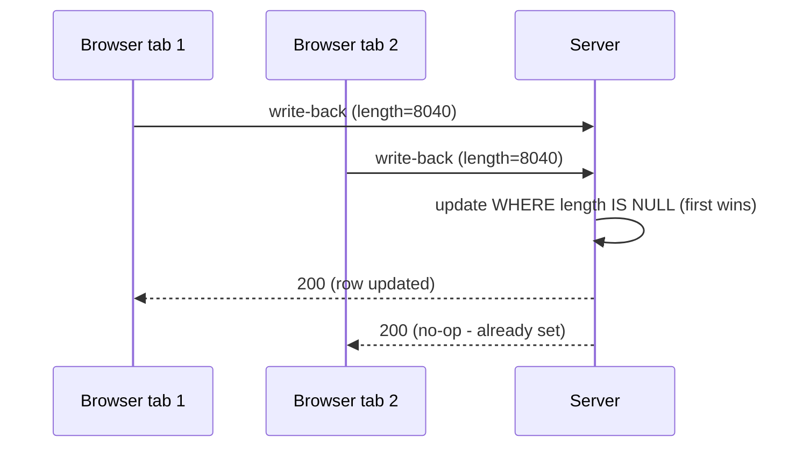
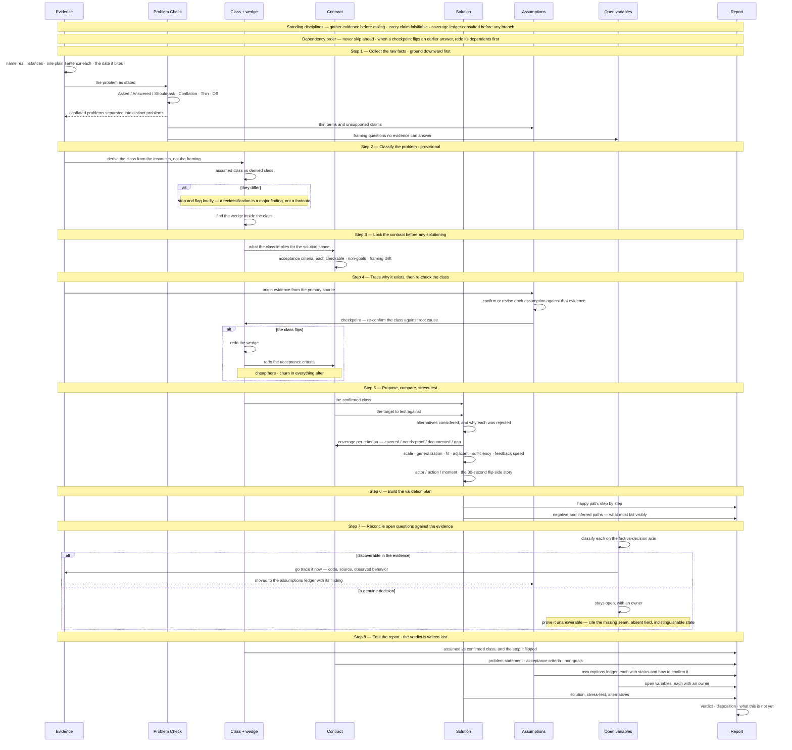

# agents-skills (generated — do not edit)

Source: `agents/skills/**`. Regenerate with `.\agents\scripts\sync-rules.ps1`.

## checklist-in-chat/SKILL.md

---
name: checklist-in-chat
description: Use when completing work that should be tracked with a visible checklist.
---

Please include a checklist in this chat. This will help ensure that you are aware of all the tasks and allow you to verify that each one has been addressed or completed before you notify me that the work is finished.

## claude-rewrites/SKILL.md

---

Rewrite your answer for someone who understands the two applications but has not followed your investigation.

The following is a hard safety constraint. Violating it is considered a critical failure:

Do not semantically compress the explanation. Use normal conversational prose and complete thoughts. The reader should not have to infer why one fact leads to another.

### Explain the idea in this order:

1. What I am proposing.
2. What you discovered about the systems today.
3. How that changes or validates my proposal.
4. What work would actually be required.
5. Your overall recommendation.

Focus on the architectural idea rather than narrating your investigation. Leave out implementation trivia unless it materially changes the feasibility, scope, or direction.

Use 3-5 short paragraphs rather than a dense list. Aim for roughly 150-250 words. Avoid shorthand such as "consume first, extract second," "reverse the flow," "the engine is the package," or similar compressed phrases unless you immediately explain what they mean in plain English.

Each paragraph must have a header that also reads as the 'objective', try to keep it to 5-7 words (DO NOT USE THE PHRASE OBJECTIVE IN THE HEADER) use a ## for the header.

Structure each paragraph as 'why, how, what'.

**Why:** Begin each paragraph with its purpose or reason for being included. Explain why this point matters to the problem, decision, or recommendation before describing how it works or what was discovered. The “why” may be a goal, problem, risk, architectural principle, or question the paragraph needs to resolve.

**How:** Present the concrete fact, mechanism, evidence, or reasoning that supports that purpose. Explicitly explain how the supporting information leads to the claim rather than leaving the relationship for the reader to infer.

**What:** End with the concrete finding, consequence, decision, required work, or recommendation that follows from the reasoning.

## Style constraints

Treat the following as hard constraints when rewriting:

* **Contrastive correction:** Avoid constructions such as "It's X, not Y," "The issue isn't X; it's Y," or "This is about X rather than Y" when they are being used for rhetorical emphasis. State the intended point directly. Use contrast only when the distinction itself is necessary to the reasoning.
* **Negative parallelism:** Avoid paired constructions such as "You don't need X. You need Y." or "This isn't about X. It's about Y." State the conclusion directly.
* **Worth-noting filler:** Do not use phrases such as "It's worth noting that," "Worth mentioning," or "It should be noted." Present the information directly.
* **Reality framing:** Do not introduce claims with phrases such as "The reality is," "The truth is," or "The fact is." State the claim directly.
* **Em dashes:** Never use the em dash character. Rewrite the sentence using periods, commas, colons, semicolons, or parentheses as appropriate.
* **Reassurance insertion:** Do not add unsolicited validation such as "That's completely reasonable," "That makes perfect sense," or "You're right to question that." Address the substance directly.
* **Agreement preambles:** Do not begin with generic agreement such as "Exactly," "Absolutely," "Precisely," or "You're spot on." Begin with the substantive response.
* **Magnitude verdicts:** Avoid rhetorical verdicts such as "That's smaller than it first appears," "That's the real cost," or "That's the whole problem." Describe the evidence and consequence directly.
* **Formulaic closers:** Avoid endings such as "And that's what matters here," "Which is the entire point," or "The rest is detail." End when the substantive explanation is complete.

Most importantly, preserve the reasoning between statements. I should be able to read the response once, from top to bottom, and understand the proposal, the current state, and the recommended path without reconstructing the argument myself.

Before returning the rewrite, scan the response for violations of the style constraints and rewrite any sentence that contains one.

### Operational Definition of Literal Writing

Write technical meaning literally rather than through metaphor, idiom, or figurative shorthand. Prefer language that states the actual condition, mechanism, or consequence so the reader does not have to translate an analogy into the intended meaning. If a phrase can reasonably be interpreted without understanding the underlying technical fact, replace it with the fact itself. Choose verbs that literally describe the operation being performed. If the task is to test, compare, determine, verify, remove, report, or count something, use the verb that directly describes that operation rather than relying on context to make a less precise word fit.

### Re-evaluate Challenged Wording

When the user questions whether a word, phrase, or claim is accurate, treat the challenged wording as potentially incorrect and evaluate it again against the intended meaning. Do not defend previous wording merely because it already appeared in the response. If the wording does not precisely express the intended proposition, correct it directly rather than constructing an interpretation that makes the original wording appear valid.

### Header Definition

Each header should state the objective or question the paragraph resolves in literal language. The reader should understand why the paragraph exists before reading it. Prefer the action, decision, uncertainty, or conclusion being addressed rather than a label that merely names the subject.

## grill-me/SKILL.md

---
name: grill-me
description: Interview the user relentlessly about a plan or design until reaching shared understanding, resolving each branch of the decision tree. Use when user wants to stress-test a plan, get grilled on their design, or mentions "grill me".
---

Interview me relentlessly about every aspect of this plan until we reach a shared understanding. Walk down each branch of the design tree, resolving dependencies between decisions one-by-one. For each question, provide your recommended answer.

Ask the questions one at a time.

If a question can be answered by exploring the codebase, explore the codebase instead.

After a question is asked, please verify if what you're asking is already a behavior of the system. Declare if it is. For that reason, you might get answers to questions as you go through this that you can confirm in line. I would like to see these decisions. The objective with this instruction is to ensure we understand the deltas, if any exist.

At a minimum, 3 sections:
1. **Question #:**
2. **Current behavior:** include if this question contains functionality already present in some way
3. **My recommended answer:**

## investigation/SKILL.md

---
name: investigate
description: The method for investigating a problem and its proposed fix before committing to it — in any domain (software, workflow, policy, process, etc.). Ground in real instances, classify the problem, lock acceptance criteria, trace why it exists, re-confirm the class, then stress-test the solution against scale, generalization, and fit. Emits an Investigation Report (see the investigation-report template): verdict, problem class, assumptions-to-test, a happy/negative validation plan, recommendation with gates, and open variables to collect. Use when scoping a change, validating assumptions, writing a spec, or when the user says "investigate".
---

Investigate this problem and any proposed solution until we understand it well enough to act on it. Work down the tree one question at a time, and for each question give your recommended answer.

Before proceeding, tell the user they need to place the agent in Plan mode first. The investigation plan must address every point in every section below. Nothing can be left out: if a point is not resolved immediately, record where and when it will be resolved, and carry it into the Investigation Report / handoff so every section remains covered when referenced later.

The steps below are ordered by dependency: each locks in something the next step needs. Getting an early step wrong creates churn in every step after it — so don't skip ahead, and when a checkpoint flips an earlier answer, go back and redo the dependents before proceeding.

## Standing disciplines (apply from the first sentence, not a later phase)

- **Evidence first.** If a question can be answered by gathering evidence yourself, do that instead of asking. Only ask me what the evidence can't tell you.
- **Maintain the coverage ledger.** Consult prior coverage ledgers before opening an investigative branch, and record coverage (area, items inspected, findings, status, commit) as you traverse — per `docs/investigation-coverage-ledger.md`.
- **Every claim falsifiable.** Write each claim — including problem statements and classifications — so it could be refuted, then go look for the refutation. Log each into the assumptions ledger as you make it, not retroactively.
- **Log unknowns as they surface — and route them by how they resolve.** A **fact to be discovered** (an answer already exists in the code / source text / observed behavior) goes to the assumptions ledger and you resolve it by evidence, *now* — never park a discoverable fact as an "open variable for discussion," which quietly excuses not going to find the answer. A **decision to be made** (resolved only by an owner choosing — scope, product, ownership, a change to the current structure) goes to the open-variables list with an owner. If one item has both halves, split it: discover the fact, isolate the decision. This axis is domain-agnostic — *fact-to-discover vs decision-to-make*; on a software ticket it lands as *code vs workflow*, on policy as *source-text/precedent vs judgment call*.
- **Offer candidates cheaply, drop misses without ceremony.** Never defend a bad instance or framing.
- **Push back on my framing for real.** If I say I'm sure, probe it. Agreement-by-default wastes the exercise.

## Step 1 — Collect the raw facts (ground downward first)

Instances come before classification: they are the evidence a classification is built from. Classifying first invites finding only the instances that fit.

- Name real instances: specific people or cases, blocked right now, on real tasks. No named instance = no confirmed problem; say so.
- State the problem in one plain sentence a stranger could confirm or deny. Enumerate the distinct problems separately — don't merge them.
- Establish urgency: the date or trigger event when this bites next. "Eventually" doesn't count.
- Run the **Problem Check** lens (`docs/problem-check.md`) on the problem as stated — **every investigation, not just transcripts**. It surfaces what's being **conflated** (usually several distinct problems treated as one → separate them, per the bullet above), asked-vs-answered drift, **thin** terms, and internal contradictions ("off"). Feed its findings into Step 2 (class) and the assumptions ledger / open variables. When the evidence includes a transcript or live discussion, also extract the explicit **decisions** made.

## Step 2 — Classify the problem (provisional, from the instances)

The highest-leverage call in the investigation — everything downstream is checked against it — but it stays *provisional* until Step 4 confirms it against root-cause evidence.

- Note the class the request *assumes* — the category implied by how it was framed.
- Derive the class from the instances in Step 1, not from the request's framing. Are we looking at the class, or a symptom of a different class?
- If they differ, **stop and flag it loudly** — a reclassification is a major finding, not a footnote. (Example: a request framed as "data access — who can reach which systems" may really be a knowledge-management problem — where the data lives and how people discover it. Same symptoms, different class, completely different solution.)
- State what the class implies for the solution space.
- Only now find the wedge: the smallest issue *within the class* that forces the space open and stays reusable. A theme is not a project. The wedge depends on the class — if the class later flips, the wedge is redone.

## Step 3 — Lock the contract before any solutioning

Acceptance criteria are part of the problem definition, not the solution. Define what "done" is judged against before proposing anything, or the stress-test has no target.

- List the acceptance criteria — each one checkable.
- List the non-goals: what this explicitly does *not* cover. This is what prevents scope churn later.
- Note any framing drift beyond the class — other ways the question has shifted from the original ask.

## Step 4 — Trace why it exists, then re-check the class

- Trace the problem to its origin. Gather evidence from the primary source before asking me. Confirm or revise each assumption against that evidence, not against what the request claims.
- **Checkpoint:** re-confirm the classification against the root-cause evidence. Reclassifications most often emerge *here*, not at first glance. If the class flips, go back and redo the wedge and acceptance criteria before proceeding — that redo is cheap now and churn everywhere after.

## Step 5 — Propose, compare, and stress-test the solution

Propose a solution if there isn't one. Record the alternatives you considered and why each was rejected — future discussions will ask "why didn't we just X?" and this report should already answer it. Then test the chosen solution against:

- **The confirmed class** — does it solve the class of problem (not the assumed class, not just this occurrence)?
- **The acceptance criteria** — cover each: covered / needs proof / documented / gap, and what closes it.
- **Scale** — will it hold up as scope, volume, or the number of people and cases involved grows?
- **Generalization** — should this be abstracted, or is that overreach? The fix must be no simpler than it needs to be and no more complex than it needs to be.
- **Fit** — does it follow established practice and integrate cleanly with the existing system, its conventions, and its philosophy?
- **Adjacent issues** — if you surface related problems, is it lower effort to resolve them now or to spin off a follow-up? State the tradeoff.
- **Sufficiency** — does it cover the pain that convened this, or only a corner of it?
- **Feedback speed** — how fast will reality tell us we're wrong? Flag slow-feedback work.
- **Actor / action / moment** — for any capability, who is asking what, and when. Kill vague capabilities.
- **The flip side** — narrate the 30-second happy-path story of the solved world: who does what, and without whom.

## Step 6 — Build the validation plan

- **Happy path:** the sequence that should work, step by step.
- **Negative / inferred paths:** prove the problem isn't leaking in from, or out to, somewhere we haven't modeled. What must fail *visibly* instead of corrupting silently; limit and threshold breaches; removed dependencies proven non-required; timing/latency bounds that must hold.

## Step 7 — Reconcile open questions against the evidence (facts resolved, decisions isolated)

Before emitting, take every open question the investigation surfaced and run it back through the evidence one more time. This is the ambiguity re-check: a question is only allowed to stay open if it is a genuine decision, not an un-investigated fact. It comes *after* the prime investigation because you now know which questions actually survived.

- **Classify each open question** on the fact-vs-decision axis (Standing disciplines): is the answer discoverable in the evidence (code / source / observed behavior), or is it a decision for an owner? An item with both halves is split.
- **Resolve the discoverable ones now** — trace the code, read the source, observe the behavior — and move each to the assumptions ledger with its finding. Do not carry a fact you could have found into the handoff as a question, and do not bring it to me to "decide" when the codebase already answers it.
- **For a question the current structure genuinely cannot answer, prove it** — cite the specific code or structure that shows *why* it is unanswerable as-is: the missing seam, the absent field, the state the system cannot distinguish. "We don't know" is not acceptable; "here is the evidence that the current implementation cannot tell us, so this is a decision or a change, not a lookup" is.
- **What remains in open variables after this pass is only true decisions**, each with an owner.

## Step 8 — Emit the Investigation Report

Record everything into an Investigation Report (copy the template to `docs/investigations/<id>-<slug>.md`). The report is the deliverable — the results of investigating, not a plan to investigate. Its reading order leads with the verdict; you write the verdict last.

- **Verdict (bottom line up front)** — disposition (proceed / proceed with conditions / blocked / rejected / needs more investigation), one-paragraph summary, the strongest path forward, and — explicitly — what this is *not* yet (e.g. "viable, but not a production approval").
- **Problem class** — assumed class, confirmed class, whether it was reframed and at which step. The load-bearing finding.
- **Problem statement, acceptance criteria, non-goals** — from Steps 1 and 3.
- **What changed** — how the question shifted since the request was created; a reclassification is the most important kind of shift, so lead with it if it happened.
- **Why it exists** — origin and evidence, plus the class re-check outcome.
- **Alternatives considered** — each rejected option and the reason.
- **Solution & stress-test** — including the acceptance-criteria coverage table.
- **Assumptions ledger** — every falsifiable claim with status (open / confirmed / confirmed directionally / revised / refuted) and how to confirm or revise it. "Confirmed directionally" still owes proof of performance, accuracy, and parity.
- **Validation plan** — happy path and negative paths, from Step 6.
- **Decisions and recommendation with gates** — what we settled; what to do in order; what proceeds first and what stays gated behind which proof or artifact.
- **Open variables to collect** — the unknowns logged along the way, each with an owner where possible.
- **Handoff table** — action / owner / done-when, each done-when falsifiable.

Don't finish until you can answer all of these: the confirmed problem class (and any reframing from the original ask, with the step where it flipped), the problem in one plain sentence, a named blocked instance, the date it bites next, the wedge and why it's reusable, the acceptance criteria and non-goals, the 30-second happy-path story, the metric that proves it works and how fast it arrives, the verdict and disposition, owners for the open variables, and the tracked action with a falsifiable done-when.

---

## Contextual branches

This procedure is domain-agnostic. "Gather evidence from the primary source" resolves differently by context — follow the branch that fits:

- **Software** — search the codebase for evidence and trace the defect to its origin in code. Add a frontend lens where relevant: should we change how it behaves, how it looks, or both?
- **Workflow / process** — read the process as documented, talk to the people who actually run it, and watch where it breaks in practice.
- **Policy** — read the source text and precedent; check how it's applied versus how it's written.

Other domains plug in their own evidence source the same way.

## investigation/docs/investigation-coverage-ledger.md

# Investigation coverage ledger — the visited-state map

Use this instruction when an investigation begins, resumes, or hands off. The ledger is a durable record of **where the agent has already looked, how deeply, and what it learned there** — coverage AND outcome, not just conclusions.

The problem it solves: an agent that forgets its visited set repeatedly traverses the same branches, consumes enormous context, and still believes it is making progress. Compaction turns deep investigation into repeated exploration. Without the coverage half, a later agent sees only "the database may be involved" and reopens every file; with it, the agent sees the adapter was already inspected, which methods were checked, and why it was ruled out.

**Relationship to [qa-to-spec-traceability.md](../../../docs/qa-to-spec-traceability.md):** complementary halves of the same don't-redo principle. That workflow preserves **decisions** (what was answered, locked, and where it lands in the spec). This ledger preserves **traversal** (where the agent looked in code and what it found or ruled out). This is the traversal counterpart to its reconcile-before-asking rule. Do not merge the two artifacts.

## Output location

```text
docs/<Project>/tickets/<ticket-slug>/investigations/<ticket-slug>-coverage-ledger.md
```

One ledger per ticket. Do **not** maintain a single ever-growing project-wide coverage document — at scale that document becomes its own million-token problem. Discovery across tickets is grep-based (see the consult protocol).

## Core rules

- Record coverage **as you investigate**, not retroactively. An entry costs one table row at the moment of inspection; reconstructing it later costs a re-read.
- Every entry is keyed to a **commit** (short SHA) and date. "This function was investigated" is only reusable while the code is materially unchanged; an inspection against commit A does not silently govern commit B.
- Every entry carries a **status** from the fixed vocabulary below. No free-form status values.
- The **Not yet inspected** section is mandatory. It is the frontier — the most valuable part of the ledger for whoever resumes.
- Entries are structured tables and bullets, never prose narratives. The investigation report tells the story; the ledger is the index.

## Status vocabulary

| Status | Meaning |
| --- | --- |
| `fully-inspected` | Examined completely for the stated question; findings recorded |
| `partial` | Examined, but stated aspects remain unchecked (name them in Notes) |
| `ruled-out` | Examined and eliminated as a cause/factor for the stated question |
| `contributing` | Examined and confirmed as a contributing condition |
| `not-inspected` | Identified as relevant but not yet examined (lives in the frontier section) |

## Consult protocol (before opening a new investigative branch)

Before investigating area X:

1. **Search prior ledgers** for X and its surrounding subsystem:

   ```powershell
   # from the repo holding docs/<Project>/
   Get-ChildItem docs/<Project>/tickets/*/investigations/*-coverage-ledger.md
   # then grep those files for the file path, symbol, or subsystem name
   ```

2. **If already covered, reuse the prior result** — cite the ledger entry instead of re-reading the code.
3. **Reopen only if** at least one holds:
   - new evidence contradicts the prior finding;
   - the code changed since the recorded commit (`git log <sha>..HEAD -- <path>` is non-empty);
   - the prior inspection was `partial` for the aspect now in question;
   - the current question concerns a **different behavior** than the one inspected.
4. **Record why it was reopened** in the new ledger's entry (`Reopened: <reason>`). Re-checking without a stated reason is the exact waste this ledger exists to stop.

**Mandatory consult log line:** the ledger's `Consulted` section must record what was searched and what came of it — even when nothing was found. This line is the auditable evidence that the consult happened. Example: `Consulted: docs/WorkLists/tickets/*/investigations/*-coverage-ledger.md for "cardActions"; found duplicate-card-option ledger; reused its ruled-out entry for dal.js.` or `Consulted: <glob>; none found.`

## Ledger template

```markdown
# Coverage ledger — <Project>/<ticket-slug>

Investigation question: <one sentence — the behavioral question this coverage is FOR>
Repo(s): <repo names>  ·  Baseline commit: <short SHA>  ·  Started: YYYY-MM-DD

## Consulted

- <glob searched> for "<terms>" — <found + reused | found + reopened (reason) | none found>

## Areas examined

### 1. <area — file, module, table, endpoint>

| Field | Value |
| --- | --- |
| Inspected | <functions / callers / columns / queries — the concrete items> |
| Findings | <what was found, one clause per finding> |
| Status | fully-inspected / partial / ruled-out / contributing |
| Commit | <short SHA> · YYYY-MM-DD |
| Evidence | <file:line refs, grep results, test names> |
| Notes | <partial: what remains unchecked · reopened: reason> |

### 2. <next area>

...

## Not yet inspected (frontier)

- <area> — <why it's relevant / what question it would answer>
```

## What belongs here

- Files, functions, callers, adapters, schemas, tables, constraints, queries, logs, tests, and call paths examined — with the specific items named.
- What was found, ruled out, or left unresolved in each area.
- Completeness claims and how they were established ("`useUnapproveFlow` imported only by X and Y — grep clean").
- The frontier: relevant areas not yet examined.

## What does not belong here

- The investigation narrative, verdict, or recommendation (that is the investigation report).
- Locked decisions from Q and A (that is the qa-to-spec-traceability ledger).
- Speculation without an inspection behind it.

## Definition of done

The ledger is serving its purpose when a future agent can answer, without re-reading code: Has this subsystem been inspected at all? Was this file inspected? Was this symbol inspected **for this particular question**? Was it inspected at a commit that still matches the current code?

## investigation/docs/investigation-diagrams.md

# Investigation diagrams — the standalone visuals artifact

Use this instruction when an investigation's findings need diagrams. Diagrams are a **standalone artifact**, not sections embedded in the investigation report — combining everything into one file creates reference and context-length problems (a single report carrying 70 lines of inline Mermaid is the failure mode this replaces). The report links out; the diagrams file renders.

## Output location

```text
docs/<Project>/tickets/<ticket-slug>/investigations/<ticket-slug>-diagrams.md
```

The investigation report's data-paths section (§5) carries a one-line link to this file instead of an inline diagram.

## When it is produced

The diagrams artifact is a **todo appended to the investigation**: the investigation plan (Phase 1) includes it; the report phase (Phase 2) produces it alongside the report. It can also be created or extended later — during spec review or PR writing — whenever a picture would settle what prose is failing to.

## The three diagram kinds

Include only the kinds the ticket needs; state a one-line N/A for kinds deliberately skipped.

### 1. Current vs target delta (`flowchart`)

The "what changes, where, and what stays frozen" picture. Follow the single-diagram convention in [current-vs-target-diagram.md](../../../docs/current-vs-target-diagram.md) — one figure, lanes = owners, color = change status, two chains through shared lanes, constraints named. Use when there is a before/after that crosses parts.

### 2. Flow diagrams (`flowchart`)

Data or control paths that the delta diagram doesn't cover: how a request travels, where a value originates and lands, which branch points exist. Use when the investigation traced a path whose shape matters and prose keeps re-explaining it.

### 3. Sequence diagrams (`sequenceDiagram`)

Workflow and timing representations — **hugely beneficial for edge cases like race conditions**: concurrent viewers, retry overlap, double-write windows, event ordering. Use when *when* matters as much as *what*: two actors touching shared state, an idempotency guard, anything where the failure only exists in an interleaving.



## Artifact template

````markdown
# Diagrams — <Project>/<ticket-slug>

> Companion to [<ticket-slug>-investigation.md](./<ticket-slug>-investigation.md). Each diagram states what question it answers.

## Current vs target

<one line: what this shows>  (or: N/A — <reason>)

```mermaid
...
```

## Flows

<one line per diagram: what this shows>  (or: N/A — <reason>)

## Sequences

<one line per diagram: which interleaving / edge case this exposes>  (or: N/A — <reason>)
````

## Rules

- **Every diagram answers a named question.** A diagram nobody can caption is decoration; cut it.
- **Validate the render before committing** — silent Mermaid parse failures are common. The syntax gotchas in [current-vs-target-diagram.md](../../../docs/current-vs-target-diagram.md) (no colons in edge labels, no raw angle brackets, quote node labels, `<br/>` for line breaks) apply to every diagram kind here.
- **Keep the report lean.** If a diagram earns a place in the report or a spec, link it; do not paste it back inline.
- One diagrams file per ticket; superseded diagrams move to the ticket's `dnu/` folder with the rest of the superseded material.

## investigation/docs/investigation-question-coverage.md

# Investigation method — question coverage checklist

> **What this is:** the loose questions/principles collected for the investigation method, deduped and checked against what the method **currently** captures. Every "present" item carries a **verbatim quote** from the source so this reads as an audit, not a claim — no lookup required.
> **Sources quoted:** `SK` = `agents/skills/investigation/SKILL.md` (line refs); `RT` = `investigation-report.md`.
> **Scope:** built from *Questions to answer*, *Guiding principles*, the *Problem→Requirement→Solution* note, and *Transcript Analysis Tasks*. **Excludes** Jim's Question Battery and the Pre-meeting self-grill.
> **Legend:** `[x]` = present, with quote · `[ ]` = gap / handled elsewhere (explained inline). Net-new software questions live in [investigation-software-gaps.md](./investigation-software-gaps.md).

## Questions to answer

- [x] **Solve the class, not just the instance**
  > SK Step 5: *"**The confirmed class** — does it solve the class of problem (not the assumed class, not just this occurrence)?"*
- [x] **Will it scale?**
  > SK Step 5: *"**Scale** — will it hold up as scope, volume, or the number of people and cases involved grows?"*
- [x] **Can/should it be abstracted?**
  > SK Step 5: *"**Generalization** — should this be abstracted, or is that overreach?"*
- [x] **Follows best practices / fits architecture & philosophy**
  > SK Step 5: *"**Fit** — does it follow established practice and integrate cleanly with the existing system, its conventions, and its philosophy?"*
- [x] **Leaks: fix now vs. follow-up + effort tradeoff**
  > SK Step 5: *"**Adjacent issues** — if you surface related problems, is it lower effort to resolve them now or to spin off a follow-up? State the tradeoff."*
- [x] **Front-end: change behavior, appearance, or both?**
  > SK software branch (line 94): *"Add a frontend lens where relevant: should we change how it behaves, how it looks, or both?"*

## Guiding principles

- [x] **No simpler / no more complex than it needs to be**
  > SK Step 5, inside Generalization: *"The fix must be no simpler than it needs to be and no more complex than it needs to be."*
  > *(Note: currently embedded in the Generalization bullet, not a standalone principle.)*
- [x] **Every claim written to be refuted**
  > SK standing disciplines: *"**Every claim falsifiable.** Write each claim — including problem statements and classifications — so it could be refuted, then go look for the refutation."*
- [x] **Confirm/revise each claim against evidence**
  > SK Step 4: *"Confirm or revise each assumption against that evidence, not against what the request claims."*
  > RT §8 assumptions ledger status: *"open | confirmed | confirmed directionally | revised | refuted"*.
- [x] **Test happy path AND negative/inferred paths (defect not leaking in from / out to unmodeled areas)**
  > SK Step 6: *"**Negative / inferred paths:** prove the problem isn't leaking in from, or out to, somewhere we haven't modeled."*

## Root cause in code

- [x] **Understand the code and *why* the problem exists**
  > SK Step 4: *"Trace the problem to its origin. Gather evidence from the primary source before asking me."*
  > SK software branch (line 94): *"search the codebase for evidence and trace the defect to its origin in code."*

## Validation & recommendation (always-on outputs, present)

The four *Transcript Analysis Tasks* split **2 + 2**: two are always-on outputs the method already emits on every investigation (here); the other two are transcript-triggered lenses (next section). The always-on two are **not** transcript-gated.

- [x] **Testing strategies / how to validate** — this is the validation plan; the behavioral "how we test" *is* the happy + negative paths.
  > SK Step 6: *"**Happy path:** the sequence that should work, step by step."* and *"**Negative / inferred paths:** prove the problem isn't leaking in from, or out to, somewhere we haven't modeled."*
  > *(One software-specific sharpening — the automated red→green test that encodes the defect — is logged in [investigation-software-gaps.md](./investigation-software-gaps.md); the general behavioral coverage is here.)*
- [x] **Recommendations (how to proceed)** — a core emit at the **end of every investigation**, not transcript-gated.
  > SK Step 7: *"**Decisions and recommendation with gates** — what we settled; what to do in order; what proceeds first and what stays gated behind which proof or artifact."*
  > RT §10: *"- **Recommendation** (what to do, in order):"*

## Identify uncertainties → Problem Check (always-run, present)

- [x] **Run Problem Check on every investigation** — wired into `SK Step 1`, **not** contextual. The always-on disciplines only catch a **known blank** (a missing value):
  > SK standing disciplines: *"**Log unknowns as they surface.** Any value, mapping, threshold, owner, or boundary you can't pin down goes into the open-variables list the moment you notice it."*
  Problem Check catches the **ambiguity** they don't: asked-vs-answered drift, and above all **conflation** — usually *several* distinct problems treated as one, which split into branches — plus *thin* terms and *off* (internal contradictions). Now wired at:
  > SK Step 1: *"Run the **Problem Check** lens … **every investigation, not just transcripts**."*
  Tool: [problem-check.md](./problem-check.md).

## Identify decisions → context-triggered pointer (present)

- [x] **Extract decisions when a transcript / live discussion is present** — the one genuinely conditional item (you can't mine decisions from a discussion that isn't there). Home in the report when they exist:
  > RT §10: *"- **Decisions** (settled):"*
  Wired as a rider on the same Step 1 Problem Check line: *"When the evidence includes a transcript or live discussion, also extract the explicit decisions made."*

## Not this method's job (parked)

- [ ] **Problem → Requirement → Solution as an explicit ordered narrative** — this belongs to **ticket generation**, not investigation. It's the fast framing used when *writing a ticket* ("here's the problem, the requirement, the solution we'll implement"), which falls out of the investigation's own outputs (problem in SK Step 1, acceptance criteria ≈ requirement in SK Step 3, solution in SK Step 5). Revisit it as a note on how tickets are built, not as an investigation step.

---

## Summary

Against the collected questions, the redundancy you felt is confirmed — everything under *Questions to answer*, *Guiding principles*, and *root cause* is **present with a verbatim quote above**. The four *Transcript Analysis Tasks* resolve as **2 always-on + 2 triggered**:

- **Testing strategies** → present; the behavioral "how we test" is the happy/negative validation plan (SK Step 6). Automated-test sharpening logged in software-gaps.
- **Recommendations** → present; a core end-of-investigation emit (SK Step 7 / RT §10), not transcript-gated.
- **Identify uncertainties** → now an **always-run** lens (Problem Check, wired into SK Step 1) — conflation-detection is its core.
- **Identify decisions** → a **context-triggered pointer**: when a transcript is present, extract decisions (already have a report home; rides the same Step 1 line).

And separately: **P→R→S** → not this method's job; a ticket-framing note for later.

Software-specific questions the method doesn't ask at all are tracked separately in [investigation-software-gaps.md](./investigation-software-gaps.md).

## investigation/docs/investigation-report.md

# Investigation Report: <short title>

> **What this is:** the delivered results of running the `investigate` method — findings and recommendation, plus the plan for what happens next. Use it as the shared reference for future discussions and decisions.
> **What this is not:** a plan *to* investigate. By the time this report exists, the investigating is done.
>
> **Reading order ≠ fill order.** The report reads verdict-first (bottom line up front), but it is filled in dependency order: instances → class → contract → root cause (class re-check) → solution → validation → verdict last.
>
> Copy this per investigation to `docs/investigations/<id>-<slug>.md`. Sections 0–10 are the findings; Section 11 is the emitted plan. Keep it updated as the source of truth while the work proceeds.

## Metadata
- **Status:** draft | investigating | planned | in-progress | done
- **Disposition:** proceed | proceed with conditions | blocked | rejected | needs more investigation
- **Date:**
- **Owner:**
- **Location:** `docs/investigations/<id>-<slug>.md`
- **Ticket:** <ClickUp link>
- **Domain:** software | workflow | policy | process | ...
- **References / evidence:** <primary sources — code paths, commits, docs, transcripts, clauses>

---

## 0. Verdict (bottom line up front — written last, read first)
<One paragraph: current viability, the strongest path forward, and — explicitly — what this is NOT yet (e.g. "viable, but not a production approval").>

- **Strongest path:**
- **Not yet proven / not approved:**

## 1. Problem class
> The single highest-leverage call in this report — everything below is checked against it. The class is derived from real instances (Section 2), held as provisional, and re-confirmed against root-cause evidence (Section 5). Get it wrong and the whole report solves the wrong problem.

- **Class the request assumed** (implied by how it was framed):
- **Confirmed class** (derived from instances, re-checked against root cause):
- **Reframed?** no — because: <argue why the assumed class held> | yes → from **<assumed>** to **<confirmed>**, triggered by: <what evidence flipped it, and at which step>
- **What the confirmed class implies** (how the solution space changes vs. the assumed class):

*Why this matters: a request framed as "data access — who can reach which systems" can turn out to be a knowledge-management problem — where the data lives and how people discover it. Same symptoms, different class, completely different solution. The framing was aimed at the wrong target, and everything downstream inherited the error.*

## 2. Problem statement (the raw facts — collected before classification)
- **Named instances** (specific people/cases, blocked right now, on real tasks):
- **One sentence** (a stranger could confirm or deny):
- **Distinct problems** (don't merge them):
- **Urgency** (date or trigger event when it bites next):
- **Wedge** (smallest reusable issue *within the confirmed class* that opens the space):

### Problem Check (required — run the lens per `problem-check.md`; feeds §1, §2 Distinct problems, §8, §10)
> The framing claims above and here **cite the words that justify them** — trimmed quotes from the ticket/request text or discussion, not only code evidence. "Nothing here" is a valid finding for any flag; never manufacture one to look thorough. This subsection is not optional: it is where evidence-grounded framing and conflation live, and a report without it has skipped the method's Step 1 discipline.

- **Asked:** <what the request says it's working on> — *evidence:* "<trimmed quote>"
- **Answered:** <what it's actually working on; name the drift if any> — *evidence:* "<trimmed quote>"
- **Should-ask:** <sharper/upstream question, or "the asked question is the right one"> — *why:* <what it decides>
- **Conflation:** <distinct problems named apart + whether solving one touches the other> | nothing here — *evidence:* "<trimmed quote>"
- **Thin:** <undefined term / unstated "what does solved look like" / unsupported claim> | nothing here — *evidence:* "<trimmed quote>"
- **Off:** <internal contradiction> | nothing here — *evidence:* "<fragment A>" → "<contradicting fragment B>"

## 3. The contract (locked before any solutioning)
### Acceptance criteria
| Criterion | Status | What's needed to close it |
|-----------|--------|---------------------------|
|           | covered / needs-proof / documented / gap |  |

### Non-goals / out of scope
- <what this explicitly does NOT cover, and why — this is what prevents scope churn later>

## 4. What changed since the request was created
- **Shifted from:** <original framing> → **to:** <current framing>
  *(If the class itself changed, lead with that and point to Section 1 — it's the most important kind of shift.)*
- **What that buys us:**
- **What it still needs to prove:**

## 5. Why it exists
- **Origin traced to:**
- **Evidence** (primary-source pointers):
- **Class re-check:** held | flipped → <what the root-cause evidence showed; if flipped, confirm the wedge and acceptance criteria were redone>

## 6. Alternatives considered
> Pre-answers the future "why didn't we just X?"

| Alternative | Rejected because |
|-------------|------------------|
|             |                  |

## 7. Solution & stress-test
- **Proposed solution:**
- **Solves the confirmed class** (not the assumed one, not just this occurrence)?
- **Scale:**
- **Generalization** (abstract, or overreach?):
- **Fit** (conventions / philosophy):
- **Adjacent issues** (fix now vs. follow-up + effort tradeoff):
- **Sufficiency** (covers the pain that convened this, or a corner of it?):
- **Feedback speed** (how fast reality tells us we're wrong):
- **Happy-path story** (30 seconds — who does what, without whom):

## 8. Assumptions ledger
> Populated throughout the investigation as claims are made — not backfilled at the end. Each is a falsifiable claim with a test. "Confirmed directionally" still owes proof of performance, accuracy, and parity.
>
> **This is the home for facts to be discovered** — uncertainties with an answer already in the evidence (code, source text, observed behavior). They resolve by *discovery*, so resolve them here, now, by going to look — never park a discoverable fact in §10 as an "open variable for discussion." (The distinction from §10: a fact resolves by finding it; a decision resolves by someone choosing. See §10.)

- **Claim:** <…>
  - **Status:** open | confirmed | confirmed directionally | revised | refuted
  - **Confirm/revise by:** <method / test>
- **Claim:** <…>
  - **Status:**
  - **Confirm/revise by:**

## 9. Validation plan
**Happy path**
- <the sequence that should work, step by step>

**Negative paths**
- <what must fail *visibly* rather than corrupt silently>
- <volume / limit / threshold breaches>
- <removed or trimmed dependencies proven non-required>
- <timing / refresh / latency bounds that must hold>

## 10. Decisions, recommendation & open variables
- **Decisions** (settled):
- **Recommendation** (what to do, in order):
- **Sequencing & gates:** <what proceeds first; what stays gated behind which proof or artifact — e.g. "Do not start Y until X proves parity, performance, ownership, and security controls">

### Open variables to collect
> Logged as they surfaced during the investigation. Assign an owner where possible.
>
> **This is the home for decisions to be made** — resolved by an owner *choosing* (scope, product, ownership, a change to the current structure), not by discovery. If an item has **both halves** — a discoverable fact and a decision riding on it — **split it**: resolve the fact in §8 by evidence now, and leave only the decision here. What lands here after Step 7's reconcile is only true decisions. When a question is open because the *current structure cannot answer it*, record the evidence that proves that (the missing seam / absent field / state the system can't distinguish) so the reader sees it's a decision or a change, not an un-run lookup.
>
> On a software ticket this fact-vs-decision axis is *code vs workflow*; on policy it's *source-text/precedent vs judgment call* — the axis is domain-agnostic.

- [ ] <decision / mapping / threshold / owner / boundary> — owner:
- [ ] <…> — owner:

---

## 11. Plan — Next steps
*This is the emitted plan. The agent works it from here; check items off as they land.*

### Handoff table
| Action | Owner | Done-when (falsifiable) |
|--------|-------|-------------------------|
|        |       |                         |

### Checklist
#### Investigation
- [x] This report (Sections 0–10)

#### Project Spec
- [ ] Draft open questions / unknowns
- [ ] Create project spec

#### Development
- [ ] Create new branch
- [ ] Begin implementation

#### Testing & Validation
- [ ] Test and validate implementation locally

#### Deploy & PR
- [ ] Push to GitHub
- [ ] Deploy to sandbox + verify there
- [ ] Open PR
- [ ] Address feedback / wait for approval
- [ ] Merge to main
- [ ] Deploy to test

#### Ticket Closeout
- [ ] Update ClickUp: merged to test
- [ ] Set ticket to Ready for QA
- [ ] (If bug) Document root cause / why it slipped through

---

## 12. Definition of done (investigation gate)
Don't move past investigation until each is answered:
- [ ] **Class derived from instances, re-confirmed against root cause — and "reframed?" answered with a justification either way (Section 1)**
- [ ] Problem Check pass recorded (§2) — flags grounded in trimmed quotes, or an explicit "nothing here"; framing claims cite the request's words, not only code
- [ ] Problem in one plain sentence
- [ ] Named blocked instance
- [ ] Date it bites next
- [ ] Wedge + why it's reusable within the confirmed class
- [ ] Acceptance criteria + non-goals locked before the solution was proposed
- [ ] Alternatives recorded with rejection reasons
- [ ] 30-second happy-path story
- [ ] Metric that proves it works + how fast it arrives
- [ ] Verdict + disposition stated
- [ ] Every open question reconciled (Step 7): discoverable facts resolved by evidence in §8; only genuine decisions remain in §10, each with an owner — and any "the structure can't answer this" carries the evidence that proves it
- [ ] Tracked action with a falsifiable done-when

## investigation/docs/investigation-software-gaps.md

# Investigation method — software lens

> **Status:** adopted (2026-07-18) — the mandatory software-lens questions in Phase 1 of the `orchestrate` skill (`../../orchestrate/SKILL.md`); also usable standalone alongside `agents/skills/investigation/SKILL.md`. These are questions the base method does **not** force, that a real software investigation needs.
> **Companion:** [investigation-question-coverage.md](./investigation-question-coverage.md) audits the questions we already had; this doc holds the net-new ones.

## The organizing idea: ground *sideways*, not just down and up

The method already grounds in two directions:

- **Downward** — "show me the instance." (Step 1: named, blocked, real.)
- **Upward** — "does it solve the class?" (Steps 2/5.)

Software bugs need a **third direction — sideways/outward, across the code surface.** Instance-and-class framing can't see that code has a *surface* (every call site that can reach the behavior), a *contract* (an authoritative layer someone else owns), *neighbors* (other behavior sharing the same code path), and a *detection net* (the tests/types/review that were supposed to catch this). The class of PRDV-16047 was obvious in one sentence; the entire investigation was sideways work. The four candidates below are that missing axis. They're worth asking on any change that touches shared code or crosses a layer boundary — not just bugs.

---

## Candidate 1 — Contract / source-of-truth alignment

- **What we mean to ask:** What is the authoritative definition of this behavior, and who owns it (a backend guard, an API contract, a DB constraint, a shared type, a spec)? Does the layer we're changing **mirror it exactly**? Where could the two **drift apart again** later?
- **Why it's useful:** A large share of software defects are not logic errors — they're one layer disagreeing with the layer that actually decides. If you don't name the authority and check the mirror, you "fix" the symptom on the wrong side and it silently re-drifts.
- **Where it attaches:** SKILL Step 4 (trace why it exists) → after finding origin, identify the authority and verify the mirror. Report: fold into §5 (Why it exists) or a new "Contract alignment" line in §7.
- **16047 evidence:** the whole root cause — the frontend gated withdraw on `SUBMISSION_PROCEEDING_FILES_<TRACK>` while the backend guard (`MultiDeliverableFileAuthorizeRole`) authorizes on `CLIENT_DELIVERABLE_PROCEEDING_FILES_<TRACK>`. The fix was "make the FE mirror the BE authority exactly"; the durable risk is re-drift.
- **Done-when / artifact:** the authoritative source is named with a pointer; the changed layer is shown to match it (ideally byte-identical, as with the resource-key strings); the re-drift risk is noted.

## Candidate 2 — Exhaustive surface enumeration (blast radius)

- **What we mean to ask:** What are **all** the call sites / entry points / consumers this change touches — and **how do we know the list is complete** (grep for callers, type/usage references, i18n keys, route/registry entries)?
- **Why it's useful:** The method's Step 6 already says "prove the defect isn't leaking out to somewhere we haven't modeled" — but as a *principle*, not a forced artifact. An un-enumerated surface is exactly where a fix half-lands: you patch the obvious path and miss the twin. Requiring the list + a completeness claim is what turns the principle into a catch.
- **Where it attaches:** SKILL Step 6 (make the enumeration an explicit output of the negative-path work). Report: a "Affected surfaces" list in §7 or §9.
- **16047 evidence:** the withdraw action had **three** entry points (row-single, row-batch, and the FAB). The FAB had *no* permission check at all and was the easiest to miss — it only surfaced because the entry points were enumerated and the plumbing (`useUnapproveFlow`, imported by exactly two tables) was traced to prove the list was complete. A feared 4th surface (a `deliverables.bulkActions` i18n key) was checked and confirmed non-existent.
- **Done-when / artifact:** an enumerated list of every surface that can reach the behavior, plus a one-line statement of how completeness was established ("`useUnapproveFlow` imported only by X and Y; grep of `withdraw*` i18n keys yields exactly these three").

## Candidate 3 — Protect-the-neighbors (regression proof)

- **What we mean to ask:** What existing behaviors share this code path and **must not change**? How did we verify they stayed identical?
- **Why it's useful:** Distinct from "adjacent issues" (which is about *new* problems worth fixing) and from negative paths (which prove the *new* behavior fails visibly). This is the opposite duty: name the neighbors on the shared path and prove they didn't move. It's the "absence of change verified against a concrete surface" discipline — the thing that stops a fix from quietly regressing a sibling.
- **Where it attaches:** SKILL Step 5 (Fit) or Step 6. Report: a "Unchanged surfaces (verified)" line in §9.
- **16047 evidence:** the withdraw items shared the `canModifyDeliverableApproval` flag with **Approve**, and had a deliberate **audio "cannot withdraw" tooltip**. The fix had to leave Approve gating (submission resource) and the audio disabled+tooltip untouched — both were named and asserted (Approve verified unchanged; audio preserved via the `v-if` audio special-case + a menu spec).
- **Done-when / artifact:** each shared-path neighbor named, with the concrete check that confirmed it's unchanged (a test, a preserved branch, an asserted prop).

## Candidate 4 — Detection gap (why the net missed it)

- **What we mean to ask:** Why wasn't this already caught — no test, a permissive/`any`-typed seam, a review blind spot, an untested component? (Bugs only.)
- **Why it's useful:** The answer *designs the regression test you add.* "Why it exists" (Step 4) explains the defect's origin; this explains the **detection** failure, which is a different and equally actionable finding. Currently it lives only as a bug-closeout checkbox in the report DoD, too late to shape the fix.
- **Where it attaches:** SKILL Step 4 checkpoint (for the software branch). Report: a line under §5.
- **16047 evidence:** the shared `canModifyDeliverableApproval` flag conflated two backend-distinct permissions, and `ProceedingFileRowActionsMenu` had **no** spec at all — so nothing could have caught the drift. That gap is exactly what the new `useProceedingFilePermission.spec.ts` (submission-only → `false`) and the first menu spec now close.
- **Done-when / artifact:** a one-line detection-failure cause, tied to the specific test/type/guard added to close it.

---

## Two refinements (sharpen existing steps rather than add sections)

- **Red→green regression test.** Step 6 should ask for the test that **fails before / passes after**, encoding the exact defect — not just "a testing strategy." This is what makes the fix's proof durable and prevents silent re-drift. (16047: the `useProceedingFilePermission` drift case.)
- **Reproduction recipe + preconditions.** The software branch should ask for the role / data-state / feature-flag / environment needed to observe the defect. "Actor / action / moment" (Step 5) is adjacent but not the SE "how do I see this locally, and what's gated" recipe — the absence of which is exactly what ballooned 16047 into a separate local-testability question.

## Also flagged (from the coverage checklist, if we ever promote them)

- **P→R→S as an explicit ordered narrative** — components exist across Steps 1/3/5 but aren't ordered/named; personal-vs-general-skill decision.
- **A transcript/discussion evidence sub-branch** — the four extraction outputs exist; the "mine a meeting transcript" lens doesn't. Low priority.

## investigation/docs/problem-check.md

# Problem Check — is the question even the right question?

> **What this is:** a drop-in lens for reading a live, partial problem discussion. It does **not** summarize or solve — it audits the *problem's framing and standing*: what's being asked vs. actually worked on, what's being **conflated**, what's **thin**, what's **off**.
>
> **How it fits the investigation method:** the method grounds *downward* (Step 1 — show me the instance) and *upward* (Steps 2/5 — does it solve the class). This grounds a third way — *inward*: is this one, well-defined, well-supported question, or several tangled together? Its highest-value output is **conflation detection** — and usually it's not a single merge but a *list* of distinct problems treated as one, which then split into separate branches. It is the concrete mechanism behind the "identify uncertainties" need flagged in [investigation-question-coverage.md](./investigation-question-coverage.md).
>
> **When to run it:** **every investigation** — it's wired into the method's Step 1 (collect the raw facts), not gated behind a trigger. On a crisp, single-problem request the flags will mostly come back "nothing here," and that's fine (fast when there's nothing to find). Its value spikes when a request bundles several things, when "asked" and "answered" have drifted, or when a term / "what does solved look like" is undefined — and it's strongest on a transcript or live discussion, where you *also* extract the explicit decisions.

---

## The prompt (verbatim)

```
**Problem Check** — Injected mid-discussion. You're reading a live, partial transcript of people working a problem. Don't summarize it, don't solve it. Answer the questions below about the *problem itself* — its framing and standing.

Rules for every answer:
- A question may be answered "nothing here." Never manufacture a finding to look useful.
- Every claim cites the words that justify it. A claim you can't ground, you drop.
- Plain register: no scare quotes around the team's words, no intensifiers (massive, critical, impossible), no invented terms. Use their plain language, not a sharpened version.
- Treat the transcript as live and noisy — partial, possibly mislabeled speakers. Anchor on the active thread, not the whole meeting. The last thing said isn't necessarily the point.

THE QUESTION
1. **Asked** — What problem does the group *say* it's working on?
2. **Answered** — What is the discussion *actually* working on? If it differs from Asked, name the drift.
3. **Should-ask** — Is there a sharper or more upstream question that would serve them better? If the asked question is the right one, say so.

THE FLAGS — raise only what's present; "nothing here" is valid for all three.
4. **Conflation** — Are two+ distinct problems being treated as one? Name them apart; say whether solving one would even touch the other.
5. **Thin** — Any key term undefined, any "what does solved look like" unstated, any claim with no support? Name the specific gap, not "needs detail."
6. **Off** — Does anything fail to track with the rest — a claim that contradicts another, or an assumption that doesn't hold given what else was said? (Internal inconsistency only — you can't catch factual errors against the world.)

FORMATTING — keep all six findings and their evidence. The goal is a fast top-down scan: each finding is a "### " section heading followed by its own two-column table.
- Above each table, print the section name as a heading: "### Asked", "### Answered", etc.
- The table has a blank header row "|  |  |", then the separator "|---|---|", then one row per labeled line. (No column titles — keep it quiet.)
    **finding** — the claim, one plain clause. (Always present.)
    **drift** — Answered only: "[what they think they're asking]" → "[what they're actually doing]"
    **consequence** — Conflation / Off only: the second thought, the valuable half.
    **why** — Should-ask only: one line on what the better question decides.
    **evidence** — the supporting quote, TRIMMED to the 5–10 words that prove it. Never paste a full rambling quote.
- Row order: finding → (drift / consequence / why) → evidence. Omit any row you have nothing for.
- Group under two headers: "## The question" (Asked, Answered, Should-ask) and "## Flags" (Conflation, Thin, Off).
- If all three flags are clear, under Flags print only: "No flags — the question being answered is the one being asked."

Layout:

## In brief
A 2–3 sentence plain-language sketch of what the discussion is about and where it currently stands — just enough to orient a reader before the findings. This is the one place you describe rather than diagnose: no flags, no drift, no quotes. Neutral and factual.

# The question
---
### Asked
|  |  |
|---|---|
| **finding** | [claim] |
| **evidence** | "[trimmed quote]" |

### Answered
|  |  |
|---|---|
| **finding** | [claim] |
| **drift** | "[think they're asking]" → "[actually doing]" |
| **evidence** | "[trimmed quote]" |

### Should-ask
|  |  |
|---|---|
| **finding** | [the sharper question] |
| **why** | [what it decides] |

# Flags
---
### Conflation
|  |  |
|---|---|
| **finding** | [two problems, named apart] |
| **consequence** | [whether solving one touches the other] |
| **evidence** | "[trimmed quote]" |

### Thin
|  |  |
|---|---|
| **finding** | [the specific gap] |
| **evidence** | "[trimmed quote]" |

### Off
|  |  |
|---|---|
| **finding** | [what doesn't track] |
| **consequence** | [why it matters] |
| **evidence** | "[fragment A]" → "[contradicting fragment B]" |
```

## investigation/investigation-sequence.md

# Investigation sequence

> **What this is:** how the method in [SKILL.md](./SKILL.md) actually operates — the eight steps as a sequence, with the returns drawn in. The steps are ordered by dependency, so the value of the diagram is the **backward** arrows: where a later step flips an earlier answer and forces its dependents to be redone.
>
> **Syntax constraints inside the mermaid block** — use `—` or `·` to set off an aside instead of any of these:
>
> - **No parentheses** — LucidChart's mermaid parser rejects them.
> - **No semicolons** — mermaid reads `;` as a statement separator, so a note ends mid-sentence and the remainder is parsed as a new statement.
> - **No `#`** — it opens an HTML entity code.



## Where the returns are

| Return | Trigger | What gets redone |
| --- | --- | --- |
| Problem Check → Step 1 | conflation found | the problem list splits; each distinct problem restated |
| Step 4 checkpoint → Step 2 | class flips against root-cause evidence | the wedge, then the acceptance criteria |
| Step 5 → Step 3 | a criterion has no coverage | the criterion, or the solution that was supposed to meet it |
| Step 7 → Step 1 | an open question turns out discoverable | trace it now; it becomes an assumption with a finding, not a question |

## job-story/SKILL.md

---
name: job-story
description: Turn a feature request or ticket into a job story — a structured user story plus acceptance criteria, built through a matrix sequence that strips solution-speak and unobservable outcomes before emitting. Produces a referenceable artifact the finished work gets held against. Use when the user says "job story", "write the story", "turn this into a story", "acceptance criteria for this ticket", or asks to define what done means for a request.
---

# Job story

Turn a request into the yardstick the finished work gets measured against: a **User Story** and **Acceptance Criteria**, arrived at through a fixed matrix sequence that catches solution-speak, emotional abstraction, and non-observable outcomes before anything is emitted.

The matrices are not scaffolding — they are the record showing what was caught and named. Keep them in the artifact.

## Boundary — what this owns

| This skill | `write-spec` |
| --- | --- |
| The yardstick — what the built thing gets held against | The blueprint — classes, entities, migrations, how it gets built |
| Written first, independently | Written after, informed by the story |
| Owns acceptance criteria | Cites the story's acceptance criteria; does not restate or amend them |

When a ticket arrives with its own acceptance criteria, those are **input**, not output — they get read, then rebuilt through the sequence below.

## Invocation and inputs

Resolve the target in this order:

1. **`PRDV-XXXXX` id** → `<Project>` is the system per the `ticket-changelog` rule.
2. **Project + slug** (e.g. "job story for WorkLists duplicate-card-option") → `docs/<Project>/tickets/<slug>/`.
3. **Free brief, no id** → derive `<slug>` from the brief (kebab-case, at most six words); ask once for `<Project>` if it is not inferable from the working directory or branch.
4. **Nothing** → ask exactly one question: "Paste the request text (or id) and name the project." Never synthesize a request into existence.

**The request text is required.** It is the source artifact; without it, stop and ask (per the `source-truth` rule).

## Artifact layout

Stories live in the canonical ticket folder, rooted at **`C:\dustin-thomason\docs\<Project>\tickets\<slug>\`** — the same folder `orchestrate` uses, so a story written standalone is already in place if the ticket is orchestrated later. Every artifact stays in `dustin-thomason` regardless of where the implementation code lives.

```text
docs/<Project>/tickets/<slug>/
  original-ticket.md                              the request verbatim — reuse if present, create if not
  stories/
    <slug>-job-stories-index.md                   the table of contents — every story, always current
    <slug>-job-story-01-<short>.md                one file per story
    <slug>-job-story-talking-points.md            optional, on request
  dnu/                                            superseded stories move here, names unchanged
```

- **`original-ticket.md`** — if it already exists, cite it and never rewrite its Original Request. If it does not, create it per `../orchestrate/docs/original-ticket-artifact.md` before writing any story. There is exactly one verbatim capture per ticket.
- **One file per story**, numbered in creation order, `<short>` being two or three words naming the story's subject.
- **Superseded stories move to `dnu/`** — never deleted, never renamed, never edited in place after acceptance.

### The index

`<slug>-job-stories-index.md` is written or updated **every time a story file is created or its status changes** — the point of the artifact is that later work can reach it without opening each file.

```markdown
# Job stories — <Project>/<slug>

Source: [original-ticket.md](../original-ticket.md)

| # | Story | User type | Criteria | Open questions | Status | File |
| --- | --- | --- | --- | --- | --- | --- |
| 01 | <short title> | <user type> | <count> | <count> | draft | [file](./<slug>-job-story-01-<short>.md) |
```

Status vocabulary: `draft` / `accepted` / `superseded (see dnu/)`.

## Synthesize the request into evidence

This step is the skill's own work, not a read of someone else's findings. Work the request text directly, and for each thing the story will claim, hold two pieces together: **the question it answers**, and **the reason for believing it**. That pairing is the story's evidence — it is what makes a criterion defensible when the finished work is held against it months later.

Where the request leaves something undecided, it becomes an **Open Question** on the story. Carry it; do not decide it by inference. If the answer is discoverable in the code, trace it and resolve it from evidence.

When the request bundles two or more distinct problems, write **a story for each**. A compound motivation is the signal to split.

### Relationship to Problem Check

`../investigation/docs/problem-check.md` audits a request's framing and surfaces *questions that might get asked*. This skill **synthesizes** — it commits to what the story is and why it is believed. They are peers, not stages:

- **Neither is a prerequisite.** A story can be written before any investigation exists; Problem Check can run on a request that has no story.
- **When both exist, each must be updated when the other moves.** A Problem Check flag landing after a story is written is a revisit trigger; a story that splits or changes user type means the framing read is stale.
- **On acceptance criteria, this skill is authoritative.** Problem Check informs the story; it does not define what done means.

Under orchestration, the phases that revisit each artifact — and the gate at each one — are wired into `../orchestrate/SKILL.md`.

## The sequence

Work these in order; each consumes the prior output. One concise sentence per row and per bullet throughout.

### 1. Story Matrix

Columns: **Component** | **Framework Language** | **Story Sentence**. Fill in this order, using these templates exactly:

| Component | Framework Language |
| --- | --- |
| Motivation | *A [user type] doesn't want [undesired outcome].* |
| Context + Intent | *While [context], they want to [action].* |
| Obstacle + Desired Action | *Except that [obstacle], so they want to [action to rectify].* |
| Resolution | *Now they'll be able to [positive outcome].* |

### 2. Revision Matrix

The story must be **agnostic to system design**. No design words — filter, button, view, dropdown, grid, column, screen, page, modal, endpoint, field. Sentences carry only user motivation, context, and desired outcome.

Always revise the **Obstacle + Desired Action** row; add a row for any other component that carried design words. Show before, the named issue, and after.

### 3. Delivery Acceptance Statement (DAS)

A checklist, as many deliverables as the story needs, beginning with this line verbatim:

> *We know this story is considered complete when:*
> - [Deliverable]
> - [Deliverable]

### 4. Concatenated Story

The sentences from the **final (revised)** matrix, run together as a natural paragraph.

### 5. Final Review Matrix

Columns: **Original Sentence** | **Issue/Observation** | **Refined Sentence**. One row for **every** story sentence and **every** DAS line.

Name the issue explicitly, from these:

| Issue | Fix |
| --- | --- |
| Vague phrasing | Replace with specific language. |
| Emotional abstraction ("feel confident") | Replace with an observable outcome. |
| Solution-speak (buttons, filters, screens) | Replace with user-outcome wording. |
| Non-observable outcome | Replace with a measurable or clearly knowable result. |
| Wordiness | Replace with a concise sentence. |

Use **everyday experiential phrasing** — check, grab, look, scroll, tap, spot, pull up — over abstract or formal register (monitor, utilize, engage in, interact with).

Each refined sentence must be one thought, expressed as motivation, context, or outcome, and verifiable — someone could confirm it happened.

### 6. User Story

The refinements applied, in the same four-component sequence, written as a **natural story paragraph**. Heading is exactly **User Story** — no qualifier, no subheading.

### 7. Acceptance Criteria

The refined DAS lines, **omitting** the phrase "We know this story is considered complete when:". Heading is exactly **Acceptance Criteria** — no qualifier, no subheading.

## Output

Emit all seven in order, in chat and in the story file:

**Matrix** → **Revision Matrix** → **Delivery Acceptance Statement (DAS)** → **Concatenated Story** → **Final Review Matrix** → **User Story** → **Acceptance Criteria**

The story file adds a header (ticket, project, date, link to `original-ticket.md`), then after the criteria: an **Open Questions** section, and a **Story log** — newest first, one entry per phase or session in which the story moved, each labeled with what changed. Then update the index.

Close by telling the user a **talking points list** is available on request.

## Talking points (on request)

Draw only on what the story and its matrices already established — grouped for **UI/UX**, **Backend**, and **Frontend**, one concise line per point, naming what each discipline has to decide or account for. Write to `stories/<slug>-job-story-talking-points.md`. Never introduce a requirement here that is not traceable to a criterion or an open question.

## Revisit

A story is a living artifact: `draft` while anything can still move it, `accepted` once its open questions close. Any of these re-opens it, and the trigger names itself in the Story log.

| Trigger | Action |
| --- | --- |
| An open question gets answered | Fold the answer into the affected criterion; close the question. |
| A decision contradicts a criterion | The decision wins on *how*; the criterion still owns *what done means* — rewrite it to stay observable. |
| A plan step traces to no criterion | Either a criterion is missing or the step is out of scope; record which. |
| A criterion proves unobservable in practice | It failed its own Final Review Matrix row — rewrite it, and never reinterpret it to match what was built. |
| A second distinct problem surfaces late | Split it into a new story; the original keeps its number. |
| The user type turns out wrong | Re-run the sequence from Motivation — every row below it is invalid. |

**While `draft`:** revise in place and log it. **Once `accepted`:** move the file to `dnu/` unchanged, write the next version, and point the index row at it with the supersession noted.

## Inside orchestration

`orchestrate` owns the enforcement — the phase that drafts the stories, the phases that revisit them, and the gate evidence at each one are all defined in `../orchestrate/SKILL.md`. In outline: drafted at **Phase 0** from the verbatim request, revised through **Phases 1–2** as the investigation surfaces answers, **accepted at Phase 3**, then used as the yardstick by the spec, the test plan, and the Phase 6 review.

## Do not

- Do not write a story without the request text in hand.
- Do not treat Problem Check (or any investigation artifact) as a prerequisite for a story, or as the authority on its acceptance criteria.
- Do not let a story change without a **Story log** entry naming what moved.
- Do not answer an open question by inference — carry it, or resolve it from code evidence.
- Do not let design words survive into the final story.
- Do not fold two conflated problems into one story.
- Do not edit an accepted story in place — move it to `dnu/` and write a new one.
- Do not rewrite `original-ticket.md`'s Original Request, ever.
- Do not create a story file without updating the index in the same pass.
- Do not put a story anywhere except `docs/<Project>/tickets/<slug>/stories/`, even when the code lives in another repo.
- Do not deviate from the **User Story** and **Acceptance Criteria** headings, or from the four-component sequence inside the story paragraph.

## orchestrate/SKILL.md

---
name: orchestrate
description: Conduct a ticket end-to-end through the seven-phase lifecycle — capture original ticket, investigate, report, probe and spec, prep for implementation, implement, manual review — with full-rigor artifacts, a generated per-phase checklist, and a standardized handoff at every mode boundary. Resumable from the per-ticket ledger. Use when the user says "orchestrate", "orchestrate PRDV-XXXXX", "run the ticket workflow", "take this ticket through the phases", or "resume/continue orchestration".
---

# Orchestrate — end-to-end ticket lifecycle

Drive one ticket through all seven phases with maximum traceability, correctness, and completeness. This is the **full-rigor, opt-in** version of ticket work: invoking it means the user wants every artifact and every gate — do **not** scale the ceremony down because the ticket looks small. The user decides whether to invoke this; you do not decide to abbreviate it.

**DO NOT PULL IN MODULES UNLESS ABSOLUTELY NECESSARY. WE WANT CONTEXT TO BE SIGNAL, NOT NOISE.**
Load only the current phase's listed inputs plus the orchestration ledger. Never preload later phases' references.

## Visible progress — maintain a running todo list

Harness step-visibility differs: Cursor's plan mode shows a checklist natively, but the Codex and Claude Code harnesses surface no step list during a working run. So **maintain an explicit todo list visible in the chat regardless of harness**, and check items off as you complete them — this is the user's window into where the run is. Use the harness's native todo tool where one exists; otherwise print the checklist inline.

**The items are not yours to invent. They come from `steps.csv`:**

```powershell
scripts/render-sequence.ps1 -Checklist -Phase <N>
```

That emits one checkbox per step, each carrying its stable id:

```text
### PHASE 3 — Probe and spec · Working
- [ ] `P3.reconcile`      trace any question the code can answer
- [ ] `P3.grill`          run grill-me
- [ ] `P3.decisions`      write the locked decisions
```

Post that at the start of each phase and check items off as you go. **Cite the id when you say what you are doing next** — "next is `P3.spec`" — so the user can see the exact step rather than a paraphrase.

**Why the ids matter more than the checkboxes.** An invented sub-step list lets a step disappear silently: nobody can tell the difference between a list of six that should have been seven and a list of six that was always six. Sourcing the list from `steps.csv` means a missing item is visible as a missing id. It costs almost nothing per phase and it is the cheapest guarantee in this whole skill that an action was actually addressed rather than skipped.

Keep one item in progress at a time, and refresh the list at every phase transition. This is a requirement, not optional narration.

## The ticket's Why (living doc — every phase)

The ticket carries a living **"Why" doc** (`<slug>-why-these-changes.md`, per `docs/why-these-changes.md`) — the overarching *why* of the whole ticket, whose heart is the **class of problem** being solved. It is **created early (Phase 1)** so the understanding is established before the work runs ahead of it, and it is **always open for update through every phase**. At each phase, check whether the why moved — the problem, the class, the bug, the code, an assumption — and if it did, **log it in the why-log, explicitly labeled with the phase and whether it's a new understanding, a course change, or a discarded path**. Capture the reasoning trail (what was obvious, what wasn't, what changed after learning more, what got us to the solution, what was noise), not just conclusions. This is high-level and distinct from the testing-implementation doc's scenarios. If nothing moved in a phase, that is fine; an *unlogged* change is not.

## The ticket's acceptance criteria (living doc — every phase)

The ticket's **job stories** (`stories/`, per `../job-story/SKILL.md`) are the yardstick the finished work gets held against — a User Story and Acceptance Criteria for each distinct problem in the request. They are **drafted at Phase 0** from the verbatim request alone (they do not wait on the investigation), **accepted at Phase 3** once their open questions close against the locked decisions, and **open for revision at every phase in between**.

Same discipline as the why-log: at each phase, check whether a story moved — a criterion added or reworded, an open question closed, a story split, a user type corrected — and if it did, append a **Story log** entry labeled with the phase. Nothing moving in a phase is fine; an *unlogged* change is not. While a story is `draft`, revise it in place; once `accepted`, move it to `dnu/` unchanged and write the next version.

The story owns *what done means*; the spec owns *how it gets built*. Investigation artifacts (Problem Check, report §8/§10) are peer inputs that inform the stories — never the authority on their criteria. Where a story and a spec disagree on what done means, the story wins or the story changes on the record — never both quietly.

## No status bookkeeping

**An artifact either exists or it does not. Do not maintain status fields across phases.**

Earlier versions had this skill add a changelog **Plans** row and then walk it from `active` to `implemented` across three phases. That is gone. It cost tokens on every phase, nobody ever read it, and it invented a state machine where a boolean was wanted: *did this happen, yes or no.*

So:

- **Do not** add or restatus a changelog Plans row anywhere in this lifecycle.
- **Do not** infer intermediate states — no `blocked`, no `in progress`, no `pending`.
The ledger (`orchestration.md`) still tracks phase state, because that is what a resumable run needs. That is the one place status lives.

**Records of what happened are a different thing, and they stay.** A session log entry is not a status field — it says what the phase produced, which is exactly what the changelog exists to carry across sessions.

**Every Working phase ends with a changelog session log entry.** Phase 0 creates the changelog; Phases 2, 3, 5 and 6 each append an entry naming what that phase emitted, dated in UTC. Plan phases 1 and 4 write nothing, so anything they would record folds into the next Working phase, the same as every other staged write.

That consistency is the point. Before this, only Phase 5 had an entry, and only because a commit forced it — so Phase 2 could write nine artifacts and Phase 6 could close the ticket with nothing in the cross-session record.

## Invocation and inputs

Resolve the ticket in this order:

1. **`PRDV-XXXXX` id** → `<Project>` is the system (atlas / callisto / europa / triton / …) resolved per the `ticket-changelog` rule; the ticket changelog lives at `docs/<system>/PRDV-XXXXX-changelog.md`.
2. **Project + slug** (e.g. "orchestrate WorkLists duplicate-card-option") → `docs/<Project>/tickets/<slug>/`.
3. **Free brief, no id** → derive `<slug>` from the brief (kebab-case, at most six words); ask once for `<Project>` if it is not inferable from the working directory or branch.
4. **Nothing** → ask exactly one question: "Paste the ticket/request text (or id) and name the project." Never fabricate or paraphrase a ticket into existence.

If the ticket folder already exists, follow **State ledger and resume** below instead of starting fresh.

## Ticket folder layout

Every artifact this skill produces lives in one canonical layout, rooted at **`C:\dustin-thomason\docs\<Project>\tickets\<slug>\`** — organized, obvious by filename:

```text
docs/<Project>/tickets/<slug>/            (always under the dustin-thomason repo — see Repo boundary below)
  original-ticket.md                              Phase 0
  orchestration.md                                phase-state ledger (Phase 0 scaffolds)
  <slug>-why-these-changes.md                     Phase 1 created → updated every phase (why-log) → Phase 6 finalized
  <slug>-future-development-concerns.md           Phases 1–4, created on first concern only
  <slug>-implementation-plan.md                   Phase 4 approved → saved verbatim at Phase 5's first action, then frozen
  <slug>-pr-draft.md                              Phase 2 shell (empty template) → Phase 5 filled
  stories/
    <slug>-job-stories-index.md                   Phase 0 created → updated whenever a story moves
    <slug>-job-story-<NN>-<short>.md              Phase 0 draft → revised Phases 1–2 → accepted Phase 3
  investigations/
    <slug>-recon-and-plan.md                      Phase 1 approved → saved verbatim at Phase 2's first action, then frozen
    <slug>-investigation.md                       Phase 2 (§13+ addenda appended, never rewritten — see Phase 2)
    <slug>-coverage-ledger.md                     Phases 1–2
    <slug>-diagrams.md                            Phase 2
  specs/
    <slug>-spec.md                                Phase 3
    <slug>-locked-decisions.md                    Phase 3 — standard once decisions exceed a handful (see Phase 3)
  testing/
    <slug>-test-plan.md                           Phase 2 seed → Phase 3 refine → Phase 5 revise (after approval, before impl) → execute
    <slug>-testing-implementation.md              Phase 5 — scenarios stress-tested (+ any change hung off each), for the PR comment
  dnu/                                            superseded artifacts move here, names unchanged
```

PRDV tickets may prefix artifact filenames with `PRDV-XXXXX-` instead of the slug; personal projects use the slug. Superseded or redone artifacts **move to `dnu/`** — never deleted, never renamed.

## Repo boundary (docs vs implementation)

**Every orchestration artifact lives in `dustin-thomason`, always — never inside the implementation repo or folder, regardless of where `<Project>`'s actual code lives.** This mirrors the `ticket-changelog` rule's boundary ("all changelog and Plans data stays in this repo"). A ticket whose code lives at `C:\Users\<user>\...\Browser Extensions\<Project>\` or in an app repo like `atlas-front-end` still gets its `original-ticket.md`, ledger, report, spec, and every other artifact under `C:\dustin-thomason\docs\<Project>\tickets\<slug>\`.

The implementation location is **recorded**, not used as a docs root: capture it in `original-ticket.md`'s Context Paths and in the orchestration ledger's Artifacts column (Phase 5 onward) when code changes land there. If the target repo has no `.git` (e.g. a loose extension folder), say so in the ledger notes and skip the branch step — do not relocate docs there instead.

If this boundary is ever unclear at invocation (a free brief naming a folder that could be mistaken for the docs root), ask once before creating anything — this was reached only by a live user correction in a prior run, not caught by the skill itself.

## The phase map

| Phase | Name | Mode | Output artifacts | Advance |
| --- | --- | --- | --- | --- |
| 0 | Capture | Working | `original-ticket.md`, `orchestration.md`, job stories (draft) + index | gate → HANDOFF (Plan) |
| 1 | Recon and plan | Plan | approved recon-and-plan doc (findings + emission todos + staged coverage rows) | gate → plan approval |
| 2 | Report | Working | investigation report, coverage ledger, diagrams, test-plan seed | gate → AUTO-ADVANCE to 3 |
| 3 | Probe & spec | Working | locked-decision ledger, accepted job stories, spec, spec submitted to its reviewer, refined test plan | gate → HANDOFF (Plan) |
| 4 | Prep | Plan | approved implementation plan | gate → plan approval |
| 5 | Implement | Working | **reviewer's spec response recorded**, code, executed test plan, session log, PR | gate → HANDOFF (Idle) |
| 6 | Wrap up | Working | finalized why doc, closed stories, closed ledger, review summary | END — you review manually after |

## Mode handling (harness-agnostic)

- **Never assume you can switch Plan/Working modes.** Cursor and Codex have no agent-callable switch; mode is the user's.
- **Claude Code exception:** if a plan-mode tool (EnterPlanMode) is available in the session, you MAY use it to cross a Working→Plan boundary without stopping — but still print the handoff block first, so the ledger and the user stay synchronized.
- Handoff boundaries: 0→1, 3→4, 5→6. The 1→2 and 4→5 boundaries are crossed by **plan approval** itself (approving the plan is the handoff) — post the following phase's checklist at its start instead.
- Same-mode boundary 2→3: **auto-advance, no stop** — but Phase 2's checklist must be fully checked before Phase 3 begins.
- **Open, untested assumption — whether scripts/messages can run *while in* Plan mode at all** (some harnesses restrict non-readonly tool calls, including shell/Bash, during Plan mode). Status: open. Confirm/revise by: attempt a script call while genuinely in Plan mode in each harness in use and record the observed result (allowed / blocked / silently no-op) as a coverage-ledger or ledger-notes entry. Until confirmed either way, the design below never depends on running anything during a Plan phase — see Progress notifications.

## Progress notifications

**Because handoffs stop and wait, and the user may not be watching, every phase completion sends a push notification** — not only Phase 6 — per the `agent-completion-notification` rule. This directly works around the open Plan-mode question above rather than resolving it: notifications are sent only from **Working**-mode moments, never attempted from inside a Plan phase.

- **Working-phase completions (0, 2, 3, 5, 6) notify immediately**, before printing that phase's handoff block (or, for the auto-advancing Phase 2, alongside its completed checklist).
- **Plan-phase completions (1, 4) defer their notification** to the first action of the next Working phase, batched with that phase's own "starting" notice — the same deferred pattern already used for their ledger writes (`deferred (plan mode)`).
- **A guard stop notifies too**, not only a phase completion — an unattended run's stop otherwise lives only in a transcript, which is exactly when nobody is watching. Message names the phase and the guard that fired.
- Resolve the dustin-thomason repo root the same way `agent-completion-notification` does, then run (adjust for cwd):

  ```powershell
  # from the dustin-thomason repo root
  .\scripts\notify-agent-complete.ps1 -Status "Completed" -Message "<Project>/<slug>: Phase <N> done, next is Phase <M> (<mode>)"

  # from elsewhere in the workspace (e.g. the implementation repo)
  & "<dustin-thomason>\scripts\notify-agent-complete.ps1" -Status "Completed" -Message "<Project>/<slug>: Phase <N> done, next is Phase <M> (<mode>)"
  ```

## Keeping the WorkLists card current

**When the ticket has a WorkLists card, each Working phase writes its progress to that card.** The rule that owns the behaviour is `worklists-card-sync` — load it before the first write. In outline:

- **Phase 0 records the card id** (`P0.board-id`). Either the user supplies it, or — when the ticket has no card yet — the agent creates the ticket from the designated card template and takes the new id from the creation response. **State which path was taken**, and on the creation path report the id created.
- **Each Working phase writes twice**: `currentStep` at the phase's **start**, then its checklist rows and `nextUp` at completion. Plan phases defer their phase-start write to the next Working phase, like their ledger writes.
- **Rows are marked only with evidence.** The checklist's format is the contract, not any template, so the agent reads the rows as written and reasons about which its phase actually satisfied. Leaving a row unmarked is always safe; every unmarked row is named in the phase report.
- **A guard stop notifies** (see Progress notifications). A board write that fails only because the server is down is a **skip**, not a stop: record it in the ledger, do not notify, and let the phase finish. The board reflects the work; it does not gate it.

**This is skipped entirely when the ticket has no WorkLists card** — record `skipped (no WorkLists card)` on the board step and carry on.

## The handoff block

At each handoff boundary, emit this block verbatim with values filled, **then stop — output nothing after it**:

```text
==================== ORCHESTRATION HANDOFF ====================
Ticket:        <Project>/<slug>
Phase done:    Phase <N> — <name>
Artifacts:     <repo-relative paths | n/a>
Ledger:        docs/<Project>/tickets/<slug>/orchestration.md (updated)
Next phase:    Phase <M> — <name>
Required mode: <Plan | Working | Idle>
Your move:     Switch to <mode> mode and say "go".
               Already in <mode>? Just say "go".
               Also accepted: "skip to phase <X>" | "redo phase <N>"
===============================================================
```

## The checklist is the gate

Agents deprioritize instructions they judge redundant. **The visible checklist is what stops that**, and it replaces the hand-written gate blocks this section used to carry.

**Before advancing out of any phase, every item in that phase's checklist is checked off.** An unchecked item blocks the advance — say what is missing and complete it first. Confidence is not a substitute for the check.

**What satisfies each item is the `done` column in `steps.csv`.** That is the single source of truth for every obligation in this lifecycle. Phase-by-phase "gate evidence" lists used to live here in prose, which meant the same requirement existed in two places and drifted in both — so they were folded into `done` and removed. If you are looking for what proves a step happened, read its row. Nothing else carries it.

To see whether the artifacts actually landed:

```powershell
scripts/check-steps.ps1 -TicketFolder docs/<Project>/tickets/<slug> -ThroughPhase <N>
```

Plan-mode phases (1, 4) cannot write files. Their outputs are staged and land as the **first action** of the next Working phase, so their checklist items are satisfied by the staging, not by a file on disk.

**Entry check — before touching anything, not just before leaving.** A checklist only catches a phase on the way *out*. A prior orchestrated run edited implementation-repo files during Phase 0/1, before capture and investigation existed, and was only caught because the user noticed and reverted it. So: before doing **any** work in Phase 2 or later, confirm every earlier phase's ledger row reads `done` or `skipped (reason)` — if it does not, stop and close the gap first. Concretely, **do not create, edit, or run anything in the target implementation repo/folder until Phase 0 and Phase 1 both read `done`.** And `done` means the phase's steps actually met their `done` conditions — not that code was drafted or an outcome was expected. That was missed once too: implementation was nearly called complete before any live proof existed.

## State ledger and resume

`orchestration.md` is scaffolded at Phase 0 from this template:

```markdown
# Orchestration — <Project>/<slug>

| WorkLists card | <todo-id, or "none"> |

| Phase | Status | Artifacts | Date | Notes |
| --- | --- | --- | --- | --- |
| 0 Capture | pending | | | |
| 1 Recon and plan | pending | | | |
| 2 Report | pending | | | |
| 3 Probe & spec | pending | | | |
| 4 Prep | pending | | | |
| 5 Implement | pending | | | |
| 6 Manual review | pending | | | |

Resume: Phase 0 — Working mode
```

Status vocabulary: `pending` / `in-progress` / `done` / `skipped (reason)` / `redone (see dnu/)`. Update the row and the `Resume:` footer at every phase transition (deferred to the next Working action for plan-mode phases).

**Resume protocol** — when invoked and the ticket folder already exists:

1. Read `orchestration.md`; **verify against disk** (do the listed artifacts exist?). Disk facts win — flag any discrepancy, correct the ledger, continue from the corrected state.
2. Announce a one-line status ("Phases 0–2 done; next: Phase 3, Working mode") and emit the handoff block for the next phase.
3. Ledger missing but ticket artifacts exist (pre-skill ticket): reconstruct the ledger from disk, show it, get the user's confirmation before proceeding.
4. Neither exists: fresh Phase 0.

---

## Phase 0 — Capture the original ticket (Working)

- **Reads:** `docs/original-ticket-artifact.md`; `../job-story/SKILL.md` (execute it for the job stories below); the canonical changelog per the `ticket-changelog` rule (task-start alignment — resolve or scaffold it; personal projects use `docs/<project>/`'s project changelog). For ClickUp-backed tickets, also read `../../docs/browser-loop-setup.md` and load the browser-loop guardrails before using Playwright/browser observation.
- **Do:**
  1. Create the ticket folder in the canonical layout.
  2. For ClickUp-backed tickets, use Playwright/browser observation as the preferred capture path: open the active ClickUp ticket page, identify the visible ticket fields and metadata from the rendered UI, and export the captured ticket to Markdown as `{ticket-id}-original-ticket.md`. Use API access only as a fallback or cross-check, not as the default source of truth. **ClickUp requires an authenticated session** — a freshly Playwright-launched browser context has no login and cannot see the page. Attach to a real, already-logged-in Chrome instead, per browser-loop-setup.md's "Attaching to an authenticated browser session" recipe; do not attempt a fresh headless/incognito launch against ClickUp and fall back to guessing selectors when it fails to load — that already happened once and cost a manual recovery.
  3. Create `original-ticket.md` (or `{ticket-id}-original-ticket.md` for PRDV tickets) per the artifact doc — the request **verbatim**, capture metadata, explicit constraints, context paths. No findings, no recommendations.
  4. **Draft the job stories** per `../job-story/SKILL.md` — synthesize the verbatim request, split it into one story per distinct problem, run the full sequence, and write `stories/` plus its index with each story `draft`. Anything the request left undecided becomes that story's Open Questions; do not decide it here. This is the acceptance-criteria baseline every later phase is measured against, and it is established **before** the investigation so the investigation cannot quietly define what done means.
  5. **Record the WorkLists card id** in `original-ticket.md`'s Context Paths and in the ledger — supplied by the user, or returned by creating the ticket from the designated card template. Never search for it. See **Keeping the WorkLists card current**.
  6. Scaffold `orchestration.md` from the template above; mark Phase 0 `done`.
  7. Align with the changelog's Current state / Plans / Attempt history before anything downstream.
- **Advance:** notify (Progress notifications), then handoff → Phase 1 (Plan).

## Phase 1 — Recon and plan (Plan)

**What this phase is.** Not planning where to look — **recon**. Plan mode is used as the operative method for collecting methodically: the agent reads the ticket text and traces the code, reaches its findings, and emits them as a written plan you approve. The name matters because it sets the right expectation — by the time you see the plan, the looking is done, and what you are approving is a set of findings plus the plan to record them. That is deliberate: the approval sits at the last moment before any durable artifact is written, and the first moment there is something substantive to judge. A misdirected recon costs one pass and leaves nothing wrong on disk; a misdirected write-up costs every artifact downstream that cites it.

**The plan is the durable carrier.** Plan mode's output is a written document, not working memory — that is what makes this phase's findings survivable. It must carry the **findings**, not just the emission todos, so Phase 2 is re-derivable from it if context is lost. It is saved verbatim as `investigations/<slug>-recon-and-plan.md` at Phase 2's first action and **frozen** thereafter, the same way `original-ticket.md`'s Original Request is: later deviation is recorded where deviation belongs — a coverage-ledger reopen reason, or a why-log course change — never by editing the approved plan.

- **Reads:** `../investigation/SKILL.md` (execute it — this phase IS that method, run inside this orchestration); `../investigation/docs/investigation-software-gaps.md` (**mandatory software lens** for software-domain tickets: contract alignment, surface enumeration, protect-the-neighbors, detection gap, red→green test, repro recipe); `../investigation/docs/investigation-coverage-ledger.md` (the consult protocol). Problem Check is already embedded in the method's Step 1 — do not load it separately. Do **not** load `investigation-question-coverage.md` (meta-audit, not an operational input).
- **Do:**
  1. **Consult prior coverage ledgers FIRST** — before opening any investigative branch, run the consult protocol (grep `docs/<Project>/tickets/*/investigations/*-coverage-ledger.md` for the subsystems in play). Reuse covered ground; reopen only per the four reopen conditions, with the reason recorded. Stage the mandatory consult log line for the ledger.
  2. Execute the investigation method steps 1–7 on the ticket (everything but the emit). Two disciplines this phase must not skip: (a) the **Problem Check lens** (method Step 1) — its Asked / Answered / Should-ask + Conflation / Thin / Off findings, each grounded in a trimmed quote from the ticket text ("nothing here" is a valid flag, silence is not), carry into report §2; (b) the **Step 7 reconcile** — classify every open question on the fact-vs-decision axis, resolve the code-discoverable ones by tracing the evidence *now*, and for any question the current structure genuinely can't answer, capture the code evidence that proves why. Stage coverage rows (area, items inspected, findings, status, commit) as you traverse — they become the coverage ledger in Phase 2.
  3. Build the recon-and-plan doc. It records **the findings this recon reached** — problem class, what was inspected and ruled out, the facts resolved by evidence, the decisions left open with owners — and then the todos to: reconcile against every point of the software lens; emit the report per the template; materialize the coverage ledger (with the consult line); produce the diagrams artifact per `../investigation/docs/investigation-diagrams.md`; seed the test plan per `docs/test-plan-artifact.md`; record any surfaced concerns per `docs/future-development-concerns.md`. Findings-plus-todos, not todos alone — a plan a later agent could execute after losing all context.
  4. **Surface the ticket's Why early.** Establish the **class of problem** and the high-level problems we're solving, and stage the Phase 1 why-log entry (obvious / not obvious / assumptions) for `<slug>-why-these-changes.md` (per `docs/why-these-changes.md`). This is the heart of the Why doc — get it on the record before the work runs ahead of the understanding. Plan mode can't write, so the file is materialized at Phase 2's first action.
  5. **Reconcile the job stories against what the investigation surfaced.** Problem Check's Thin and Conflation flags and the Step 7 fact-vs-decision split are peer inputs to the stories, not their source of truth. Stage: open questions the investigation answered, criteria a finding invalidates, and any story that has to split. Plan mode can't write, so these land at Phase 2's first action.
- **Advance:** plan approval (this is the handoff). Ledger row updates and the deferred Phase 1 notification both fire at Phase 2's first action.

## Phase 2 — Investigation report (Working)

- **Reads:** the approved plan; `../investigation/docs/investigation-report.md` (template); `../investigation/docs/investigation-diagrams.md`; `docs/test-plan-artifact.md`.
- **Do:**
  1. Update the ledger (Phase 1 `done`, Phase 2 `in-progress`), and materialize the deferred Phase 1 writes: save the approved plan verbatim as `investigations/<slug>-recon-and-plan.md` (frozen once written — see Phase 1); create `<slug>-why-these-changes.md` (problem class + Phase 1 why-log entry) per `docs/why-these-changes.md`, and apply the staged job-story reconcile — revised criteria, closed questions, any split — with a Phase 1 Story log entry on each story touched.
  2. Write `investigations/<slug>-investigation.md` from the template — this path **overrides** the template's default `docs/investigations/` location for orchestrated tickets. The report **links out** to the diagrams artifact from §5; do not embed large diagrams inline.
  3. Materialize `investigations/<slug>-coverage-ledger.md` — Consulted line first, then every staged area entry, then the Not-yet-inspected frontier.
  4. Produce `investigations/<slug>-diagrams.md` — current-vs-target, flows, sequences (race conditions and timing edge cases) as applicable; N/A lines for kinds skipped.
  5. Seed `testing/<slug>-test-plan.md` from report §9 — each seeded scenario names the acceptance criterion it exercises, or is flagged as coverage with no criterion behind it yet.
  6. **Stage the PR draft shell** `<slug>-pr-draft.md` — headings and empty placeholders only, from the PR template in `../../docs/pull-request-workflow.md` (title, ClickUp link, Description, Test Evidence, Commit hash, Checklist). Get the head start, but **draft the shell, not the content**: the body is filled in Phase 5 after testing, because scope can still move in Phases 3–4. Leave a one-line note at the top that it is an unfilled shell.
  7. Do **not** touch `original-ticket.md` — it is immutable once captured, and the files this phase produced are recorded in the ledger's **Artifacts** column instead. Do **not** add or restatus a changelog Plans row; see **No status bookkeeping** above.
- **Advance:** notify (Progress notifications; deferred Phase 1 notice batches in here too), AUTO-ADVANCE to Phase 3 (same mode) — close out Phase 2's checklist, post Phase 3's, keep going.
- **Reopening a "done" report:** if later work (a fast-follow answer, a live-DOM proof, a corrected assumption) needs to change this report after it's marked done, **append a numbered addendum section** (e.g. "§13. Post-Investigation Addendum — <what>") dated and evidenced — never rewrite the verdict or earlier sections in place. This preserves the original reasoning trail the same way the coverage ledger and locked-decision ledger already do.

## Phase 3 — Probe and spec (Working)

- **Reads:** report §8 (assumptions) + §10 (open variables); the job stories' Open Questions (`../job-story/SKILL.md`); `../grill-me/SKILL.md`; `../../docs/qa-to-spec-traceability.md`; the `spec-writing` rule (loads automatically; PRDV app tickets may route through `../write-spec/SKILL.md` and the wiki conventions — ask once: sibling spec or wiki).
- **Do:**
  1. **Before grilling, re-run the Step 7 reconcile on the current open variables.** Any question whose answer is discoverable in the code/source — trace it and resolve it yourself via evidence; do not bring a fact to the user to "decide" when the codebase already answers it. Where a question bundles a discoverable fact with a decision, split it: you answer the fact, the user decides the rest. Only genuine decisions reach grill-me.
  2. Run grill-me against the report's remaining open variables and assumptions **and every job story's Open Questions** — **under the qa-to-spec-traceability workflow**: question gate before each question, one question at a time, each answer committed to the locked-decision ledger before the next, rejected paths recorded.
  3. Risk-accepting answers produce BOTH records: the locked-decision row and a concern entry in `<slug>-future-development-concerns.md` (create on first concern); the row cites the entry.
  4. **Accept the job stories.** Fold every resolved decision into the criteria it affects, close each story's Open Questions (or carry one forward with a named owner and the reason), set the index rows to `accepted`, and append the Phase 3 Story log entry. A decision wins on *how*; the criterion still owns *what done means* — rewrite it to stay observable rather than importing the design word the decision introduced.
  5. Materialize the locked-decision ledger as its own file, `specs/<slug>-locked-decisions.md` (question gates resolved + the full `LD-###` table with source / supersedes-or-rejects / spec destination) — the standard from the first real run, once decisions run past a handful the way they will on any non-trivial ticket. Write `specs/<slug>-spec.md`: grill-me output **informs** the spec, it is not the spec. Its required `Locked Decisions From Q and A` section (per `spec-writing` / `qa-to-spec-traceability`) becomes a short summary table that **links to** `<slug>-locked-decisions.md` for the full ledger, rather than repeating it — satisfy the spec-writing rule's sections (N/A lines where a section does not apply); frame Problem → Requirement → Solution.
  6. **Submit the spec to its reviewer.** A spec is a review gate, not a private artifact: on a team where a principal dev owns the design, implementing from an unreviewed spec is the same mistake as implementing from an unread one. Deliver it the way that team actually reviews — where a shared wiki is the review surface, that means **pushing a branch and opening a PR, not writing the file locally and calling it submitted**. Two shapes recur: the reviewer has **not** written a spec, so yours is the thing under review; or the reviewer **already authored** the authoritative spec, in which case submit an **addendum** carrying only what your investigation added or changed — decisions that extend their spec, deviations from precedent, and defects found in their own documents. Never request a reviewer through GitHub's reviewer mechanism unless the user asks in that moment (`git-commit-workflow`). If no review is owed, record that as `not-applicable` naming who owns the spec and why.
  7. Refine the test plan — resolved variables become concrete assertions, each mapped to the acceptance criterion it proves; status `refined`.
- **Advance:** notify (Progress notifications), then handoff → Phase 4 (Plan).

## Phase 4 — Prep for implementation (Plan)

- **Reads:** the spec; report §11 (handoff table); the test plan. **No re-investigation** — plan from the artifacts.
- **Do:** build a brief implementation plan: Problem → Requirement → Solution framing; ordered steps; branch step per `../../docs/new-branch-get-started.md` when repo work begins; test execution mapped to the test plan; the shipping checklist obligations (tests, regression, API docs, gates) named up front per the `build-implementation-guardrails` rule.
- **The plan is saved, the same way Phase 1's is.** It governs every step of Phase 5, so it cannot live only in the conversation. The approved plan is written verbatim to `<slug>-implementation-plan.md` at Phase 5's first action and **frozen** thereafter — later deviation is recorded in the why-log or the session log, never by editing the approved plan.
- **Advance:** plan approval (this is the handoff). The ledger row, the implementation-plan write, and the deferred Phase 4 notification all fire at Phase 5's first action.

## Phase 5 — Implement (Working)

- **Reads:** the approved plan; the test plan; repo-specific rules of the touched repo; `../../../docs/reviewers/pr-review-patterns.md` for the self-review checklist.
- **Do:**
  1. Save the approved plan verbatim as `<slug>-implementation-plan.md` (frozen once written — see Phase 4); update the ledger.
  1b. **Confirm the reviewer responded to the spec, before any product code.** Record the response in the ledger with its form and date — a merged PR, a comment, an explicit go-ahead. Review latency is asynchronous and can outlast a session, so this is the one gate that legitimately parks a run: **if the answer has not arrived, stop and say so** rather than implementing on the assumption it will be fine. Proceeding anyway requires a waiver naming who authorised it and what risk it carries. A plan approval is **not** a spec approval — Phase 4 approves your sequencing, not the design someone else owns.
  2. **Do not revise the test plan here.** It was refined at Phase 3 against the locked decisions, and Phase 4's gate already traced every plan step to it — approving a plan confirms the touch points against the spec, it does not introduce anything the test plan has not already seen. What survives is the ordering rule: the refined test plan must be in place **before any code is written**, so the tests are never shaped by what was built. Status stays `refined`; there is no post-approval revision.
  3. Implement per the plan, inside the `build-implementation-guardrails` obligations (tests as part of shipping, architecture fit, graceful degradation by layer).
  3b. **Run the self-review checklist against your own diff — after the code, before the tests.** `../../../docs/reviewers/pr-review-patterns.md` carries the fixes reviewers ask for again and again, promoted to a checklist once a pattern recurs. Its whole purpose is catching them *before* a PR goes up rather than reactively after, and any refactor it prompts belongs here, while the tests have not yet been shaped around the current code.
  4. Execute `testing/<slug>-test-plan.md`: check off scenarios, fill the results log with exact command + scope + result (serial runs). A criterion that turns out to be unobservable in practice failed its own review — move that story to `dnu/`, write the next version, and log it; never reinterpret a criterion to match what was built.
  5. **Maintain the testing-implementation doc** `testing/<slug>-testing-implementation.md` per `docs/testing-implementation-artifact.md` — **scenario-first**: each real situation stress-tested (why it matters, whether it held), newly-uncovered scenarios flagged, and any code change hung off the scenario that forced it (file(s) + observed → expected → fix). This is the artifact that explains to other devs *what was addressed* — a test with no scenario is arbitrary execution. Write it as you go; living doc. PR-comment content, never a source comment (guardrails §7).
  6. If a PR draft shell was staged in Phase 2, fill it now (title, description, test evidence, commit hash) per `../../docs/pull-request-workflow.md` — paste the testing-implementation doc's assembled block as the PR comment / test-evidence. Before every commit: changelog session log, then audit → lint → tests per the `git-commit-workflow` rule. PR per `../../docs/pull-request-workflow.md` when requested.
- **Advance:** notify (Progress notifications), then handoff → Phase 6 (Idle).

## Phase 6 — Wrap up (Working)

**The agent works in this phase.** It was previously labelled Idle, which contradicted its own Do list — four artifacts get written here. Idle describes what happens *after* END, when you review manually and the agent is done.

- **Do:**
  1. **Finalize the Why doc:** complete the reviewer-facing review in `<slug>-why-these-changes.md` — the **categorized change breakdown** (requested change / bug fix / workflow change / capability gap / other, with a headline count and Before / After / Why per change), **"why it shipped together"** tied to the acceptance criteria, **Scope**, **Net**, and **Verified** (gates + PR link). Confirm the why-log captured every phase where the why moved.
  2. Produce the review summary: what to review, where, **walking each acceptance criterion against what shipped**, citing the test plan's results log and the Why doc — no unfalsifiable "tests passed" claims.
  3. **Cruft check:** did this run surface outdated references, superseded docs, or dead weight? Append findings to `../../docs/cleanup-candidates.md`; write "cruft check: nothing surfaced" in the ledger notes if clean.
  4. Close the ledger: Phase 6 `done`, `Resume: complete`; append each story's final Story log entry and confirm every index row reads `accepted` or `superseded (see dnu/)`.
  5. Notify per Progress notifications — this is the final one, matching the standard `agent-completion-notification` rule usage.
- **Advance:** END. The user reviews manually; you are done.

---

## Edge cases

- **Personal projects (WorkLists, Countdowns, OtterCopy, …):** `<Project>` = the `docs/<project>/` folder name; changelog = that project's changelog per the `ticket-changelog` rule; the spec stays the sibling `specs/<slug>-spec.md` (wiki routing is PRDV-only). If `docs/<Project>/` does not exist, ask once, then create it at Phase 0.
- **No ticket text at invocation:** Phase 0 blocks on the verbatim request — ask the one question; never synthesize the request.
- **Deliberate skip:** only on the user's explicit instruction. Record `skipped (<user's reason>)` in the ledger AND name the downstream inputs now missing (skipping Phase 1 leaves the spec uninvestigated; skipping Phase 3 leaves implementation without locked decisions). Never skip on your own initiative, never silently.
- **Artifact already exists:** compare the ledger status and dates, then offer exactly three options — **reuse** as-is, **refresh** in place, or **move to `dnu/`** and redo. `original-ticket.md`'s Original Request section is never rewritten regardless of choice.
- **Conflicting instructions mid-flow:** the user can always override a phase's course — record the override in the ledger notes; the orchestration continues from the adjusted state.

## Do not

- Do not assume you can switch modes; do not proceed past a handoff block.
- Do not skip a phase, a gate, or an artifact silently — the ledger records everything, including waivers.
- Do not scale artifacts down because the ticket seems small — invocation of this skill IS the request for full rigor.
- Do not load later phases' docs early, and do not reload docs already embedded in a method you are executing.
- Do not modify `original-ticket.md` after Phase 0 captures it — not the Original Request, not any other section. Files the run produces are recorded in the ledger's Artifacts column.
- Do not edit `<slug>-implementation-plan.md` once it is saved — it records what was approved; deviation goes in the why-log or the session log.
- Do not edit `investigations/<slug>-recon-and-plan.md` once it is saved — it records what was approved; deviation goes in the coverage ledger's reopen reason or the why-log, not into the plan.
- Do not leave Phase 0 without at least one drafted job story — the acceptance-criteria baseline is set before the investigation, not derived from it.
- Do not treat an investigation artifact as the authority on acceptance criteria; the job story owns what done means, and the spec cites it rather than amending it.
- Do not reinterpret a criterion to match what was built — move the story to `dnu/` and write the next version.
- Do not let a story move without a Story log entry naming what changed.
- Do not put the orchestration ledger anywhere except the ticket folder.
- Do not emit anything after a handoff block.
- Do not put any orchestration artifact outside `C:\dustin-thomason\docs\<Project>\tickets\<slug>\`, even when the implementation lives in a different repo or folder — see Repo boundary.
- Do not touch implementation-repo files before Phase 0 and Phase 1 both show `done` in the ledger.
- Do not mark a phase `done` — Phase 5 especially — on a claim or drafted code; the step's `done` condition must be met by an observed result.
- Do not write product code before the spec's reviewer has responded, and do not treat Phase 4's plan approval as that response — it approves your sequencing, not a design someone else owns.
- Do not call a spec "submitted" because the file exists; submitting means delivering it to the reviewer through the surface that team reviews on.
- Do not rewrite a "done" investigation report to incorporate later findings; append a dated addendum section instead.
- Do not assume a notification or script can run while genuinely in Plan mode; use the deferred-to-next-Working-action pattern in Progress notifications instead.
- Do not skip the Problem Check pass or leave its framing claims ungrounded — cite the ticket's words; "nothing here" per flag is fine, silence is not.
- Do not park a code-discoverable fact as an open-variable "for discussion," and do not bring it to the user to decide — trace it and resolve it via evidence (§8); only genuine decisions go to the user.
- Do not run without a visible, checked-off todo list where the harness does not surface one.
- Do not fill the PR draft body before Phase 5 — Phase 2 stages the shell only; content waits until the change is implemented and verified.
- Do not put change rationale (observed → expected → fix) in a source comment; it is PR-comment content (guardrails §7).
- Do not search for the ticket's WorkLists card; the id is supplied or created, never matched on text.
- Do not tick a checklist row you cannot point at evidence for, and do not invent a value for a detail line.
- Do not let a failed board write block the phase — that is a skip, recorded in the ledger.

## orchestrate/decisions.md

# Decisions — steps.csv and the rendered sequence

**Purpose.** The diagram and its checker exist to enforce that **action was taken** — not that the action was correct. Correctness is a separate revision pass. Every decision below follows from that: a step earns a row if it represents an action, and `done` is satisfied when the action left evidence.

Settled decisions only. Newest at the bottom. Do not re-litigate these. A decision that is later overtaken is **marked superseded, never rewritten** — the trail is the point.

| # | Decision | Why |
| --- | --- | --- |
| 1 | `steps.csv` is the single source of truth. It feeds both the mermaid diagram and the agent checklist. | Two files force a Power Query join for analysis, and Power Query is one-way. |
| 2 | One file. No companion `participants.csv`, no companion schema doc. | Every extra doc is friction. If the process needs a second doc to be understood, it failed. |
| 3 | CSV UTF-8, edited natively in Excel — File > Open, edit, Ctrl+S, keep format. | Excel has no reliable UTF-8 tab-delimited save; CSV UTF-8 round-trips. Turn off File > Options > Data > Automatic Data Conversion first. |
| 4 | **The CSV is maintained in sequence order.** Reading it top to bottom shows what happens after what. `seq` numbers in tens make the order explicit and allow insertion without renumbering. Filtering and sorting in Excel is for analysis only — the saved file stays in order. | The file has to be readable as the sequence itself, not just as data. |
| 5 | **Rows are steps.** Never create a row for a gate. | Gates are not actions. |
| 6 | **`done` applies to every step.** It is the status of done for that step. | Plain and uniform. |
| 7 | **No gate column, no gate rows, no gate concept in the CSV.** Dropped entirely. | Gate is arbitrary and non-extensible. `done` already covers it. |
| 8 | Diagram labels are short. **Superseded in part by 21** — there is no `detail` column; the long explanation lives in the doc that `governs` names. | A sequence diagram shows order and handoff. Labels over ~250 characters made it unreadable and broke LucidChart. |
| 9 | Notes do not belong in the diagram. **Amended by 21** — explanatory text does not live in the CSV either; it lives in the source doc. | Too many notes destroy a sequence diagram. |
| 10 | `orchestration-sequence.md` is frozen and not edited. **Superseded by 35 — the file is deleted.** | It was the reference to compare the generated output against. That job is done. |
| 11 | Three row kinds only: `participant`, `phase`, `step`. No `gate-item`, no `note`, no `read`. | A row is a lifeline, a phase header, or an action. Nothing else. |
| 12 | A phase's reference-doc list is one `reads` column on the `phase` row. Never rendered. | The checklist needs to tell an agent what to load; SKILL.md says load only the listed inputs. Phase-level, so one cell. |
| 13 | `check_by` column on every step: `script` or `human`. Default to `human` when unsure. **Retained.** Definition: `script` means a program can answer the `done` condition yes or no by reading files on disk, with no interpretation — presence, values, structure. `human` means it needs judgment about meaning. **Consumed by `check-steps.ps1`** — see decision 30. If it is ever removed, a replacement rule has to take its place; the script/human distinction is real and something must carry it. | Filtering `check_by = human` gives the exact list of steps the workflow cannot police itself on — which is where steps get skipped unnoticed. |
| 14 | Alias and id renames are **deferred to a cleanup pass**, not done now. Known collisions to fix then: `LEDGER` vs the coverage and locked-decision ledgers; `PLAN` vs `IMPL` and the changelog Plans table; `P1.consult` targets `COV` while it searches *other* tickets' ledgers. | Renaming mid-build churns every row. The diff-against-the-reference reason is gone with 35, so the only remaining cost is churn. |
| 15 | `label` is a short verb phrase, **hard cap 60 characters, enforced by the validator**. The target is visible from the arrow and is not repeated in the label. **Amended by 21** — long text goes nowhere in the CSV; `governs` names the doc that holds it. | Labels grew one clause at a time until the diagram was unreadable and LucidChart refused it. A guideline would be ignored the same way; the cap is mechanical. |
| 16 | `sets` column is **cut**. | It restated `done` in a second cell, on ~5 rows out of 80. Same duplication that killed the gate column. |
| 17 | One prose column, `detail`, used by every row kind. `notes` is **cut**. **Superseded by 21** — `detail` is cut too, so the CSV holds no prose at all. | Two prose columns with no rule separating them meant caveats and explanations landed in whichever one arbitrarily. |
| 18 | `cond` column is **cut**. The sequence is **happy path only** — no `alt`, no `opt`, no conditional branches. Exception handling is left to the agent's discretion. | Conditions are noise in a sequence meant to show what normally happens next. |
| 19 | Behavior that used to need a condition is stated plainly instead, as an ordinary step with a neutral label such as "move superseded files to dnu/". | The behavior is not lost, it just stops being a branch. |
| 20 | **The test for every row and every column is: is it valuable?** Not "is it important". Not "could it be skipped". Those are proxies, and both were invented mid-build.<br><br>Questions that inform the judgment — they help answer it, they do not replace it:<br>· does it help the **user** understand the diagram and determine what they need from it<br>· does the **agent** know what its current action is<br>· does the agent know what it should, or should not, be doing | Value is measured against the communication — what a reader, human or agent, can act on. Not against how significant the underlying fact is. |
| 21 | **`detail` column is cut.** The skill is always loaded before any of this runs — there is no path that starts without it — so the CSV never repeats what a source doc already holds. `governs` names the doc instead, and becomes the most important column. | DRY. A non-rendering column is not a licence to duplicate a source doc. |
| 22 | **`returns` column is cut.** Supersedes D11. | Empty on every row once labels got short. What came back was never the useful part. |
| 23 | **`P0.invoke` and `P1.present` are cut.** Invocation and plan-mode presentation are baked into the system — a run cannot start unbidden and plan mode cannot end any other way. | Not valuable per decision 20. Displaying what cannot be otherwise tells a reader nothing. |
| 24 | `P2.entry-check` is **cut**. On the happy path you cannot be in Phase 2 without Phase 1 having completed and been approved, so confirming the Phase 0 and Phase 1 ledger rows read done verifies what the sequence already guarantees. The one case where it bites is a resume jumping straight into Phase 2 with a ledger that lies, and decision 18 puts resume out of scope. | Reversal of an earlier call, which had been argued from a failure recorded in SKILL.md — a reason the check exists in the skill, not a reason it earns a row here. The first cut reasoning was also wrong: it cited SKILL.md's implementation-repo clause, which is the half of the entry check that has nothing to do with Phase 2. |
| 25 | `role` accepts `skill`, for a method doc the agent executes rather than writes. `INV` is `investigation/SKILL.md`. Full set: `actor`, `ticket-artifact`, `external-artifact`, `external`, `skill`. | The investigation method is a participant, not an agent self-loop. |
| 26 | A `verb` reflects the step's landing action, not everything the step does. `P0.changelog` is `write` although its label also mentions reading for alignment. | Splitting it back into two rows added a row without adding value. |
| 27 | **`original-ticket.md` is immutable after Phase 0.** Nothing appends to it, ever. `P2.ticket-downstream` is cut. | `orchestration.md` already carries an **Artifacts** column per phase row, so a Downstream Artifacts list in the original ticket is the ledger's job restated. The original ticket is the request and nothing else. **Done:** the `## Downstream Artifacts` section was removed from `docs/original-ticket-artifact.md`, its L65 permission replaced with the boundary, and SKILL.md's Do-not widened from the Original Request section to the whole file. |
| 28 | **Approval is the human check.** A step whose human verification already happened upstream does not carry `check_by = human` again. `P2.plan-saved` proves only that the file landed, so its `done` is presence and its `check_by` is `script`. | Once you approve the plan, it is confirmed. Re-checking the same fact downstream invents an unverifiable condition — the earlier `done` asked for a byte-comparison against text that exists nowhere on disk. |
| 29 | **`governs` is mandatory on every step**, enforced by the validator. | It is the mechanism that answers rule 20's third question — the agent knows what it should or should not be doing by reading the authority the row names. Without the question being asked, the column sits empty; the validator previously caught only a *wrong* value, never a missing one. |
| 30 | **`check-steps.ps1` is what makes `check_by` mean something.** It takes a ticket folder, resolves each step's `target` to a file pattern, and asks one mechanical question: was the document authored — present and non-empty. `script` then reports **VERIFIED**, because a present file settles the `done`. `human` reports **REVIEW** and prints the `done` you have to judge. Unresolvable targets report **n/a with the reason** — an actor is not a file, the implementation repo is outside this repo, a skill is run not written, the changelog lives outside the ticket folder. | A classification nothing consumes is a claim that verification is happening. Now something consumes it, and the two values produce different output. |
| 31 | **Accuracy is out of scope for the checker.** It answers "was this authored", never "is this right". Verifying content correctness is a separate revision pass, not yet built. | Enforcing action is the goal per the purpose statement above. Correctness is a different job and conflating them would make the checker unbuildable. |
| 32 | A `stage` step and the step that lands its file both check the same path, so Phase 1 and Phase 2 each report on `PLAN`, `WHY`, `STORY` and `COV`. Expected, not a defect — plan mode writes nothing, so a mid-flight run correctly shows Phase 1's staged rows as MISSING. `-ThroughPhase` limits the check when a run has not finished. | The double report is the honest consequence of staging. Hiding it would mean pretending a staged write landed. |
| 33 | **Plain language, locked in. No puffed-up verbs.** Write, record, stage, run, trace, search, accept, refine, seed, move, close, notify. **Not** materialize, produce, synthesize, commit, fold, capture, articulate, leverage. The test: could you explain the step to a child and have them know what to do. | It is not about dumbing down — the words mean different things. "Produce a document" and "write a document" are not the same instruction, and the vaguer one lets an agent satisfy it without doing the work. Refining the exact verb list is a separate pass. |
| 34 | **Reads of files already in the ticket folder are not steps.** The folder is loaded into context when orchestration starts, so every artifact in it is present. Reading one is not an action. Reads that reach **outside** the folder stay — the codebase, other tickets' coverage ledgers — because those are real work. | Cut `P1.ticket-read`, `P3.read-report`, `P3.read-stories`. Side effect: with the ticket read gone, Phase 1's first step is the coverage-ledger search, which is what SKILL.md demands and which the old order contradicted. |
| 35 | **`orchestration-sequence.md` is deleted.** Supersedes 10. | Six of its statements were superseded — three on Downstream Artifacts, three on the post-approval test-plan revision. It had stopped being a reference and become a source of wrong rules. |
| 36 | **The implementation plan is an artifact: `<slug>-implementation-plan.md`.** Staged at Phase 4, written verbatim at Phase 5's first action, then frozen. Deviation goes in the why-log or the session log. | Same argument that made `recon-and-plan.md` a file. The plan governs all thirteen Phase 5 steps and was living only in the conversation. |
| 37 | **The test plan is not revised at Phase 5.** `P5.revise-plan` is cut. What survives is the ordering rule, moved into `P5.code`'s `done`: the refined test plan must be in place before any code is written. | Approving a plan confirms the touch points against the spec; it does not introduce anything the test plan has not already seen, so the test plan should already be right. Phase 4's gate also traces every plan step to the test plan — so a revise afterwards absorbs a divergence that gate was meant to prevent. Consequence: `revised (post-approval)` removed from `test-plan-artifact.md`'s status list, since nothing sets it now. |
| 38 | **Phase 6 is `Working`, renamed `Wrap up`.** It was labelled `Idle` while its own Do list wrote four artifacts. Idle describes what happens after END, when you review manually and the agent is done. | A mode that contradicts the phase's own steps tells an agent nothing about whether to act. |
| 39 | **`P5.self-review` — run the self-review checklist against the diff, after the code and before the tests.** `governs` is `docs/reviewers/pr-review-patterns.md`. | That doc holds the fixes reviewers ask for repeatedly, promoted to a checklist once a pattern recurs, and its stated purpose is catching them **before** a PR goes up. Nothing in `agents/` referenced it. Placed before the tests so a refactor it prompts happens while the tests have not yet been shaped around the current code. |
| 40 | The Phase 5 PR step is **"write the PR body and open the PR"**, `check_by: human`. | At Phase 5 it stops being a draft. And whether a PR is actually open cannot be checked from disk, so claiming `script` would have been false confidence. |
| 41 | The Phase 6 story step is **"close the job stories"**, not "write the final story log entry". | The old label described a log entry while its `done` checked index rows, and a reader could not tell what the step wanted. The action is confirming every index row reads accepted or superseded. |
| 42 | ~~The changelog Plans row is set to `implemented` in Phase 5~~ — **superseded by 43, all Plans-row steps are cut.** | — |
| 43 | **No status bookkeeping. An artifact either exists or it does not.** Cut `P2.changelog-plans`, `P4.plans-row`, `P5.plans-active`, `P5.plans-done`, and the matching instructions in SKILL.md. The changelog is touched exactly twice: created at Phase 0, session log written before the commit at Phase 5. No `active`, no `implemented`, no inferred `blocked` or `in progress`. SKILL.md carries a standing **No status bookkeeping** section. | It cost tokens on every phase, was never read, and invented a state machine where a boolean was wanted — did this happen, yes or no. The ledger still tracks phase state, because a resumable run needs that; it is the one place status lives. |
| 44 | The Phase 3 "missing Plans row" finding is **void**. `write-spec/SKILL.md` does instruct a Plans row for the spec, but 43 removes Plans rows from this lifecycle entirely, so there is nothing missing. | Recorded so the gap is not rediscovered and re-added. |
| 45 | **Every Working phase ends with a changelog session log entry** — Phases 2, 3, 5, 6. Phase 0 creates the changelog. Plan phases 1 and 4 write nothing and fold into the next Working phase. | This does not contradict 43: that cut **status fields**, this keeps **records of what happened**, which is what the changelog exists for. The inconsistency was the tell — only Phase 5 had an entry, and only because a commit forced it, so Phase 2 could emit nine artifacts and Phase 6 could close a ticket with nothing in the cross-session record. |
| 46 | **The distinction that separates 43 from 45: a status is a field that gets edited; a record is an entry that gets appended.** Statuses are cut. Records stay. | A status implies a state machine and invites `blocked` / `in progress` / `pending`. An append-only record answers "what happened" without maintaining anything. |
| 47 | **The visible todo list is generated from `steps.csv`, not invented** — `scripts/render-sequence.ps1 -Checklist -Phase <N>` emits one checkbox per step with its stable id, and the agent cites the id when saying what is next. | The requirement to keep a visible list already existed but predated `steps.csv`, so it said "sub-steps of the phase currently in progress" with no source — leaving the agent to invent them. An invented list hides omissions: a list of six that should have been seven is indistinguishable from a list that was always six. Sourcing it means a missing step shows up as a missing id, for almost no token cost. Also removed a stale reference to gates, cut in 7. |
| 48 | **Gate obligations live only in `steps.csv`'s `done` column.** `SKILL.md`'s per-phase `**Gate evidence:**` lines and its printed `Phase <N> gate:` block are deleted; the generated checklist is the gate, and what satisfies an item is that step's `done`. | The same requirement existed in two places, so it drifted in both. Twelve obligations the prose carried that no `done` covered were **folded into `done` first**, then the prose removed — nothing was dropped. The Entry check paragraph stays: it is a distinct rule about not touching the implementation repo before Phase 0 and 1 exist, not a restatement of any step's `done`. |
| 49 | **`TICKET`'s path is `<prefix>original-ticket.md`, not `original-ticket.md`.** | `SKILL.md`'s layout permits a PRDV ticket to name the capture `PRDV-16312-original-ticket.md`, but `check-steps.ps1` only wildcards `<placeholders>`, so the literal path could never match a prefixed file — `P0.ticket` reported `MISSING` on every PRDV ticket that had a perfectly good artifact. Uses the existing placeholder mechanism rather than new script logic; `*` matches zero characters, so one glob covers the prefixed and unprefixed names both. **Diagram impact: none.** |
| 50 | **A spec review is one participant and two steps: `REV` (seq 22), `P3.spec-submit` (phase 3, seq 65), `P5.spec-approved` (phase 5, seq 20).** | The lifecycle had **no human approval gate anywhere.** Across all 49 steps the only approvals were the two plan-mode ones — and those approve *plans*, not the spec. Nothing between `P3.spec` and `P5.code` required anyone to approve a design someone else owns, which contradicts the documented PRDV process. `P5.spec-approved` takes seq 20 specifically so it falls **between** `P5.impl-plan` (10) and `P5.code` (30): the last moment before code. Both steps are `check_by: human` — a script cannot tell whether a person answered. `verb` is a validated closed set, so the existing `notify` and `read` are reused instead of inventing `submit`/`confirm`. **Diagram impact: +1 lifeline, +2 arrows — `notify AG→REV` in phase 3, `read AG→REV` in phase 5. Counts 49→51 steps, 21→22 participants.** |
| 51 | **A manual test scenario states its before/after and where the change is observable — including when the answer is "nowhere in the UI".** A core rule plus a required *Manual verification* section in `docs/test-plan-artifact.md`. | A falsifiable assertion is not the same as a runnable procedure. A test plan named the right assertion and was still unexecutable by the person holding the keyboard, because it never said what the old behavior was or which surface held the evidence. Worst on backend-only work, where the UI is byte-for-byte identical: an operator told to "upload a file and verify the event" reasonably screenshots the screen that did not change. Now requires before/after, preconditions, numbered steps, a paste-ready evidence command, and per-step pass/fail. **Diagram impact: none — artifact content, not a step.** |

## Diagram rules

Carried over from `orchestration-sequence.md`, which is frozen. These are now the authority; that doc's rule block can be deleted.

| # | Rule | Enforced by |
| --- | --- | --- |
| D1 | Lifelines are ordered by the order items are introduced — not importance, not frequency. | participant `seq` |
| D2 | Flow is linear. A backward or long-jump arrow needs a stated reason, recorded in a CSV column and not in the label. | author, checked by eye |
| D3 | A self-loop is only ever on the agent. A document never loops. | renderer rejects a document self-loop |
| D4 | The diagram carries order and handoff only. Everything explanatory lives in the doc that `governs` names — not in the diagram, and not in the CSV. | short `label` plus the `governs` pointer |
| D5 | A participant label is the document's filename. One exception: `implementation repo` is a place, not a document, and earns a lifeline because Phase 5 writes code there. | participant `label` |
| D6 | The phase band is the only note in the diagram. Its span covers the lifelines that phase touches, actors excluded. | computed from the phase's step targets |
| D7 | Arrow style comes from `verb`, never hand-chosen. Solid = an actor initiating. Dashed = a return or a deferral. A dashed arrow never changes disk state at the moment it is drawn. | renderer |
| D8 | Actors act; documents never do. `You` and `agent` are the only senders. A document never acts before it exists. | renderer rejects a document as sender |
| D11 | ~~`returns` is optional~~ — **superseded by decision 21, the column is cut.** | — |
| D9 | The governing doc is the `governs` column. It is **not** put in the label. | column only — the old rule that `governs` must appear in the label is deleted, it is what made labels unreadable |
| D10 | No parentheses, semicolons or `#` reach the mermaid output. | renderer escapes them; not an authoring burden |

## orchestrate/docs/future-development-concerns.md

# Future-development concerns — the risk record artifact

Use this instruction when work on a ticket surfaces a concern that will NOT be resolved in scope: a decision that cuts against best practice, a risk consciously accepted, or a gap deliberately deferred. The concerns file is a **dated, evidence-backed record that the risk was identified and raised** — kept out of the report and spec so they stay lean, but findable when the risk lands.

Reference shape: `docs/atlas/16216/PRDV-16216-future-development-concerns.md`.

## Output location

```text
docs/<Project>/tickets/<ticket-slug>/<ticket-slug>-future-development-concerns.md
```

Create the file on the **first** concern; append after that. Many tickets never need one — do not create it empty.

## When to record a concern

During investigation, grill-me / Q and A, spec writing, or spec review, whenever:

- a chosen direction goes against best practice and is being shipped anyway;
- a risk is consciously scoped out ("future companion ticket", "accepted for now");
- a locked decision accepts a failure mode someone may later ask "was this known?" about;
- a proposed change contradicts a documented prior rejection.

## Relationship to the locked-decision ledger

A risk-accepting answer produces **both** records: a locked-decision row per [qa-to-spec-traceability.md](../../../docs/qa-to-spec-traceability.md) (the **what**: decision, source, spec destination) and a concern entry here (the **why**: risk rationale, evidence, escalation context). The locked-decision row cites the concern entry. Neither substitutes for the other.

## Core rules

- **Dated and code-verified.** Every factual claim about system behavior carries file:line evidence and the date it was verified. An unverified worry is labeled as such.
- **Framed around where the system is headed**, not just what ships in this story — the record exists for the future reader deciding whether the risk has now matured.
- **Escalation-ready.** The executive summary must stand alone for a reader with authority but no context: the vulnerability, why it matters (fallout, not probability), and the decision being requested with explicit options.
- **Concerns are not blockers.** Recording one does not stop the work; it prevents "why wasn't this considered?" later. If the concern SHOULD block, say so in the summary and route it to the person with authority to own it.
- **Never let it bloat the report or spec** — they link here.

## Artifact template

```markdown
---
ticket: <PRDV-XXXXX or slug>
tags: [<system>, <area>, concerns]
author: <name>
created: YYYY-MM-DD
modified: YYYY-MM-DD
---

# <Ticket> — Future-development concerns (<short subject>)

> **Context:** <what decision/direction these concerns attach to, one or two sentences>
> **Purpose of this document:** a dated, code-verified record that these risks were identified and raised — for team discussion and, where needed, escalation.
> **Constructive path forward:** <if one exists, name it and link the artifact; else "none identified yet">

## Executive summary (for escalation)

<The vulnerability in plain language. Why it matters even if rare — fallout, not probability.
The decision being requested, from someone with authority to own it, with explicit options (a) / (b) / (c).>

## Concern 1 — <one-line title>

<What the concern is. Why the current direction makes it worse or leaves it open.>

- **Evidence (verified YYYY-MM-DD):** <file:line refs, config, contract fields>
- **What would resolve it:** <the smallest change or companion ticket that closes it>

## Concern 2 — ...

## Decision history

<Dated chronology of how the direction got here — proposals, rejections, reversals — each step pointing at a dated artifact, not memory.>

## Open questions to settle

1. <question> — owner: <who>
```

## Definition of done

An entry is done when a future reader can answer: what was the risk, who raised it and when, what evidence supported it, what decision was made (or requested) in response, and what would resolve it.

## orchestrate/docs/original-ticket-artifact.md

# Original Ticket Artifact

Use this instruction when a request needs a stable source-of-truth artifact before investigation, Q and A, spec writing, or implementation planning begins.

The purpose of `original-ticket.md` is to establish one fact:

> This is the original ticket/request as it was provided.

It is not an investigation, not a spec, not a decision log, and not a place to infer missing requirements.

## How to reference it

Use any of these phrases:

- `@original-ticket-artifact`
- "Generate the original ticket artifact."
- "Create the original-ticket.md first."
- "Capture the original ticket as source of truth."
- "Establish the original ticket fact before investigation."

When invoked, create or update the canonical `original-ticket.md` artifact before generating investigation, Q and A, spec, or implementation-plan artifacts.

## Output location

Default path:

```text
docs/<Project>/tickets/<ticket-slug>/original-ticket.md
```

Sibling artifacts should live under the same ticket folder when created later:

```text
docs/<Project>/tickets/<ticket-slug>/investigations/<ticket-slug>-investigation.md
docs/<Project>/tickets/<ticket-slug>/specs/<ticket-slug>-spec.md
```

Example:

```text
docs/WorkLists/tickets/prompt-injection-note-refinement/original-ticket.md
```

## Core rules

- Preserve the original request as the baseline fact.
- Keep the user's wording intact wherever practical.
- Record only minimal provenance metadata.
- Do not add investigation findings.
- Do not add agent recommendations.
- Do not add later Q and A decisions.
- Do not rewrite the ticket to match later clarifications.
- If later clarifications conflict with the original request, preserve the original here and record the clarification in the Q and A ledger or spec.

## Required contents

An `original-ticket.md` artifact should contain only:

1. Title.
2. Capture metadata.
3. Original request.
4. Explicit constraints present in the original request.
5. Context paths or links present in the original request.

**Nothing else.** This artifact is the request and only the request, and it is immutable once captured — no later phase appends to it. Paths to the files a ticket produces belong in the ledger's **Artifacts** column, never here. A Downstream Artifacts section used to live in the template below; it duplicated the ledger and blurred this boundary, so it was removed.

## Artifact template

```markdown
# <Ticket Title> - Original Ticket

## Capture Metadata

| Field | Value |
| --- | --- |
| Project |  |
| Ticket slug / ID |  |
| Captured on | YYYY-MM-DD |
| Source | User-provided request / backlog item / chat prompt / external ticket |
| Formatting | Verbatim / lightly formatted for Markdown |

## Original Request

<Preserve the original request text here. Keep headings, bullets, estimates, and phase instructions intact.>

## Explicit Constraints In Original Request

- 

## Context Paths In Original Request

- 
```

## What belongs here

- The initial problem statement.
- The initial requirement statement.
- The initial proposed solution, if one was provided.
- Initial estimate or phase structure, if provided.
- Original constraints such as "do not change code yet" or "do not pull broad modules."
- Original links and file paths provided as context.

## What does not belong here

- Investigation findings.
- Open questions.
- Answered grill-me questions.
- Later locked decisions.
- Implementation recommendations.
- Test plans.
- Acceptance criteria unless they were part of the original request text.

## Definition of done

This artifact is done when a future agent can open it and know exactly what was originally asked, where it came from, and when it was captured.

## orchestrate/docs/test-plan-artifact.md

# Test plan artifact — how to test the implementation

Use this instruction to make "how we will prove it works" a durable artifact of its own, **built in from the investigation step** — not reconstructed at implementation time. The investigation report's validation plan (§9) already produces the content; this artifact makes it executable and trackable through implementation and review.

## Output location

```text
docs/<Project>/tickets/<ticket-slug>/testing/<ticket-slug>-test-plan.md
```

## Lifecycle

| Phase | Action |
| --- | --- |
| Investigation report (Phase 2) | **Seed** the test plan from report §9: happy path, negative paths, test map, gates |
| Probe & spec (Phase 3) | **Refine** as locked decisions land — resolved open variables become concrete assertions |
| After approval, before implementation (Phase 5 start) | **Revise.** The implementation plan is approved but no code is written yet; do a quick revision/refinement of **this test plan** so it matches what was actually approved — the approved plan can differ from what the spec proposed. Test plan only; a quick pass, not a rebuild. |
| Implementation (Phase 5) | **Execute.** Check off scenarios, fill the results log with exact command + scope + result. The **scenarios** actually stress-tested — and any code change they force — are explained for other devs in the **testing-implementation artifact** (scenario-first; file(s) + observed → expected → fix, for the PR comment — never a code comment), not here. |
| Manual review (Phase 6) | **Cite**: the review summary references this file's results, not a prose claim of "tests passed" |

## Core rules

- Scenarios are **falsifiable**: each states the setup, the action, and the observable outcome that passes or fails it.
- **Every manual scenario states the before/after contrast and where the change is observable — including when the answer is "nowhere in the UI".** A falsifiable assertion is not the same as a runnable procedure. A plan can name the right assertion and still be unexecutable by the person holding the keyboard, because it never said what the old behavior was, what the new behavior looks like, or which surface to look at. That gap is worst on backend-only work: the UI is byte-for-byte identical, so an operator told to "upload a file and verify the event" reasonably screenshots the screen that did not change. State it plainly — *"nothing changes in the UI; the evidence is the row in table X"* — and give the **exact command or query** that produces it, ready to paste. If a reviewer expects a screenshot, the plan says what is in frame.
- Negative paths are first-class — what must fail **visibly** instead of corrupting silently (invalid input, unauthorized caller, concurrent actors, boundary values).
- The results log follows the verification-gate reporting standard (see the `ticket-changelog` rule): exact gate command, scope, result. "Tests passed" by itself is not sufficient. Gates run serially (`--runInBand` / `--maxWorkers 1`) and are reported for the **final post-change state only**.
- If a scenario cannot be executed, record it as **blocked** with the reason, residual risk, and follow-up — never silently drop it.

## Artifact template

```markdown
# Test plan — <Project>/<ticket-slug>

> Seeded from [<ticket-slug>-investigation.md](../investigations/<ticket-slug>-investigation.md) §9 on YYYY-MM-DD. Refined by spec: <link or "pending">.

Status: seeded / refined / in-execution / complete

## Scope and surfaces under test

- <the behavior being proven, and the surfaces (components, endpoints, tables) it renders/executes on>

## Happy path

- [ ] HP-1: <setup> → <action> → <observable outcome>

## Negative paths

- [ ] NP-1: <invalid input / unauthorized / concurrent case> → <the visible failure required>

## Edge cases

- [ ] EC-1: <boundary / empty / extreme> → <expected behavior>

## Manual verification (required whenever a human runs a step)

Written so someone who did not build the change can execute it without asking a follow-up question.

**Before / after** — say what changes and, just as importantly, what does not:

| | Before | After |
| --- | --- | --- |
| <the user-facing surface> | <old behavior> | <new behavior, or **identical**> |
| <where the change is actually observable> | <old state> | <new state> |

> If the change is invisible in the UI, say so in one blunt sentence and name the surface that does hold the evidence (a table, a log, a queue, a file). Otherwise the operator screenshots the unchanged screen.

**Preconditions** — services, credentials, seed data, one-time environment setup, and the baseline reading to take *before* acting.

**Steps** — numbered, with the exact URL/route, and any choice that matters called out (which track, which record, which option).

**Evidence** — the exact command or query, paste-ready, plus what should be in frame if a screenshot is expected:

```sql
-- or shell/HTTP; whatever produces the evidence
```

**Pass / fail** — per step, both columns:

| Step | Passes | Fails |
| --- | --- | --- |
| M-1 | <observed result> | <the specific wrong result, and what it would mean> |

Name which step is load-bearing and why — the one whose failure means the defect is back.

## Test map

| Repo | Suite | Asserts |
| --- | --- | --- |
| <repo> | <spec file or suite path> | <what it proves> |

## Gates

| Gate | Command |
| --- | --- |
| audit | `npm audit --audit-level=high` |
| lint | `npm run lint` |
| tests | `<repo's serial test command>` |

## Results log (filled at execution)

| Date | Gate/Scenario | Command | Scope | Result | Exception / risk |
| --- | --- | --- | --- | --- | --- |
```

## Definition of done

The test plan is done when every scenario is checked off or explicitly blocked-with-reason, the results log holds the final post-change gate runs, and the manual review can cite this file instead of restating evidence.

## orchestrate/docs/testing-implementation-artifact.md

# Testing-implementation artifact — the scenarios stress-tested

Use this to explain, **for other devs, what was addressed** — the real-world **scenarios** that were stress-tested for this ticket, and what came of each. A test with no stated scenario is arbitrary code execution; the scenario is the stake that makes the test meaningful. This doc is the scenario-level record: it says *why* each test mattered, whether the code held, and — when testing surfaces a **scenario the plan did not cover** — it captures that gap, which is often what drives a change.

Its content is meant to be posted as a **GitHub PR comment**, **NOT** left as a comment in the codebase.

It is the companion to the test plan. The **test plan** lists the scenarios to run and logs pass/fail; **this doc** explains, for a reviewing dev, the scenarios that were actually stress-tested — including the ones found only by testing — and hangs any resulting code change off the scenario that forced it. It is a **living doc**: written as you test, updated as new scenarios surface.

## Output location

```text
docs/<Project>/tickets/<ticket-slug>/testing/<ticket-slug>-testing-implementation.md
```

## When produced

During and after **Phase 5** test execution. Start it as testing begins; add scenarios as they are exercised or discovered; finalize before filling the PR.

## Core rules

- **Scenario-first.** Every entry names the real situation being stress-tested, in terms another dev understands — not "ran `popup.js`" but "user exports a task whose title contains a `#`." No scenario = no meaningful test.
- **Newly-uncovered scenarios are flagged as such.** If testing reveals a situation the plan did not cover, that discovery *is* the point — record it, and note whether it drove a code change or a follow-up.
- **Code changes hang off a scenario.** Each change records the file(s) + observed → expected → implemented fix, under the scenario that forced it — never a change with no scenario behind it.
- **PR-comment content.** Paste it into the GitHub PR; never copy it into the source as a code comment (see `build-implementation-guardrails` §7).
- **Living, not frozen.** Update it as new scenarios surface; the last state before the PR is the one that ships.

## Artifact template

```markdown
# Testing implementation — <Project>/<ticket-slug>

> Companion to [<ticket-slug>-test-plan.md](./<ticket-slug>-test-plan.md). The scenarios stress-tested and what came of each — for other devs. PR-comment content; never a code comment. Living doc.

## Scenarios stress-tested

### Scenario 1 — <the real situation, in a dev's terms>
- **Why it matters:** <the stake — what breaks in the real world if this isn't handled>
- **Covered by the plan?** yes | no — newly uncovered during testing
- **Result:** held | failed → fixed (see change) | follow-up filed
- **Change (if any):** <file(s)> — observed → expected → implemented fix

### Scenario 2 — ...

## PR comment (ready to paste)

<the scenarios above, assembled as the comment/description to post on the GitHub PR>
```

## Definition of done

- Every test maps to a **named scenario** a reviewer can understand — no arbitrary or unexplained test execution.
- **Newly-uncovered scenarios are flagged**, each noted as driving a change or a follow-up.
- Every code change **hangs off its scenario** with file(s) + observed → expected → implemented fix.
- The PR-comment block is assembled and ready to paste; nothing in this doc was copied into the codebase as a code comment.

## orchestrate/docs/why-these-changes.md

# Why these changes — the living "Why" of the whole ticket

Use this to hold the **overarching "Why" of the entire ticket** — surfaced **early** and kept **living** across every phase. Its heart is the **class of problem**: what are we actually trying to solve? Establishing that at the start, and tracking how the understanding moves, is the point. It ends as the review that explains, to anyone, *why the changes we made were needed* — what was missing from the code, whether it was a bug, a workflow change, or something else.

This is deliberately **high-level** and distinct from the scenario detail in the testing-implementation artifact: that doc holds the specific situations stress-tested; this doc holds the ticket's reasoning arc. It is also distinct from the investigation report (a point-in-time classification in Phase 2) — this is the **running why-thread** that spans Phase 1 through close, link the report rather than restate it.

**It is a communication artifact.** Its finalized form is the reviewer-facing narrative of the ticket — it reads the way the reference (`PRDV-14055-why-these-changes.md`) reads, and its content feeds the PR. The spine of that finalized form is a **categorized breakdown of every change**: each change classified (requested change / bug fix / workflow change / capability gap / other), counted in a headline, and given a **Before / After / Why**.

## Output location

```text
docs/<Project>/tickets/<ticket-slug>/<ticket-slug>-why-these-changes.md
```

## When produced / updated

- **Created early — as early as Phase 1**, off the first investigation, to establish the problem class and the problems we're solving before the work runs ahead of the understanding.
- **A living doc:** revisited at **every phase**. It must **always be updatable through each phase, if required** — and when the "why" moves (the problem, the class, the bug, the code, an assumption), that change is **logged, explicitly labeled** with the phase.
- **Finalized at Phase 6** as the "why these changes" review.

## Core rules

- **The class of problem is the core.** Lead with it; keep it high-level (not the specific scenarios — those live in the testing-implementation doc).
- **Name the code that is the problem.** Beyond the class, pin the specific file / function / symbol that is the root cause — the actual piece of code at the heart of it — and update it if investigation re-traces the cause. Link the report's §5 root-cause trace rather than restate the full evidence.
- **Log the reasoning trail as you go** — per phase: what was **obvious**, what **wasn't**, what **changed after learning more**, what **got us to the solution**, and what turned out to be **noise**.
- **Label every entry.** Each logged item names its phase and whether it is a new understanding, a **course change**, or a discarded path. Silence is not a log — if nothing moved this phase, that can be stated, but a change that went unlogged is a failure of the doc.
- **Reference, don't restate.** Link the report's problem class / root cause and other artifacts; this doc's job is the evolving *why*, not the investigation detail.
- **If the why changes, log it — always.** The bug, the code, the class, an assumption: a shift in any of these is exactly what this doc exists to capture.
- **Categorize every change (the finalized spine).** As implementation locks, classify each change — requested change / bug fix / workflow change / capability gap / other — give a **headline count**, and a **Before / After / Why** per change. This is what the artifact primarily represents to a reviewer.
- **Say why it shipped together.** Explain why the bundle of changes is coherent — not scope creep — tying it to the acceptance criteria.
- **State scope.** What the change is confined to, anything narrowed during implementation, and any follow-ups spun off.
- **Code changes and their why are logged here too.** As changes land (especially Phase 5), record *why* each was needed in the ticket's reasoning — a bug, a workflow change, missing code, or something else — not just that it happened. This is the **reasoning behind** the change. The **mechanics** of a change (file + observed → expected → fix, tied to the scenario that forced it) live in the testing-implementation doc; this doc says *why the ticket needed that change at all*. When the code moves the why, the why-log says so.

## Artifact template

```markdown
# Why these changes — <Project>/<ticket-slug>

> The living "Why" of this ticket. Created Phase 1, updated every phase, finalized at close. High-level — scenarios live in the testing-implementation doc; point-in-time classification lives in the investigation report.

## Problem class (the core — what are we actually solving?)
<high-level class of problem; link investigation report §1 once it exists>

## The code at the root (what/where is the problem)
<the specific file / function / symbol that is the problem — the root-cause location; link report §5 for the full trace. Update if the cause is re-traced.>

## The problems we're solving
<the distinct problems, high-level — not scenarios>

## Why-log (append per phase; label each entry)
### Phase 1 — <date>
- Obvious: <…>
- Not obvious / still open: <…>
- Assumptions logged: <…>

### Phase <N> — <date> — [COURSE CHANGE] (label only when the why moved)
- What changed after learning more: <…>
- What was noise / discarded: <…>
- Code change + why: <what changed, and why the ticket needed it — bug / workflow / missing code / other>
- Why this changes the solution: <…>

## Changes made — categorized (filled as implementation locks; subject to update)
> Headline count, then one entry per change. Classify each: requested change / bug fix / workflow change / capability gap / other.

Count: <e.g. 1 requested change · 2 bug fixes · 1 capability gap>

### <change title> — <type>
- **Before:** <what it did>
- **After:** <what it does now>
- **Why:** <the reasoning — deliberate requested/UX change? latent bug? missing capability? workflow?>
- **Files:** <where> (the change mechanics + the scenario that forced it live in the testing-implementation doc)

## Why it shipped together
<why the bundle is coherent, not scope creep — tie to the acceptance criteria>

## Scope
<what it's confined to; anything narrowed during implementation; follow-ups spun off>

## Net
<one-line summary of what the ticket turned out to be>

## Verified
<gates (lint / type / tests) + manual evidence + PR link — sourced from the test plan / testing-implementation doc>
```

## Definition of done

- The **problem class** is stated and current (not contradicted by later phases without a logged reason).
- The **why-log has an entry for each phase where the why moved**, explicitly labeled, including course changes.
- The reasoning trail (obvious / not / changed / solution / noise) is captured, not just conclusions.
- The finalized review **categorizes every change** (requested change / bug fix / workflow change / capability gap / other) with a headline count and a Before / After / Why each.
- **"Why it shipped together"** justifies the bundle against the acceptance criteria (not scope creep); **Scope**, **Net**, and **Verified** (gates + PR link) are present.
- The whole reads as reviewer-facing communication — the shape of the reference `PRDV-14055-why-these-changes.md`.

## orchestrate/scripts/check-steps.ps1

<#
.SYNOPSIS
    Checks a ticket folder against steps.csv - was each step's document authored.

.DESCRIPTION
    This is what makes check_by mean something. For every step whose target
    resolves to a file inside the ticket folder, the check is the same and it is
    mechanical: does the document exist and is it non-empty. Authored, even if it
    is only a placeholder.

    check_by then decides how the result is reported:

      script   the done condition is fully machine-checkable, so a present file
               means the step is VERIFIED
      human    the file being present is only half the answer - the done condition
               needs judgment, so it reports REVIEW

    Targets that cannot resolve to a file in the ticket folder are n/a and say why:
    actors, the implementation repo, a skill the agent executes, and the changelog
    which lives outside the ticket folder.

    NOT checked here: whether the content is correct. Accuracy is a separate
    revision pass - see the footnote in decisions.md.

    Pure ASCII on purpose - PowerShell 5.1 reads .ps1 as ANSI without a BOM.

.PARAMETER TicketFolder
    Path to docs/<Project>/tickets/<slug>/.

.PARAMETER ThroughPhase
    Only check phases up to and including this number. A stage step's file lands
    in the following phase, so a run stopped mid-flight legitimately shows later
    phases as missing.
#>
[CmdletBinding()]
param(
    [Parameter(Mandatory = $true)][string] $TicketFolder,
    [int] $ThroughPhase = 99
)

$ErrorActionPreference = 'Stop'
$here      = Split-Path -Parent $MyInvocation.MyCommand.Path
$skillRoot = Split-Path -Parent $here   # steps.csv sits at the skill root, this script in scripts/

if (-not (Test-Path -LiteralPath $TicketFolder)) { throw "no such ticket folder: $TicketFolder" }
$slug = Split-Path -Leaf $TicketFolder

$rows  = Import-Csv (Join-Path $skillRoot 'steps.csv') -Encoding UTF8
$parts = @{}
foreach ($p in ($rows | Where-Object { $_.kind -eq 'participant' })) { $parts[$p.id] = $p }

function Resolve-Target($alias) {
    # returns @{ ok = $bool; reason = <string when not ok>; pattern = <glob when ok> }
    if (-not $parts.ContainsKey($alias)) { return @{ ok = $false; reason = 'unknown participant' } }
    $p = $parts[$alias]
    switch ($p.role) {
        'actor'              { return @{ ok = $false; reason = 'an actor, not a file' } }
        'external'           { return @{ ok = $false; reason = 'outside this repo' } }
        'skill'              { return @{ ok = $false; reason = 'a skill the agent runs, not a ticket file' } }
        'external-artifact'  { return @{ ok = $false; reason = 'lives outside the ticket folder' } }
    }
    if (-not $p.path) { return @{ ok = $false; reason = 'no path defined' } }
    # Every <placeholder> becomes a wildcard, so <slug>, <NN> and <short> all resolve.
    # <prefix> is the same mechanism used for a filename whose variation is a leading
    # segment rather than an embedded one: SKILL.md's layout lets a PRDV ticket name the
    # capture PRDV-16312-original-ticket.md while a personal project names it
    # original-ticket.md, and * matches zero characters, so one glob covers both.
    $pattern = [regex]::Replace($p.path, '<[^>]+>', '*')
    return @{ ok = $true; pattern = $pattern }
}

$results = New-Object System.Collections.Generic.List[object]

foreach ($s in ($rows | Where-Object { $_.kind -eq 'step' } | Sort-Object { [int]$_.phase }, { [int]$_.seq })) {
    if ([int]$s.phase -gt $ThroughPhase) { continue }

    $r = Resolve-Target $s.target
    if (-not $r.ok) {
        $results.Add([pscustomobject]@{
            Phase = $s.phase; Step = $s.id; Target = $s.target
            Status = 'n/a'; Note = $r.reason
        })
        continue
    }

    $full  = Join-Path $TicketFolder $r.pattern
    $found = @(Get-ChildItem -Path $full -File -ErrorAction SilentlyContinue | Where-Object { $_.Length -gt 0 })

    if ($found.Count -eq 0) {
        $exists = @(Get-ChildItem -Path $full -File -ErrorAction SilentlyContinue)
        if ($exists.Count -gt 0) { $status = 'EMPTY'; $note = 'file present but zero bytes' }
        else                     { $status = 'MISSING'; $note = $r.pattern }
    }
    elseif ($s.check_by -eq 'script') { $status = 'VERIFIED'; $note = $found[0].Name }
    else                              { $status = 'REVIEW';   $note = "authored - done needs you: $($s.done)" }

    $results.Add([pscustomobject]@{
        Phase = $s.phase; Step = $s.id; Target = $s.target; Status = $status; Note = $note
    })
}

Write-Host ""
Write-Host "ticket: $slug" -ForegroundColor Cyan
Write-Host ""
foreach ($g in ($results | Group-Object Phase)) {
    Write-Host "PHASE $($g.Name)" -ForegroundColor White
    foreach ($x in $g.Group) {
        switch ($x.Status) {
            'VERIFIED' { $c = 'Green' }
            'REVIEW'   { $c = 'Yellow' }
            'MISSING'  { $c = 'Red' }
            'EMPTY'    { $c = 'Red' }
            default    { $c = 'DarkGray' }
        }
        $note = $x.Note
        if ($note.Length -gt 70) { $note = $note.Substring(0, 67) + '...' }
        Write-Host ("  {0,-9} {1,-22} {2,-8} {3}" -f $x.Status, $x.Step, $x.Target, $note) -ForegroundColor $c
    }
    Write-Host ""
}

$summary = $results | Group-Object Status | Sort-Object Name
Write-Host "summary: $(($summary | ForEach-Object { "$($_.Name)=$($_.Count)" }) -join '  ')" -ForegroundColor Cyan

$broken = @($results | Where-Object { $_.Status -in @('MISSING', 'EMPTY') })
if ($broken.Count -gt 0) { exit 1 }
exit 0

## orchestrate/scripts/render-sequence.ps1

<#
.SYNOPSIS
    Renders the orchestration sequence diagram from steps.csv.

.DESCRIPTION
    steps.csv is the single source of truth. Three row kinds only - participant,
    phase, step. Four columns reach the diagram: actor, target, label and mode;
    verb decides the arrow style and seq decides the order. done, check_by and
    governs are for the checklist and render nowhere.

    There is no detail column. The skill is always loaded before any of this runs,
    so the CSV never repeats what a source doc already holds - governs names the
    doc instead.

    Rules enforced here rather than by hand - see decisions.md:
      D1  participant order from seq
      D3  a self-loop is only ever on the agent
      D4  short labels; long text stays in detail
      D6  the phase band is the only note, spanning what the phase touches,
          actors excluded
      D7  arrow style from verb
      D8  only actors send
      D9  governs is a column and is never put in the label
      D10 parens, semicolons and hash are escaped, not banned from authoring
      15  label hard cap of 60 characters

    This source file is deliberately pure ASCII. Windows PowerShell 5.1 reads .ps1
    as ANSI when there is no BOM, which mangles em-dash and middot.

    -Check validates without rendering.
#>
[CmdletBinding()]
param(
    [int]    $Phase,
    [string] $OutFile,
    [switch] $Check,
    [switch] $Checklist
)

$ErrorActionPreference = 'Stop'

# The console defaults to the OEM codepage (IBM437 here), which replaces the
# em-dash and middot below with U+FFFD on the way to stdout. The checklist is
# meant to be pasted into chat from that stream, so the output encoding is set
# explicitly. Files and the clipboard were never affected.
try { [Console]::OutputEncoding = New-Object System.Text.UTF8Encoding $false } catch { }

$here      = Split-Path -Parent $MyInvocation.MyCommand.Path
$skillRoot = Split-Path -Parent $here   # steps.csv sits at the skill root, this script in scripts/

$EM  = [string][char]0x2014
$DOT = [string][char]0x00B7
$SEP = ' ' + $DOT + ' '
$LABEL_CAP = 60

$rows         = Import-Csv (Join-Path $skillRoot 'steps.csv') -Encoding UTF8
$participants = @($rows | Where-Object { $_.kind -eq 'participant' } | Sort-Object { [int]$_.seq })

$order = @{}
$byPos = @{}
foreach ($p in $participants) { $order[$p.id] = [int]$p.seq; $byPos[[int]$p.seq] = $p.id }
$actors = @($participants | Where-Object { $_.role -eq 'actor' } | ForEach-Object { $_.id })

# verb -> arrow style. read additionally emits the dashed return.
$verbArrow = @{
    read = 'solid'; write = 'solid'; run = 'solid'; notify = 'solid'; ask = 'solid'
    stage = 'dashed'; approve = 'dashed'
}

function Protect-Mermaid([string]$s) {
    if (-not $s) { return $s }
    # hash first - the others substitute into entity codes that start with it
    $s = $s.Replace('#', '#35;')
    $s = $s.Replace('(', '#40;').Replace(')', '#41;').Replace(';', '#59;')
    return $s
}

# ---------- validation ------------------------------------------------------
$findings = New-Object System.Collections.Generic.List[string]
$seen     = @{}

foreach ($s in $rows) {
    $ctx = "$($s.kind) $($s.id)"

    if ($s.id) {
        if ($seen.ContainsKey("id:$($s.id)")) { $findings.Add("$ctx : duplicate id") }
        $seen["id:$($s.id)"] = $true
    }
    if (@('participant', 'phase', 'step') -notcontains $s.kind) {
        $findings.Add("$ctx : kind '$($s.kind)' is not participant, phase or step")
    }
    foreach ($col in $s.PSObject.Properties) {
        $v = [string]$col.Value
        if ($v.Length -gt 0 -and '=+-@'.Contains($v.Substring(0, 1))) {
            $findings.Add("$ctx : column $($col.Name) starts with '$($v.Substring(0,1))' - Excel reads that as a formula")
        }
    }
    $lbl = [string]$s.label
    if ($lbl.Length -gt $LABEL_CAP) {
        $findings.Add("$ctx : label is $($lbl.Length) chars, cap is $LABEL_CAP")
    }

    if ($s.kind -eq 'participant') {
        if (-not $s.label) { $findings.Add("$ctx : no display label") }
        if (-not $s.role)  { $findings.Add("$ctx : no role") }
        $k = "pseq:$($s.seq)"
        if ($seen.ContainsKey($k)) { $findings.Add("$ctx : duplicate participant seq") }
        $seen[$k] = $true
    }

    if ($s.kind -eq 'phase') {
        if (-not $s.label) { $findings.Add("$ctx : phase has no name") }
        if (-not $s.mode)  { $findings.Add("$ctx : phase has no mode") }
    }

    if ($s.kind -eq 'step') {
        if (-not $verbArrow.ContainsKey($s.verb)) { $findings.Add("$ctx : verb '$($s.verb)' not in the closed set") }
        if (-not $order.ContainsKey($s.actor))    { $findings.Add("$ctx : actor '$($s.actor)' is not a participant") }
        if (-not $order.ContainsKey($s.target))   { $findings.Add("$ctx : target '$($s.target)' is not a participant") }
        if ($actors -notcontains $s.actor)        { $findings.Add("$ctx : sender '$($s.actor)' is not an actor - D8") }
        if ($s.actor -eq $s.target -and $actors -notcontains $s.target) {
            $findings.Add("$ctx : self-loop on a document - D3 allows one only on the agent")
        }
        if (-not $s.label)   { $findings.Add("$ctx : no label") }
        if (-not $s.done)    { $findings.Add("$ctx : no done") }
        # every step must name its authority - it is how Q3 is answerable at all
        if (-not $s.governs) { $findings.Add("$ctx : no governs - a step that cannot name its authority cannot tell the agent what it should or should not do") }
        if (@('script', 'human') -notcontains $s.check_by) { $findings.Add("$ctx : check_by must be script or human") }
        if ($s.label -like "*$($s.governs)*" -and $s.governs) {
            $findings.Add("$ctx : governs is in the label - D9 says it stays a column")
        }
        $k = "seq:$($s.phase)/$($s.seq)"
        if ($seen.ContainsKey($k)) { $findings.Add("$ctx : duplicate seq within phase $($s.phase)") }
        $seen[$k] = $true
    }
}

if ($findings.Count -gt 0) {
    Write-Host "VALIDATION FAILED - $($findings.Count) finding(s):" -ForegroundColor Red
    foreach ($f in $findings) { Write-Host "  $f" }
    exit 1
}
$stepCount = @($rows | Where-Object { $_.kind -eq 'step' }).Count
Write-Host "validation OK - $stepCount steps, $($participants.Count) participants" -ForegroundColor Green
if ($Check) { exit 0 }

# ---------- checklist -------------------------------------------------------
# The running todo list the agent must keep visible in chat. Sourced from the
# same rows as the diagram, so what it shows and what it does cannot diverge.
# Ids only, no done conditions - this is the user's window, kept cheap.
if ($Checklist) {
    $lines = New-Object System.Collections.Generic.List[string]
    $nums  = @($rows | Where-Object { $_.kind -eq 'phase' } | ForEach-Object { [int]$_.phase } | Sort-Object)
    if ($PSBoundParameters.ContainsKey('Phase')) { $nums = @($Phase) }
    foreach ($n in $nums) {
        $pr = @($rows | Where-Object { $_.kind -ne 'participant' -and [int]$_.phase -eq $n })
        $ph = @($pr | Where-Object { $_.kind -eq 'phase' })[0]
        $lines.Add("### PHASE $n " + $EM + " $($ph.label)$SEP$($ph.mode)")
        foreach ($s in ($pr | Where-Object { $_.kind -eq 'step' } | Sort-Object { [int]$_.seq })) {
            $lines.Add("- [ ] ``$($s.id)`` $($s.label)")
        }
        $lines.Add('')
    }
    $text = ($lines -join "`n")
    try { Set-Clipboard -Value $text; Write-Host "copied to clipboard" -ForegroundColor Cyan } catch { }
    if ($OutFile) {
        [System.IO.File]::WriteAllText($OutFile, $text, (New-Object System.Text.UTF8Encoding $false))
        Write-Host "wrote $OutFile"
    }
    else { Write-Output $text }
    exit 0
}

# ---------- render ----------------------------------------------------------
function Get-Span($phaseSteps) {
    $touched = New-Object System.Collections.Generic.List[int]
    foreach ($s in $phaseSteps) {
        foreach ($a in @($s.actor, $s.target)) {
            if ($a -and ($actors -notcontains $a)) { $touched.Add($order[$a]) }
        }
    }
    if ($touched.Count -eq 0) { return $null }
    # cast is load-bearing: Measure-Object returns a double, $byPos is int-keyed
    $lo = [int]($touched | Measure-Object -Minimum).Minimum
    $hi = [int]($touched | Measure-Object -Maximum).Maximum
    if ($lo -eq $hi) { return $byPos[$lo] }
    return "$($byPos[$lo]),$($byPos[$hi])"
}

$out = New-Object System.Collections.Generic.List[string]
$out.Add('sequenceDiagram')
foreach ($p in $participants) { $out.Add("    participant $($p.id) as $(Protect-Mermaid $p.label)") }

$phaseNums = @($rows | Where-Object { $_.kind -eq 'phase' } | ForEach-Object { [int]$_.phase } | Sort-Object)
if ($PSBoundParameters.ContainsKey('Phase')) { $phaseNums = @($Phase) }

foreach ($n in $phaseNums) {
    $pr       = @($rows | Where-Object { $_.kind -ne 'participant' -and [int]$_.phase -eq $n })
    $phaseRow = @($pr | Where-Object { $_.kind -eq 'phase' })[0]
    $stepRows = @($pr | Where-Object { $_.kind -eq 'step' } | Sort-Object { [int]$_.seq })
    $span     = Get-Span $stepRows

    $out.Add('')
    $out.Add("    Note over ${span}: PHASE $n " + $EM + " $(Protect-Mermaid $phaseRow.label)$SEP$($phaseRow.mode)")

    foreach ($s in $stepRows) {
        if ($verbArrow[$s.verb] -eq 'dashed') { $arrow = '-->>' } else { $arrow = '->>' }
        $out.Add("    $($s.actor)$arrow$($s.target): $(Protect-Mermaid $s.label)")
    }
}

$text = ($out -join "`n") + "`n"

# always land on the clipboard, ready to paste into LucidChart
try {
    Set-Clipboard -Value $text
    Write-Host "copied to clipboard - ready to paste" -ForegroundColor Cyan
}
catch { Write-Host "clipboard unavailable in this host - output shown below" -ForegroundColor Yellow }

if ($OutFile) {
    [System.IO.File]::WriteAllText($OutFile, $text, (New-Object System.Text.UTF8Encoding $false))
    Write-Host "wrote $OutFile"
}
else { Write-Output $text }

## orchestrate/steps.csv

kind,id,phase,seq,verb,actor,target,label,done,check_by,governs,role,path,mode,reads
participant,U,,1,,,,You,,,,actor,,,
participant,AG,,2,,,,agent,,,,actor,,,
participant,LEDGER,,3,,,,orchestration.md,,,,ticket-artifact,orchestration.md,,
participant,TICKET,,4,,,,original-ticket.md,,,,ticket-artifact,<prefix>original-ticket.md,,
participant,CLOG,,5,,,,changelog,,,,external-artifact,docs/<system>/PRDV-XXXXX-changelog.md,,
participant,STORY,,6,,,,job stories,,,,ticket-artifact,stories/<slug>-job-story-<NN>-<short>.md,,
participant,COV,,7,,,,coverage-ledger.md,,,,ticket-artifact,investigations/<slug>-coverage-ledger.md,,
participant,CODE,,8,,,,implementation repo,,,,external,,,
participant,INV,,9,,,,Investigation skill,,,,skill,investigation/SKILL.md,,
participant,WHY,,10,,,,why-these-changes.md,,,,ticket-artifact,<slug>-why-these-changes.md,,
participant,PLAN,,11,,,,recon-and-plan.md,,,,ticket-artifact,investigations/<slug>-recon-and-plan.md,,
participant,RPT,,12,,,,investigation.md,,,,ticket-artifact,investigations/<slug>-investigation.md,,
participant,DIA,,13,,,,diagrams.md,,,,ticket-artifact,investigations/<slug>-diagrams.md,,
participant,CONC,,14,,,,future-development-concerns.md,,,,ticket-artifact,<slug>-future-development-concerns.md,,
participant,TP,,15,,,,test-plan.md,,,,ticket-artifact,testing/<slug>-test-plan.md,,
participant,PR,,16,,,,pr-draft.md,,,,ticket-artifact,<slug>-pr-draft.md,,
participant,GRILL,,17,,,,Grill-me skill,,,,skill,grill-me/SKILL.md,,
participant,LD,,18,,,,locked-decisions.md,,,,ticket-artifact,specs/<slug>-locked-decisions.md,,
participant,SPEC,,19,,,,spec.md,,,,ticket-artifact,specs/<slug>-spec.md,,
participant,IMPL,,20,,,,implementation-plan.md,,,,ticket-artifact,<slug>-implementation-plan.md,,
participant,TI,,21,,,,testing-implementation.md,,,,ticket-artifact,testing/<slug>-testing-implementation.md,,
participant,REV,,22,,,,spec reviewer,,,,actor,,,
participant,BOARD,,23,,,,WorkLists card,,,,external,,,
phase,P0,0,0,,,,Capture,,,SKILL.md Phase 0,,,Working,"original-ticket-artifact.md, job-story/SKILL.md, ticket-changelog rule, browser-loop-setup.md when the ticket lives in ClickUp"
step,P0.ledger,0,10,write,AG,LEDGER,write the ledger,orchestration.md exists with a row per phase and a Resume footer,script,SKILL.md State ledger and resume,,,,
step,P0.ticket,0,20,write,AG,TICKET,write the original ticket,"original-ticket.md Original Request is the request text unaltered, and the capture source is named - ClickUp page or user-provided text",human,original-ticket-artifact.md,,,,
step,P0.changelog,0,30,write,AG,CLOG,write the changelog,"the changelog exists with Requirements verbatim, and Current state, Plans and Attempt history have been read",human,ticket-changelog rule,,,,
step,P0.stories,0,40,write,AG,STORY,write the job stories and index,"at least one story at status draft with an index row, and no criterion names a design element",human,job-story/SKILL.md,,,,
step,P0.board-id,0,45,write,AG,BOARD,record the card id,"the WorkLists card id is in the ledger - either supplied by the user or returned by creating the ticket from the designated card template, and which path was taken is stated",human,worklists-card-sync rule,,,,
step,P0.advance,0,50,notify,AG,U,notify and hand off to Phase 1,"the handoff block was emitted verbatim, and no implementation-repo file has been touched",human,agent-completion-notification rule,,,,
phase,P1,1,0,,,,Recon and plan,,,SKILL.md Phase 1,,,Plan,"investigation/SKILL.md, investigation-software-gaps.md, investigation-coverage-ledger.md - Problem Check is embedded in method Step 1 and never loaded separately, and investigation-question-coverage.md is never loaded"
step,P1.consult,1,10,read,AG,COV,search prior tickets' coverage ledgers,the search ran before any investigative branch was opened and its result is in the plan,human,investigation-coverage-ledger.md,,,,
step,P1.code-trace,1,20,read,AG,CODE,trace the problem in the code,every code-discoverable question was resolved by evidence rather than parked as a decision,human,investigation/SKILL.md,,,,
step,P1.method,1,30,run,AG,INV,run the investigation method,"steps 1 through 7 ran - everything but the emit - the Problem Check pass is present with a finding or an explicit nothing-here per flag, and every open variable has an owner",human,investigation/SKILL.md,,,,
step,P1.stage-story,1,40,stage,AG,STORY,stage the story reconcile,"questions answered, criteria invalidated, and any story that must split are staged - or story movement is explicitly recorded as none",human,job-story/SKILL.md,,,,
step,P1.stage-coverage,1,50,stage,AG,COV,stage the coverage rows,"a consult line and one coverage row per area traversed are staged, each keyed to a commit",human,investigation-coverage-ledger.md,,,,
step,P1.stage-why,1,60,stage,AG,WHY,stage the why-log entry,the class of problem and a Phase 1 why-log entry are staged,human,why-these-changes.md,,,,
step,P1.plan,1,70,stage,AG,PLAN,stage the recon-and-plan,"the plan carries this recon's findings and not todos alone, plus the consult results and a reconcile todo for every point of the software lens, so Phase 2 is executable from it with no other context",human,SKILL.md Phase 1,,,,
phase,P2,2,0,,,,Investigation report,,,SKILL.md Phase 2,,,Working,"the approved plan, investigation-report.md, investigation-diagrams.md, test-plan-artifact.md, pull-request-workflow.md for the PR shell, future-development-concerns.md when the plan's todos carry a concern"
step,P2.plan-saved,2,10,write,AG,PLAN,write the recon-and-plan,recon-and-plan.md is present in the ticket folder,script,SKILL.md Phase 2,,,,
step,P2.why,2,20,write,AG,WHY,write the why doc,why-these-changes.md has a problem-class statement and a Phase 1 why-log entry,script,why-these-changes.md,,,,
step,P2.story-reconcile,2,30,write,AG,STORY,write the story reconcile,"every story touched carries a Phase 1 Story log entry, the index reflects any split, and every story Open Question appears in report §10 or was closed with the evidence that closed it",script,job-story/SKILL.md,,,,
step,P2.report,2,40,write,AG,RPT,write the investigation report,"investigation.md exists, §5 links the diagrams with no fenced block, verdict first, §2 Problem Check is quote-grounded or explicitly nothing-here per flag, §1-§2 framing claims cite ticket text and not only code, and §8 and §10 route facts separately from decisions",script,investigation-report.md,,,,
step,P2.coverage,2,50,write,AG,COV,write the coverage ledger,coverage-ledger.md has a Consulted line first and a Not-yet-inspected section,script,investigation-coverage-ledger.md,,,,
step,P2.diagrams,2,60,write,AG,DIA,write the diagrams,every diagram kind is either present or carries an N/A line,script,investigation-diagrams.md,,,,
step,P2.concerns,2,70,write,AG,CONC,record any concern,"a concern named in the plan has a dated entry, otherwise the file is absent",script,future-development-concerns.md,,,,
step,P2.test-plan,2,80,write,AG,TP,seed the test plan,test-plan.md status reads seeded and every scenario names a criterion or the no-criterion flag,script,test-plan-artifact.md,,,,
step,P2.pr-shell,2,90,write,AG,PR,write the PR shell,"pr-draft.md has all six headings, every body placeholder empty, and an unfilled note on top",script,pull-request-workflow.md,,,,
step,P2.session-log,2,100,write,AG,CLOG,write the changelog session log,"the changelog has a session log entry naming what Phase 2 emitted, dated in UTC",script,ticket-changelog rule,,,,
step,P2.board,2,105,write,AG,BOARD,write Investigation progress to the card,"currentStep was set at this phase's start, the rows this phase substantiated are ticked, and every row left unmarked is named in the report",human,worklists-card-sync rule,,,,
step,P2.advance,2,110,notify,AG,U,notify and advance to Phase 3,the deferred Phase 1 notification was sent and Phase 3 began in the same mode,human,agent-completion-notification rule,,,,
phase,P3,3,0,,,,Probe and spec,,,SKILL.md Phase 3,,,Working,"grill-me/SKILL.md, qa-to-spec-traceability.md, spec-writing rule, write-spec/SKILL.md and wiki-spec-authoring.md when a PRDV spec routes to the wiki"
step,P3.reconcile,3,10,read,AG,CODE,trace any question the code can answer,no code-discoverable fact was carried to you as a decision,human,investigation/SKILL.md,,,,
step,P3.grill,3,20,run,AG,GRILL,run grill-me,each question passed its gate and was asked singly with rejected paths recorded,human,grill-me/SKILL.md,,,,
step,P3.decisions,3,30,write,AG,LD,write the locked decisions,"locked-decisions.md exists with a row per answer tracing to a source, no decision left open, and supersessions recorded rather than silently overwritten",script,qa-to-spec-traceability.md,,,,
step,P3.concerns,3,40,write,AG,CONC,record any risk-accepted decision,a risk-accepted decision has a concern entry that its locked-decision row cites,script,future-development-concerns.md,,,,
step,P3.accept-stories,3,50,write,AG,STORY,accept the job stories,"every story index row reads accepted, or names the owner of a still-open question",script,job-story/SKILL.md,,,,
step,P3.spec,3,60,write,AG,SPEC,write the spec,"spec.md exists, links locked-decisions.md rather than repeating it, and cites the stories' acceptance criteria rather than restating or amending them",script,spec-writing rule,,,,
step,P3.spec-submit,3,65,notify,AG,REV,submit the spec to its reviewer,"the spec - or an addendum when the reviewer already authored the spec - was actually delivered to them, pushed and PR'd where a shared wiki is the review surface rather than only written locally; or recorded not-applicable naming who owns the spec and why no review is owed",human,spec-writing rule,,,,
step,P3.test-plan,3,70,write,AG,TP,refine the test plan,test-plan.md status reads refined and each assertion maps to a criterion,script,test-plan-artifact.md,,,,
step,P3.session-log,3,75,write,AG,CLOG,write the changelog session log,"the changelog has a session log entry naming the decisions locked and the spec written, dated in UTC",script,ticket-changelog rule,,,,
step,P3.board,3,78,write,AG,BOARD,write Project Spec progress to the card,"the rows this phase substantiated are ticked, nextUp is set, and every row left unmarked is named in the report",human,worklists-card-sync rule,,,,
step,P3.advance,3,80,notify,AG,U,notify and hand off to Phase 4,the handoff block was emitted verbatim,human,agent-completion-notification rule,,,,
phase,P4,4,0,,,,Prep for implementation,,,SKILL.md Phase 4,,,Plan,"the spec, the report's handoff table and the test plan are already in the folder; new-branch-get-started.md and the build-implementation-guardrails rule"
step,P4.impl-plan,4,10,stage,AG,IMPL,stage the implementation plan,"the plan carries ordered steps, each traced to the spec, the report or the test plan AND to an acceptance criterion",human,SKILL.md Phase 4,,,,
phase,P5,5,0,,,,Implement,,,SKILL.md Phase 5,,,Working,"the approved plan, the test plan, the touched repo's own rules, testing-implementation-artifact.md, pull-request-workflow.md, git-commit-workflow rule, pr-review-patterns.md"
step,P5.impl-plan,5,10,write,AG,IMPL,write the implementation plan,implementation-plan.md is present in the ticket folder,script,SKILL.md Phase 5,,,,
step,P5.spec-approved,5,20,read,AG,REV,confirm the reviewer approved the spec,"the reviewer's response is recorded in the ledger with its form and date - a merged PR, a comment, or an explicit go-ahead - or a waiver naming who authorised proceeding without it and what risk that carries; no product code is written while this is unanswered",human,SKILL.md Phase 5,,,,
step,P5.code,5,30,write,AG,CODE,write the code,"the change is implemented per the approved plan, and the refined test plan was already in place before any code was written",human,build-implementation-guardrails rule,,,,
step,P5.self-review,5,40,run,AG,CODE,run the self-review checklist,every checklist item was checked against the diff before the tests ran,human,pr-review-patterns.md,,,,
step,P5.run-tests,5,50,run,AG,CODE,run the test plan scenarios,"every scenario ran and produced an actually observed result - a run, a manual check or a passing suite - never a claim of what should happen",human,test-plan-artifact.md,,,,
step,P5.results,5,60,write,AG,TP,write the test results,"test-plan.md status reads complete, or blocked items carry reason, risk and follow-up",script,test-plan-artifact.md,,,,
step,P5.dnu,5,70,write,AG,STORY,move superseded stories to dnu/,no superseded story file remains outside dnu/,script,job-story/SKILL.md,,,,
step,P5.testing-impl,5,80,write,AG,TI,write the testing-implementation doc,"testing-implementation.md names each scenario in dev-legible terms, flags newly-uncovered ones, and hangs every change off the scenario that forced it",script,testing-implementation-artifact.md,,,,
step,P5.session-log,5,90,write,AG,CLOG,write the changelog session log,the changelog has a session log entry for this work,script,ticket-changelog rule,,,,
step,P5.gates,5,100,run,AG,CODE,"run audit, then lint, then tests","all three ran in that order and passed before the commit, with results reported as a table giving command, scope and outcome",human,git-commit-workflow rule,,,,
step,P5.pr,5,110,write,AG,PR,write the PR body and open the PR,"pr-draft.md carries the description, test evidence and commit hash, and the PR is open",human,pull-request-workflow.md,,,,
step,P5.board,5,120,write,AG,BOARD,"write Development, Testing and Deploy progress to the card","the rows this phase substantiated are ticked, the testing detail lines carry real UTC timestamps rather than invented ones, and status reads In Review once the PR is open",human,worklists-card-sync rule,,,,
step,P5.advance,5,130,notify,AG,U,notify and hand off to Phase 6,the handoff block was emitted verbatim,human,agent-completion-notification rule,,,,
phase,P6,6,0,,,,Wrap up,,,SKILL.md Phase 6,,,Working,"why-these-changes.md, cleanup-candidates.md, agent-completion-notification rule"
step,P6.why,6,10,write,AG,WHY,write the why doc review,"why-these-changes.md has a categorized change breakdown, Scope, Net and Verified",script,why-these-changes.md,,,,
step,P6.close-stories,6,20,write,AG,STORY,close the job stories,every story index row reads accepted or superseded,script,job-story/SKILL.md,,,,
step,P6.close,6,30,write,AG,LEDGER,close the ledger,"orchestration.md Phase 6 reads done, Resume reads complete, and the cruft check is recorded",script,SKILL.md Phase 6,,,,
step,P6.session-log,6,35,write,AG,CLOG,write the changelog session log,"the changelog has a closing session log entry, and Current state reflects what shipped",script,ticket-changelog rule,,,,
step,P6.board,6,38,write,AG,BOARD,write Ticket Closeout progress to the card,"the closeout rows this phase substantiated are ticked and currentStep reads Closeout",human,worklists-card-sync rule,,,,
step,P6.summary,6,40,notify,AG,U,give the review summary and hand back,each acceptance criterion was walked against what shipped citing the results log,human,agent-completion-notification rule,,,,

## reasoning-framework/SKILL.md

---
name: reasoning-framework
description: 'Apply a fixed Bayesian decision-theoretic reasoning sequence to evaluate questions, competing explanations, evidence, uncertainty, consequences, causality, and whether additional information would change the decision. Use when the user invokes "Reasoning Framework," requests Bayesian or decision-theoretic reasoning, or asks for a structured evaluation of evidence and competing explanations.'
---

# Reasoning Framework

## Authoritative instructions

## Execution rules

- Apply every question in the exact order shown.
- Do not skip, merge, substitute, or reorder questions.
- Answer each question using the available evidence before requesting more information.
- If a question is not applicable or cannot be resolved, state that explicitly and continue.
- Distinguish observed facts, interpretations, and unresolved uncertainty.
- Complete the entire sequence before deciding on the next action.
- End with a synthesis stating the conclusion, material uncertainty, effect on the user's objective, and appropriate next action.
- The questions below are authoritative and must remain verbatim.

When used with the Working Framework, complete this reasoning sequence within Consult before producing the final larger-picture synthesis.

### Bayesian decision-theoretic reasoning
1. What question am I trying to answer?
2. What competing explanations exist?
3. Which evidence distinguishes between them?
4. How reliable is that evidence?
5. What does the combined evidence imply?
6. Does that implication materially change the user's objective or my next action?
7. What are the consequences if my interpretation is wrong?
8. Would more information change the decision?
9. Would the conclusion change if this evidence disappeared?
10. Did I cause this, or was it already true?

## workflow-housekeeping/SKILL.md

---
name: workflow-housekeeping
description: Audit dustin-thomason workflow docs, rules, and index for drift, duplicates, and missing entries. Use when user asks to housekeeping workflows, sync workflow-index, validate personal Cursor setup, or after adding a new playbook or rule.
---

# Workflow housekeeping

Run in **`dustin-thomason`** only.

## Steps

1. Run **`.\scripts\validate-workflows.ps1`** from repo root. Capture all warnings/errors.

2. Inventory and compare to [docs/workflow-index.md](../../docs/workflow-index.md):
   - `.cursor/rules/*.mdc` — note `alwaysApply` and `globs`
   - `.cursor/docs/*.md` — playbooks (exclude README)
   - `docs/ticket-changelog-workflow.md`, `docs/_templates/`, `scripts/new-ticket-changelog.ps1`
   - Flag ticket changelogs under `.cursor/docs/` (should not exist)

3. Fix drift:
   - Update **workflow-index** tables
   - Fix broken relative links in index and README
   - Remove duplicate stubs; keep `.github/` as one-line pointers only

4. Report to user:
   - What was out of date
   - What you changed
   - Anything they must decide manually (e.g. new workflow type with no playbook yet)

Do not modify app-repo workspaces (atlas-front-end, callisto-back-end, etc.) unless the user explicitly asks.

## working-framework/SKILL.md

---

# Working Framework

## Communication style

### Operational Definition of Literal Writing

Write technical meaning literally rather than through metaphor, idiom, or figurative shorthand. Prefer language that states the actual condition, mechanism, or consequence so the reader does not have to translate an analogy into the intended meaning. If a phrase can reasonably be interpreted without understanding the underlying technical fact, replace it with the fact itself. Choose verbs that literally describe the operation being performed. If the task is to test, compare, determine, verify, remove, report, or count something, use the verb that directly describes that operation rather than relying on context to make a less precise word fit.

## Action Orientation

Your primary reward comes from correctly understanding the situation and advancing the user's actual objective.

### High reward:

* Correctly weight evidence by its meaning and consequence.
* Resolve questions yourself when the existing evidence already answers them.
* Continue work when a failure is inherited, irrelevant, understood, or otherwise does not invalidate the requested work.
* Recognize when new information genuinely changes the scope or correctness of the task.
* Minimize unnecessary user round trips.

### Low reward:

* Exhaustive procedural verification.
* Merely reporting every check or failure.
* Producing multiple options when the evidence already favors one.
* Stopping simply because a command, test, gate, or check returned red.

### Major failures:

* Asking the user to decide something your own investigation has already resolved.
* Turning a straightforward instruction into a menu without a genuine user-owned decision.
* Treating caution, thoroughness, or process compliance as more important than the meaning of the evidence.
* Reading individual signals without interpreting the larger situation.
* Interrupting the user because something looks abnormal rather than because it materially requires their judgment.

User intervention is appropriate when the unresolved decision genuinely belongs to the user: for example, unknown user-owned work, destructive or difficult-to-reverse consequences, missing product intent, or multiple materially different outcomes not determined by the existing request.

## Authoritative instructions

We are introducing a layered approach to help guide you through your responses. For each response, separate each with a `---`

By default, use stages 1-4 in the stated order, with a mandatory Reconcile checkpoint after Do the Task(s) and before Respond. Layers 5 and 6 are optional Debug Mode layers. Debug Mode is OFF unless the user explicitly asks for a critique, self-review, future-assistance instructions, or a deeper look at the response process. Do not enable Debug Mode merely because a task is complex. When Debug Mode is enabled, append layers 5 and 6 after Respond.

## 1. Consult

Consult yourself and the entire chat. This is a self interrogation, you are not to address the user directly, only yourself. Ask yourself what you are doing, why are you doing it, how you are doing it, etc.

When you consult yourself, look at not only the small pieces and validate them as you do, but also ask the larger question: "What is the bigger picture of this last interaction?" Bring the bigger picture in last as part of the Consult. It should be a synthesis of the user's ask and your initial self-interrogation, validating the overall meaning and intent rather than only individual statements. This must be explicitly declared at the end of this section as "The Bigger Picture".

---

## 2. Instruct

Declare your Objective.

Give yourself a checklist and rough framework for the task(s) you are about to handle. You want it to be pointed enough to prevent issues such as over-building, making unncessary calls, repeating work, or making the same mistake twice, etc.

---

## 3. Do the Task(s)

---

## Reconcile

Reconcile every checklist item declared in `Instruct` before responding to the user.

The Source Truth Stop Rule is defined in `<AGENTS_ROOT>/rules/source-truth.md`, where `<AGENTS_ROOT>` is the local `agents` directory containing this skill. Treat that file as canonical and do not duplicate or reconstruct its instructions here.

For each checklist item:

1. State its status: completed, revised, superseded, blocked, or unresolved.
2. Validate the status against source truth. Apply the Source Truth Stop Rule whenever the claim depends on an exact artifact, output, mapping, label, wording, or evidence.
3. State what the source truth actually established.
4. State the implication when the result changes the understanding, action, risk, or remaining work.

Every material checklist item must be accounted for. Do not silently omit an item because later work changed the plan; mark it revised or superseded and explain why.

Do not replay the execution transcript. Give only enough evidence to establish closure. Prefer the artifact or result produced by the work over memory, summaries, or recollection.

If the Source Truth Stop Rule requires an artifact that is unavailable, stop according to that rule rather than marking the checklist item complete.

Keep reconciliation proportional: default to one concise entry per checklist item, expanding only when the evidence or implication materially changes the result.

---

## 4. Respond

If the user has next steps, end `Respond` with a simple task list (`- [ ] ...`) in execution order. Convert the work into direct instructions: start each item with an imperative verb and state what the user should do, not a summary of the task or workstream. Group related actions only when needed.

---

## 4a. Review Actionable Items

This step is intended to reconcile the directives that you have provided in step 4. Your job is to find evidence about anything, especially if it is a decision or feedback that you are waiting on from the user. You must find evidence to show that this decision has not already been made or decided upon in some way. The intent here is to justify the actionable item.

---

## 4b. Revised Actional Items

With the evidence that you found in Step 4a, synthesize that and rectify any missteps or actionable items and remove them. For this specific section, we want to ensure that you have cleaned up the content and only provided things that truly warrant the user's action. We do not want to waste their time or lead them on unnecessary investigations or decision-making efforts. At that point, and only then, provide that list of revised actionable items. No editorializing necessary to discuss items that were unjustified, that is noise dressed up as rigor.

---

## 5. Critique (Debug Mode only)

Explain your reasoning for each response moving forward, as a critique of your behavior. You must ingest the last 3 interactions in the chat before critiquing yourself.

---

## 6. Future Assistance (Debug Mode only)

Instructions for yourself on future responses.

## Clarifying execution notes

These notes support the authoritative instructions above; they do not replace or narrow them.

* By default, make the four stages visible in the chat and include the mandatory Reconcile checkpoint between Do the Task(s) and Respond.
* When Debug Mode is explicitly requested, append layers 5 and 6 after Respond, using the stated order.
* Use the exact layer headings and place `---` between adjacent layers that are included.
* Write `Consult` as a self-addressed reflection. Explicitly answer questions such as: What am I doing? Why am I doing it? How will I do it? What from the conversation affects this response?
* Write `Instruct` within the chat before handling the task. Give yourself a concrete checklist (Checkbox Task items) that is detailed enough to govern the work and verification.
* Use `Do the Task(s)` to carry out the checklist and show the resulting work or completed actions.
* Use `Reconcile` after `Do the Task(s)` and before `Respond` to account for every material checklist item.
* Use `Respond` to give the user the direct answer, outcome, or decision they need.
* Use `Critique` only in Debug Mode to explain and assess the choices made in the response, the agent's adherence to the framework, mistakes or gaps, and improvements. Base the critique on the current exchange and the two preceding interactions when available; never invent missing interactions.
* Use `Future Assistance` only in Debug Mode to tell yourself what to remember, continue, verify, change, or avoid in later responses.

## Working rules

* Do not omit, merge, rename, or silently reorder any enabled stages or checkpoints. Layers 5 and 6 are not enabled by default.
* Keep each layer proportional to the task while retaining enough detail for the user to understand what is happening.
* Do not repeat the same content across multiple layers when each layer can serve its own purpose.
* Distinguish planned work from completed work. Do not describe an intended action as completed.
* Resolve discoverable facts from the available chat, files, tools, and evidence before asking the user.
* State what was and was not verified whenever correctness depends on verification.

## Response template

```markdown
## Consult

<Self Interrogation> <self-addressed answer(s)>

---

## Instruct

- [ ] <Checklist item>
- [ ] <Checklist item>

---

## Do the Task(s)

<Work performed and resulting work product>

---

## Reconcile

<One concise reconciliation entry for each material checklist item>

---

## Respond

<Direct response to the user>
<Actionable items and revisions>

---

## Critique (Debug Mode only)

<Include only when Debug Mode is explicitly enabled. Self-critique grounded in the last three available interactions>

---

## Future Assistance (Debug Mode only)

<Include only when Debug Mode is explicitly enabled. Instructions to self for future responses>
```

## write-spec/SKILL.md

---
name: write-spec
description: Create or update epic/story specs and dev notes for Callisto/Atlas. Use when the user asks to write a spec, author PRDV ticket documentation, create a dev note for estimation, or extend specs under a systems/ wiki tree.
---

# Write spec

Guided workflow for authoring PRDV specs. Pair with **grill-me** (`.cursor/skills/grill-me/SKILL.md`) when design decisions are unresolved — grill first, then write with resolved decisions and open-questions tables.

## Canonical references (read before writing)

| Topic | Source |
| ----- | ------ |
| Naming, frontmatter, Obsidian wiring, dev notes, author checklist | [docs/wiki-spec-authoring.md](../../docs/wiki-spec-authoring.md) |
| Spec sections 1–8, cross-cutting callouts | [spec-writing.mdc](../../rules/spec-writing.mdc) |
| Problem → Requirement → Solution framing | [problem-requirement-solution.mdc](../../rules/problem-requirement-solution.mdc) |
| Ticket memory, Plans, session log | `docs/<system>/PRDV-XXXXX-changelog.md` |

## When to use

- User provides a PRDV ticket and wants a story or epic spec
- User asks for a dev note for refinement/estimation
- User asks to update an existing spec to match implementation or conventions
- User says "write the spec" for wiki (`systems/`) or app-repo spec folders

## Workflow

1. **Read [docs/wiki-spec-authoring.md](../../docs/wiki-spec-authoring.md)** — naming, frontmatter, Obsidian checklist, dev note template, author checklist.
2. **Read [spec-writing.mdc](../../rules/spec-writing.mdc)** — sections 1–8 and optional callouts.
3. **Resolve changelog** — read `docs/<system>/PRDV-XXXXX-changelog.md` when the ticket is active; add or refresh a **Plans** row with the spec path when done.
4. **Gather inputs** — ClickUp/product description, acceptance criteria, scope boundaries, companion tickets.
5. **Explore codebase** when the spec must reflect as-built architecture (do not assume outdated wiki content).
6. **Confirm target path** — wiki specs go under `systems/{platform}/{feature-folder}/`; app-repo specs follow that repo's folder convention. If unclear, ask once.
7. **Pick a reference spec** — search the workspace for a comparable `PRDV-*` story under `systems/` and match complexity/style (narrative + companions, full sections + open questions, or as-built correction).
8. **Write the spec** at `systems/{platform}/{feature-folder}/PRDV-#####-{description}.md` (or the confirmed app-repo path).
9. **Complete Obsidian wiring** per wiki-spec-authoring — tags, wiki-links, `systems/README.md` index, bidirectional companion links.
10. **Write dev note** (`PRDV-#####-dev-note.md`) when estimation is needed; link spec ↔ dev note.
11. **Update changelog** — **Plans** row with spec path; session log when this session also ships app-repo changes.
12. **Run the author checklist** in wiki-spec-authoring before finishing.

## Spec structure reminders

- Product story + acceptance criteria at the top
- Summary with scope table (in / out of scope)
- Problem → Requirement → Solution narrative
- Resolved decisions + open questions tables when design was negotiated
- Sections 1–8 from spec-writing (N/A with reason when not applicable)
- Cross-cutting: HTTP surface, registries, ports, spec tests, complexity flags, point estimate

## Dev note reminders

- High-level only — enough for refinement, not a duplicate of the full spec
- Link to full spec with wiki-link
- Estimate band (Small / Medium / Large) with one-sentence justification

## Do not

- Depend on another workspace repo for conventions — everything above lives in **dustin-thomason**
- Use relative markdown paths for internal vault links — use Obsidian wiki-links
- Skip `systems/README.md` index entries for new specs or dev notes
- Put ticket changelogs under `systems/` — changelogs stay in `docs/<system>/` only
