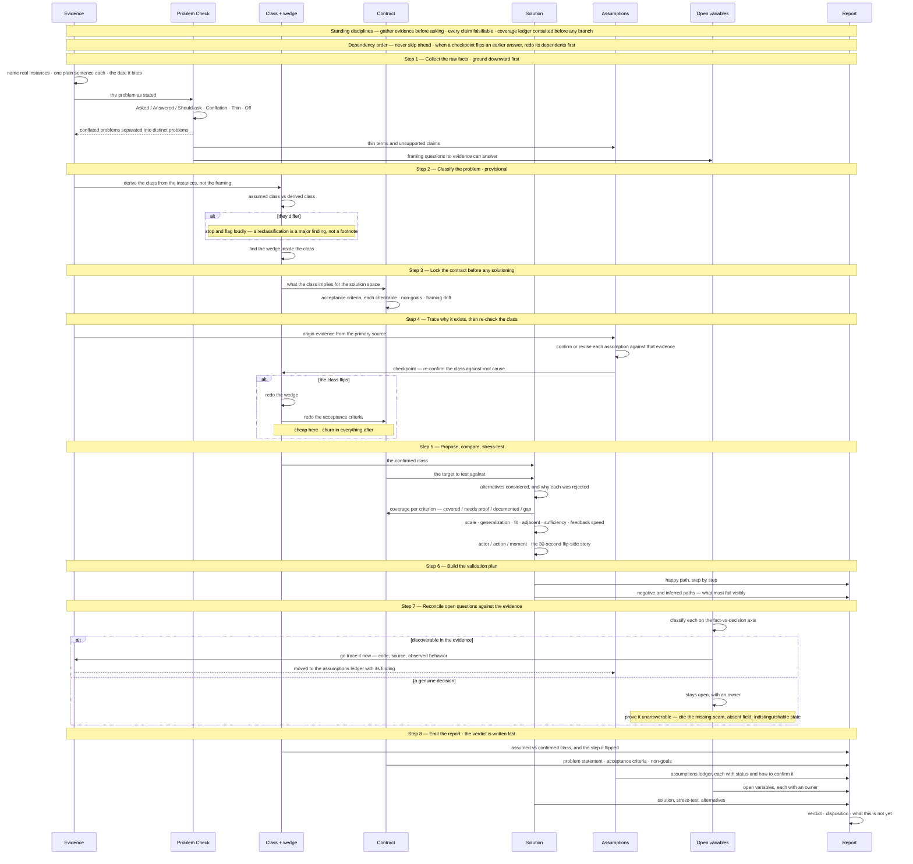

# agents-skills (generated — do not edit)

Source: `agents/skills/**`. Regenerate with `.\agents\scripts\sync-rules.ps1`.

## grill-me/SKILL.md

---
name: grill-me
description: Interview the user relentlessly about a plan or design until reaching shared understanding, resolving each branch of the decision tree. Use when user wants to stress-test a plan, get grilled on their design, or mentions "grill me".
---

Interview me relentlessly about every aspect of this plan until we reach a shared understanding. Walk down each branch of the design tree, resolving dependencies between decisions one-by-one. For each question, provide your recommended answer.

Ask the questions one at a time.

If a question can be answered by exploring the codebase, explore the codebase instead.

After a question is asked, please verify if what you're asking is already a behavior of the system. Declare if it is. For that reason, you might get answers to questions as you go through this that you can confirm in line. I would like to see these decisions. The objective with this instruction is to ensure we understand the deltas, if any exist.

At a minimum, 3 sections:
1. **Question #:**
2. **Current behavior:** include if this question contains functionality already present in some way
3. **My recommended answer:**

## investigation/investigation-sequence.md

# Investigation sequence

> **What this is:** how the method in [SKILL.md](./SKILL.md) actually operates — the eight steps as a sequence, with the returns drawn in. The steps are ordered by dependency, so the value of the diagram is the **backward** arrows: where a later step flips an earlier answer and forces its dependents to be redone.
>
> **Syntax constraints inside the mermaid block** — use `—` or `·` to set off an aside instead of any of these:
>
> - **No parentheses** — LucidChart's mermaid parser rejects them.
> - **No semicolons** — mermaid reads `;` as a statement separator, so a note ends mid-sentence and the remainder is parsed as a new statement.
> - **No `#`** — it opens an HTML entity code.



## Where the returns are

| Return | Trigger | What gets redone |
| --- | --- | --- |
| Problem Check → Step 1 | conflation found | the problem list splits; each distinct problem restated |
| Step 4 checkpoint → Step 2 | class flips against root-cause evidence | the wedge, then the acceptance criteria |
| Step 5 → Step 3 | a criterion has no coverage | the criterion, or the solution that was supposed to meet it |
| Step 7 → Step 1 | an open question turns out discoverable | trace it now; it becomes an assumption with a finding, not a question |

## investigation/SKILL.md

---
name: investigate
description: The method for investigating a problem and its proposed fix before committing to it — in any domain (software, workflow, policy, process, etc.). Ground in real instances, classify the problem, lock acceptance criteria, trace why it exists, re-confirm the class, then stress-test the solution against scale, generalization, and fit. Emits an Investigation Report (see the investigation-report template): verdict, problem class, assumptions-to-test, a happy/negative validation plan, recommendation with gates, and open variables to collect. Use when scoping a change, validating assumptions, writing a spec, or when the user says "investigate".
---

Investigate this problem and any proposed solution until we understand it well enough to act on it. Work down the tree one question at a time, and for each question give your recommended answer.

Before proceeding, tell the user they need to place the agent in Plan mode first. The investigation plan must address every point in every section below. Nothing can be left out: if a point is not resolved immediately, record where and when it will be resolved, and carry it into the Investigation Report / handoff so every section remains covered when referenced later.

The steps below are ordered by dependency: each locks in something the next step needs. Getting an early step wrong creates churn in every step after it — so don't skip ahead, and when a checkpoint flips an earlier answer, go back and redo the dependents before proceeding.

## Standing disciplines (apply from the first sentence, not a later phase)

- **Evidence first.** If a question can be answered by gathering evidence yourself, do that instead of asking. Only ask me what the evidence can't tell you.
- **Maintain the coverage ledger.** Consult prior coverage ledgers before opening an investigative branch, and record coverage (area, items inspected, findings, status, commit) as you traverse — per `agents/docs/investigation-coverage-ledger.md`.
- **Every claim falsifiable.** Write each claim — including problem statements and classifications — so it could be refuted, then go look for the refutation. Log each into the assumptions ledger as you make it, not retroactively.
- **Log unknowns as they surface — and route them by how they resolve.** A **fact to be discovered** (an answer already exists in the code / source text / observed behavior) goes to the assumptions ledger and you resolve it by evidence, *now* — never park a discoverable fact as an "open variable for discussion," which quietly excuses not going to find the answer. A **decision to be made** (resolved only by an owner choosing — scope, product, ownership, a change to the current structure) goes to the open-variables list with an owner. If one item has both halves, split it: discover the fact, isolate the decision. This axis is domain-agnostic — *fact-to-discover vs decision-to-make*; on a software ticket it lands as *code vs workflow*, on policy as *source-text/precedent vs judgment call*.
- **Offer candidates cheaply, drop misses without ceremony.** Never defend a bad instance or framing.
- **Push back on my framing for real.** If I say I'm sure, probe it. Agreement-by-default wastes the exercise.

## Step 1 — Collect the raw facts (ground downward first)

Instances come before classification: they are the evidence a classification is built from. Classifying first invites finding only the instances that fit.

- Name real instances: specific people or cases, blocked right now, on real tasks. No named instance = no confirmed problem; say so.
- State the problem in one plain sentence a stranger could confirm or deny. Enumerate the distinct problems separately — don't merge them.
- Establish urgency: the date or trigger event when this bites next. "Eventually" doesn't count.
- Run the **Problem Check** lens (`agents/docs/problem-check.md`) on the problem as stated — **every investigation, not just transcripts**. It surfaces what's being **conflated** (usually several distinct problems treated as one → separate them, per the bullet above), asked-vs-answered drift, **thin** terms, and internal contradictions ("off"). Feed its findings into Step 2 (class) and the assumptions ledger / open variables. When the evidence includes a transcript or live discussion, also extract the explicit **decisions** made.

## Step 2 — Classify the problem (provisional, from the instances)

The highest-leverage call in the investigation — everything downstream is checked against it — but it stays *provisional* until Step 4 confirms it against root-cause evidence.

- Note the class the request *assumes* — the category implied by how it was framed.
- Derive the class from the instances in Step 1, not from the request's framing. Are we looking at the class, or a symptom of a different class?
- If they differ, **stop and flag it loudly** — a reclassification is a major finding, not a footnote. (Example: a request framed as "data access — who can reach which systems" may really be a knowledge-management problem — where the data lives and how people discover it. Same symptoms, different class, completely different solution.)
- State what the class implies for the solution space.
- Only now find the wedge: the smallest issue *within the class* that forces the space open and stays reusable. A theme is not a project. The wedge depends on the class — if the class later flips, the wedge is redone.

## Step 3 — Lock the contract before any solutioning

Acceptance criteria are part of the problem definition, not the solution. Define what "done" is judged against before proposing anything, or the stress-test has no target.

- List the acceptance criteria — each one checkable.
- List the non-goals: what this explicitly does *not* cover. This is what prevents scope churn later.
- Note any framing drift beyond the class — other ways the question has shifted from the original ask.

## Step 4 — Trace why it exists, then re-check the class

- Trace the problem to its origin. Gather evidence from the primary source before asking me. Confirm or revise each assumption against that evidence, not against what the request claims.
- **Checkpoint:** re-confirm the classification against the root-cause evidence. Reclassifications most often emerge *here*, not at first glance. If the class flips, go back and redo the wedge and acceptance criteria before proceeding — that redo is cheap now and churn everywhere after.

## Step 5 — Propose, compare, and stress-test the solution

Propose a solution if there isn't one. Record the alternatives you considered and why each was rejected — future discussions will ask "why didn't we just X?" and this report should already answer it. Then test the chosen solution against:

- **The confirmed class** — does it solve the class of problem (not the assumed class, not just this occurrence)?
- **The acceptance criteria** — cover each: covered / needs proof / documented / gap, and what closes it.
- **Scale** — will it hold up as scope, volume, or the number of people and cases involved grows?
- **Generalization** — should this be abstracted, or is that overreach? The fix must be no simpler than it needs to be and no more complex than it needs to be.
- **Fit** — does it follow established practice and integrate cleanly with the existing system, its conventions, and its philosophy?
- **Adjacent issues** — if you surface related problems, is it lower effort to resolve them now or to spin off a follow-up? State the tradeoff.
- **Sufficiency** — does it cover the pain that convened this, or only a corner of it?
- **Feedback speed** — how fast will reality tell us we're wrong? Flag slow-feedback work.
- **Actor / action / moment** — for any capability, who is asking what, and when. Kill vague capabilities.
- **The flip side** — narrate the 30-second happy-path story of the solved world: who does what, and without whom.

## Step 6 — Build the validation plan

- **Happy path:** the sequence that should work, step by step.
- **Negative / inferred paths:** prove the problem isn't leaking in from, or out to, somewhere we haven't modeled. What must fail *visibly* instead of corrupting silently; limit and threshold breaches; removed dependencies proven non-required; timing/latency bounds that must hold.

## Step 7 — Reconcile open questions against the evidence (facts resolved, decisions isolated)

Before emitting, take every open question the investigation surfaced and run it back through the evidence one more time. This is the ambiguity re-check: a question is only allowed to stay open if it is a genuine decision, not an un-investigated fact. It comes *after* the prime investigation because you now know which questions actually survived.

- **Classify each open question** on the fact-vs-decision axis (Standing disciplines): is the answer discoverable in the evidence (code / source / observed behavior), or is it a decision for an owner? An item with both halves is split.
- **Resolve the discoverable ones now** — trace the code, read the source, observe the behavior — and move each to the assumptions ledger with its finding. Do not carry a fact you could have found into the handoff as a question, and do not bring it to me to "decide" when the codebase already answers it.
- **For a question the current structure genuinely cannot answer, prove it** — cite the specific code or structure that shows *why* it is unanswerable as-is: the missing seam, the absent field, the state the system cannot distinguish. "We don't know" is not acceptable; "here is the evidence that the current implementation cannot tell us, so this is a decision or a change, not a lookup" is.
- **What remains in open variables after this pass is only true decisions**, each with an owner.

## Step 8 — Emit the Investigation Report

Record everything into an Investigation Report (copy the template to `docs/investigations/<id>-<slug>.md`). The report is the deliverable — the results of investigating, not a plan to investigate. Its reading order leads with the verdict; you write the verdict last.

- **Verdict (bottom line up front)** — disposition (proceed / proceed with conditions / blocked / rejected / needs more investigation), one-paragraph summary, the strongest path forward, and — explicitly — what this is *not* yet (e.g. "viable, but not a production approval").
- **Problem class** — assumed class, confirmed class, whether it was reframed and at which step. The load-bearing finding.
- **Problem statement, acceptance criteria, non-goals** — from Steps 1 and 3.
- **What changed** — how the question shifted since the request was created; a reclassification is the most important kind of shift, so lead with it if it happened.
- **Why it exists** — origin and evidence, plus the class re-check outcome.
- **Alternatives considered** — each rejected option and the reason.
- **Solution & stress-test** — including the acceptance-criteria coverage table.
- **Assumptions ledger** — every falsifiable claim with status (open / confirmed / confirmed directionally / revised / refuted) and how to confirm or revise it. "Confirmed directionally" still owes proof of performance, accuracy, and parity.
- **Validation plan** — happy path and negative paths, from Step 6.
- **Decisions and recommendation with gates** — what we settled; what to do in order; what proceeds first and what stays gated behind which proof or artifact.
- **Open variables to collect** — the unknowns logged along the way, each with an owner where possible.
- **Handoff table** — action / owner / done-when, each done-when falsifiable.

Don't finish until you can answer all of these: the confirmed problem class (and any reframing from the original ask, with the step where it flipped), the problem in one plain sentence, a named blocked instance, the date it bites next, the wedge and why it's reusable, the acceptance criteria and non-goals, the 30-second happy-path story, the metric that proves it works and how fast it arrives, the verdict and disposition, owners for the open variables, and the tracked action with a falsifiable done-when.

---

## Contextual branches

This procedure is domain-agnostic. "Gather evidence from the primary source" resolves differently by context — follow the branch that fits:

- **Software** — search the codebase for evidence and trace the defect to its origin in code. Add a frontend lens where relevant: should we change how it behaves, how it looks, or both?
- **Workflow / process** — read the process as documented, talk to the people who actually run it, and watch where it breaks in practice.
- **Policy** — read the source text and precedent; check how it's applied versus how it's written.

Other domains plug in their own evidence source the same way.

## job-story/SKILL.md

---
name: job-story
description: Turn a feature request or ticket into a job story — a structured user story plus acceptance criteria, built through a matrix sequence that strips solution-speak and unobservable outcomes before emitting. Produces a referenceable artifact the finished work gets held against. Use when the user says "job story", "write the story", "turn this into a story", "acceptance criteria for this ticket", or asks to define what done means for a request.
---

# Job story

Turn a request into the yardstick the finished work gets measured against: a **User Story** and **Acceptance Criteria**, arrived at through a fixed matrix sequence that catches solution-speak, emotional abstraction, and non-observable outcomes before anything is emitted.

The matrices are not scaffolding — they are the record showing what was caught and named. Keep them in the artifact.

## Boundary — what this owns

| This skill | `write-spec` |
| --- | --- |
| The yardstick — what the built thing gets held against | The blueprint — classes, entities, migrations, how it gets built |
| Written first, independently | Written after, informed by the story |
| Owns acceptance criteria | Cites the story's acceptance criteria; does not restate or amend them |

When a ticket arrives with its own acceptance criteria, those are **input**, not output — they get read, then rebuilt through the sequence below.

## Invocation and inputs

Resolve the target in this order:

1. **`PRDV-XXXXX` id** → `<Project>` is the system per the `ticket-changelog` rule.
2. **Project + slug** (e.g. "job story for WorkLists duplicate-card-option") → `docs/<Project>/tickets/<slug>/`.
3. **Free brief, no id** → derive `<slug>` from the brief (kebab-case, at most six words); ask once for `<Project>` if it is not inferable from the working directory or branch.
4. **Nothing** → ask exactly one question: "Paste the request text (or id) and name the project." Never synthesize a request into existence.

**The request text is required.** It is the source artifact; without it, stop and ask (per the `source-truth` rule).

## Artifact layout

Stories live in the canonical ticket folder, rooted at **`C:\dustin-thomason\docs\<Project>\tickets\<slug>\`** — the same folder `orchestrate` uses, so a story written standalone is already in place if the ticket is orchestrated later. Every artifact stays in `dustin-thomason` regardless of where the implementation code lives.

```text
docs/<Project>/tickets/<slug>/
  original-ticket.md                              the request verbatim — reuse if present, create if not
  stories/
    <slug>-job-stories-index.md                   the table of contents — every story, always current
    <slug>-job-story-01-<short>.md                one file per story
    <slug>-job-story-talking-points.md            optional, on request
  dnu/                                            superseded stories move here, names unchanged
```

- **`original-ticket.md`** — if it already exists, cite it and never rewrite its Original Request. If it does not, create it per `../../docs/original-ticket-artifact.md` before writing any story. There is exactly one verbatim capture per ticket.
- **One file per story**, numbered in creation order, `<short>` being two or three words naming the story's subject.
- **Superseded stories move to `dnu/`** — never deleted, never renamed, never edited in place after acceptance.

### The index

`<slug>-job-stories-index.md` is written or updated **every time a story file is created or its status changes** — the point of the artifact is that later work can reach it without opening each file.

```markdown
# Job stories — <Project>/<slug>

Source: [original-ticket.md](../original-ticket.md)

| # | Story | User type | Criteria | Open questions | Status | File |
| --- | --- | --- | --- | --- | --- | --- |
| 01 | <short title> | <user type> | <count> | <count> | draft | [file](./<slug>-job-story-01-<short>.md) |
```

Status vocabulary: `draft` / `accepted` / `superseded (see dnu/)`.

## Synthesize the request into evidence

This step is the skill's own work, not a read of someone else's findings. Work the request text directly, and for each thing the story will claim, hold two pieces together: **the question it answers**, and **the reason for believing it**. That pairing is the story's evidence — it is what makes a criterion defensible when the finished work is held against it months later.

Where the request leaves something undecided, it becomes an **Open Question** on the story. Carry it; do not decide it by inference. If the answer is discoverable in the code, trace it and resolve it from evidence.

When the request bundles two or more distinct problems, write **a story for each**. A compound motivation is the signal to split.

### Relationship to Problem Check

`../../docs/problem-check.md` audits a request's framing and surfaces *questions that might get asked*. This skill **synthesizes** — it commits to what the story is and why it is believed. They are peers, not stages:

- **Neither is a prerequisite.** A story can be written before any investigation exists; Problem Check can run on a request that has no story.
- **When both exist, each must be updated when the other moves.** A Problem Check flag landing after a story is written is a revisit trigger; a story that splits or changes user type means the framing read is stale.
- **On acceptance criteria, this skill is authoritative.** Problem Check informs the story; it does not define what done means.

Under orchestration, the phases that revisit each artifact — and the gate at each one — are wired into `../orchestrate/SKILL.md`.

## The sequence

Work these in order; each consumes the prior output. One concise sentence per row and per bullet throughout.

### 1. Story Matrix

Columns: **Component** | **Framework Language** | **Story Sentence**. Fill in this order, using these templates exactly:

| Component | Framework Language |
| --- | --- |
| Motivation | *A [user type] doesn't want [undesired outcome].* |
| Context + Intent | *While [context], they want to [action].* |
| Obstacle + Desired Action | *Except that [obstacle], so they want to [action to rectify].* |
| Resolution | *Now they'll be able to [positive outcome].* |

### 2. Revision Matrix

The story must be **agnostic to system design**. No design words — filter, button, view, dropdown, grid, column, screen, page, modal, endpoint, field. Sentences carry only user motivation, context, and desired outcome.

Always revise the **Obstacle + Desired Action** row; add a row for any other component that carried design words. Show before, the named issue, and after.

### 3. Delivery Acceptance Statement (DAS)

A checklist, as many deliverables as the story needs, beginning with this line verbatim:

> *We know this story is considered complete when:*
> - [Deliverable]
> - [Deliverable]

### 4. Concatenated Story

The sentences from the **final (revised)** matrix, run together as a natural paragraph.

### 5. Final Review Matrix

Columns: **Original Sentence** | **Issue/Observation** | **Refined Sentence**. One row for **every** story sentence and **every** DAS line.

Name the issue explicitly, from these:

| Issue | Fix |
| --- | --- |
| Vague phrasing | Replace with specific language. |
| Emotional abstraction ("feel confident") | Replace with an observable outcome. |
| Solution-speak (buttons, filters, screens) | Replace with user-outcome wording. |
| Non-observable outcome | Replace with a measurable or clearly knowable result. |
| Wordiness | Replace with a concise sentence. |

Use **everyday experiential phrasing** — check, grab, look, scroll, tap, spot, pull up — over abstract or formal register (monitor, utilize, engage in, interact with).

Each refined sentence must be one thought, expressed as motivation, context, or outcome, and verifiable — someone could confirm it happened.

### 6. User Story

The refinements applied, in the same four-component sequence, written as a **natural story paragraph**. Heading is exactly **User Story** — no qualifier, no subheading.

### 7. Acceptance Criteria

The refined DAS lines, **omitting** the phrase "We know this story is considered complete when:". Heading is exactly **Acceptance Criteria** — no qualifier, no subheading.

## Output

Emit all seven in order, in chat and in the story file:

**Matrix** → **Revision Matrix** → **Delivery Acceptance Statement (DAS)** → **Concatenated Story** → **Final Review Matrix** → **User Story** → **Acceptance Criteria**

The story file adds a header (ticket, project, date, link to `original-ticket.md`), then after the criteria: an **Open Questions** section, and a **Story log** — newest first, one entry per phase or session in which the story moved, each labeled with what changed. Then update the index.

Close by telling the user a **talking points list** is available on request.

## Talking points (on request)

Draw only on what the story and its matrices already established — grouped for **UI/UX**, **Backend**, and **Frontend**, one concise line per point, naming what each discipline has to decide or account for. Write to `stories/<slug>-job-story-talking-points.md`. Never introduce a requirement here that is not traceable to a criterion or an open question.

## Revisit

A story is a living artifact: `draft` while anything can still move it, `accepted` once its open questions close. Any of these re-opens it, and the trigger names itself in the Story log.

| Trigger | Action |
| --- | --- |
| An open question gets answered | Fold the answer into the affected criterion; close the question. |
| A decision contradicts a criterion | The decision wins on *how*; the criterion still owns *what done means* — rewrite it to stay observable. |
| A plan step traces to no criterion | Either a criterion is missing or the step is out of scope; record which. |
| A criterion proves unobservable in practice | It failed its own Final Review Matrix row — rewrite it, and never reinterpret it to match what was built. |
| A second distinct problem surfaces late | Split it into a new story; the original keeps its number. |
| The user type turns out wrong | Re-run the sequence from Motivation — every row below it is invalid. |

**While `draft`:** revise in place and log it. **Once `accepted`:** move the file to `dnu/` unchanged, write the next version, and point the index row at it with the supersession noted.

## Inside orchestration

`orchestrate` owns the enforcement — the phase that drafts the stories, the phases that revisit them, and the gate evidence at each one are all defined in `../orchestrate/SKILL.md`. In outline: drafted at **Phase 0** from the verbatim request, revised through **Phases 1–2** as the investigation surfaces answers, **accepted at Phase 3**, then used as the yardstick by the spec, the test plan, and the Phase 6 review.

## Do not

- Do not write a story without the request text in hand.
- Do not treat Problem Check (or any investigation artifact) as a prerequisite for a story, or as the authority on its acceptance criteria.
- Do not let a story change without a **Story log** entry naming what moved.
- Do not answer an open question by inference — carry it, or resolve it from code evidence.
- Do not let design words survive into the final story.
- Do not fold two conflated problems into one story.
- Do not edit an accepted story in place — move it to `dnu/` and write a new one.
- Do not rewrite `original-ticket.md`'s Original Request, ever.
- Do not create a story file without updating the index in the same pass.
- Do not put a story anywhere except `docs/<Project>/tickets/<slug>/stories/`, even when the code lives in another repo.
- Do not deviate from the **User Story** and **Acceptance Criteria** headings, or from the four-component sequence inside the story paragraph.

## orchestrate/check-steps.ps1

<#
.SYNOPSIS
    Checks a ticket folder against steps.csv - was each step's document authored.

.DESCRIPTION
    This is what makes check_by mean something. For every step whose target
    resolves to a file inside the ticket folder, the check is the same and it is
    mechanical: does the document exist and is it non-empty. Authored, even if it
    is only a placeholder.

    check_by then decides how the result is reported:

      script   the done condition is fully machine-checkable, so a present file
               means the step is VERIFIED
      human    the file being present is only half the answer - the done condition
               needs judgment, so it reports REVIEW

    Targets that cannot resolve to a file in the ticket folder are n/a and say why:
    actors, the implementation repo, a skill the agent executes, and the changelog
    which lives outside the ticket folder.

    NOT checked here: whether the content is correct. Accuracy is a separate
    revision pass - see the footnote in decisions.md.

    Pure ASCII on purpose - PowerShell 5.1 reads .ps1 as ANSI without a BOM.

.PARAMETER TicketFolder
    Path to docs/<Project>/tickets/<slug>/.

.PARAMETER ThroughPhase
    Only check phases up to and including this number. A stage step's file lands
    in the following phase, so a run stopped mid-flight legitimately shows later
    phases as missing.
#>
[CmdletBinding()]
param(
    [Parameter(Mandatory = $true)][string] $TicketFolder,
    [int] $ThroughPhase = 99
)

$ErrorActionPreference = 'Stop'
$here = Split-Path -Parent $MyInvocation.MyCommand.Path

if (-not (Test-Path -LiteralPath $TicketFolder)) { throw "no such ticket folder: $TicketFolder" }
$slug = Split-Path -Leaf $TicketFolder

$rows  = Import-Csv (Join-Path $here 'steps.csv') -Encoding UTF8
$parts = @{}
foreach ($p in ($rows | Where-Object { $_.kind -eq 'participant' })) { $parts[$p.id] = $p }

function Resolve-Target($alias) {
    # returns @{ ok = $bool; reason = <string when not ok>; pattern = <glob when ok> }
    if (-not $parts.ContainsKey($alias)) { return @{ ok = $false; reason = 'unknown participant' } }
    $p = $parts[$alias]
    switch ($p.role) {
        'actor'              { return @{ ok = $false; reason = 'an actor, not a file' } }
        'external'           { return @{ ok = $false; reason = 'outside this repo' } }
        'skill'              { return @{ ok = $false; reason = 'a skill the agent runs, not a ticket file' } }
        'external-artifact'  { return @{ ok = $false; reason = 'lives outside the ticket folder' } }
    }
    if (-not $p.path) { return @{ ok = $false; reason = 'no path defined' } }
    # every <placeholder> becomes a wildcard, so <slug>, <NN> and <short> all resolve
    $pattern = [regex]::Replace($p.path, '<[^>]+>', '*')
    return @{ ok = $true; pattern = $pattern }
}

$results = New-Object System.Collections.Generic.List[object]

foreach ($s in ($rows | Where-Object { $_.kind -eq 'step' } | Sort-Object { [int]$_.phase }, { [int]$_.seq })) {
    if ([int]$s.phase -gt $ThroughPhase) { continue }

    $r = Resolve-Target $s.target
    if (-not $r.ok) {
        $results.Add([pscustomobject]@{
            Phase = $s.phase; Step = $s.id; Target = $s.target
            Status = 'n/a'; Note = $r.reason
        })
        continue
    }

    $full  = Join-Path $TicketFolder $r.pattern
    $found = @(Get-ChildItem -Path $full -File -ErrorAction SilentlyContinue | Where-Object { $_.Length -gt 0 })

    if ($found.Count -eq 0) {
        $exists = @(Get-ChildItem -Path $full -File -ErrorAction SilentlyContinue)
        if ($exists.Count -gt 0) { $status = 'EMPTY'; $note = 'file present but zero bytes' }
        else                     { $status = 'MISSING'; $note = $r.pattern }
    }
    elseif ($s.check_by -eq 'script') { $status = 'VERIFIED'; $note = $found[0].Name }
    else                              { $status = 'REVIEW';   $note = "authored - done needs you: $($s.done)" }

    $results.Add([pscustomobject]@{
        Phase = $s.phase; Step = $s.id; Target = $s.target; Status = $status; Note = $note
    })
}

Write-Host ""
Write-Host "ticket: $slug" -ForegroundColor Cyan
Write-Host ""
foreach ($g in ($results | Group-Object Phase)) {
    Write-Host "PHASE $($g.Name)" -ForegroundColor White
    foreach ($x in $g.Group) {
        switch ($x.Status) {
            'VERIFIED' { $c = 'Green' }
            'REVIEW'   { $c = 'Yellow' }
            'MISSING'  { $c = 'Red' }
            'EMPTY'    { $c = 'Red' }
            default    { $c = 'DarkGray' }
        }
        $note = $x.Note
        if ($note.Length -gt 70) { $note = $note.Substring(0, 67) + '...' }
        Write-Host ("  {0,-9} {1,-22} {2,-8} {3}" -f $x.Status, $x.Step, $x.Target, $note) -ForegroundColor $c
    }
    Write-Host ""
}

$summary = $results | Group-Object Status | Sort-Object Name
Write-Host "summary: $(($summary | ForEach-Object { "$($_.Name)=$($_.Count)" }) -join '  ')" -ForegroundColor Cyan

$broken = @($results | Where-Object { $_.Status -in @('MISSING', 'EMPTY') })
if ($broken.Count -gt 0) { exit 1 }
exit 0

## orchestrate/decisions.md

# Decisions — steps.csv and the rendered sequence

**Purpose.** The diagram and its checker exist to enforce that **action was taken** — not that the action was correct. Correctness is a separate revision pass. Every decision below follows from that: a step earns a row if it represents an action, and `done` is satisfied when the action left evidence.

Settled decisions only. Newest at the bottom. Do not re-litigate these. A decision that is later overtaken is **marked superseded, never rewritten** — the trail is the point.

| # | Decision | Why |
| --- | --- | --- |
| 1 | `steps.csv` is the single source of truth. It feeds both the mermaid diagram and the agent checklist. | Two files force a Power Query join for analysis, and Power Query is one-way. |
| 2 | One file. No companion `participants.csv`, no companion schema doc. | Every extra doc is friction. If the process needs a second doc to be understood, it failed. |
| 3 | CSV UTF-8, edited natively in Excel — File > Open, edit, Ctrl+S, keep format. | Excel has no reliable UTF-8 tab-delimited save; CSV UTF-8 round-trips. Turn off File > Options > Data > Automatic Data Conversion first. |
| 4 | **The CSV is maintained in sequence order.** Reading it top to bottom shows what happens after what. `seq` numbers in tens make the order explicit and allow insertion without renumbering. Filtering and sorting in Excel is for analysis only — the saved file stays in order. | The file has to be readable as the sequence itself, not just as data. |
| 5 | **Rows are steps.** Never create a row for a gate. | Gates are not actions. |
| 6 | **`done` applies to every step.** It is the status of done for that step. | Plain and uniform. |
| 7 | **No gate column, no gate rows, no gate concept in the CSV.** Dropped entirely. | Gate is arbitrary and non-extensible. `done` already covers it. |
| 8 | Diagram labels are short. **Superseded in part by 21** — there is no `detail` column; the long explanation lives in the doc that `governs` names. | A sequence diagram shows order and handoff. Labels over ~250 characters made it unreadable and broke LucidChart. |
| 9 | Notes do not belong in the diagram. **Amended by 21** — explanatory text does not live in the CSV either; it lives in the source doc. | Too many notes destroy a sequence diagram. |
| 10 | `orchestration-sequence.md` is frozen and not edited. **It may be deleted** — nothing depends on it, and three of its statements are now superseded, including one that reads "later phases may only append Downstream Artifacts". | It was the reference to compare the generated output against. That job is done. |
| 11 | Three row kinds only: `participant`, `phase`, `step`. No `gate-item`, no `note`, no `read`. | A row is a lifeline, a phase header, or an action. Nothing else. |
| 12 | A phase's reference-doc list is one `reads` column on the `phase` row. Never rendered. | The checklist needs to tell an agent what to load; SKILL.md says load only the listed inputs. Phase-level, so one cell. |
| 13 | `check_by` column on every step: `script` or `human`. Default to `human` when unsure. **Retained.** Definition: `script` means a program can answer the `done` condition yes or no by reading files on disk, with no interpretation — presence, values, structure. `human` means it needs judgment about meaning. **Consumed by `check-steps.ps1`** — see decision 30. If it is ever removed, a replacement rule has to take its place; the script/human distinction is real and something must carry it. | Filtering `check_by = human` gives the exact list of steps the workflow cannot police itself on — which is where steps get skipped unnoticed. |
| 14 | Alias and id renames are **deferred to a cleanup pass**, not done now. Known collisions to fix then: `LEDGER` vs the coverage and locked-decision ledgers; `PLAN` vs the implementation plan and the changelog Plans table; `P2.plan-saved` vs `P2.changelog-plans`. | Renaming mid-build churns every row and breaks the diff against the frozen reference doc. |
| 15 | `label` is a short verb phrase, **hard cap 60 characters, enforced by the validator**. The target is visible from the arrow and is not repeated in the label. **Amended by 21** — long text goes nowhere in the CSV; `governs` names the doc that holds it. | Labels grew one clause at a time until the diagram was unreadable and LucidChart refused it. A guideline would be ignored the same way; the cap is mechanical. |
| 16 | `sets` column is **cut**. | It restated `done` in a second cell, on ~5 rows out of 80. Same duplication that killed the gate column. |
| 17 | One prose column, `detail`, used by every row kind. `notes` is **cut**. **Superseded by 21** — `detail` is cut too, so the CSV holds no prose at all. | Two prose columns with no rule separating them meant caveats and explanations landed in whichever one arbitrarily. |
| 18 | `cond` column is **cut**. The sequence is **happy path only** — no `alt`, no `opt`, no conditional branches. Exception handling is left to the agent's discretion. | Conditions are noise in a sequence meant to show what normally happens next. |
| 19 | Behavior that used to need a condition is stated plainly instead, as an ordinary step with a neutral label such as "move superseded files to dnu/". | The behavior is not lost, it just stops being a branch. |
| 20 | **The test for every row and every column is: is it valuable?** Not "is it important". Not "could it be skipped". Those are proxies, and both were invented mid-build.<br><br>Questions that inform the judgment — they help answer it, they do not replace it:<br>· does it help the **user** understand the diagram and determine what they need from it<br>· does the **agent** know what its current action is<br>· does the agent know what it should, or should not, be doing | Value is measured against the communication — what a reader, human or agent, can act on. Not against how significant the underlying fact is. |
| 21 | **`detail` column is cut.** The skill is always loaded before any of this runs — there is no path that starts without it — so the CSV never repeats what a source doc already holds. `governs` names the doc instead, and becomes the most important column. | DRY. A non-rendering column is not a licence to duplicate a source doc. |
| 22 | **`returns` column is cut.** Supersedes D11. | Empty on every row once labels got short. What came back was never the useful part. |
| 23 | **`P0.invoke` and `P1.present` are cut.** Invocation and plan-mode presentation are baked into the system — a run cannot start unbidden and plan mode cannot end any other way. | Not valuable per decision 20. Displaying what cannot be otherwise tells a reader nothing. |
| 24 | `P2.entry-check` is **cut**. On the happy path you cannot be in Phase 2 without Phase 1 having completed and been approved, so confirming the Phase 0 and Phase 1 ledger rows read done verifies what the sequence already guarantees. The one case where it bites is a resume jumping straight into Phase 2 with a ledger that lies, and decision 18 puts resume out of scope. | Reversal of an earlier call, which had been argued from a failure recorded in SKILL.md — a reason the check exists in the skill, not a reason it earns a row here. The first cut reasoning was also wrong: it cited SKILL.md's implementation-repo clause, which is the half of the entry check that has nothing to do with Phase 2. |
| 25 | `role` accepts `skill`, for a method doc the agent executes rather than writes. `INV` is `investigation/SKILL.md`. Full set: `actor`, `ticket-artifact`, `external-artifact`, `external`, `skill`. | The investigation method is a participant, not an agent self-loop. |
| 26 | A `verb` reflects the step's landing action, not everything the step does. `P0.changelog` is `write` although its label also mentions reading for alignment. | Splitting it back into two rows added a row without adding value. |
| 27 | **`original-ticket.md` is immutable after Phase 0.** Nothing appends to it, ever. `P2.ticket-downstream` is cut. | `orchestration.md` already carries an **Artifacts** column per phase row, so a Downstream Artifacts list in the original ticket is the ledger's job restated. The original ticket is the request and nothing else. **Done:** the `## Downstream Artifacts` section was removed from `agents/docs/original-ticket-artifact.md`, its L65 permission replaced with the boundary, and SKILL.md's Do-not widened from the Original Request section to the whole file. |
| 28 | **Approval is the human check.** A step whose human verification already happened upstream does not carry `check_by = human` again. `P2.plan-saved` proves only that the file landed, so its `done` is presence and its `check_by` is `script`. | Once you approve the plan, it is confirmed. Re-checking the same fact downstream invents an unverifiable condition — the earlier `done` asked for a byte-comparison against text that exists nowhere on disk. |
| 29 | **`governs` is mandatory on every step**, enforced by the validator. | It is the mechanism that answers rule 20's third question — the agent knows what it should or should not be doing by reading the authority the row names. Without the question being asked, the column sits empty; the validator previously caught only a *wrong* value, never a missing one. |
| 30 | **`check-steps.ps1` is what makes `check_by` mean something.** It takes a ticket folder, resolves each step's `target` to a file pattern, and asks one mechanical question: was the document authored — present and non-empty. `script` then reports **VERIFIED**, because a present file settles the `done`. `human` reports **REVIEW** and prints the `done` you have to judge. Unresolvable targets report **n/a with the reason** — an actor is not a file, the implementation repo is outside this repo, a skill is run not written, the changelog lives outside the ticket folder. | A classification nothing consumes is a claim that verification is happening. Now something consumes it, and the two values produce different output. |
| 31 | **Accuracy is out of scope for the checker.** It answers "was this authored", never "is this right". Verifying content correctness is a separate revision pass, not yet built. | Enforcing action is the goal per the purpose statement above. Correctness is a different job and conflating them would make the checker unbuildable. |
| 32 | A `stage` step and the step that lands its file both check the same path, so Phase 1 and Phase 2 each report on `PLAN`, `WHY`, `STORY` and `COV`. Expected, not a defect — plan mode writes nothing, so a mid-flight run correctly shows Phase 1's staged rows as MISSING. `-ThroughPhase` limits the check when a run has not finished. | The double report is the honest consequence of staging. Hiding it would mean pretending a staged write landed. |

## Diagram rules

Carried over from `orchestration-sequence.md`, which is frozen. These are now the authority; that doc's rule block can be deleted.

| # | Rule | Enforced by |
| --- | --- | --- |
| D1 | Lifelines are ordered by the order items are introduced — not importance, not frequency. | participant `seq` |
| D2 | Flow is linear. A backward or long-jump arrow needs a stated reason, recorded in a CSV column and not in the label. | author, checked by eye |
| D3 | A self-loop is only ever on the agent. A document never loops. | renderer rejects a document self-loop |
| D4 | The diagram carries order and handoff only. Everything explanatory lives in the doc that `governs` names — not in the diagram, and not in the CSV. | short `label` plus the `governs` pointer |
| D5 | A participant label is the document's filename. One exception: `implementation repo` is a place, not a document, and earns a lifeline because Phase 5 writes code there. | participant `label` |
| D6 | The phase band is the only note in the diagram. Its span covers the lifelines that phase touches, actors excluded. | computed from the phase's step targets |
| D7 | Arrow style comes from `verb`, never hand-chosen. Solid = an actor initiating. Dashed = a return or a deferral. A dashed arrow never changes disk state at the moment it is drawn. | renderer |
| D8 | Actors act; documents never do. `You` and `agent` are the only senders. A document never acts before it exists. | renderer rejects a document as sender |
| D11 | ~~`returns` is optional~~ — **superseded by decision 21, the column is cut.** | — |
| D9 | The governing doc is the `governs` column. It is **not** put in the label. | column only — the old rule that `governs` must appear in the label is deleted, it is what made labels unreadable |
| D10 | No parentheses, semicolons or `#` reach the mermaid output. | renderer escapes them; not an authoring burden |

## orchestrate/orchestration-sequence.md

# Orchestration sequence

> **What this is:** how the lifecycle in [SKILL.md](./SKILL.md) actually operates — every artifact it produces, the phase that creates each one, and every later phase that updates it. Lifelines are named for the **document** rather than a role, so what a message touches is unambiguous. Filenames drop the `<slug>-` prefix for width, and the job-story lifeline also drops its trailing `-<short>` segment — the real names are `<slug>-job-story-<NN>-<short>.md` and `<slug>-job-stories-index.md`, per SKILL.md's folder layout.
>
> **Two actor columns, then documents.** `You` and `agent` are the only things that act; every other lifeline is a passive file. A read is a request out and a dashed return back; a write is a solid arrow into the document. Neither actor counts toward a phase's span.
>
> **Read it for the backward arrows.** Phases run forward, but artifacts come back: plan-mode writes land a phase late, the why doc and the stories stay open the whole way, and a done report is appended to rather than rewritten.
>
> **Rules of the diagram** — the philosophy it is held to. A change that breaks one of these is wrong even if it reads well:
>
> 1. **Lifelines are ordered by the order items are introduced** — not by importance, and not by how often they appear.
> 2. **Flow is linear** — arrows move forward to the adjacent lifeline. A backward or long-jump arrow needs a stated reason.
> 3. **A self-loop only where work is done and time passes** — never for a state label or a standing rule. Those are notes.
> 4. **Display only what changes how the phase is run** — bookkeeping that is true of every phase belongs in the global note, not in a band.
> 5. **Headers name the document**, so what an arrow touches is unambiguous.
> 6. **A phase note spans only the lifelines that phase touches, and never includes an actor.** The width measures how far the *data* reaches — back into artifacts already written, forward into ones not yet created. Actors are present at every phase, so counting them makes every note start at the left edge and destroys the signal. Only the opening notes span the full data width, because they genuinely govern every phase. Width reads as reach, leftmost to rightmost touched — not as how many lifelines lie in between.
> 7. **A note spans its phase's full data range, or sits over one named lifeline** — never an arbitrary subset. A note covering two of nine touched lifelines tells the reader nothing about why those two.
> 8. **Solid arrow = an actor initiating** — a request to read, or a write that lands on disk now. **Dashed arrow = a return or a deferral** — data coming back from a document, an approval coming back from `You`, or a Plan-mode write staged to land in a later phase. The unifying test: a dashed arrow never changes disk state at the moment it is drawn.
> 9. **Every action names the file that governs it** — the skill, doc, rule, or script it comes from, including the script a step actually executes. This diagram is a blueprint for the *files involved*, not only the workflow, so a reader can go to the source without guessing. Headers carry their source too: a phase band names the section that defines it, and a gate names where its evidence list lives.
>
> 10. **Actors act — documents never do.** There are exactly two actors, `You` and `agent`, and they are the only valid senders. A document is passive: it does not read, grep, decide, run a command, or push its contents anywhere. So a **read** is a pair — `agent->>DOC` asking, `DOC-->>agent` returning — and a **write** is `agent->>DOC`. If an arrow appears to be sent *by* a document, that lifeline is standing in for the actor and the arrow is wrong. Two corollaries: a self-loop on a document is almost always this error, because the work belongs to the agent and not to the file it happens to touch; and **a document never acts before it exists** — it may be the target of a staged write in an earlier phase, but it cannot send anything until the phase that creates it.
>
> **One deliberate exception to rule 5:** `implementation repo` is not a document. It earns a lifeline because Phase 5 writes source code, and without it the diagram shows code being written into `testing-implementation.md`. It also makes the docs-here / code-there boundary visible, which is one of the orchestration's load-bearing rules.
>
> **Syntax constraints inside the mermaid block** — use `—` or `·` to set off an aside instead of any of these:
>
> - **No parentheses** — LucidChart's mermaid parser rejects them.
> - **No semicolons** — mermaid reads `;` as a statement separator, so a note ends mid-sentence and the remainder is parsed as a new statement.
> - **No `#`** — it opens an HTML entity code.

```mermaid
sequenceDiagram
    participant U as You
    participant AG as agent
    participant LEDGER as orchestration.md
    participant TICKET as original-ticket.md
    participant CLOG as changelog
    participant STORY as job-story-NN.md + index
    participant COV as coverage-ledger.md
    participant CODE as implementation repo
    participant WHY as why-these-changes.md
    participant PLAN as recon-and-plan.md
    participant RPT as investigation.md
    participant DIA as diagrams.md
    participant CONC as future-development-concerns.md
    participant TP as test-plan.md
    participant PR as pr-draft.md
    participant LD as locked-decisions.md
    participant SPEC as spec.md
    participant TI as testing-implementation.md

    Note over LEDGER,TI: Every phase — the ledger row and Resume footer update · a visible todo list is maintained throughout · the gate must print · a failed gate blocks the advance · every completion notifies · confidence is not a substitute for the check
    Note over LEDGER,TI: Handoffs — the block is emitted verbatim and nothing follows it · in Claude Code, EnterPlanMode may cross a Working→Plan boundary without stopping, but the block still prints

    Note over LEDGER,STORY: PHASE 0 — Capture · Working · defined in SKILL.md Phase 0
    Note over LEDGER,STORY: reads — original-ticket-artifact.md · job-story/SKILL.md · ticket-changelog rule · browser-loop-setup.md when the ticket lives in ClickUp
    U->>AG: orchestrate this ticket — an id, a project and slug, or a free brief · never synthesized into existence · SKILL.md Invocation
    AG->>LEDGER: resumed from an existing run, or scaffolded from the template — disk facts win when the two disagree · SKILL.md State ledger and resume
    AG->>TICKET: written verbatim per original-ticket-artifact.md — ClickUp capture or pasted text · no findings, no recommendations
    Note over TICKET: the Original Request is never rewritten — later phases may only append Downstream Artifacts · SKILL.md Do-not
    AG->>CLOG: resolved, or scaffolded by scripts/new-ticket-changelog.ps1 with Requirements verbatim · ticket-changelog rule, First pass
    CLOG-->>AG: Current state · Plans · Attempt history — what was already tried, rejected, or asked repeatedly
    AG->>STORY: synthesized per job-story/SKILL.md — one story per distinct problem · status draft
    Note over LEDGER,STORY: gate — no criterion names a design element · every artifact under dustin-thomason even when the code lives elsewhere · no implementation-repo file touched yet · evidence list in SKILL.md Phase 0
    AG->>U: notify via scripts/notify-agent-complete.ps1 per the agent-completion-notification rule · HANDOFF block per SKILL.md → Phase 1 requires Plan mode
    U-->>AG: "go"

    Note over TICKET,PLAN: PHASE 1 — Recon and plan · Plan mode as the method for collecting methodically · nothing lands on disk yet · defined in SKILL.md Phase 1
    Note over TICKET,PLAN: reads — investigation/SKILL.md, executed as this phase · investigation-software-gaps.md as the mandatory software lens · investigation-coverage-ledger.md for the consult protocol · Problem Check is embedded in method Step 1 and is never loaded separately · NOT investigation-question-coverage.md
    Note over COV: consult protocol per investigation-coverage-ledger.md — OTHER tickets' ledgers globbed at docs/Project/tickets/*/investigations/*-coverage-ledger.md and grepped for the subsystems in play · reuse covered ground, reopen only per the four conditions with the reason recorded
    AG->>TICKET: read the request text — Problem Check grounds every finding in a trimmed quote from it
    TICKET-->>AG: the words the framing claims must cite, not only code
    AG->>CODE: Step 7 reconcile — resolve the code-discoverable questions by tracing the evidence NOW · READ ONLY, nothing created, edited, or run there until Phases 0 and 1 both print done
    CODE-->>AG: file and line evidence · the commit each inspection is keyed to
    AG->>AG: investigation method steps 1–7 — everything but the emit · Problem Check lens · software lens · Step 7 fact-vs-decision split
    AG-->>COV: staged — the consult log line, then a coverage row per area traversed with items inspected, findings, status and commit
    AG-->>WHY: staged — the class of problem, and the Phase 1 why-log entry of obvious vs not obvious vs assumptions · per why-these-changes.md
    AG-->>STORY: staged — questions the investigation answered, criteria a finding invalidates, any story that has to split · peer input to the stories, never their source of truth
    AG-->>PLAN: staged — this recon's findings, then the emission todos · saved verbatim at Phase 2's first action
    Note over TICKET,PLAN: gate — the plan carries this recon's findings, not todos alone, so Phase 2 is executable from it with no other context · the consult results and reconcile-per-lens todos are in it · the Problem Check pass is present, and a flag may read nothing here · every open question split into a fact resolved by evidence or a decision with an owner · no code-discoverable fact parked as a decision · problem class, why-log entry and story reconcile all staged, or story movement explicitly none · SKILL.md Phase 1 gate
    AG->>U: the recon-and-plan doc — findings reached, then todos to reconcile against every point of the software lens, emit the report, materialize the coverage ledger with its consult line, produce the diagrams artifact, seed the test plan, and record any surfaced concerns
    U-->>AG: plan approved — the approval IS the handoff · the Phase 1 ledger row and its notification both fire at Phase 2's first action

    Note over LEDGER,PR: PHASE 2 — Investigation report · Working · defined in SKILL.md Phase 2
    Note over LEDGER,PR: reads — the approved plan · investigation-report.md · investigation-diagrams.md · test-plan-artifact.md · in-step — pull-request-workflow.md for the PR shell, future-development-concerns.md when the plan's todos carry a concern
    AG->>LEDGER: entry check — confirm Phases 0 and 1 both read done, or skipped with a reason
    LEDGER-->>AG: the phase rows · nothing is created, edited, or run in the implementation repo until they do · SKILL.md Entry check
    AG->>PLAN: the approved plan saved verbatim, then frozen — deviation goes to the coverage ledger's reopen reason or the why-log, never back into the plan
    AG->>WHY: materialized — the staged problem class and Phase 1 why-log entry land here
    AG->>STORY: staged reconcile applied — revised criteria, closed questions, any split · a Phase 1 Story log entry on each story touched
    AG->>RPT: written from investigation-report.md into investigations/, which OVERRIDES the template's own default location · the verdict leads the reading order and is written last · §5 links out to the diagrams artifact and never embeds it
    AG->>COV: materialized — consult line first, then every staged area entry, then the not-yet-inspected frontier
    AG->>DIA: current-vs-target, flows, sequences including race conditions and timing edges per investigation-diagrams.md · N/A lines for the kinds skipped
    AG->>CONC: created on the first concern only, per the plan's emission todos and future-development-concerns.md
    AG->>TP: seeded from report §9 per test-plan-artifact.md — each scenario names the criterion it exercises, or is flagged as coverage with no criterion behind it yet · status seeded
    AG->>PR: shell only per pull-request-workflow.md — title, ClickUp link, Description, Test Evidence, Commit hash, Checklist as empty placeholders, topped with a one-line note that it is unfilled · the body waits because scope can still move in Phases 3 and 4
    AG->>TICKET: Downstream Artifacts appended
    AG->>CLOG: Plans row added
    Note over LEDGER,PR: gate — the consult log line is present in the coverage ledger · report §5 links the diagrams rather than embedding them · report §2 Problem Check filled with quote-grounded findings, or an explicit nothing-here per flag · §1–§2 framing claims cite ticket-text quotes, not only code · §8 and §10 route facts vs decisions · every story Open Question appears in §10 or was closed with its evidence · test plan status seeded · PR shell staged with its body unfilled · evidence list in SKILL.md Phase 2
    AG->>U: notify, with the deferred Phase 1 notice batched in · gate prints, then AUTO-ADVANCE to Phase 3 — same mode, no stop

    Note over STORY,SPEC: PHASE 3 — Probe and spec · Working · defined in SKILL.md Phase 3
    Note over STORY,SPEC: reads — grill-me/SKILL.md · qa-to-spec-traceability.md · spec-writing rule, loaded automatically · write-spec/SKILL.md and wiki-spec-authoring.md when a PRDV app ticket routes to the wiki, asked once — sibling spec or wiki
    AG->>RPT: read §8 assumptions and §10 open variables
    RPT-->>AG: the assumptions and open variables as recorded at Phase 2
    AG->>STORY: read each story's remaining Open Questions
    STORY-->>AG: the open questions each story still carries
    AG->>CODE: re-run the Step 7 reconcile before grilling — trace every question the code can answer · a question bundling a fact with a decision is split, the fact answered here
    CODE-->>AG: the discoverable facts, resolved by evidence · only genuine decisions may reach grill-me
    AG->>AG: grill-me per grill-me/SKILL.md under the qa-to-spec-traceability workflow — one question at a time · question gate before each · rejected paths recorded
    AG->>LD: materialized as its own file — question gates resolved, then the full row table with source, supersedes-or-rejects, and spec destination · each answer committed before the next question · supersessions recorded, never overwritten
    AG->>CONC: a risk-accepting answer produces BOTH records, the file created on the first concern — the locked-decision row cites the concern entry
    AG->>STORY: resolved decisions folded into the criteria they affect · Open Questions closed, or one carried forward with a named owner and reason · index rows set accepted · Phase 3 Story log entry appended · a decision wins on how, the criterion still owns what done means and is rewritten to stay observable
    AG->>SPEC: written per the spec-writing rule — grill-me output INFORMS the spec and is not the spec · links locked-decisions.md rather than repeating it · N/A lines where a section does not apply · framed Problem → Requirement → Solution · cites the stories' criteria, never restates or amends them
    AG->>TP: refined — resolved variables become concrete assertions, each mapped to the criterion it proves · status refined
    Note over STORY,SPEC: gate — the spec's locked-decisions section links to a locked-decisions.md whose ledger traces every entry to a source · no locked decision left open · supersessions recorded, never a silent overwrite · every story accepted, or naming the owner of a still-open question · the spec cites the criteria rather than restating or amending them · audit per qa-to-spec-traceability.md definition of done
    AG->>U: notify · HANDOFF block per SKILL.md → Phase 4 requires Plan mode
    U-->>AG: "go"

    Note over CLOG,SPEC: PHASE 4 — Prep · Plan · no re-investigation, plan from the artifacts · defined in SKILL.md Phase 4
    Note over CLOG,SPEC: reads — the spec, report §11 and the test plan, all drawn below · in-step — new-branch-get-started.md for the branch step, build-implementation-guardrails rule for the shipping obligations
    AG->>SPEC: read the design
    SPEC-->>AG: what to build, and the locked decisions behind it
    AG->>RPT: read §11 handoff table
    RPT-->>AG: action · owner · falsifiable done-when per item
    AG->>TP: read the refined scenarios
    TP-->>AG: what must be proven, and by which assertion
    Note over CLOG,SPEC: gate — every plan step traces to spec, report, or test plan AND to an acceptance criterion · a step tracing to no criterion is a missing criterion or out of scope, and which one gets recorded · evidence list in SKILL.md Phase 4
    AG-->>CLOG: staged — a Plans row for this plan, landing at Phase 5's first action
    AG->>U: implementation plan — framed Problem → Requirement → Solution · ordered steps · branch step per new-branch-get-started.md when repo work begins · test execution mapped to the test plan · tests, regression, API docs and gates named up front per the build-implementation-guardrails rule
    U-->>AG: plan approved — the approval IS the handoff · the ledger row, the changelog Plans row and the deferred Phase 4 notification all fire at Phase 5's first action

    Note over CLOG,TI: PHASE 5 — Implement · Working · defined in SKILL.md Phase 5
    Note over CLOG,TI: reads — the approved plan · the test plan · the touched repo's own rules · in-step — testing-implementation-artifact.md, pull-request-workflow.md, git-commit-workflow rule
    AG->>CLOG: Plans row set active — the row staged at Phase 4 lands here
    AG->>TP: revised to match what was actually approved, since that can differ from what the spec proposed — after approval, before any code · a quick pass, not a rebuild · status revised post-approval
    AG->>CODE: implemented per the approved plan, inside the build-implementation-guardrails obligations — tests as part of shipping · architecture fit · graceful degradation by layer
    AG->>TP: read the scenarios to execute
    TP-->>AG: each scenario and the criterion it proves
    AG->>CODE: test-plan scenarios executed against the change
    CODE-->>AG: observed results — exact command · scope · result · serial runs
    AG->>TP: scenarios checked off and the results log filled · status complete, or blocked items carrying reason, residual risk and follow-up
    alt a criterion proves unobservable
        AG->>STORY: story moved to dnu/ and the next version written — never reinterpret a criterion to match what was built
    end
    opt any phase after 2 — later work changes a report already marked done
        AG->>RPT: numbered addendum §13+, dated and evidenced — never a rewrite of the verdict
    end
    AG->>TI: scenario first per testing-implementation-artifact.md — why each situation matters and whether it held · newly-uncovered scenarios flagged · each change hung off the scenario that forced it, as files plus observed → expected → fix · a living doc written as you go
    AG->>CLOG: session log written before every commit · ticket-changelog rule
    AG->>CODE: audit, then lint, then tests — the pre-commit gate order per the git-commit-workflow rule
    AG->>PR: the Phase 2 shell filled per pull-request-workflow.md — title · description · test evidence pasted from testing-implementation.md · commit hash · PR opened when requested
    Note over CLOG,TI: gate — test plan status complete, or blocked items carrying reason, risk and follow-up · the testing-implementation doc records each scenario in dev-legible terms with newly-uncovered ones flagged and every change hung off its scenario, assembled for the PR comment and never copied into source · session log written · gate results reported as a table · never mark this phase done on drafted code, the evidence must be an observed run, check or passing suite and not a claim · evidence list in SKILL.md Phase 5
    AG->>U: notify · HANDOFF block per SKILL.md → Phase 6 · Idle

    Note over LEDGER,TP: PHASE 6 — Manual review · Idle · defined in SKILL.md Phase 6
    Note over LEDGER,TP: reads — SKILL.md declares none for this phase · in-step — why-these-changes.md for the finalization shape, cleanup-candidates.md as the cruft-check destination, agent-completion-notification rule for the last notify
    AG->>STORY: read the accepted acceptance criteria
    STORY-->>AG: what done was defined as, before anything was built
    AG->>TP: read the results log
    TP-->>AG: what was proven, and what was blocked with what residual risk
    AG->>WHY: read the why-log
    WHY-->>AG: every phase where the why moved — confirm none went unlogged
    AG->>WHY: finalized — a headline count, then each change categorized as requested change, bug fix, workflow change, capability gap or other, with Before / After / Why per change · why it shipped together, tied to the acceptance criteria · Scope · Net · Verified as gates plus the PR link
    AG->>STORY: final Story log entry · every index row reads accepted or superseded
    AG->>CLOG: Plans row set implemented, when the work actually landed
    AG->>LEDGER: Phase 6 done · Resume complete · cruft check — findings are appended to cleanup-candidates.md, and only the clean case is noted here as nothing surfaced
    AG->>U: review summary — what to review and where, each acceptance criterion walked against what shipped, citing the test plan's results log and the Why doc · no unfalsifiable tests-passed claims · the final notify · then END, you review manually
```

## Artifacts produced

Every file the orchestration writes, and each phase that **writes** to it. Reads are on the diagram, not in this table — a phase absent from a row never writes that artifact, but may still read it.

| Artifact | Created | Updated | Closed |
| --- | --- | --- | --- |
| `original-ticket.md` | 0 | 2 — Downstream Artifacts | Original Request never rewritten, ever |
| `orchestration.md` | 0 | every phase transition | 6 — `Resume: complete` |
| `stories/` + index | 0 — `draft` | 1 staged → 2 applied → 3 `accepted` → 4 if a plan step traces to no criterion → 5 if a criterion breaks | 6 — every row `accepted` or `superseded (see dnu/)` |
| `recon-and-plan.md` | 1 approved → 2 saved verbatim | — | frozen on write; deviation lands in the coverage ledger or the why-log |
| `why-these-changes.md` | 1 staged → 2 written | every phase the why moves | 6 — reviewer-facing finalization |
| `coverage-ledger.md` | 1 staged → 2 written | as branches are traversed | frontier left explicit |
| `investigation.md` | 2 | addendum §13+ only — never rewritten in place | verdict written last |
| `diagrams.md` | 2 | — | N/A lines for kinds skipped |
| `future-development-concerns.md` | 1–4, on the first concern only | 3 — risk-accepting answers | — |
| `locked-decisions.md` | 3 | supersessions recorded, never overwritten | 3 — no decision left open |
| `spec.md` | 3 | — | cites stories and the LD ledger rather than repeating them |
| `test-plan.md` | 2 `seeded` | 3 `refined` → 5 `revised (post-approval)` → executed | 5 `complete`, or blocked with reason and risk |
| `testing-implementation.md` | 5 | living, written as you go | assembled for the PR comment, never a source comment |
| `pr-draft.md` | 2 — shell only | 5 — body filled | — |
| changelog | pre-existing or scaffolded at 0 | 2 Plans row → 4 staged → 5 `active` + session log → 6 `implemented` | canonical record |
| `dnu/` | on first supersession | names unchanged, never deleted | — |

## Where the returns are

| Return | Trigger | What happens |
| --- | --- | --- |
| Plan phase → next Working phase | Phases 1 and 4 cannot write to disk | the approved recon-and-plan doc, staged why-log entries, story reconciles, coverage rows, ledger rows, the Phase 4 changelog Plans row, and the deferred notification all land as the next Working phase's first action |
| `why-these-changes.md` ← every phase | the why moved | why-log entry labeled with the phase and whether it is new understanding, a course change, or a discarded path; unchanged is fine, unlogged is not |
| `stories/` ← Phases 1–2 | the investigation answers a question or invalidates a criterion | revise in place while `draft`, with a Story log entry naming what moved |
| `stories/` ← Phase 5 | a criterion proves unobservable in practice | the story moves to `dnu/` and the next version is written — never reinterpret a criterion to match what was built |
| `investigation.md` ← after done | a fast-follow answer, a live-DOM proof, a corrected assumption | append a numbered addendum §13+, dated and evidenced; never rewrite the verdict or earlier sections in place |
| `test-plan.md` ← Phase 5 | the approved plan differs from what the spec proposed | quick revision before implementation; status `revised (post-approval)` |
| `locked-decisions.md` ← Phase 3 | an approach replaces an earlier one | the old row is marked superseded and the new one added — never a silent overwrite |
| Earlier phase ← entry check | a prior phase row does not read `done` or `skipped (reason)` | stop and close the gap before doing any work in Phase 2 or later |
| `orchestration.md` ← resume | the ledger disagrees with what is on disk | disk facts win — flag the discrepancy, correct the ledger, continue from the corrected state |
| `stories/` ← Phase 4 | a plan step traces to no acceptance criterion | either a criterion is missing or the step is out of scope — record which, staged for the Story log if the story has to move |
| Any phase ← you | "redo phase N" or "skip to phase X" | the override is recorded in the ledger notes; orchestration continues from the adjusted state |
| A phase ← a deliberate skip | you explicitly instruct it | ledger records `skipped (<your reason>)` **and** names the downstream inputs now missing — skipping Phase 1 leaves the spec uninvestigated, skipping Phase 3 leaves implementation without locked decisions |
| An existing artifact ← re-invocation | the ticket folder already holds that artifact | exactly three options offered — reuse as-is, refresh in place, or move to `dnu/` and redo; `original-ticket.md`'s Original Request is never rewritten regardless of choice |
| `orchestration.md` ← a pre-skill ticket | artifacts exist but no ledger does | reconstruct the ledger from disk, show it, and get your confirmation before proceeding |
| Advance blocked ← gate | a required artifact, ledger row, or evidence is missing | state what is missing and complete it before advancing |

## Coverage of `agents/docs`

Every playbook in `agents/docs/`, and where the orchestration uses it. Rows marked **out** are deliberate, not oversights.

| Doc | Role | Phase |
| --- | --- | --- |
| `original-ticket-artifact.md` | template for the verbatim capture | 0 |
| `browser-loop-setup.md` | authenticated-session recipe for ClickUp capture | 0 |
| `problem-check.md` | framing lens, embedded in method Step 1 | 1 |
| `investigation-software-gaps.md` | mandatory software lens | 1 |
| `investigation-coverage-ledger.md` | consult protocol + ledger shape | 1–2 |
| `investigation-report.md` | report template | 2 |
| `investigation-diagrams.md` | standalone diagrams artifact | 2 |
| `current-vs-target-diagram.md` | the delta-diagram convention, reached through `investigation-diagrams.md` rather than loaded directly | 2 |
| `test-plan-artifact.md` | test-plan shape and status vocabulary | 2 |
| `future-development-concerns.md` | risk-record artifact | 1–4 |
| `qa-to-spec-traceability.md` | question-gate workflow for grill-me | 3 |
| `wiki-spec-authoring.md` | naming and vault wiring when a PRDV spec routes to the wiki | 3 |
| `new-branch-get-started.md` | branch step | 4 |
| `testing-implementation-artifact.md` | scenario-first record for the PR comment | 5 |
| `pull-request-workflow.md` | PR shell at 2, filled body and commit-hash block at 5 | 2, 5 |
| `ticket-changelog-workflow.md` | changelog paths, Plans rows, session log | 0, 2, 5, 6 |
| `why-these-changes.md` | the living why doc | 1–6 |
| `cleanup-candidates.md` | cruft-check destination | 6 |
| `investigation-question-coverage.md` | **out** — meta-audit of the method, not an operational input | — |
| `ticket-orchestration.md` | **out** — superseded pointer to this skill | — |
| `session-start.md` | **out** — optional human opener, not an agent input | — |
| `workflow-index.md`, `README.md` | **out** — navigation indexes | — |

## orchestrate/render-sequence.ps1

<#
.SYNOPSIS
    Renders the orchestration sequence diagram from steps.csv.

.DESCRIPTION
    steps.csv is the single source of truth. Three row kinds only - participant,
    phase, step. Four columns reach the diagram: actor, target, label and mode;
    verb decides the arrow style and seq decides the order. done, check_by and
    governs are for the checklist and render nowhere.

    There is no detail column. The skill is always loaded before any of this runs,
    so the CSV never repeats what a source doc already holds - governs names the
    doc instead.

    Rules enforced here rather than by hand - see decisions.md:
      D1  participant order from seq
      D3  a self-loop is only ever on the agent
      D4  short labels; long text stays in detail
      D6  the phase band is the only note, spanning what the phase touches,
          actors excluded
      D7  arrow style from verb
      D8  only actors send
      D9  governs is a column and is never put in the label
      D10 parens, semicolons and hash are escaped, not banned from authoring
      15  label hard cap of 60 characters

    This source file is deliberately pure ASCII. Windows PowerShell 5.1 reads .ps1
    as ANSI when there is no BOM, which mangles em-dash and middot.

    -Check validates without rendering.
#>
[CmdletBinding()]
param(
    [int]    $Phase,
    [string] $OutFile,
    [switch] $Check
)

$ErrorActionPreference = 'Stop'
$here = Split-Path -Parent $MyInvocation.MyCommand.Path

$EM  = [string][char]0x2014
$DOT = [string][char]0x00B7
$SEP = ' ' + $DOT + ' '
$LABEL_CAP = 60

$rows         = Import-Csv (Join-Path $here 'steps.csv') -Encoding UTF8
$participants = @($rows | Where-Object { $_.kind -eq 'participant' } | Sort-Object { [int]$_.seq })

$order = @{}
$byPos = @{}
foreach ($p in $participants) { $order[$p.id] = [int]$p.seq; $byPos[[int]$p.seq] = $p.id }
$actors = @($participants | Where-Object { $_.role -eq 'actor' } | ForEach-Object { $_.id })

# verb -> arrow style. read additionally emits the dashed return.
$verbArrow = @{
    read = 'solid'; write = 'solid'; run = 'solid'; notify = 'solid'; ask = 'solid'
    stage = 'dashed'; approve = 'dashed'
}

function Protect-Mermaid([string]$s) {
    if (-not $s) { return $s }
    # hash first - the others substitute into entity codes that start with it
    $s = $s.Replace('#', '#35;')
    $s = $s.Replace('(', '#40;').Replace(')', '#41;').Replace(';', '#59;')
    return $s
}

# ---------- validation ------------------------------------------------------
$findings = New-Object System.Collections.Generic.List[string]
$seen     = @{}

foreach ($s in $rows) {
    $ctx = "$($s.kind) $($s.id)"

    if ($s.id) {
        if ($seen.ContainsKey("id:$($s.id)")) { $findings.Add("$ctx : duplicate id") }
        $seen["id:$($s.id)"] = $true
    }
    if (@('participant', 'phase', 'step') -notcontains $s.kind) {
        $findings.Add("$ctx : kind '$($s.kind)' is not participant, phase or step")
    }
    foreach ($col in $s.PSObject.Properties) {
        $v = [string]$col.Value
        if ($v.Length -gt 0 -and '=+-@'.Contains($v.Substring(0, 1))) {
            $findings.Add("$ctx : column $($col.Name) starts with '$($v.Substring(0,1))' - Excel reads that as a formula")
        }
    }
    $lbl = [string]$s.label
    if ($lbl.Length -gt $LABEL_CAP) {
        $findings.Add("$ctx : label is $($lbl.Length) chars, cap is $LABEL_CAP")
    }

    if ($s.kind -eq 'participant') {
        if (-not $s.label) { $findings.Add("$ctx : no display label") }
        if (-not $s.role)  { $findings.Add("$ctx : no role") }
        $k = "pseq:$($s.seq)"
        if ($seen.ContainsKey($k)) { $findings.Add("$ctx : duplicate participant seq") }
        $seen[$k] = $true
    }

    if ($s.kind -eq 'phase') {
        if (-not $s.label) { $findings.Add("$ctx : phase has no name") }
        if (-not $s.mode)  { $findings.Add("$ctx : phase has no mode") }
    }

    if ($s.kind -eq 'step') {
        if (-not $verbArrow.ContainsKey($s.verb)) { $findings.Add("$ctx : verb '$($s.verb)' not in the closed set") }
        if (-not $order.ContainsKey($s.actor))    { $findings.Add("$ctx : actor '$($s.actor)' is not a participant") }
        if (-not $order.ContainsKey($s.target))   { $findings.Add("$ctx : target '$($s.target)' is not a participant") }
        if ($actors -notcontains $s.actor)        { $findings.Add("$ctx : sender '$($s.actor)' is not an actor - D8") }
        if ($s.actor -eq $s.target -and $actors -notcontains $s.target) {
            $findings.Add("$ctx : self-loop on a document - D3 allows one only on the agent")
        }
        if (-not $s.label)   { $findings.Add("$ctx : no label") }
        if (-not $s.done)    { $findings.Add("$ctx : no done") }
        # every step must name its authority - it is how Q3 is answerable at all
        if (-not $s.governs) { $findings.Add("$ctx : no governs - a step that cannot name its authority cannot tell the agent what it should or should not do") }
        if (@('script', 'human') -notcontains $s.check_by) { $findings.Add("$ctx : check_by must be script or human") }
        if ($s.label -like "*$($s.governs)*" -and $s.governs) {
            $findings.Add("$ctx : governs is in the label - D9 says it stays a column")
        }
        $k = "seq:$($s.phase)/$($s.seq)"
        if ($seen.ContainsKey($k)) { $findings.Add("$ctx : duplicate seq within phase $($s.phase)") }
        $seen[$k] = $true
    }
}

if ($findings.Count -gt 0) {
    Write-Host "VALIDATION FAILED - $($findings.Count) finding(s):" -ForegroundColor Red
    foreach ($f in $findings) { Write-Host "  $f" }
    exit 1
}
$stepCount = @($rows | Where-Object { $_.kind -eq 'step' }).Count
Write-Host "validation OK - $stepCount steps, $($participants.Count) participants" -ForegroundColor Green
if ($Check) { exit 0 }

# ---------- render ----------------------------------------------------------
function Get-Span($phaseSteps) {
    $touched = New-Object System.Collections.Generic.List[int]
    foreach ($s in $phaseSteps) {
        foreach ($a in @($s.actor, $s.target)) {
            if ($a -and ($actors -notcontains $a)) { $touched.Add($order[$a]) }
        }
    }
    if ($touched.Count -eq 0) { return $null }
    # cast is load-bearing: Measure-Object returns a double, $byPos is int-keyed
    $lo = [int]($touched | Measure-Object -Minimum).Minimum
    $hi = [int]($touched | Measure-Object -Maximum).Maximum
    if ($lo -eq $hi) { return $byPos[$lo] }
    return "$($byPos[$lo]),$($byPos[$hi])"
}

$out = New-Object System.Collections.Generic.List[string]
$out.Add('sequenceDiagram')
foreach ($p in $participants) { $out.Add("    participant $($p.id) as $(Protect-Mermaid $p.label)") }

$phaseNums = @($rows | Where-Object { $_.kind -eq 'phase' } | ForEach-Object { [int]$_.phase } | Sort-Object)
if ($PSBoundParameters.ContainsKey('Phase')) { $phaseNums = @($Phase) }

foreach ($n in $phaseNums) {
    $pr       = @($rows | Where-Object { $_.kind -ne 'participant' -and [int]$_.phase -eq $n })
    $phaseRow = @($pr | Where-Object { $_.kind -eq 'phase' })[0]
    $stepRows = @($pr | Where-Object { $_.kind -eq 'step' } | Sort-Object { [int]$_.seq })
    $span     = Get-Span $stepRows

    $out.Add('')
    $out.Add("    Note over ${span}: PHASE $n " + $EM + " $(Protect-Mermaid $phaseRow.label)$SEP$($phaseRow.mode)")

    foreach ($s in $stepRows) {
        if ($verbArrow[$s.verb] -eq 'dashed') { $arrow = '-->>' } else { $arrow = '->>' }
        $out.Add("    $($s.actor)$arrow$($s.target): $(Protect-Mermaid $s.label)")
    }
}

$text = ($out -join "`n") + "`n"

# always land on the clipboard, ready to paste into LucidChart
try {
    Set-Clipboard -Value $text
    Write-Host "copied to clipboard - ready to paste" -ForegroundColor Cyan
}
catch { Write-Host "clipboard unavailable in this host - output shown below" -ForegroundColor Yellow }

if ($OutFile) {
    [System.IO.File]::WriteAllText($OutFile, $text, (New-Object System.Text.UTF8Encoding $false))
    Write-Host "wrote $OutFile"
}
else { Write-Output $text }

## orchestrate/SKILL.md

---
name: orchestrate
description: Conduct a ticket end-to-end through the seven-phase lifecycle — capture original ticket, investigate, report, probe and spec, prep for implementation, implement, manual review — with full-rigor artifacts, phase exit gates, and a standardized handoff at every mode boundary. Resumable from the per-ticket ledger. Use when the user says "orchestrate", "orchestrate PRDV-XXXXX", "run the ticket workflow", "take this ticket through the phases", or "resume/continue orchestration".
---

# Orchestrate — end-to-end ticket lifecycle

Drive one ticket through all seven phases with maximum traceability, correctness, and completeness. This is the **full-rigor, opt-in** version of ticket work: invoking it means the user wants every artifact and every gate — do **not** scale the ceremony down because the ticket looks small. The user decides whether to invoke this; you do not decide to abbreviate it.

**DO NOT PULL IN MODULES UNLESS ABSOLUTELY NECESSARY. WE WANT CONTEXT TO BE SIGNAL, NOT NOISE.**
Load only the current phase's listed inputs plus the orchestration ledger. Never preload later phases' references.

## Visible progress — maintain a running todo list

Harness step-visibility differs: Cursor's plan mode shows a checklist natively, but the Codex and Claude Code harnesses surface no step list during a working run. So **maintain an explicit todo list visible in the chat regardless of harness**, and check items off as you complete them — this is the user's window into where the run is. Use the harness's native todo tool where one exists; otherwise print the checklist inline. Keep one item in progress at a time; refresh it at every phase transition and every gate. At minimum the list carries one item per phase (0–6) plus the sub-steps of the phase currently in progress. This is a quality-of-life requirement, not optional narration.

## The ticket's Why (living doc — every phase)

The ticket carries a living **"Why" doc** (`<slug>-why-these-changes.md`, per `../../docs/why-these-changes.md`) — the overarching *why* of the whole ticket, whose heart is the **class of problem** being solved. It is **created early (Phase 1)** so the understanding is established before the work runs ahead of it, and it is **always open for update through every phase**. At each phase, check whether the why moved — the problem, the class, the bug, the code, an assumption — and if it did, **log it in the why-log, explicitly labeled with the phase and whether it's a new understanding, a course change, or a discarded path**. Capture the reasoning trail (what was obvious, what wasn't, what changed after learning more, what got us to the solution, what was noise), not just conclusions. This is high-level and distinct from the testing-implementation doc's scenarios. If nothing moved in a phase, that is fine; an *unlogged* change is not.

## The ticket's acceptance criteria (living doc — every phase)

The ticket's **job stories** (`stories/`, per `../job-story/SKILL.md`) are the yardstick the finished work gets held against — a User Story and Acceptance Criteria for each distinct problem in the request. They are **drafted at Phase 0** from the verbatim request alone (they do not wait on the investigation), **accepted at Phase 3** once their open questions close against the locked decisions, and **open for revision at every phase in between**.

Same discipline as the why-log: at each phase, check whether a story moved — a criterion added or reworded, an open question closed, a story split, a user type corrected — and if it did, append a **Story log** entry labeled with the phase. Nothing moving in a phase is fine; an *unlogged* change is not. While a story is `draft`, revise it in place; once `accepted`, move it to `dnu/` unchanged and write the next version.

The story owns *what done means*; the spec owns *how it gets built*. Investigation artifacts (Problem Check, report §8/§10) are peer inputs that inform the stories — never the authority on their criteria. Where a story and a spec disagree on what done means, the story wins or the story changes on the record — never both quietly.

## Invocation and inputs

Resolve the ticket in this order:

1. **`PRDV-XXXXX` id** → `<Project>` is the system (atlas / callisto / europa / triton / …) resolved per the `ticket-changelog` rule; the ticket changelog lives at `docs/<system>/PRDV-XXXXX-changelog.md`.
2. **Project + slug** (e.g. "orchestrate WorkLists duplicate-card-option") → `docs/<Project>/tickets/<slug>/`.
3. **Free brief, no id** → derive `<slug>` from the brief (kebab-case, at most six words); ask once for `<Project>` if it is not inferable from the working directory or branch.
4. **Nothing** → ask exactly one question: "Paste the ticket/request text (or id) and name the project." Never fabricate or paraphrase a ticket into existence.

If the ticket folder already exists, follow **State ledger and resume** below instead of starting fresh.

## Ticket folder layout

Every artifact this skill produces lives in one canonical layout, rooted at **`C:\dustin-thomason\docs\<Project>\tickets\<slug>\`** — organized, obvious by filename:

```text
docs/<Project>/tickets/<slug>/            (always under the dustin-thomason repo — see Repo boundary below)
  original-ticket.md                              Phase 0
  orchestration.md                                phase-state ledger (Phase 0 scaffolds)
  <slug>-why-these-changes.md                     Phase 1 created → updated every phase (why-log) → Phase 6 finalized
  <slug>-future-development-concerns.md           Phases 1–4, created on first concern only
  <slug>-pr-draft.md                              Phase 2 shell (empty template) → Phase 5 filled
  stories/
    <slug>-job-stories-index.md                   Phase 0 created → updated whenever a story moves
    <slug>-job-story-<NN>-<short>.md              Phase 0 draft → revised Phases 1–2 → accepted Phase 3
  investigations/
    <slug>-recon-and-plan.md                      Phase 1 approved → saved verbatim at Phase 2's first action, then frozen
    <slug>-investigation.md                       Phase 2 (§13+ addenda appended, never rewritten — see Phase 2)
    <slug>-coverage-ledger.md                     Phases 1–2
    <slug>-diagrams.md                            Phase 2
  specs/
    <slug>-spec.md                                Phase 3
    <slug>-locked-decisions.md                    Phase 3 — standard once decisions exceed a handful (see Phase 3)
  testing/
    <slug>-test-plan.md                           Phase 2 seed → Phase 3 refine → Phase 5 revise (after approval, before impl) → execute
    <slug>-testing-implementation.md              Phase 5 — scenarios stress-tested (+ any change hung off each), for the PR comment
  dnu/                                            superseded artifacts move here, names unchanged
```

PRDV tickets may prefix artifact filenames with `PRDV-XXXXX-` instead of the slug; personal projects use the slug. Superseded or redone artifacts **move to `dnu/`** — never deleted, never renamed.

## Repo boundary (docs vs implementation)

**Every orchestration artifact lives in `dustin-thomason`, always — never inside the implementation repo or folder, regardless of where `<Project>`'s actual code lives.** This mirrors the `ticket-changelog` rule's boundary ("all changelog and Plans data stays in this repo"). A ticket whose code lives at `C:\Users\<user>\...\Browser Extensions\<Project>\` or in an app repo like `atlas-front-end` still gets its `original-ticket.md`, ledger, report, spec, and every other artifact under `C:\dustin-thomason\docs\<Project>\tickets\<slug>\`.

The implementation location is **recorded**, not used as a docs root: capture it in `original-ticket.md`'s Context Paths and in the orchestration ledger's Artifacts column (Phase 5 onward) when code changes land there. If the target repo has no `.git` (e.g. a loose extension folder), say so in the ledger notes and skip the branch step — do not relocate docs there instead.

If this boundary is ever unclear at invocation (a free brief naming a folder that could be mistaken for the docs root), ask once before creating anything — this was reached only by a live user correction in a prior run, not caught by the skill itself.

## The phase map

| Phase | Name | Mode | Output artifacts | Advance |
| --- | --- | --- | --- | --- |
| 0 | Capture | Working | `original-ticket.md`, `orchestration.md`, job stories (draft) + index | gate → HANDOFF (Plan) |
| 1 | Recon and plan | Plan | approved recon-and-plan doc (findings + emission todos + staged coverage rows) | gate → plan approval |
| 2 | Report | Working | investigation report, coverage ledger, diagrams, test-plan seed | gate → AUTO-ADVANCE to 3 |
| 3 | Probe & spec | Working | locked-decision ledger, accepted job stories, spec, refined test plan | gate → HANDOFF (Plan) |
| 4 | Prep | Plan | approved implementation plan | gate → plan approval |
| 5 | Implement | Working | code, executed test plan, session log, PR | gate → HANDOFF (Idle) |
| 6 | Manual review | Idle | review summary, cruft check, closed ledger | END |

## Mode handling (harness-agnostic)

- **Never assume you can switch Plan/Working modes.** Cursor and Codex have no agent-callable switch; mode is the user's.
- **Claude Code exception:** if a plan-mode tool (EnterPlanMode) is available in the session, you MAY use it to cross a Working→Plan boundary without stopping — but still print the handoff block first, so the ledger and the user stay synchronized.
- Handoff boundaries: 0→1, 3→4, 5→6. The 1→2 and 4→5 boundaries are crossed by **plan approval** itself (approving the plan is the handoff) — print the phase gate at the start of the following phase instead.
- Same-mode boundary 2→3: **auto-advance, no stop** — but the Phase 2 exit gate still prints.
- **Open, untested assumption — whether scripts/messages can run *while in* Plan mode at all** (some harnesses restrict non-readonly tool calls, including shell/Bash, during Plan mode). Status: open. Confirm/revise by: attempt a script call while genuinely in Plan mode in each harness in use and record the observed result (allowed / blocked / silently no-op) as a coverage-ledger or ledger-notes entry. Until confirmed either way, the design below never depends on running anything during a Plan phase — see Progress notifications.

## Progress notifications

**Because handoffs stop and wait, and the user may not be watching, every phase completion sends a push notification** — not only Phase 6 — per the `agent-completion-notification` rule. This directly works around the open Plan-mode question above rather than resolving it: notifications are sent only from **Working**-mode moments, never attempted from inside a Plan phase.

- **Working-phase completions (0, 2, 3, 5, 6) notify immediately**, before printing that phase's handoff block (or, for the auto-advancing Phase 2, alongside its printed gate).
- **Plan-phase completions (1, 4) defer their notification** to the first action of the next Working phase, batched with that phase's own "starting" notice — the same deferred pattern already used for their ledger writes (`deferred (plan mode)`).
- Resolve the dustin-thomason repo root the same way `agent-completion-notification` does, then run (adjust for cwd):

  ```powershell
  # from the dustin-thomason repo root
  .\scripts\notify-agent-complete.ps1 -Status "Completed" -Message "<Project>/<slug>: Phase <N> done, next is Phase <M> (<mode>)"

  # from elsewhere in the workspace (e.g. the implementation repo)
  & "<dustin-thomason>\scripts\notify-agent-complete.ps1" -Status "Completed" -Message "<Project>/<slug>: Phase <N> done, next is Phase <M> (<mode>)"
  ```

## The handoff block

At each handoff boundary, emit this block verbatim with values filled, **then stop — output nothing after it**:

```text
==================== ORCHESTRATION HANDOFF ====================
Ticket:        <Project>/<slug>
Phase done:    Phase <N> — <name>
Artifacts:     <repo-relative paths | n/a>
Ledger:        docs/<Project>/tickets/<slug>/orchestration.md (updated)
Next phase:    Phase <M> — <name>
Required mode: <Plan | Working | Idle>
Your move:     Switch to <mode> mode and say "go".
               Already in <mode>? Just say "go".
               Also accepted: "skip to phase <X>" | "redo phase <N>"
===============================================================
```

## Phase exit gates (stop-gaps — every phase, including auto-advance)

Agents deprioritize instructions they judge redundant. These gates exist to stop that. Before advancing out of ANY phase, verify and **print** a gate check:

```text
Phase <N> gate:
- Artifacts on disk: <each required path — exists / MISSING>
- Ledger row updated: <yes / deferred (plan mode) / MISSING>
- Why-log: <updated this phase, labeled | unchanged this phase | deferred (plan mode)>
- Story log: <moved this phase, labeled | unchanged this phase | deferred (plan mode)>
- Phase evidence: <the phase-specific proof named below>
```

A failed gate blocks the advance — state what is missing and complete it first. Confidence is not a substitute for the check. Plan-mode phases (1, 4) cannot write files; their ledger rows and file outputs are written as the **first action** of the next Working phase, and the gate says `deferred (plan mode)`.

**Entry check — before touching anything, not just before leaving.** A prior orchestrated run edited implementation-repo files during Phase 0/1, before capture and investigation existed, and was only caught because the user noticed and reverted it — the gate above didn't stop it, because it only checks a phase on the way *out*. Before doing **any** work in Phase 2 or later, confirm every earlier phase's ledger row reads `done` or `skipped (reason)` — if it does not, stop and close the gap first. Concretely: do not create, edit, or run anything in the target implementation repo/folder until Phase 0 and Phase 1's gates have both printed `done`. Do not mark a phase `done` in the ledger — especially Phase 5 — on the strength of drafted code or an unproven claim; `done` means the phase's own gate evidence is real, not pending (this was also missed once: implementation was nearly called complete before live proof existed, per Phase 5's own evidence requirement below).

## State ledger and resume

`orchestration.md` is scaffolded at Phase 0 from this template:

```markdown
# Orchestration — <Project>/<slug>

| Phase | Status | Artifacts | Date | Notes |
| --- | --- | --- | --- | --- |
| 0 Capture | pending | | | |
| 1 Recon and plan | pending | | | |
| 2 Report | pending | | | |
| 3 Probe & spec | pending | | | |
| 4 Prep | pending | | | |
| 5 Implement | pending | | | |
| 6 Manual review | pending | | | |

Resume: Phase 0 — Working mode
```

Status vocabulary: `pending` / `in-progress` / `done` / `skipped (reason)` / `redone (see dnu/)`. Update the row and the `Resume:` footer at every phase transition (deferred to the next Working action for plan-mode phases).

**Resume protocol** — when invoked and the ticket folder already exists:

1. Read `orchestration.md`; **verify against disk** (do the listed artifacts exist?). Disk facts win — flag any discrepancy, correct the ledger, continue from the corrected state.
2. Announce a one-line status ("Phases 0–2 done; next: Phase 3, Working mode") and emit the handoff block for the next phase.
3. Ledger missing but ticket artifacts exist (pre-skill ticket): reconstruct the ledger from disk, show it, get the user's confirmation before proceeding.
4. Neither exists: fresh Phase 0.

---

## Phase 0 — Capture the original ticket (Working)

- **Reads:** `../../docs/original-ticket-artifact.md`; `../job-story/SKILL.md` (execute it for the job stories below); the canonical changelog per the `ticket-changelog` rule (task-start alignment — resolve or scaffold it; personal projects use `docs/<project>/`'s project changelog). For ClickUp-backed tickets, also read `../../docs/browser-loop-setup.md` and load the browser-loop guardrails before using Playwright/browser observation.
- **Do:**
  1. Create the ticket folder in the canonical layout.
  2. For ClickUp-backed tickets, use Playwright/browser observation as the preferred capture path: open the active ClickUp ticket page, identify the visible ticket fields and metadata from the rendered UI, and export the captured ticket to Markdown as `{ticket-id}-original-ticket.md`. Use API access only as a fallback or cross-check, not as the default source of truth. **ClickUp requires an authenticated session** — a freshly Playwright-launched browser context has no login and cannot see the page. Attach to a real, already-logged-in Chrome instead, per browser-loop-setup.md's "Attaching to an authenticated browser session" recipe; do not attempt a fresh headless/incognito launch against ClickUp and fall back to guessing selectors when it fails to load — that already happened once and cost a manual recovery.
  3. Create `original-ticket.md` (or `{ticket-id}-original-ticket.md` for PRDV tickets) per the artifact doc — the request **verbatim**, capture metadata, explicit constraints, context paths. No findings, no recommendations.
  4. **Draft the job stories** per `../job-story/SKILL.md` — synthesize the verbatim request, split it into one story per distinct problem, run the full sequence, and write `stories/` plus its index with each story `draft`. Anything the request left undecided becomes that story's Open Questions; do not decide it here. This is the acceptance-criteria baseline every later phase is measured against, and it is established **before** the investigation so the investigation cannot quietly define what done means.
  5. Scaffold `orchestration.md` from the template above; mark Phase 0 `done`.
  6. Align with the changelog's Current state / Plans / Attempt history before anything downstream.
- **Gate evidence:** original-ticket artifact Original Request section is verbatim; ClickUp capture path or user-provided source is named; at least one job story exists at `draft` with its index row, and no criterion names a design element; changelog named; no implementation-repo file has been touched yet.
- **Advance:** notify (Progress notifications), then handoff → Phase 1 (Plan).

## Phase 1 — Recon and plan (Plan)

**What this phase is.** Not planning where to look — **recon**. Plan mode is used as the operative method for collecting methodically: the agent reads the ticket text and traces the code, reaches its findings, and emits them as a written plan you approve. The name matters because it sets the right expectation — by the time you see the plan, the looking is done, and what you are approving is a set of findings plus the plan to record them. That is deliberate: the approval sits at the last moment before any durable artifact is written, and the first moment there is something substantive to judge. A misdirected recon costs one pass and leaves nothing wrong on disk; a misdirected write-up costs every artifact downstream that cites it.

**The plan is the durable carrier.** Plan mode's output is a written document, not working memory — that is what makes this phase's findings survivable. It must carry the **findings**, not just the emission todos, so Phase 2 is re-derivable from it if context is lost. It is saved verbatim as `investigations/<slug>-recon-and-plan.md` at Phase 2's first action and **frozen** thereafter, the same way `original-ticket.md`'s Original Request is: later deviation is recorded where deviation belongs — a coverage-ledger reopen reason, or a why-log course change — never by editing the approved plan.

- **Reads:** `../investigation/SKILL.md` (execute it — this phase IS that method, run inside this orchestration); `../../docs/investigation-software-gaps.md` (**mandatory software lens** for software-domain tickets: contract alignment, surface enumeration, protect-the-neighbors, detection gap, red→green test, repro recipe); `../../docs/investigation-coverage-ledger.md` (the consult protocol). Problem Check is already embedded in the method's Step 1 — do not load it separately. Do **not** load `investigation-question-coverage.md` (meta-audit, not an operational input).
- **Do:**
  1. **Consult prior coverage ledgers FIRST** — before opening any investigative branch, run the consult protocol (grep `docs/<Project>/tickets/*/investigations/*-coverage-ledger.md` for the subsystems in play). Reuse covered ground; reopen only per the four reopen conditions, with the reason recorded. Stage the mandatory consult log line for the ledger.
  2. Execute the investigation method steps 1–7 on the ticket (everything but the emit). Two disciplines this phase must not skip: (a) the **Problem Check lens** (method Step 1) — its Asked / Answered / Should-ask + Conflation / Thin / Off findings, each grounded in a trimmed quote from the ticket text ("nothing here" is a valid flag, silence is not), carry into report §2; (b) the **Step 7 reconcile** — classify every open question on the fact-vs-decision axis, resolve the code-discoverable ones by tracing the evidence *now*, and for any question the current structure genuinely can't answer, capture the code evidence that proves why. Stage coverage rows (area, items inspected, findings, status, commit) as you traverse — they become the coverage ledger in Phase 2.
  3. Build the recon-and-plan doc. It records **the findings this recon reached** — problem class, what was inspected and ruled out, the facts resolved by evidence, the decisions left open with owners — and then the todos to: reconcile against every point of the software lens; emit the report per the template; materialize the coverage ledger (with the consult line); produce the diagrams artifact per `../../docs/investigation-diagrams.md`; seed the test plan per `../../docs/test-plan-artifact.md`; record any surfaced concerns per `../../docs/future-development-concerns.md`. Findings-plus-todos, not todos alone — a plan a later agent could execute after losing all context.
  4. **Surface the ticket's Why early.** Establish the **class of problem** and the high-level problems we're solving, and stage the Phase 1 why-log entry (obvious / not obvious / assumptions) for `<slug>-why-these-changes.md` (per `../../docs/why-these-changes.md`). This is the heart of the Why doc — get it on the record before the work runs ahead of the understanding. Plan mode can't write, so the file is materialized at Phase 2's first action.
  5. **Reconcile the job stories against what the investigation surfaced.** Problem Check's Thin and Conflation flags and the Step 7 fact-vs-decision split are peer inputs to the stories, not their source of truth. Stage: open questions the investigation answered, criteria a finding invalidates, and any story that has to split. Plan mode can't write, so these land at Phase 2's first action.
- **Gate evidence:** the plan carries this recon's findings — not todos alone — such that Phase 2 could be executed from it with no other context; the plan contains the consult results and the reconcile-per-lens todos; the Problem Check pass is present (flags may read "nothing here"); every open question is split into facts (resolved via evidence) vs decisions (owner) — no code-discoverable fact left parked as a decision; open variables have owners; the problem class and Phase 1 why-log entry are staged for the Why doc; the job-story reconcile is staged (or explicitly "no story movement this phase").
- **Advance:** plan approval (this is the handoff). Ledger row updates and the deferred Phase 1 notification both fire at Phase 2's first action.

## Phase 2 — Investigation report (Working)

- **Reads:** the approved plan; `../../docs/investigation-report.md` (template); `../../docs/investigation-diagrams.md`; `../../docs/test-plan-artifact.md`.
- **Do:**
  1. Update the ledger (Phase 1 `done`, Phase 2 `in-progress`), and materialize the deferred Phase 1 writes: save the approved plan verbatim as `investigations/<slug>-recon-and-plan.md` (frozen once written — see Phase 1); create `<slug>-why-these-changes.md` (problem class + Phase 1 why-log entry) per `../../docs/why-these-changes.md`, and apply the staged job-story reconcile — revised criteria, closed questions, any split — with a Phase 1 Story log entry on each story touched.
  2. Write `investigations/<slug>-investigation.md` from the template — this path **overrides** the template's default `docs/investigations/` location for orchestrated tickets. The report **links out** to the diagrams artifact from §5; do not embed large diagrams inline.
  3. Materialize `investigations/<slug>-coverage-ledger.md` — Consulted line first, then every staged area entry, then the Not-yet-inspected frontier.
  4. Produce `investigations/<slug>-diagrams.md` — current-vs-target, flows, sequences (race conditions and timing edge cases) as applicable; N/A lines for kinds skipped.
  5. Seed `testing/<slug>-test-plan.md` from report §9 — each seeded scenario names the acceptance criterion it exercises, or is flagged as coverage with no criterion behind it yet.
  6. **Stage the PR draft shell** `<slug>-pr-draft.md` — headings and empty placeholders only, from the PR template in `../../docs/pull-request-workflow.md` (title, ClickUp link, Description, Test Evidence, Commit hash, Checklist). Get the head start, but **draft the shell, not the content**: the body is filled in Phase 5 after testing, because scope can still move in Phases 3–4. Leave a one-line note at the top that it is an unfilled shell.
  7. Add a Plans row to the changelog. Do **not** touch `original-ticket.md` — it is immutable once captured, and the files this phase produced are recorded in the ledger's **Artifacts** column instead.
- **Gate evidence:** consult log line present in the coverage ledger; report §5 links (not embeds) the diagrams; report §2 Problem Check subsection is filled with quote-grounded findings (or explicit "nothing here" per flag) and the §1–§2 framing claims cite ticket-text quotes, not only code; §8/§10 route facts vs decisions per Step 7; every story Open Question appears in §10 or was closed with the evidence that closed it; test plan status `seeded`; PR draft shell staged (shell only, body unfilled).
- **Advance:** notify (Progress notifications; deferred Phase 1 notice batches in here too), AUTO-ADVANCE to Phase 3 (same mode) — print the gate, keep going.
- **Reopening a "done" report:** if later work (a fast-follow answer, a live-DOM proof, a corrected assumption) needs to change this report after it's marked done, **append a numbered addendum section** (e.g. "§13. Post-Investigation Addendum — <what>") dated and evidenced — never rewrite the verdict or earlier sections in place. This preserves the original reasoning trail the same way the coverage ledger and locked-decision ledger already do.

## Phase 3 — Probe and spec (Working)

- **Reads:** report §8 (assumptions) + §10 (open variables); the job stories' Open Questions (`../job-story/SKILL.md`); `../grill-me/SKILL.md`; `../../docs/qa-to-spec-traceability.md`; the `spec-writing` rule (loads automatically; PRDV app tickets may route through `../write-spec/SKILL.md` and the wiki conventions — ask once: sibling spec or wiki).
- **Do:**
  1. **Before grilling, re-run the Step 7 reconcile on the current open variables.** Any question whose answer is discoverable in the code/source — trace it and resolve it yourself via evidence; do not bring a fact to the user to "decide" when the codebase already answers it. Where a question bundles a discoverable fact with a decision, split it: you answer the fact, the user decides the rest. Only genuine decisions reach grill-me.
  2. Run grill-me against the report's remaining open variables and assumptions **and every job story's Open Questions** — **under the qa-to-spec-traceability workflow**: question gate before each question, one question at a time, each answer committed to the locked-decision ledger before the next, rejected paths recorded.
  3. Risk-accepting answers produce BOTH records: the locked-decision row and a concern entry in `<slug>-future-development-concerns.md` (create on first concern); the row cites the entry.
  4. **Accept the job stories.** Fold every resolved decision into the criteria it affects, close each story's Open Questions (or carry one forward with a named owner and the reason), set the index rows to `accepted`, and append the Phase 3 Story log entry. A decision wins on *how*; the criterion still owns *what done means* — rewrite it to stay observable rather than importing the design word the decision introduced.
  5. Materialize the locked-decision ledger as its own file, `specs/<slug>-locked-decisions.md` (question gates resolved + the full `LD-###` table with source / supersedes-or-rejects / spec destination) — the standard from the first real run, once decisions run past a handful the way they will on any non-trivial ticket. Write `specs/<slug>-spec.md`: grill-me output **informs** the spec, it is not the spec. Its required `Locked Decisions From Q and A` section (per `spec-writing` / `qa-to-spec-traceability`) becomes a short summary table that **links to** `<slug>-locked-decisions.md` for the full ledger, rather than repeating it — satisfy the spec-writing rule's sections (N/A lines where a section does not apply); frame Problem → Requirement → Solution.
  6. Refine the test plan — resolved variables become concrete assertions, each mapped to the acceptance criterion it proves; status `refined`.
- **Gate evidence:** spec's locked-decisions section links to a `<slug>-locked-decisions.md` whose ledger traces every entry to a source; no locked decision remains open; supersessions are recorded (never a silent overwrite); every job story is `accepted` (or names the owner of a still-open question) and the spec **cites** the stories' acceptance criteria rather than restating or amending them; audit per the traceability doc's definition of done.
- **Advance:** notify (Progress notifications), then handoff → Phase 4 (Plan).

## Phase 4 — Prep for implementation (Plan)

- **Reads:** the spec; report §11 (handoff table); the test plan. **No re-investigation** — plan from the artifacts.
- **Do:** build a brief implementation plan: Problem → Requirement → Solution framing; ordered steps; branch step per `../../docs/new-branch-get-started.md` when repo work begins; test execution mapped to the test plan; the shipping checklist obligations (tests, regression, API docs, gates) named up front per the `build-implementation-guardrails` rule.
- **Gate evidence:** every plan step traces to spec/report/test-plan **and to an acceptance criterion** — a step tracing to no criterion is either a missing criterion or out of scope, and which one it is gets recorded (staged for the Story log when the story has to move); a Plans row for this plan is staged for the changelog.
- **Advance:** plan approval (this is the handoff). Ledger + changelog Plans row update, and the deferred Phase 4 notification, all fire at Phase 5's first action.

## Phase 5 — Implement (Working)

- **Reads:** the approved plan; the test plan; repo-specific rules of the touched repo.
- **Do:**
  1. Update the ledger; add the changelog Plans row (`active`).
  2. **Revise the test plan — after approval, before implementation.** The implementation plan is approved (Phase 4) but no code is written yet; at this junction do a quick revision/refinement of the test plan (`testing/<slug>-test-plan.md`) so it matches what was actually approved — the approved plan can differ from what the spec proposed. Test plan only; a quick pass, not a rebuild. Set status `revised (post-approval)`.
  3. Implement per the plan, inside the `build-implementation-guardrails` obligations (tests as part of shipping, architecture fit, graceful degradation by layer).
  4. Execute `testing/<slug>-test-plan.md`: check off scenarios, fill the results log with exact command + scope + result (serial runs). A criterion that turns out to be unobservable in practice failed its own review — move that story to `dnu/`, write the next version, and log it; never reinterpret a criterion to match what was built.
  5. **Maintain the testing-implementation doc** `testing/<slug>-testing-implementation.md` per `../../docs/testing-implementation-artifact.md` — **scenario-first**: each real situation stress-tested (why it matters, whether it held), newly-uncovered scenarios flagged, and any code change hung off the scenario that forced it (file(s) + observed → expected → fix). This is the artifact that explains to other devs *what was addressed* — a test with no scenario is arbitrary execution. Write it as you go; living doc. PR-comment content, never a source comment (guardrails §7).
  6. If a PR draft shell was staged in Phase 2, fill it now (title, description, test evidence, commit hash) per `../../docs/pull-request-workflow.md` — paste the testing-implementation doc's assembled block as the PR comment / test-evidence. Before every commit: changelog session log, then audit → lint → tests per the `git-commit-workflow` rule. PR per `../../docs/pull-request-workflow.md` when requested.
- **Gate evidence:** test plan status `complete` (or blocked items carry reason + residual risk + follow-up); testing-implementation doc records the scenarios stress-tested (each in dev-legible terms, newly-uncovered ones flagged) with any change hung off its scenario, assembled for the PR comment and not copied into source; session log written; gate results reported as a table. **Do not mark this phase `done` on drafted-but-unproven code** — the evidence must be an actual observed result (a run, a manual check, a passing suite), not a claim of what should happen.
- **Advance:** notify (Progress notifications), then handoff → Phase 6 (Idle).

## Phase 6 — Manual review (Idle)

- **Do:**
  1. **Finalize the Why doc:** complete the reviewer-facing review in `<slug>-why-these-changes.md` — the **categorized change breakdown** (requested change / bug fix / workflow change / capability gap / other, with a headline count and Before / After / Why per change), **"why it shipped together"** tied to the acceptance criteria, **Scope**, **Net**, and **Verified** (gates + PR link). Confirm the why-log captured every phase where the why moved.
  2. Produce the review summary: what to review, where, **walking each acceptance criterion against what shipped**, citing the test plan's results log and the Why doc — no unfalsifiable "tests passed" claims.
  3. **Cruft check:** did this run surface outdated references, superseded docs, or dead weight? Append findings to `../../docs/cleanup-candidates.md`; write "cruft check: nothing surfaced" in the ledger notes if clean.
  4. Close the ledger: Phase 6 `done`, `Resume: complete`; set the changelog Plans row to `implemented` when the work landed; append each story's final Story log entry and confirm every index row reads `accepted` or `superseded (see dnu/)`.
  5. Notify per Progress notifications — this is the final one, matching the standard `agent-completion-notification` rule usage.
- **Advance:** END. The user reviews manually; you are done.

---

## Edge cases

- **Personal projects (WorkLists, Countdowns, OtterCopy, …):** `<Project>` = the `docs/<project>/` folder name; changelog = that project's changelog per the `ticket-changelog` rule; the spec stays the sibling `specs/<slug>-spec.md` (wiki routing is PRDV-only). If `docs/<Project>/` does not exist, ask once, then create it at Phase 0.
- **No ticket text at invocation:** Phase 0 blocks on the verbatim request — ask the one question; never synthesize the request.
- **Deliberate skip:** only on the user's explicit instruction. Record `skipped (<user's reason>)` in the ledger AND name the downstream inputs now missing (skipping Phase 1 leaves the spec uninvestigated; skipping Phase 3 leaves implementation without locked decisions). Never skip on your own initiative, never silently.
- **Artifact already exists:** compare the ledger status and dates, then offer exactly three options — **reuse** as-is, **refresh** in place, or **move to `dnu/`** and redo. `original-ticket.md`'s Original Request section is never rewritten regardless of choice.
- **Conflicting instructions mid-flow:** the user can always override a phase's course — record the override in the ledger notes; the orchestration continues from the adjusted state.

## Do not

- Do not assume you can switch modes; do not proceed past a handoff block.
- Do not skip a phase, a gate, or an artifact silently — the ledger records everything, including waivers.
- Do not scale artifacts down because the ticket seems small — invocation of this skill IS the request for full rigor.
- Do not load later phases' docs early, and do not reload docs already embedded in a method you are executing.
- Do not modify `original-ticket.md` after Phase 0 captures it — not the Original Request, not any other section. Files the run produces are recorded in the ledger's Artifacts column.
- Do not edit `investigations/<slug>-recon-and-plan.md` once it is saved — it records what was approved; deviation goes in the coverage ledger's reopen reason or the why-log, not into the plan.
- Do not leave Phase 0 without at least one drafted job story — the acceptance-criteria baseline is set before the investigation, not derived from it.
- Do not treat an investigation artifact as the authority on acceptance criteria; the job story owns what done means, and the spec cites it rather than amending it.
- Do not reinterpret a criterion to match what was built — move the story to `dnu/` and write the next version.
- Do not let a story move without a Story log entry naming what changed.
- Do not put the orchestration ledger anywhere except the ticket folder.
- Do not emit anything after a handoff block.
- Do not put any orchestration artifact outside `C:\dustin-thomason\docs\<Project>\tickets\<slug>\`, even when the implementation lives in a different repo or folder — see Repo boundary.
- Do not touch implementation-repo files before Phase 0 and Phase 1 both show `done` in the ledger.
- Do not mark a phase `done` — Phase 5 especially — on a claim or drafted code; the gate evidence must be an observed result.
- Do not rewrite a "done" investigation report to incorporate later findings; append a dated addendum section instead.
- Do not assume a notification or script can run while genuinely in Plan mode; use the deferred-to-next-Working-action pattern in Progress notifications instead.
- Do not skip the Problem Check pass or leave its framing claims ungrounded — cite the ticket's words; "nothing here" per flag is fine, silence is not.
- Do not park a code-discoverable fact as an open-variable "for discussion," and do not bring it to the user to decide — trace it and resolve it via evidence (§8); only genuine decisions go to the user.
- Do not run without a visible, checked-off todo list where the harness does not surface one.
- Do not fill the PR draft body before Phase 5 — Phase 2 stages the shell only; content waits until the change is implemented and verified.
- Do not put change rationale (observed → expected → fix) in a source comment; it is PR-comment content (guardrails §7).

## orchestrate/steps.csv

kind,id,phase,seq,verb,actor,target,label,done,check_by,governs,role,path,mode,reads
participant,U,,1,,,,You,,,,actor,,,
participant,AG,,2,,,,agent,,,,actor,,,
participant,LEDGER,,3,,,,orchestration.md,,,,ticket-artifact,orchestration.md,,
participant,TICKET,,4,,,,original-ticket.md,,,,ticket-artifact,original-ticket.md,,
participant,CLOG,,5,,,,changelog,,,,external-artifact,docs/<system>/PRDV-XXXXX-changelog.md,,
participant,STORY,,6,,,,job stories,,,,ticket-artifact,stories/<slug>-job-story-<NN>-<short>.md,,
participant,COV,,7,,,,coverage-ledger.md,,,,ticket-artifact,investigations/<slug>-coverage-ledger.md,,
participant,CODE,,8,,,,implementation repo,,,,external,,,
participant,INV,,9,,,,Investigation skill,,,,skill,investigation/SKILL.md,,
participant,WHY,,10,,,,why-these-changes.md,,,,ticket-artifact,<slug>-why-these-changes.md,,
participant,PLAN,,11,,,,recon-and-plan.md,,,,ticket-artifact,investigations/<slug>-recon-and-plan.md,,
participant,RPT,,12,,,,investigation.md,,,,ticket-artifact,investigations/<slug>-investigation.md,,
participant,DIA,,13,,,,diagrams.md,,,,ticket-artifact,investigations/<slug>-diagrams.md,,
participant,CONC,,14,,,,future-development-concerns.md,,,,ticket-artifact,<slug>-future-development-concerns.md,,
participant,TP,,15,,,,test-plan.md,,,,ticket-artifact,testing/<slug>-test-plan.md,,
participant,PR,,16,,,,pr-draft.md,,,,ticket-artifact,<slug>-pr-draft.md,,
participant,GRILL,,17,,,,Grill-me skill,,,,skill,grill-me/SKILL.md,,
participant,LD,,18,,,,locked-decisions.md,,,,ticket-artifact,specs/<slug>-locked-decisions.md,,
participant,SPEC,,19,,,,spec.md,,,,ticket-artifact,specs/<slug>-spec.md,,
participant,TI,,20,,,,testing-implementation.md,,,,ticket-artifact,testing/<slug>-testing-implementation.md,,
phase,P0,0,0,,,,Capture,,,SKILL.md Phase 0,,,Working,"original-ticket-artifact.md, job-story/SKILL.md, ticket-changelog rule, browser-loop-setup.md when the ticket lives in ClickUp"
step,P0.ledger,0,20,write,AG,LEDGER,resume or scaffold the ledger,orchestration.md exists with a row per phase and a Resume footer,script,SKILL.md State ledger and resume,,,,
step,P0.ticket,0,30,write,AG,TICKET,capture the request verbatim,original-ticket.md Original Request is the request text unaltered,human,original-ticket-artifact.md,,,,
step,P0.changelog,0,40,write,AG,CLOG,"resolve, scaffold, or read the changelog for alignment","the changelog exists with Requirements verbatim, and Current state, Plans and Attempt history have been read",human,ticket-changelog rule,,,,
step,P0.stories,0,60,write,AG,STORY,synthesize job stories with Index,"at least one story at status draft with an index row, and no criterion names a design element",human,job-story/SKILL.md,,,,
step,P0.advance,0,70,notify,AG,U,"notify, handoff to Phase 1 in Plan mode","the handoff block was emitted verbatim, and no implementation-repo file has been touched",human,agent-completion-notification rule,,,,
phase,P1,1,0,,,,Recon and plan,,,SKILL.md Phase 1,,,Plan,"investigation/SKILL.md, investigation-software-gaps.md, investigation-coverage-ledger.md - Problem Check is embedded in method Step 1 and never loaded separately, and investigation-question-coverage.md is never loaded"
step,P1.ticket-read,1,10,read,AG,TICKET,read the request text,every Problem Check finding is grounded in a trimmed quote from the ticket text,human,problem-check.md,,,,
step,P1.consult,1,20,read,AG,COV,consult prior tickets' coverage ledgers,the consult ran before any investigative branch was opened and its result is in the plan,script,investigation-coverage-ledger.md,,,,
step,P1.code-trace,1,30,read,AG,CODE,"trace the problem to origin, read only",every code-discoverable question was resolved by evidence rather than parked as a decision,human,investigation/SKILL.md,,,,
step,P1.method,1,40,run,AG,INV,run investigation method steps 1-7,steps 1 through 7 ran - everything but the emit,human,investigation/SKILL.md,,,,
step,P1.stage-story,1,50,stage,AG,STORY,stage story reconcile,"questions answered, criteria invalidated, and any story that must split are staged",human,job-story/SKILL.md,,,,
step,P1.stage-coverage,1,60,stage,AG,COV,stage consult line and coverage rows,"a consult line and one coverage row per area traversed are staged, each keyed to a commit",script,investigation-coverage-ledger.md,,,,
step,P1.stage-why,1,70,stage,AG,WHY,stage problem class and why-log entry,the class of problem and a Phase 1 why-log entry are staged,human,why-these-changes.md,,,,
step,P1.plan,1,80,stage,AG,PLAN,stage the recon-and-plan doc,the plan carries this recon's findings and not todos alone,human,SKILL.md Phase 1,,,,
phase,P2,2,0,,,,Investigation report,,,SKILL.md Phase 2,,,Working,"the approved plan, investigation-report.md, investigation-diagrams.md, test-plan-artifact.md, pull-request-workflow.md for the PR shell, future-development-concerns.md when the plan's todos carry a concern"
step,P2.plan-saved,2,20,write,AG,PLAN,"save approved plan, then freeze",recon-and-plan.md is present in the ticket folder,script,SKILL.md Phase 2,,,,
step,P2.why,2,30,write,AG,WHY,materialize why doc,why-these-changes.md has a problem-class statement and a Phase 1 why-log entry,script,why-these-changes.md,,,,
step,P2.story-reconcile,2,40,write,AG,STORY,apply staged story reconcile,"every story touched carries a Phase 1 Story log entry, and the index reflects any split",script,job-story/SKILL.md,,,,
step,P2.report,2,50,write,AG,RPT,write investigation report,"investigation.md exists, §5 links the diagrams with no fenced block, verdict first",script,investigation-report.md,,,,
step,P2.coverage,2,60,write,AG,COV,materialize coverage ledger,coverage-ledger.md has a Consulted line first and a Not-yet-inspected section,script,investigation-coverage-ledger.md,,,,
step,P2.diagrams,2,70,write,AG,DIA,produce diagrams,every diagram kind is either present or carries an N/A line,script,investigation-diagrams.md,,,,
step,P2.concerns,2,80,write,AG,CONC,record any surfaced concern,"a concern named in the plan has a dated entry, otherwise the file is absent",script,future-development-concerns.md,,,,
step,P2.test-plan,2,90,write,AG,TP,seed test plan,test-plan.md status reads seeded and every scenario names a criterion or the no-criterion flag,script,test-plan-artifact.md,,,,
step,P2.pr-shell,2,100,write,AG,PR,stage PR shell,"pr-draft.md has all six headings, every body placeholder empty, and an unfilled note on top",script,pull-request-workflow.md,,,,
step,P2.changelog-plans,2,120,write,AG,CLOG,add changelog Plans row,the changelog Plans table has a row citing the recon-and-plan doc,script,ticket-changelog rule,,,,
step,P2.advance,2,130,notify,AG,U,notify and advance to Phase 3,the deferred Phase 1 notification was sent and Phase 3 began in the same mode,human,agent-completion-notification rule,,,,
phase,P3,3,0,,,,Probe and spec,,,SKILL.md Phase 3,,,Working,"grill-me/SKILL.md, qa-to-spec-traceability.md, spec-writing rule, write-spec/SKILL.md and wiki-spec-authoring.md when a PRDV spec routes to the wiki"
step,P3.read-report,3,10,read,AG,RPT,read assumptions and open variables,the report's assumptions and open variables have been read,human,investigation-report.md,,,,
step,P3.read-stories,3,20,read,AG,STORY,read each story's open questions,every story's remaining Open Questions have been read,human,job-story/SKILL.md,,,,
step,P3.reconcile,3,30,read,AG,CODE,re-run Step 7 reconcile before grilling,no code-discoverable fact was carried to you as a decision,human,investigation/SKILL.md,,,,
step,P3.grill,3,40,run,AG,GRILL,grill-me one question at a time,each question passed its gate and was asked singly with rejected paths recorded,human,grill-me/SKILL.md,,,,
step,P3.decisions,3,50,write,AG,LD,commit each answer as a locked decision,"locked-decisions.md exists with a row per answer, and supersessions recorded",script,qa-to-spec-traceability.md,,,,
step,P3.concerns,3,60,write,AG,CONC,record any risk-accepted decision,a risk-accepted decision has a concern entry that its locked-decision row cites,script,future-development-concerns.md,,,,
step,P3.accept-stories,3,70,write,AG,STORY,"fold decisions into criteria, accept stories","every story index row reads accepted, or names the owner of a still-open question",script,job-story/SKILL.md,,,,
step,P3.spec,3,80,write,AG,SPEC,write the spec,spec.md exists and links locked-decisions.md rather than repeating it,script,spec-writing rule,,,,
step,P3.test-plan,3,90,write,AG,TP,refine the test plan,test-plan.md status reads refined and each assertion maps to a criterion,script,test-plan-artifact.md,,,,
step,P3.advance,3,100,notify,AG,U,"notify, handoff to Phase 4 in Plan mode",the handoff block was emitted verbatim,human,agent-completion-notification rule,,,,

## workflow-housekeeping/SKILL.md

---
name: workflow-housekeeping
description: Audit dustin-thomason workflow docs, rules, and index for drift, duplicates, and missing entries. Use when user asks to housekeeping workflows, sync workflow-index, validate personal Cursor setup, or after adding a new playbook or rule.
---

# Workflow housekeeping

Run in **`dustin-thomason`** only.

## Steps

1. Run **`.\scripts\validate-workflows.ps1`** from repo root. Capture all warnings/errors.

2. Inventory and compare to [docs/workflow-index.md](../../docs/workflow-index.md):
   - `.cursor/rules/*.mdc` — note `alwaysApply` and `globs`
   - `.cursor/docs/*.md` — playbooks (exclude README)
   - `docs/ticket-changelog-workflow.md`, `docs/_templates/`, `scripts/new-ticket-changelog.ps1`
   - Flag ticket changelogs under `.cursor/docs/` (should not exist)

3. Fix drift:
   - Update **workflow-index** tables
   - Fix broken relative links in index and README
   - Remove duplicate stubs; keep `.github/` as one-line pointers only

4. Report to user:
   - What was out of date
   - What you changed
   - Anything they must decide manually (e.g. new workflow type with no playbook yet)

Do not modify app-repo workspaces (atlas-front-end, callisto-back-end, etc.) unless the user explicitly asks.

## write-spec/SKILL.md

---
name: write-spec
description: Create or update epic/story specs and dev notes for Callisto/Atlas. Use when the user asks to write a spec, author PRDV ticket documentation, create a dev note for estimation, or extend specs under a systems/ wiki tree.
---

# Write spec

Guided workflow for authoring PRDV specs. Pair with **grill-me** (`.cursor/skills/grill-me/SKILL.md`) when design decisions are unresolved — grill first, then write with resolved decisions and open-questions tables.

## Canonical references (read before writing)

| Topic | Source |
| ----- | ------ |
| Naming, frontmatter, Obsidian wiring, dev notes, author checklist | [docs/wiki-spec-authoring.md](../../docs/wiki-spec-authoring.md) |
| Spec sections 1–8, cross-cutting callouts | [spec-writing.mdc](../../rules/spec-writing.mdc) |
| Problem → Requirement → Solution framing | [problem-requirement-solution.mdc](../../rules/problem-requirement-solution.mdc) |
| Ticket memory, Plans, session log | `docs/<system>/PRDV-XXXXX-changelog.md` |

## When to use

- User provides a PRDV ticket and wants a story or epic spec
- User asks for a dev note for refinement/estimation
- User asks to update an existing spec to match implementation or conventions
- User says "write the spec" for wiki (`systems/`) or app-repo spec folders

## Workflow

1. **Read [docs/wiki-spec-authoring.md](../../docs/wiki-spec-authoring.md)** — naming, frontmatter, Obsidian checklist, dev note template, author checklist.
2. **Read [spec-writing.mdc](../../rules/spec-writing.mdc)** — sections 1–8 and optional callouts.
3. **Resolve changelog** — read `docs/<system>/PRDV-XXXXX-changelog.md` when the ticket is active; add or refresh a **Plans** row with the spec path when done.
4. **Gather inputs** — ClickUp/product description, acceptance criteria, scope boundaries, companion tickets.
5. **Explore codebase** when the spec must reflect as-built architecture (do not assume outdated wiki content).
6. **Confirm target path** — wiki specs go under `systems/{platform}/{feature-folder}/`; app-repo specs follow that repo's folder convention. If unclear, ask once.
7. **Pick a reference spec** — search the workspace for a comparable `PRDV-*` story under `systems/` and match complexity/style (narrative + companions, full sections + open questions, or as-built correction).
8. **Write the spec** at `systems/{platform}/{feature-folder}/PRDV-#####-{description}.md` (or the confirmed app-repo path).
9. **Complete Obsidian wiring** per wiki-spec-authoring — tags, wiki-links, `systems/README.md` index, bidirectional companion links.
10. **Write dev note** (`PRDV-#####-dev-note.md`) when estimation is needed; link spec ↔ dev note.
11. **Update changelog** — **Plans** row with spec path; session log when this session also ships app-repo changes.
12. **Run the author checklist** in wiki-spec-authoring before finishing.

## Spec structure reminders

- Product story + acceptance criteria at the top
- Summary with scope table (in / out of scope)
- Problem → Requirement → Solution narrative
- Resolved decisions + open questions tables when design was negotiated
- Sections 1–8 from spec-writing (N/A with reason when not applicable)
- Cross-cutting: HTTP surface, registries, ports, spec tests, complexity flags, point estimate

## Dev note reminders

- High-level only — enough for refinement, not a duplicate of the full spec
- Link to full spec with wiki-link
- Estimate band (Small / Medium / Large) with one-sentence justification

## Do not

- Depend on another workspace repo for conventions — everything above lives in **dustin-thomason**
- Use relative markdown paths for internal vault links — use Obsidian wiki-links
- Skip `systems/README.md` index entries for new specs or dev notes
- Put ticket changelogs under `systems/` — changelogs stay in `docs/<system>/` only
