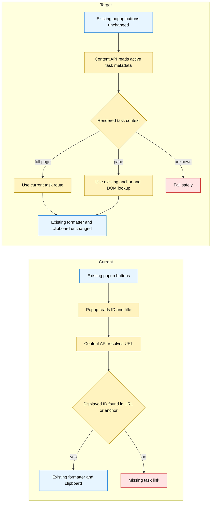
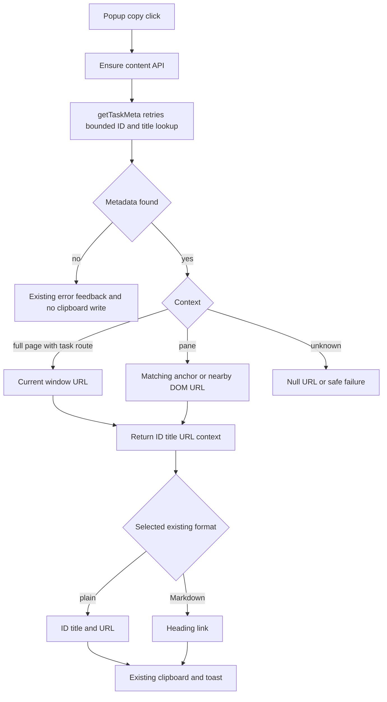
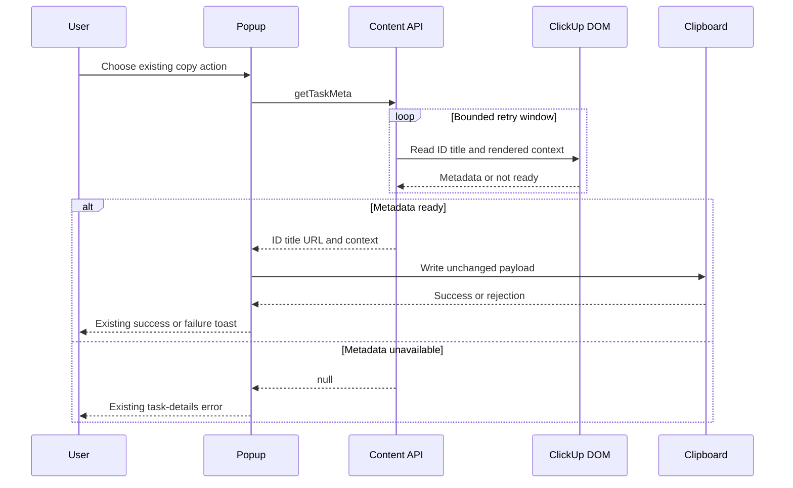

# Diagrams — ClickUpWideLayout/enable-copy-links-page-view

> Companion to [enable-copy-links-page-view-investigation.md](./enable-copy-links-page-view-investigation.md). Each diagram states what question it answers.

## Current vs target

What changes in metadata ownership while the popup controls, formatters, clipboard path, and ClickUp DOM remain stable?

## Flows

How does one metadata request select the correct URL without adding UI or a backend?

## Sequences

Which timing edge case prevents a copy click from reading task metadata before ClickUp finishes rendering?

