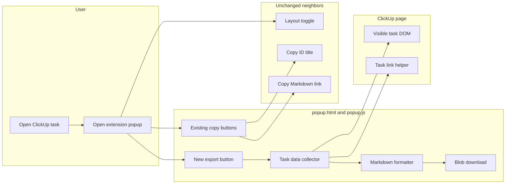
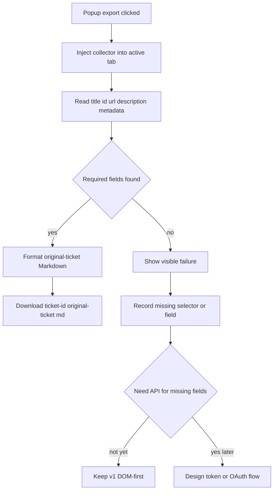
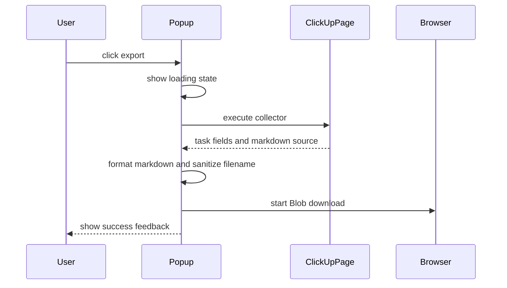

# Diagrams - ClickUpWideLayout/export-clickup-ticket-to-markdown

> Companion to [export-clickup-ticket-to-markdown-investigation.md](./export-clickup-ticket-to-markdown-investigation.md). Each diagram states what question it answers.

## Current vs target

What changes in the extension when export is added, and what stays frozen.

## Flows

How the target export flow chooses DOM-first capture and API fallback.

## Sequences

Happy path timing for one export request.

