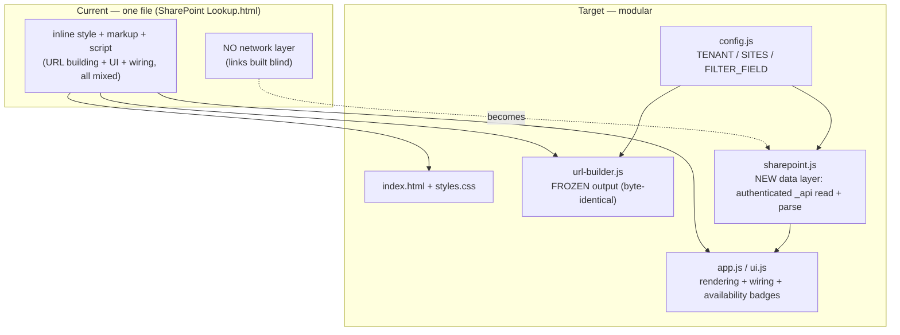
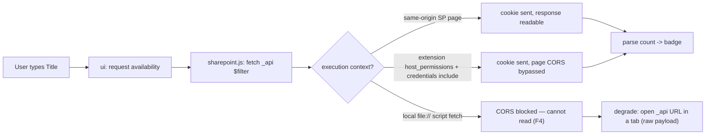
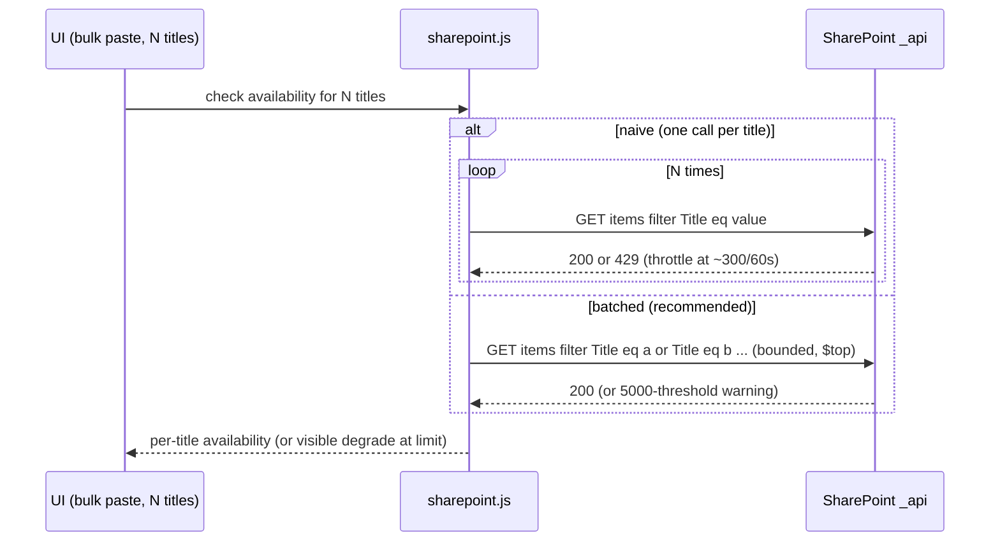

# Diagrams — Jaimie/shareplane-modularize-availability

> Companion to [shareplane-modularize-availability-investigation.md](./shareplane-modularize-availability-investigation.md). Each diagram states the question it answers.

## Current vs target

Shows what the refactor changes (monolith → modules + a NEW data-layer seam) and what stays frozen (URL-building output must be byte-identical).

## Flows

Shows where an availability check travels and the delivery-context gate that decides whether it is possible at all.

## Sequences

Exposes the bulk-availability throttle/threshold edge — why one-query-per-title is wrong for the OJB lists.

