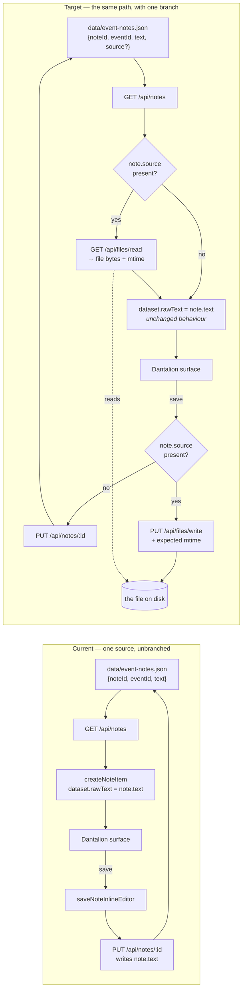
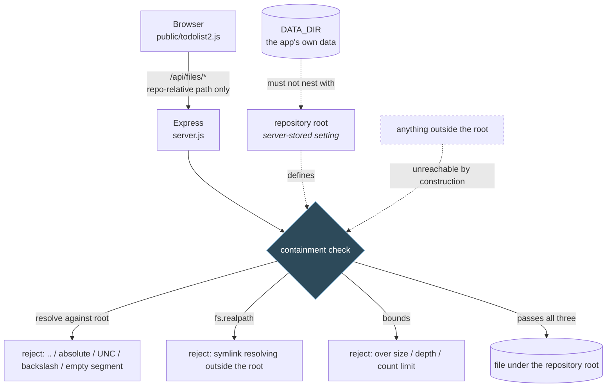
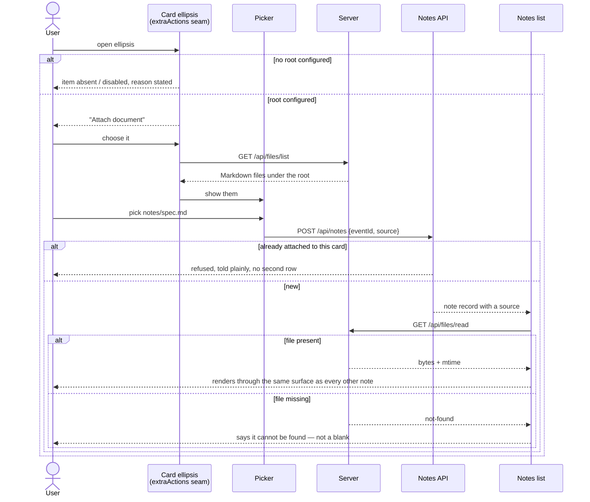
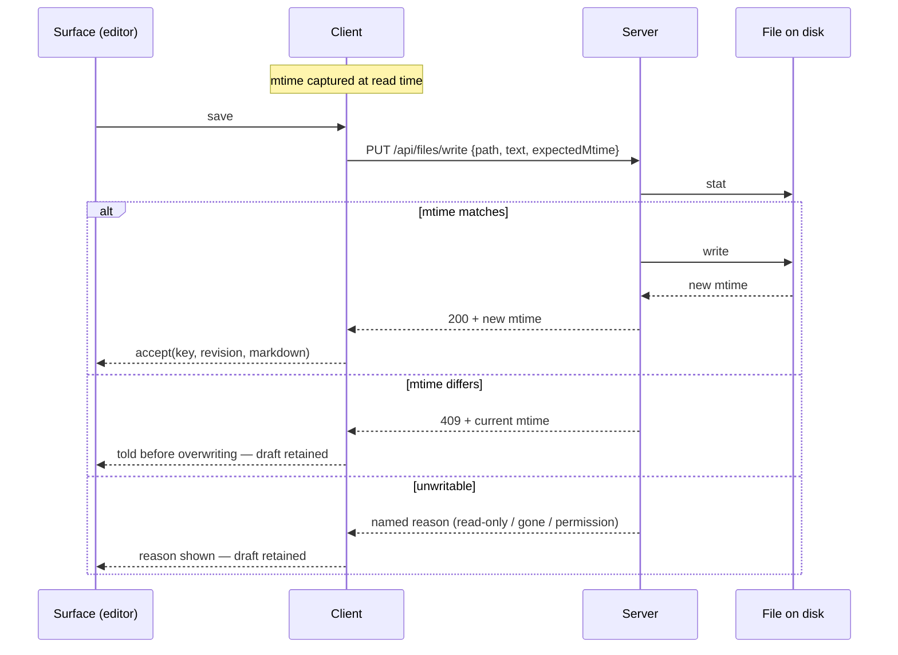
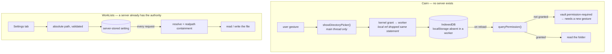

# Diagrams — WorkLists/attach-repository-files-as-notes

Companion to [the investigation report](./attach-repository-files-as-notes-investigation.md) §5 and §7. Baseline commit `06b78be`.

Every diagram below shows the **recommended** design (server-resolved root). If open variable 1 resolves the other way, diagrams 2–4 change materially and this file is superseded rather than edited.

---

## 1. Current vs. target — where a note's content comes from

The whole ticket is this one difference.

**What to read from it:** the two diamonds are the entire change on the note path. Everything else — the surface, the fetch, the record — is untouched. A note without a `source` traverses exactly the path it traverses today, which is what makes the change additive and what makes "protect the neighbours" (report §7) checkable rather than hopeful.

---

## 2. The authority boundary — target only

**What to read from it:** there is exactly **one** chokepoint, and it does three independent jobs. The third (`realpath`) is the one Cairn never needed — a `FileSystemDirectoryHandle` cannot be traversed upward at all, whereas a Node path can be walked out of via a symlink. That asymmetry is why the path rules port but the security model does not port unchanged.

---

## 3. Attach flow — from the ellipsis to a rendered note

**What to read from it:** the only genuinely new interaction is the picker. The refusal branches are the story-02 criteria that are easiest to leave out and hardest to notice missing — an already-attached duplicate, and a file that has since moved.

---

## 4. Save with the concurrency precondition

**What to read from it:** this is not a new pattern. `PATCH /api/notes/:noteId` already does exactly this shape with `expectedLastModified` → `409` (`server.js:2896-2920`), and `tests/note-checklist-patch.test.js` already exercises it. The file version substitutes mtime for `lastModified` and changes nothing else — which is the reason to mirror it rather than invent one.

---

## 5. Cairn's permission process vs. the recommended one

Side by side, because the difference is the report's reframe (§1) and it is easier to see than to read.

**What to read from it:** the left column's four middle boxes all exist to hold an OS grant somewhere a browser tab can keep it. The right column has no equivalent because the authority never left the machine. What *is* common — one root, granted once, everything under it reachable, nothing outside it, failures named from a closed vocabulary — is the part worth porting, and it ports intact.

---

## 6. Kinds not drawn

- **State machine — N/A.** Nothing here has states beyond present/absent; a diagram would restate diagram 1.
- **ER / schema diagram — N/A.** One optional field on one existing record. Report §7 states it in a sentence, which is shorter and no less clear.
- **Deployment / infrastructure — N/A.** Single local process; nothing deploys.
- **Race-condition timing diagram — deliberately deferred.** The one real race (two places editing the same file) is covered by diagram 4's `409` branch. A timing diagram becomes worth drawing only if open variable 9 (live refresh while the file changes on disk) resolves to yes, which would add a genuine watcher-versus-editor interleaving.
