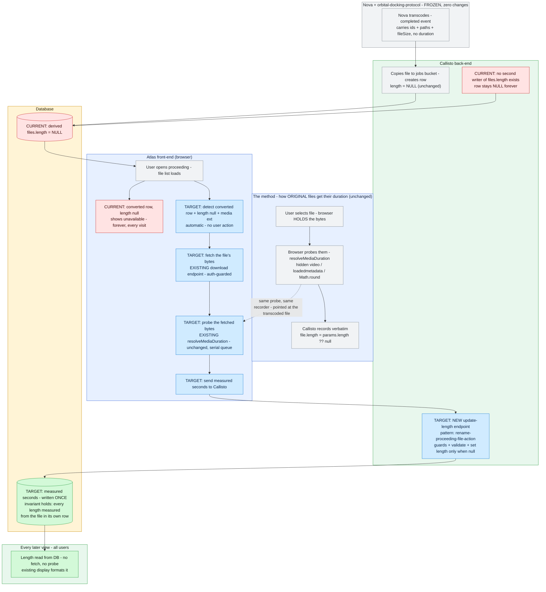

# Investigation Report: PRDV-16216 — Browser-probe write-back (Atlas + Callisto only)

> Delivered results of the `investigation` method, run 2026-07-15 and **re-run the same day under corrected constraints**. This version **overwrites** the first pass, which proposed changing Nova and the protocol package — ruled out by the user: **Nova will not be changed under any circumstances at this point; `orbital-docking-protocol` will not be changed under any circumstances at this point.** The requirement is to **leverage the same method that collects the original file's duration** — the browser probe — to collect the transcoded file's duration, **triggered automatically, always**.
>
> **Relationship to prior artifacts:** evidence from the superseded 07-13 and 07-14 investigations (now under `dnu/` — `dnu/PRDV-16216-transcoded-media-duration.md`, `dnu/PRDV-16216-lookup-display-investigation.md`) is cited where still valid. The first pass of this report (Nova-emission "Approach D") is superseded by this overwrite. Risk record: `PRDV-16216-future-development-concerns.md`.

## Metadata
- **Status:** planned
- **Disposition:** proceed
- **Date:** 2026-07-15
- **Owner:** Dustin Thomason
- **Location:** `docs/atlas/16216/PRDV-16216-measured-write-investigation.md`
- **Ticket:** https://app.clickup.com/t/43227262/PRDV-16216 (verbatim: `PRDV-16216-original-ticket.md`)
- **Domain:** software
- **References / evidence:** file/line citations inline, verified 2026-07-15 across `atlas-front-end` and `callisto-back-end`; user constraint rulings 2026-07-15 (this session)

---

## 0. Verdict (bottom line up front)

**Proceed.** The transcoded file's duration is collected **the same way the original's is: the browser measures it, Callisto records it.** The only difference is *when* the browser has the file: for originals, at upload; for transcoded files, the first time a user views a proceeding containing one. At that moment Atlas automatically fetches the file through the **existing, guarded download endpoint**, measures it with the **existing probe composable** (unchanged), and writes the measured number back through **one new small Callisto endpoint** that updates `files.length` — the same one-line save the upload path already performs. The probe happens **once per file, ever**: after the write-back, every subsequent viewer reads the value from the database. Nova is untouched. The protocol package is untouched. The value is a genuine **measurement of the transcoded file itself** — never a copy of the source's number — so the column's invariant (*every length was measured from the file in its own row*) holds. Historical rows are covered automatically: any pre-existing transcoded file gets measured the first time anyone views it.

- **Strongest path:** write the story spec directly from §7 (two new pieces: an Atlas auto-probe wiring + a Callisto update-length endpoint following the `rename-proceeding-file-action` pattern), then implement.
- **Not yet proven / not approved:** not a spec, not implemented; the write-endpoint's guard choice and the update-only-when-null condition are spec-level decisions (open variables, owners assigned); rows in proceedings **never viewed by anyone** stay unmeasured — a fact to carry into the future concatenation work, not a blocker here.

## 1. Problem class

- **Class the request assumed** (original ticket framing): an Atlas display story ("display their media duration just like all other video files").
- **Confirmed class:** an **ingestion-time measurement gap, bounded by frozen components.** The transcoded file is the only media in the system whose bytes are never measured by any party. With Nova and the protocol frozen (locked constraint), the only changeable party that can ever hold the file's bytes **and** measure them is **the browser** — which is exactly the party that measures every other file. The class therefore forces: *browser measures, Callisto records* — the system's one and only existing capture method, pointed at the one file type it never covered.
- **Reframed?** **Yes, twice.** (1) From display story to measurement gap — triggered at the root-cause trace (§5): the display path is complete and merged; only the data is missing. (2) Within this report's own history: the first pass reframed toward "Nova measures at creation," which violated constraints the investigation had failed to lock in Step 3 — corrected this session when the user ruled Nova and the protocol frozen. The constraint correction did **not** flip the class (measurement gap holds); it narrowed the solution space to the browser.
- **What the confirmed class implies:** the solution must (a) get the transcoded file's bytes into the browser — the existing download endpoint already does this on demand, with auth guards; (b) measure them — the existing probe composable already does this; (c) persist the number — the only genuinely new piece: a write-back endpoint, mirroring what the upload path's mapper already does.

## 2. Problem statement (raw facts, collected before classification)

- **Named instances:**
  - **Every Nova-transcoded row** — deterministic: the persist mapper never sets `length` (`persist-video-transcode-derivative.mapper.ts:88-104`), so 100% of derived rows are `NULL` → Atlas shows "unavailable".
  - **Leah (video team manager)** and her team — requested the duration display; they are the users looking at "unavailable" on every transcoded file.
  - **The concatenation fast-follow** — future consumer of per-file measured durations.
- **One sentence:** *Transcoded files show "unavailable" because their duration is never measured anywhere, and the components that could have measured it at creation time (Nova, the event contract) are frozen — while the browser, which measures every other file, never gets pointed at these.*
- **Distinct problems (kept separate):**
  1. **Display gap** — transcoded rows show "unavailable" (the ticket).
  2. **Measurement gap** — nobody measures the transcoded bytes (confirmed class; this report solves it browser-side).
  3. **Validation gap** — no input-vs-output compare/fail (**out of scope** — future companion ticket, spec drafted; user decision 2026-07-15).
  4. **Reliance-surface risk** — a displayed number replaces the manual check (concerns doc). A *measured* number can carry that reliance; a copied one can't.
- **Urgency:** live now — every transcoded file in every proceeding shows "unavailable" to Leah's team today; company-wide deploy pending.
- **Wedge:** **point the existing probe at bytes the browser fetched, and write the result back.** Smallest possible move within the class: zero new measurement code, zero new download code — one new write path. Reusable: the same fetch→probe→write-back shape serves any future client-measured metadata backfill, and the measured values feed the concatenation feature and the future validation comparison.

### Problem Check (run per `problem-check.md` on the live discussion, 2026-07-15)

#### In brief
The discussion is about getting a duration to display for Nova-transcoded files in Atlas. Several solution directions were debated across sessions (Nova emission, read-time lookup, persist-time copy); the user repeatedly steered toward a current-system answer and ultimately locked constraints — Nova frozen, protocol frozen, browser probe as the method, automatic trigger. This report describes the resulting browser-probe write-back design.

#### The question

##### Asked
|  |  |
|---|---|
| **finding** | How does the current system's existing duration-capture method reach the transcoded file? |
| **evidence** | "leverage the same method that collects the duration of the original file" · "make this work with the current system" |

##### Answered
|  |  |
|---|---|
| **finding** | Earlier passes answered a different question: where the system *should* measure at creation time. |
| **drift** | "make this work with the current system" → recommending Nova + protocol changes (first pass of this report) |
| **evidence** | "I'm not looking for a recommendation. I've told you this." · "Nova will not be changed under any circumstances at this point." |

##### Should-ask
|  |  |
|---|---|
| **finding** | "Given what is frozen, which component can hold the transcoded file's bytes and measure them?" — with constraints locked, this *is* the asked question, and it has exactly one answer (the browser). |
| **why** | It selects the measuring party uniquely and settles every alternative in one move. |

#### Flags

##### Conflation
|  |  |
|---|---|
| **finding** | Three problems ran as one "show a number" ask: the display gap, the measurement/provenance gap, and the validation gap. |
| **consequence** | Solving display alone (copy/lookup) touches neither of the others; this design solves display + measurement; validation stays a separate future ticket. |
| **evidence** | "we're putting something into the database to say that we assume it's the same when we don't know it's the same" (the user separating validation from display themselves) |

##### Thin
|  |  |
|---|---|
| **finding** | "Probed" was undefined on the pivotal axis — probed *from which file, by which party*. Also thin: "1 line change" (three typed files) and "automatically" (resolved: on table load, no user action). |
| **evidence** | "the file length IS probed when it's getting back over into Callisto, that it's not a copy" · "the frontend will take care of probing" · "probe automatically, always" |

##### Off
|  |  |
|---|---|
| **finding** | "Callisto probes the duration" does not track with the codebase: Callisto has no media-probe capability and its only per-file operation is an S3 HEAD returning bytes. |
| **consequence** | The probe must live in the browser; the design places it there. |
| **evidence** | "Callisto then probes the duration and adds it to its database" → dependency scan clean; `process-...service.ts:101-122` (HEAD = bytes) |

#### Decisions extracted (user, 2026-07-15)
Nova frozen; protocol frozen; browser probe is the method; trigger = automatic, always; validation = future companion; this report overwrites the first pass.

## 3. The contract (locked before solutioning)

### Acceptance criteria

| Criterion | Status | What's needed to close it |
|-----------|--------|---------------------------|
| A transcoded (`lineageRole: 'converted'`) row with `length == null` and a media extension is automatically measured on first view and its duration persisted to `files.length` (integer whole seconds) | gap | Atlas auto-probe wiring + Callisto write-back endpoint (§7) |
| The persisted value is a **measurement of the transcoded file's own bytes** — no code path copies the source row's `length` | covered by design | The probe runs on the fetched file itself; source value never consulted |
| Probe failure / invalid result (`NaN`, `<= 0`, non-finite, timeout) → **no write**; row stays `NULL` / "unavailable" | gap | Guard in the Atlas wiring; server rejects invalid payloads (400) |
| Probe happens **once per file**: after write-back, subsequent loads read the DB value and never re-fetch | covered by design | Trigger condition is `length == null`; a written row no longer matches |
| Rows that are not converted, not media, or already measured are never probed | gap | Trigger predicate asserted in specs |
| Existing historical transcoded rows are covered (measured on first view) with no migration | covered by design | Read-side trigger is creation-date-agnostic |
| Nova: zero changes; `orbital-docking-protocol`: zero changes | covered by design | No code in either is touched; asserted by the diff surface |
| Existing upload capture path unchanged; existing Length display/formatting unchanged | covered | Probe composable reused as-is; display already merged (PRDV-9756/15875) |
| Write-back requires authorization at least equal to file download | gap | Guard on the new action (pattern: existing file-action guards) — guard choice = open variable |

### Non-goals / out of scope
- **Compare-and-fail validation** — future companion ticket (spec drafted: `PRDV-16216-companion-nova-duration-validation-spec.md`); its value peaks with the concatenation feature (user decision 2026-07-15).
- **Nova changes of any kind** — including the output probe proposed by earlier artifacts. Frozen per user ruling.
- **Protocol changes of any kind** — no new event fields. Frozen per user ruling.
- **No backfill migration** — historical rows are covered by the read-side trigger itself; no data script.
- **Original rows with null `length`** (browser-unmeasurable source formats like `.mts`/`.mkv`/`.avi`): **not re-probed.** The browser already failed on those bytes once at upload; re-fetching them would fail again. Transcoded outputs are always `.mp4` — those the browser can parse.
- **No change to what "unavailable" means or how it renders.**

### Framing drift beyond the class
Ticket (Atlas display) → 07-13 (Nova emission) → 07-14 (read-time lookup, principal dev) → PR #24 (persist-time copy) → first pass of this report (Nova emission revived) → **this overwrite: browser measurement within the frozen system** — the first framing that honors both the method requirement and the freeze rulings.

## 4. What changed since the request was created

- **Shifted from:** "which backend writes the number at creation" → **to:** "the browser measures it at first view, exactly as it measures everything else."
- **What that buys us:** zero Nova/protocol risk (frozen components stay frozen); genuine measurement (never a copy — the concerns doc's core requirement); automatic historical coverage (first view measures old rows too — something no write-at-creation design offered without a backfill); total reuse (download endpoint, probe composable, display path — all existing; one new endpoint and one wiring composable are the entire diff surface).
- **What it still needs to prove:** bandwidth behavior in practice (a full-file download per unmeasured file, automatic on view — user accepted: *"probe automatically, always"*); guard/idempotency choices at spec time (owners assigned in §10).

## 5. Why it exists + data paths

- **Origin traced to:** the derived-file persist path writes every metadata field except `length` (`persist-video-transcode-derivative.mapper.ts:88-104` — bucket, path, name, size, type, audit fields; no duration), because no measured value reaches it: the completed event carries none, and Callisto cannot measure (no media library — dependency scan clean; its only per-file operation is an S3 HEAD returning **bytes**, `process-proceeding-video-transcode-completed.service.ts:101-122`). Meanwhile the system's one capture method — browser probe at upload (`useMediaDurationParser.ts` → upload DTO → `create-proceeding-file.mapper.ts:29`, `file.length = params.length ?? null`) — only ever runs on files a user hands to the browser. Transcoded files are created server-side, so no browser ever held them… **but the browser can hold them on demand**: the existing download endpoint (`POST /callisto/proceedings/downloads`, `download-proceeding-files.action.ts` — auth-guarded, streams the file) already delivers any authorized file's bytes to the browser today.
- **Evidence (primary sources, verified 2026-07-15):**
  - Probe composable, reusable as-is: `atlas-front-end/src/callisto/composables/useMediaDurationParser.ts` — `resolveMediaDuration(file)` → hidden `<video>`, `preload='metadata'`, `Math.round(video.duration)`, `null` on error/10s timeout; **serial queue built in** (`enqueueParse`) so multiple probes never run concurrently.
  - Detection data already on every row: `ProceedingFileDTO` has `lineageRole` (`'converted'`), `length`, `id`, `fileName` (`atlas-front-end/src/callisto/types/proceeding.ts:9-22`); the row component already branches on these (`ProceedingFileTableDataRow.vue:53-64`).
  - Download-to-browser flow already patterned: `useProceedingFilePreview.ts` fetches file bytes via `useApiStream` + `DOWNLOAD_PROCEEDING_URL` with abort + progress — the fetch half of the new wiring copies this shape.
  - Write-endpoint pattern: `rename-proceeding-file-action/` (action + swagger + request/response DTO + guards) — the new update-length action mirrors it.
  - The only writer of `files.length` today is the upload path — nothing else sets it (grep-verified); the new endpoint becomes the second writer, recording the same kind of browser-measured value.
- **Class re-check:** **held.** Root cause = no measured value ever reaches the row; with creation-time measurement ruled out by the freeze, the browser-at-first-view is the remaining — and method-consistent — point of measurement. No evidence suggested a display or serialization defect (display path proven complete).
- **Contract alignment (software lens):** the authoritative definition of `files.length` is set by its only existing writer, the upload capture path: *browser-measured duration of the file in this row, integer whole seconds, null = never measured* (`create-proceeding-file.mapper.ts:29` + `useMediaDurationParser.ts`). The new endpoint **mirrors that authority exactly** — same measurer (browser), same unit (whole seconds), same null semantics — and its update-only-when-null condition prevents it from overwriting the authority's values. **Re-drift risk:** any future writer persisting a non-measured value (e.g., a copy) silently breaks the column's meaning; the endpoint's DTO description should state the measured-provenance expectation so the contract is written down where the next writer will look.
- **Detection gap:** N/A — this is a scoped-out capability being added, not a defect that slipped past tests; the original absence is traced in Decision history (concerns doc) rather than owed a detection-failure analysis.

### Data paths — current vs target (single diagram)

Frozen components are labeled; `CURRENT` red, `TARGET` blue deltas, unchanged grey, outcomes green. The top lane is the method being leveraged — the browser probe that already measures every original file.

## 6. Alternatives considered

| Alternative | Rejected because |
|-------------|------------------|
| **Nova probes the output + protocol field** (07-13 plan; first pass of this report) | **Constraint violation:** Nova and `orbital-docking-protocol` are frozen under any circumstances at this point (user ruling 2026-07-15). Retained in history as a possible *future* handling; not the current-system answer. |
| **Persist-time copy** (PR #24) | Writes a measurement of a **different file** as this file's length; indistinguishable from measured values; defeats the source-vs-converted comparison by construction; rejected in the written record (07-14 §6) and by the concerns doc. |
| **Read-time lookup** (07-14 direction) | Displays the source's number without measuring anything — same provenance problem as the copy, minus the persistence; produces no data for future consumers. |
| **Callisto probes the file server-side** | Callisto has no media capability (verified — no ffprobe/ffmpeg/media lib) and never holds usable bytes (S3-to-S3 copy + HEAD only); adding a media stack + downloads to Callisto duplicates the browser's existing, already-authorized capability. |
| **Manual trigger** (probe on user download/preview only) | Rejected by user ruling: *"probe automatically, always."* Automatic coverage also guarantees rows fill without depending on someone happening to download the file. |
| **Browser probe, automatic, with write-back** | **Proposed.** |

## 7. Solution & stress-test

- **Proposed solution — two new pieces, everything else reused:**
  1. **Atlas — auto-probe wiring** (new composable + trigger in the file-table load path): for each row where `lineageRole === 'converted'` **and** `length == null` **and** the extension is media: fetch bytes via the existing download flow (`useApiStream` + `DOWNLOAD_PROCEEDING_URL`, per the `useProceedingFilePreview` pattern, abortable), wrap in a `File`, run the existing `resolveMediaDuration` (its built-in queue serializes multiple probes), and on a valid result call the new endpoint; on failure, do nothing (row stays "unavailable"). Update the row's displayed value on success.
  2. **Callisto — update-length action** (pattern: `rename-proceeding-file-action/`): request DTO `{ length: number }` validated (integer, `> 0`); auth guards at least equal to file download; service/TS updates `files.length` **only when currently null** (idempotency + never overwrites an existing value); swagger helper per module convention.
- **Solves the confirmed class?** Yes — the one changeable party that can hold the bytes measures them; the measurement gap closes for every transcoded file that is ever viewed, using the system's own established method.
- **Scale:** cost is **one full-file download per unmeasured file, once ever** (the write-back retires the trigger). The probe queue is already serial (`enqueueParse`), so a proceeding with several unmeasured files fetches/probes them one at a time in the background without blocking the UI. Fleet-wide, total cost is bounded by the number of transcoded files, not by views.
- **Generalization:** the fetch→probe→write-back shape is the reusable template for any client-measured metadata backfill; building it as one composable + one endpoint is the right size — abstracting further now would be overreach.
- **Fit:** Atlas — reuses the module's own composable/download patterns; Callisto — mirrors an existing action end-to-end; the new endpoint's writer semantics mirror the upload mapper's one-liner. No new concepts enter either codebase.
- **Frontend lens (behavior, appearance, or both?):** **behavior only, invisibly.** No visual change: the Length column and "unavailable" render exactly as today; what changes is that unmeasured transcoded rows quietly acquire a value (first view populates it; the row can update in place). Appearance untouched.
- **Adjacent issues (fix now vs follow-up):**
  - *Validation companion* (future ticket, user decision): unaffected and still fully available later — and this design makes the two-row comparison genuinely meaningful *now*: original = browser-measured at upload; converted = browser-measured at first view. Two independent measurements of two files.
  - *Concatenation fast-follow:* consumes `files.length`; this fills it with measured values for every viewed file. Residual: files **never viewed** stay null (flagged, open variable — a trivial "open the proceeding once" or a later sweep closes it when that feature lands).
  - *Browser-unmeasurable originals:* out of scope (§3) — but their **transcoded outputs get real values** here (outputs are `.mp4`), so the converted row shows a measured duration even where the source shows "unavailable" — this design and no cheaper one delivers that.
- **Affected surfaces (blast radius, enumerated):** the Length column renders in **exactly one component** — `ProceedingFileTableDataRow.vue` (completeness: grep of `formatMediaDuration` across `src/callisto` hits only that component and the util itself) — mounted by **exactly two tables**: `SubmissionFilesTable.vue` and `ClientDeliverablesTable.vue` (completeness: grep of the component name hits only these two plus itself). Placing the trigger at those two tables (or their shared load path) therefore covers **every** render site of the column; no other entry point can show an unmeasured transcoded duration. The §10 open variable narrows to confirming this at spec time, not discovering it.
- **Unchanged neighbors (must not move, named):**
  - *Upload capture path* — untouched; the probe composable is called, not modified.
  - **Shared probe queue** — `enqueueParse` in `useMediaDurationParser.ts` is **module-global**, so auto-backfill probes and upload probes share one serial queue: a backfill probe of a large fetched video queued ahead of an upload's probe delays that upload's duration capture. Mitigation is a spec decision (separate queue instance for backfill vs accept the delay — probes themselves are fast; it's only ordering). Named so it can't regress silently.
  - *Download endpoint* — behavior unchanged; auto-fetch is one more authorized caller of the same guarded action (no new response shape, no guard change).
  - *Read path / fetch-files TS* — unchanged; existing specs stay green (§9).
- **Sufficiency:** covers the ticket's pain in full (transcoded files display duration like all other files, via literally the same method) and the concerns doc's provenance requirement (measured, never copied). The validation gap remains companion-scoped — stated plainly.
- **Feedback speed:** fast — open one proceeding with an unmeasured transcoded file in sandbox; the network tab shows the fetch, the write-back fires, the row shows the value; reload shows it served from the DB with no fetch. Reality answers in one page view.
- **Actor / action / moment:** *the browser* (machine, automatic) measures on first view; *any authorized viewer* unknowingly triggers it — no new human action exists; *Leah's team* reads the value at QC exactly as they read every other file's; *the future concatenation feature* reads it from the DB.
- **Happy-path story (30 seconds):** months of transcoded files show "unavailable." This ships. An ops specialist opens a proceeding — within moments the converted `deposition.mp4` row flips from "unavailable" to **2h 14m**: the browser fetched the file in the background, measured *the actual transcoded video*, and saved the number. Every colleague who opens that proceeding afterward sees 2h 14m instantly, from the database. Nobody changed Nova. Nobody touched the protocol. Nobody clicked anything.

## 8. Assumptions ledger

1. **"The probe composable works on fetched bytes, not just upload-picked files."** — **confirmed** (`parseMediaDuration` builds an object URL from the passed `File`; downloaded bytes wrapped via `new File([bytes], fileName)` are equivalent; `isMediaFile(file.name)` gate keys on the name, which the row provides).
2. **"The browser can obtain the transcoded file's bytes in the current system."** — **confirmed** (`POST /callisto/proceedings/downloads`, auth-guarded, streams single files; the preview composable already consumes it this way).
3. **"Detection needs no new data."** — **confirmed** (`ProceedingFileDTO` already carries `lineageRole`, `length`, `id`, `fileName`; the row component already branches on them).
4. **"No second writer of `files.length` exists to conflict with."** — **confirmed** (upload path is the only writer today, grep-verified; the new endpoint is the second, guarded by update-only-when-null).
5. **"Transcoded outputs are always browser-parseable."** — **confirmed directionally** (Nova's derivative is always `.mp4` `video/mp4` — `DERIVATIVE_FILE_TYPE`, filename builder forces `.mp4`; browsers parse mp4 metadata natively; a pathological mp4 fails the probe safely → row stays null).
6. **"Probing costs one full-file download in the current system."** — **confirmed** (the download action streams the whole object; no range/presigned-URL surface exists today). Accepted by user ruling (*automatic, always*).
7. **"Concurrent viewers produce a stable outcome."** — **confirmed by design, owes spec assertion** (update-only-when-null makes double write-backs converge; both browsers measured the same bytes, so the values match anyway).
8. **"Probe failure re-tries on every subsequent view."** — **open** (acceptable — failures are rare and cheap to retry — but a per-session suppression is a spec-level nicety; owner below).
9. **"Nova and the protocol remain untouched by this design."** — **confirmed by construction** (the diff surface is two Atlas files + one Callisto action stack; nothing in `nova-back-end` or the package is referenced).
10. **"Rows never viewed stay unmeasured."** — **confirmed by construction**; consequence deferred to the concatenation feature (open variable, product).
11. **"The Length column's render surface is fully enumerated."** — **confirmed** (`formatMediaDuration` used by exactly one component, `ProceedingFileTableDataRow.vue`; that component mounted by exactly two tables, `SubmissionFilesTable.vue` + `ClientDeliverablesTable.vue` — both greps clean of other hits).
12. **"Backfill probes share the upload probes' serial queue."** — **confirmed** (`enqueueParse` is module-scoped in `useMediaDurationParser.ts`); ordering-delay neighbor named in §7; mitigation = spec decision.

## 9. Validation plan

**Happy path**
1. Sandbox: a proceeding contains a transcoded file with `length = NULL` (any existing one qualifies — historical coverage is part of the test).
2. Open the proceeding: network shows one download request for that file; the probe runs; a write-back request fires with the measured integer.
3. DB: `files.length` is set on the derived row; the UI row shows the formatted duration (in place or on refresh, per spec choice).
4. Reload the page: the value renders from the API; **no download, no probe** (trigger condition no longer matches).
5. A second user opens the same proceeding: same as step 4.

**Negative paths**
- Probe failure (corrupt/pathological file, timeout): **no write-back fires**; row keeps "unavailable"; no error surfaced to the user beyond the existing state. Must fail silent-but-clean, never write `0`/`NaN`.
- Server rejects invalid payloads: `length` missing, non-integer, `<= 0` → 400; row unchanged.
- Unauthorized caller on the write endpoint → 403; guard asserted.
- Update-only-when-null: a second write-back against an already-measured row is a no-op (assert no overwrite).
- Non-converted rows, PDF/non-media rows, already-measured rows: **no fetch is ever issued** (assert the trigger predicate).
- Original-role rows with null length (browser-unmeasurable formats): **not probed** (assert exclusion).
- Two tabs / two users concurrently: both may fetch; one write lands, the other no-ops; final value stable.
- Large file: probes run through the existing serial queue; UI remains responsive (no blocking spinner introduced).

**Test map**
| Repo | Suite | Assert |
|---|---|---|
| atlas | new composable spec (`__specs__`, vitest) | trigger predicate (converted + null + media ext); fetch→probe→write-back happy path; probe-fail → no write; abort on unmount; queue serialization respected |
| atlas | file-table integration spec | rows outside the predicate never trigger; successful write-back updates the displayed value |
| callisto | new action/service/TS specs (`__specs__`, jest) | guard enforced; DTO validation (integer, `> 0`); update-only-when-null; response shape; audit fields set |
| callisto | existing fetch-files specs | untouched — read path unchanged |

Gates: atlas — `npm audit --audit-level=high` → `npm run lint` → `npx vitest run --maxWorkers 1`; callisto — audit → lint → `npm test -- --runInBand`.

## 10. Decisions, recommendation & open variables

- **Decisions (settled, user rulings 2026-07-15):**
  1. **Nova: frozen. Protocol package: frozen.** Under any circumstances, at this point.
  2. **Method: the browser probe** — the same mechanism that collects the original file's duration.
  3. **Trigger: automatic, always** — no user action; full-file download cost accepted.
  4. **Validation compare/fail: future companion ticket** (spec drafted); not this scope.
  5. This report **overwrites** the first pass (Nova-emission version) — that approach is not the current-system answer.
- **Recommendation (in order):**
  1. Write the story spec (larry-adams format) from §7: Atlas auto-probe composable + trigger wiring; Callisto update-length action stack (pattern: `rename-proceeding-file-action/`).
  2. Resolve the spec-level open variables below (guard choice, retry suppression, in-place row update vs refresh) during spec review.
  3. Implement Callisto endpoint first (independently testable), then Atlas wiring against it.
  4. Validate per §9 in sandbox, including one historical row.
- **Sequencing & gates:** Callisto PR before or with the Atlas PR (the wiring needs the endpoint). No other gates — no external package, no cross-team publish, no product sign-off required beyond normal review (the automatic-download behavior is the user's own ruling; note it in the PR description for visibility).

### Open variables to collect
- [ ] Write-endpoint guard: reuse the file-download/read guard vs a stricter write guard — owner: Dustin (spec) / principal dev (review)
- [ ] Probe-failure retry policy: bare retry-on-next-view (default) vs per-session suppression — owner: Dustin (spec)
- [ ] UI behavior on success: update row in place vs next-load — owner: Dustin (spec)
- [ ] Trigger placement detail: `SubmissionFilesTable` + `ClientDeliverablesTable` are the complete render surface (enumerated, §7) — confirm at spec time whether the trigger lives in each table or their shared load path — owner: Dustin (spec)
- [ ] Probe-queue sharing: separate queue instance for backfill probes vs accept ordering delay behind uploads (§7 neighbors) — owner: Dustin (spec)
- [ ] Rows never viewed stay unmeasured — acceptable until concatenation feature; sweep-or-view decision then — owner: product (later)
- [ ] Endpoint route/name + DTO field naming per module conventions — owner: Dustin (spec)

---

## 11. Plan — next steps

### Handoff table
| Action | Owner | Done-when (falsifiable) |
|--------|-------|-------------------------|
| Story spec from §7 (Atlas wiring + Callisto endpoint) | Dustin | Spec exists covering both pieces + §9 test map; open variables above resolved or carried with owners |
| Callisto PR: update-length action stack | Dustin | Endpoint live in sandbox; jest suite green (`npm test -- --runInBand`); guard + only-when-null asserted |
| Atlas PR: auto-probe composable + table wiring | Dustin | Sandbox proceeding auto-fills a transcoded row's duration on first view; vitest green (`npx vitest run --maxWorkers 1`) |
| Sandbox validation incl. one historical row | Dustin | §9 happy path steps 1–5 observed; negative paths spot-checked |
| Changelog + Plans status updates | Dustin | This report `active`; first-pass approach marked superseded; session log entries present |

### Checklist
#### Investigation
- [x] This report (Sections 0–10)
#### Project Spec
- [ ] Story spec (larry-adams format) from §7
#### Development
- [ ] Callisto endpoint → Atlas wiring (gated order)
#### Testing & Validation
- [ ] Per-repo gates + §9 sandbox paths
#### Deploy & PR / Ticket Closeout
- [ ] Per repo workflows; ClickUp updates after merge

---

## 12. Definition of done (investigation gate)
- [x] Class derived from instances, re-confirmed against root cause; "reframed?" answered with justification (§1, §5)
- [x] Problem in one plain sentence (§2)
- [x] Named blocked instance (§2)
- [x] Date it bites next (§2 — live now, every view by Leah's team; deploy pending)
- [x] Wedge + why it's reusable within the confirmed class (§2)
- [x] Acceptance criteria + non-goals locked before the solution was proposed (§3)
- [x] Alternatives recorded with rejection reasons (§6)
- [x] 30-second happy-path story (§7)
- [x] Metric that proves it works + how fast it arrives (§7 feedback speed; §9 step 3 is the metric moment — derived row's `length` equals the browser-measured value after first view)
- [x] Verdict + disposition stated (§0)
- [x] Open variables each have an owner (§10)
- [x] Tracked action with a falsifiable done-when (§11)
