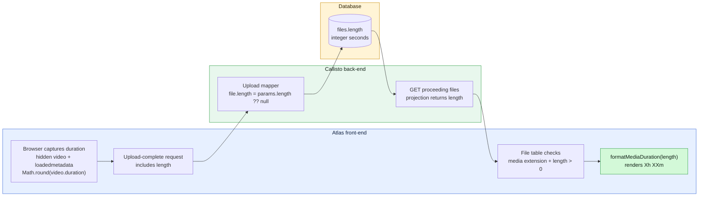
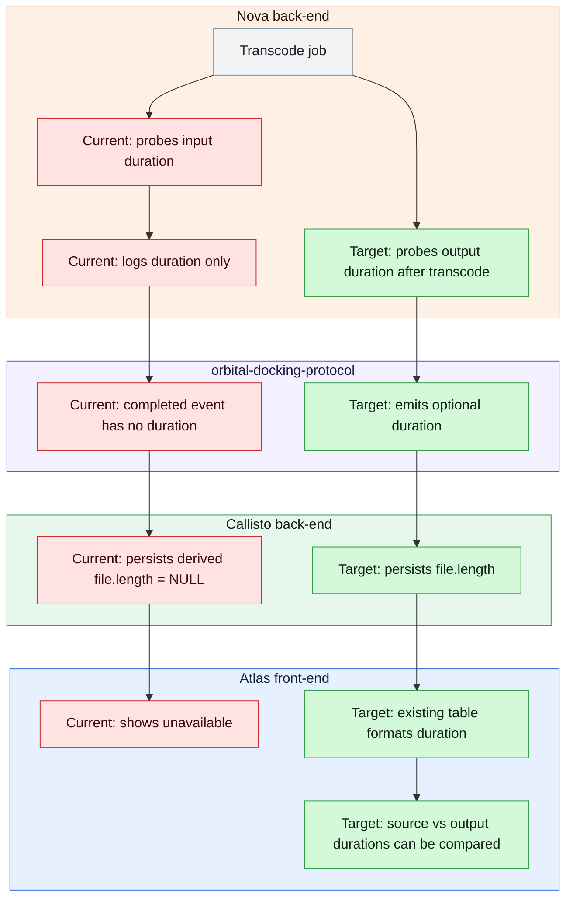

# PRDV-16216 - Section 5 Data-Path Diagrams

Companion diagrams for Section 5 of `PRDV-16216-transcoded-media-duration.md`.

Ownership is declared with Mermaid subgraphs. Node ID prefixes mirror the owner:
`AT_` = Atlas, `CA_` = Callisto, `OR_` = nova-orbital, `NO_` = Nova, `ODP_` = orbital-docking-protocol, `DB_` = database.

## Path A - Baseline Uploaded Video - Works Today

## Path B - Current Transcoded-File Path - Where Duration Dies

```mermaid
flowchart LR
  classDef bad fill:#ffe3e3,stroke:#c92a2a,color:#3b0a0a
  classDef null fill:#f1f3f5,stroke:#868e96,color:#212529

  subgraph SG_CALLISTO_B1["Callisto back-end"]
    direction TB
    CA_B1["Emits<br/>video-transcode-requested.v1"]
  end

  subgraph SG_ORBITAL_B["nova-orbital back-end"]
    direction TB
    OR_B2["Listens<br/>launches Fargate ECS task"]
  end

  subgraph SG_NOVA_B["Nova back-end"]
    direction TB
    NO_B3["Materializes input<br/>from S3"]
    NO_B4["ProbeDurationStep on INPUT<br/>ffprobe format=duration"]
    NO_B5["videoDurationSeconds<br/>logged only"]
    NO_B6["DISCARDED"]
    NO_B7["TranscodeStep<br/>ffmpeg output mp4"]
    NO_B8["PersistOutputStep<br/>writes output to S3"]
  end

  subgraph SG_PROTOCOL_B["orbital-docking-protocol"]
    direction TB
    ODP_B9["completed event payload<br/>has bucket/path only<br/>no duration field"]
  end

  subgraph SG_CALLISTO_B2["Callisto back-end"]
    direction TB
    CA_B10["Completed handler<br/>parser/service/assembler"]
    CA_B11["Derivative mapper<br/>sets file metadata<br/>never sets file.length"]
    CA_B13["GET proceeding files<br/>length: null"]
  end

  subgraph SG_DATABASE_B["Database"]
    direction TB
    DB_B12[("derived files.length<br/>NULL")]
  end

  subgraph SG_ATLAS_B["Atlas front-end"]
    direction TB
    AT_B14["File table<br/>.mp4 is media"]
    AT_B15["length unavailable"]
  end

  CA_B1 --> OR_B2 --> NO_B3 --> NO_B4 --> NO_B5 --> NO_B6
  NO_B6 --> NO_B7 --> NO_B8 --> ODP_B9 --> CA_B10 --> CA_B11 --> DB_B12 --> CA_B13 --> AT_B14 --> AT_B15

  class NO_B6,ODP_B9,CA_B11,AT_B15 bad
  class DB_B12,CA_B13 null
  style SG_CALLISTO_B1 fill:#e8f7ed,stroke:#2f9e44,color:#102015
  style SG_CALLISTO_B2 fill:#e8f7ed,stroke:#2f9e44,color:#102015
  style SG_ORBITAL_B fill:#eef0ff,stroke:#5f3dc4,color:#171331
  style SG_NOVA_B fill:#fff0e6,stroke:#e8590c,color:#2d1200
  style SG_PROTOCOL_B fill:#f3f0ff,stroke:#7048e8,color:#1f183d
  style SG_DATABASE_B fill:#fff4d6,stroke:#c98a00,color:#2d2200
  style SG_ATLAS_B fill:#e7f0ff,stroke:#3867d6,color:#10203f
```

## Path C - Target Transcoded-File Path - Deltas Only

```mermaid
flowchart LR
  classDef delta fill:#d0ebff,stroke:#1c7ed6,color:#0b2545
  classDef ok fill:#d3f9d8,stroke:#2f9e44,color:#102015

  subgraph SG_NOVA_C["Nova back-end"]
    direction TB
    NO_C1["Keeps existing input probe<br/>for ops telemetry"]
    NO_C2["TranscodeStep completes<br/>output file exists locally"]
    NO_C3["Add output probe<br/>ProbeDurationStep(localOutputPath)"]
    NO_C4["Thread output duration<br/>service -> outbox writer -> assembler -> converter"]
  end

  subgraph SG_PROTOCOL_C["orbital-docking-protocol"]
    direction TB
    ODP_C5["Completed event<br/>duration?: number<br/>whole seconds"]
  end

  subgraph SG_CALLISTO_C["Callisto back-end"]
    direction TB
    CA_C6["Parser<br/>duration optional<br/>not required"]
    CA_C7["Service<br/>length: command.duration ?? null"]
    CA_C8["Derivative params<br/>length?: number | null"]
    CA_C9["Derivative mapper<br/>file.length = params.length ?? null"]
    CA_C11["Existing serve path<br/>returns length"]
  end

  subgraph SG_DATABASE_C["Database"]
    direction TB
    DB_C10[("derived files.length<br/>output-probed seconds")]
  end

  subgraph SG_ATLAS_C["Atlas front-end"]
    direction TB
    AT_C12["Existing display path<br/>renders Xh XXm"]
    AT_C13["Source row and converted row<br/>independently comparable"]
  end

  NO_C1 -. unchanged .-> NO_C2
  NO_C2 --> NO_C3 --> NO_C4 --> ODP_C5 --> CA_C6 --> CA_C7 --> CA_C8 --> CA_C9 --> DB_C10 --> CA_C11 --> AT_C12 --> AT_C13

  class NO_C3,NO_C4,ODP_C5,CA_C6,CA_C7,CA_C8,CA_C9 delta
  class DB_C10,AT_C12,AT_C13 ok
  style SG_NOVA_C fill:#fff0e6,stroke:#e8590c,color:#2d1200
  style SG_PROTOCOL_C fill:#f3f0ff,stroke:#7048e8,color:#1f183d
  style SG_CALLISTO_C fill:#e8f7ed,stroke:#2f9e44,color:#102015
  style SG_DATABASE_C fill:#fff4d6,stroke:#c98a00,color:#2d2200
  style SG_ATLAS_C fill:#e7f0ff,stroke:#3867d6,color:#10203f
```

## Current vs Target Summary

