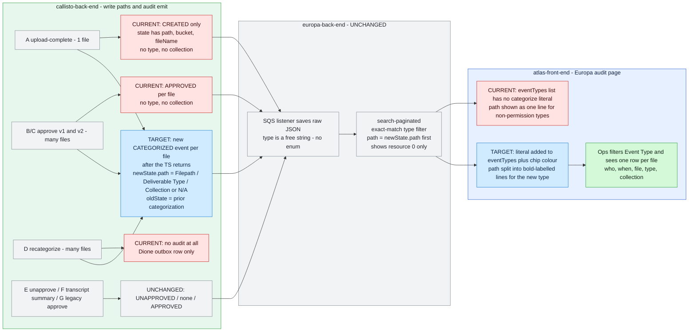
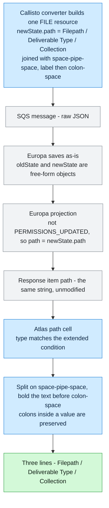
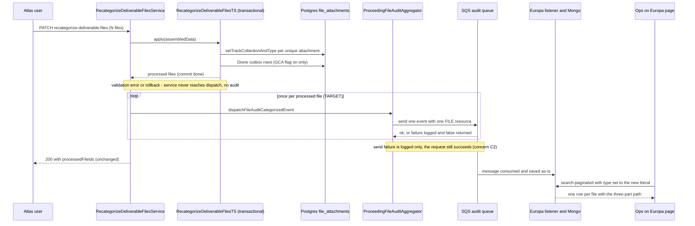

# Diagrams — atlas/INT-138

> Companion to [INT-138-investigation.md](./INT-138-investigation.md). Each diagram states the question it answers. **Render check:** no Mermaid renderer is installed on this machine, so these were hand-checked against the gotchas in `agents/docs/current-vs-target-diagram.md` (no colons in edge labels, quoted node labels, no raw angle brackets, ` ` breaks, and no pipes inside labels) rather than machine-rendered. Re-check in a Mermaid preview before quoting a diagram in a spec or PR.

## Current vs target

**Question:** for each path that writes a file's categorization, what reaches the Europa audit log today, what reaches it after this ticket, and which parts do not change?

Target nodes for A and B/C depend on D1. The diagram shows the recommended D1 (A, B/C and D emit; E, F and G unchanged). The literal is shown as `CATEGORIZED` pending D2.

Reading it:
- The only red node with nothing downstream is **D**, the recategorize path that is silent today.
- Europa sits in a grey lane on both chains.
- Existing events (the red `CURRENT` nodes for A and B/C) keep flowing unchanged. The new event is added alongside them, not in place of them.

## Flows

**Question:** why does Europa need no change? How does one Categorize value travel from Callisto to the rendered cell?

Safe separators: dynamic collection names reject both `|` and `:` (`validate-dynamic-collection-name.validator.ts:7`), and the seeded deliverable type names contain no pipe. The Planet Suite seed is still to be checked (coverage frontier).

## Sequences

**Question:** in what order do commit, audit dispatch and failure happen on recategorize? This shows why dispatching after the TS returns means a rollback can't produce an audit, and where a lost audit goes unnoticed.

Edge case this exposes: nothing re-sends a failed audit. Europa gets no record, and the user's request still succeeds. The existing CREATED, APPROVED and UNAPPROVED audits share this behavior, so it is accepted as-is and recorded as concern C2.
