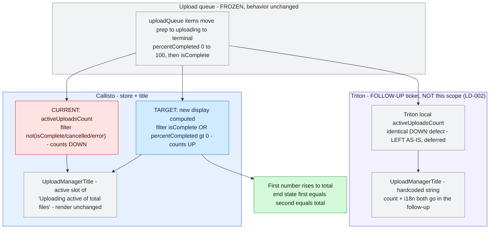
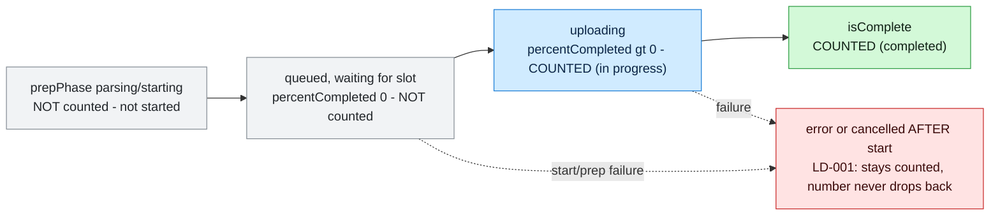
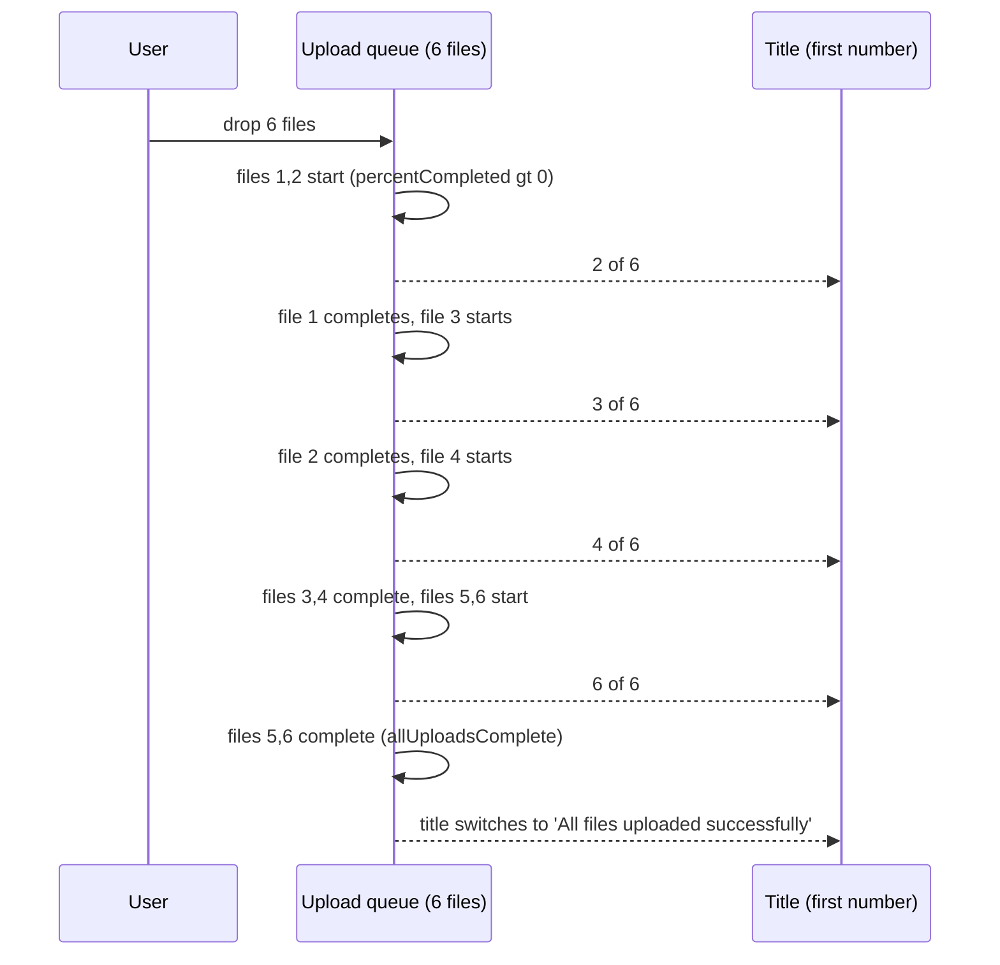

# Diagrams — atlas/PRDV-14055

> Companion to [PRDV-14055-investigation.md](./PRDV-14055-investigation.md). Each diagram states the question it answers.

## Current vs target

What this shows: the first number's source computed changes from a "remaining" count (falls) to a "started-or-done" count (rises); the render surfaces and the second number stay frozen. Scope is **Callisto only** (LD-002); the Triton lane carries the identical defect but is **deferred to a follow-up ticket**, shown greyed.

## Flows

What this shows: the per-file state progression the count keys off — which states are "not started" (excluded), "in progress" (counted), and "done" (counted).

## Sequences

What this shows: the interleaving that makes the count *rise* — a 6-file batch with concurrency 2, where at most two files transfer at once and the displayed number only increases.

