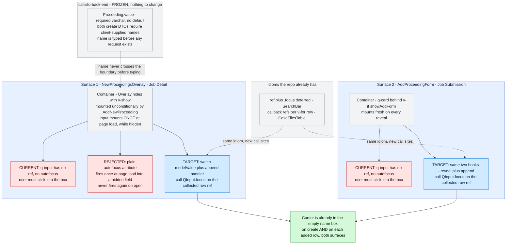
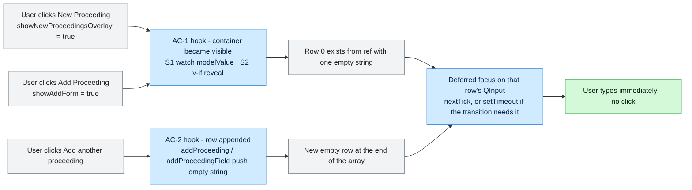
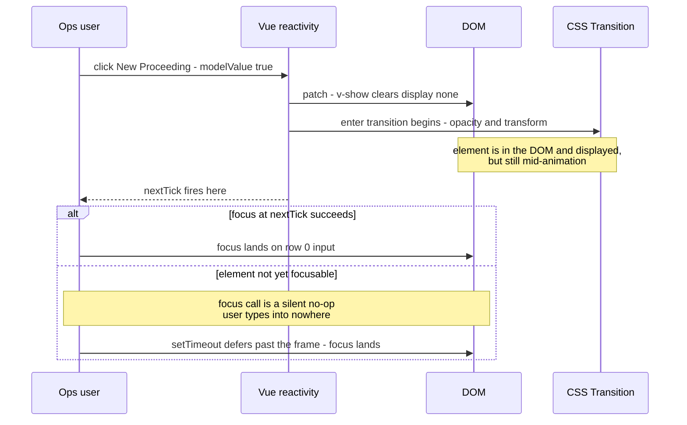

# Diagrams — atlas/PRDV-14184 (PRDV-14184)

> Companion to [PRDV-14184-investigation.md](./PRDV-14184-investigation.md). Each diagram states what question it answers.

## Current vs target

Answers: *why does the same one-line fix work on one create surface and silently fail on the other, and where does the change actually land?* The two surfaces share the same repeater shape but differ in **how their container is hidden** — that difference, not the input, is the whole design constraint.

Read without the prose: the backend is untouched, both surfaces need the same change, the repo already owns the idiom — and the rejected shortcut is drawn in red **inside Surface 1's lane** so it is visible exactly where it would have been applied.

## Flows

Answers: *which code events are the two acceptance criteria, on each surface?* This is the picture that turns "AC-1 and AC-2" into four concrete hook points.

Note the asymmetry the diagram makes concrete: **two user actions map to AC-1** (one per surface) and they are *different mechanisms*, while AC-2 is the same `push('')` shape on both.

## Sequences

Answers: *is there an interleaving where focus lands on the wrong element, or on a detached one?* Not a race between actors — a single-user ordering problem between Vue's DOM update, `v-show`, and the CSS transition. This is the timing question recorded as assumption A5, and the reason the change is not considered proven by unit tests alone.

The failure mode on the right-hand branch is **silent** — `HTMLElement.focus()` on a non-focusable element throws nothing. That is precisely why A5 must be settled by browser observation rather than by a green assertion, and why any `setTimeout` that ships must carry a comment naming the timing constraint it exists for rather than standing as an unexplained delay.

A second interleaving worth stating, which needs no diagram: **remove a row, then add one.** `removeProceeding` splices the array while rows are keyed by index, so a per-row ref map can retain an entry pointing at a detached element. Covered as a negative path in report §9 rather than drawn, because the ordering is linear and prose carries it without loss.
