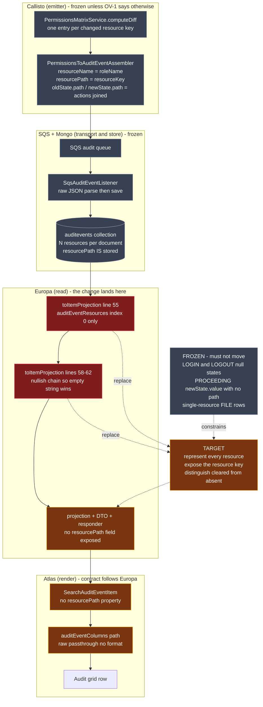
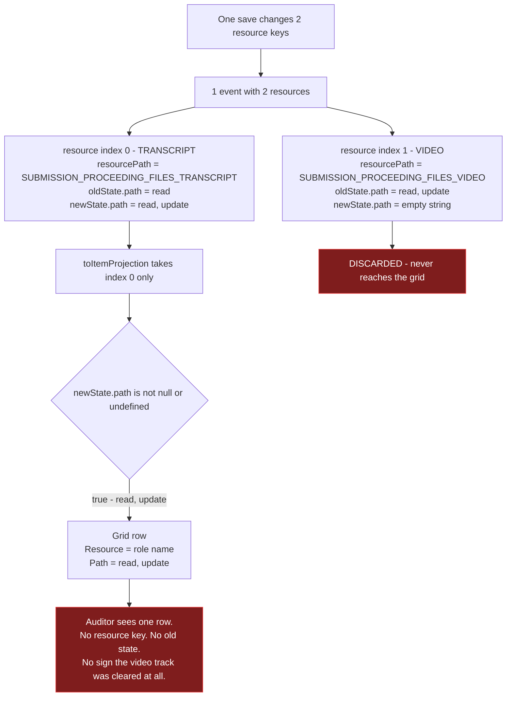
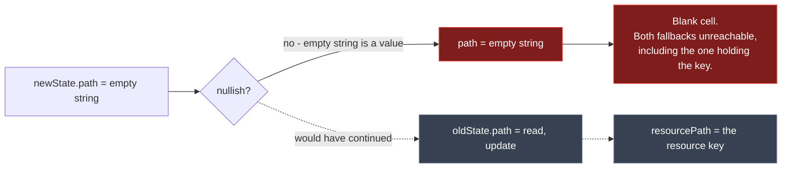
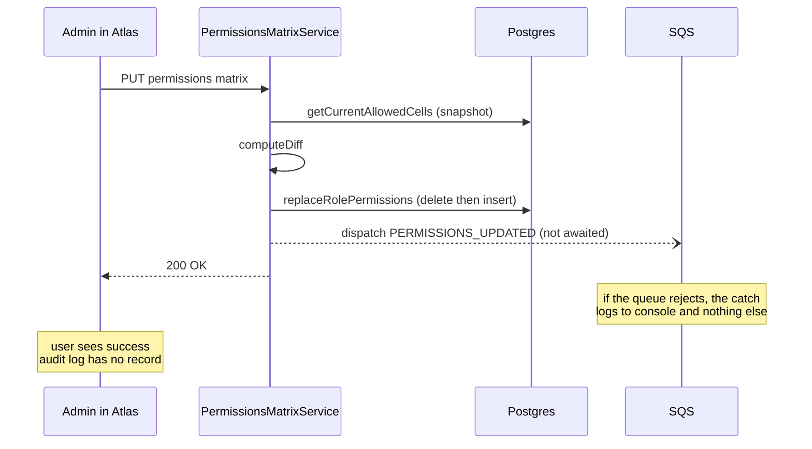
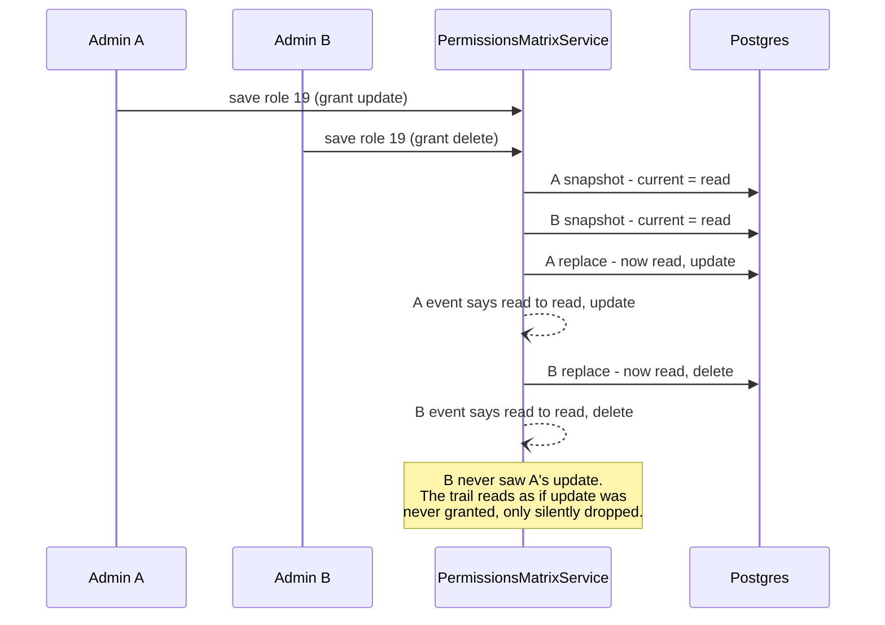

# Diagrams — atlas/PRDV-16192

> Companion to [PRDV-16192-investigation.md](./PRDV-16192-investigation.md). Each diagram states what question it answers.

## Current vs target

What this shows: where a `PERMISSIONS_UPDATED` event loses information on its way to the grid, which lane owns each step, and which steps must stay frozen. Lanes are owners; red is the defect, amber is what changes, grey is frozen.

Reading it: nothing is wrong before the Europa lane. The document in Mongo is complete — it carries every changed resource key in `resourcePath`. Both red nodes discard information that is already present, which is why the fix is retroactive.

## Flows

### 1. What a two-key save actually renders today

What this shows: the exact loss for the ticket's own example — transcript track gains `update`, video track is cleared — and why the blank cell also costs you the key.

### 2. Why the empty string is worse than a blank cell

What this shows: the `??` chain when the *first* resource is the cleared one — the case that produces the ticket's item 3. The chain is a fallback ladder, and `''` is a rung, not a miss.

## Sequences

### 1. Fire-and-forget dispatch — the audit can vanish while the save succeeds

What this exposes: the permission change is persisted *before* the audit event is dispatched, and the dispatch is not awaited by the request. A queue failure logs to console and the user sees a successful save with no audit trail — a silent gap in an audit log, which is the one place silence is unacceptable.

### 2. Two concurrent saves on the same role — the second event's "old" state is wrong

What this exposes: the diff baseline is snapshotted before the replace, and nothing serialises two saves against the same role. If B snapshots before A commits, B's event reports an `oldActions` that never existed at the moment B ran — the audit trail becomes internally inconsistent even though the final permission state is correct.

Both sequences are pre-existing behaviour, not introduced by this ticket, and both are recorded in [future-development concerns](../PRDV-16192-future-development-concerns.md) rather than folded into scope.
