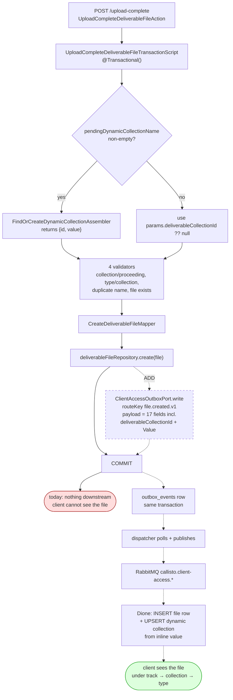
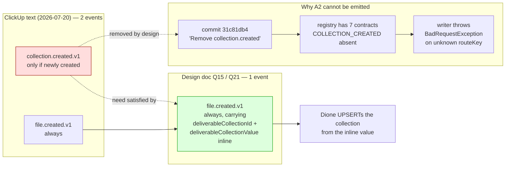
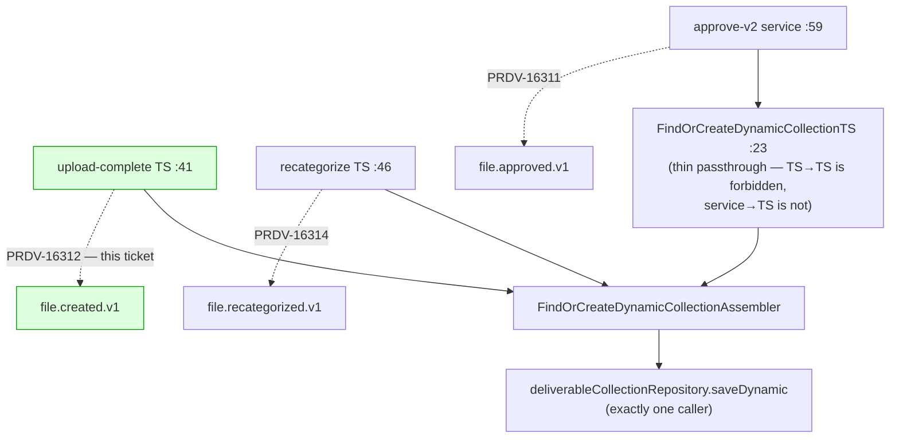
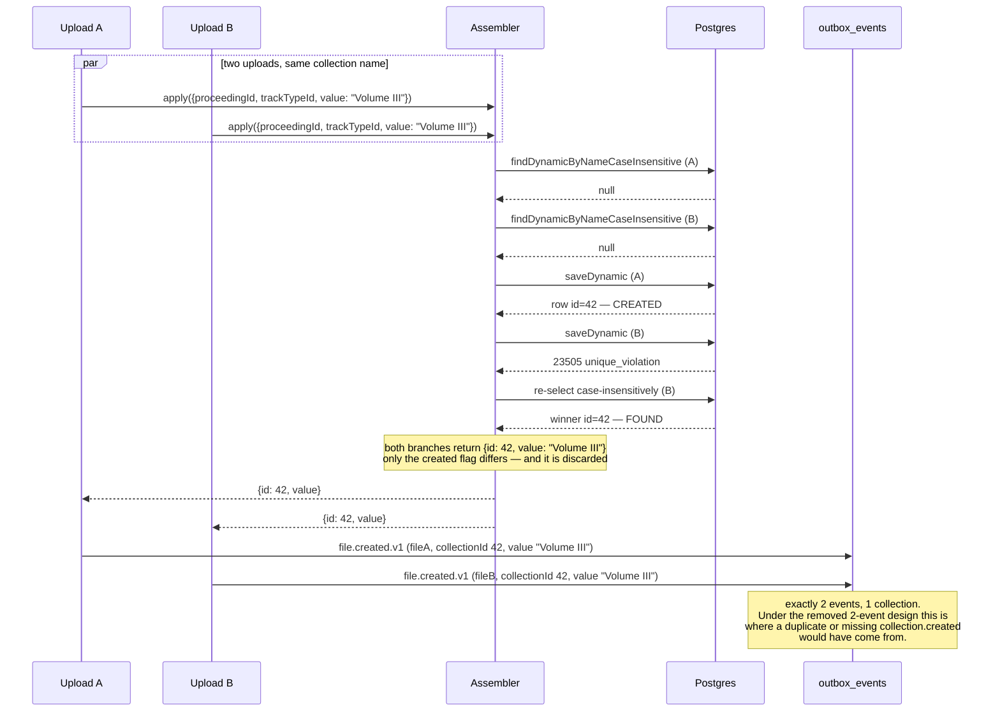
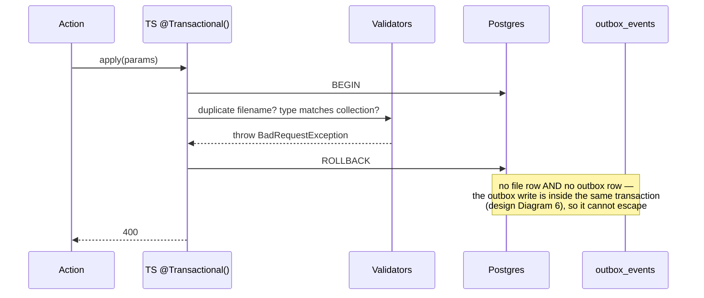

# Diagrams — atlas/PRDV-16312

Companion to [PRDV-16312-investigation.md](./PRDV-16312-investigation.md) §5 and §9. Baseline `71ce3cbf` (callisto `main`).

## Current vs target

The delta is one injected dependency and one call. Everything dashed is what this ticket adds; everything solid exists today.

**What the delta is not:** no second event, no new contract, no registry change, and no change to the assembler's return type. `CALLISTO_CLIENT_ACCESS_FILE_CREATED_V1` is already registered and `CLIENT_ACCESS_OUTBOX` is already provided and exported — it simply has no consumer yet.

## Flows

### The removed event, and where the ticket's second emission went

Why the ClickUp text asks for something that cannot be built, and what replaced it.

### Collection-creation surfaces — three, only one in scope

Protect-the-neighbors set for any change to the assembler.

Completeness is closed by construction: `saveDynamic` has exactly one caller (the assembler), and the assembler has exactly three. Each of the other two carries the same inline collection fields under its own sibling ticket, so the class is covered — not by this ticket.

## Sequences

### Concurrent uploads of the same new collection name (the race)

This is the timing edge case where a created-vs-found conditional would have gone wrong — and the reason the inline design removes the hazard rather than handling it.

**Why this matters to the acceptance criteria.** Story 02 criterion 2 — *"does not make that grouping show up twice for the client"* — is satisfied here by Dione **upserting** on `deliverableCollectionId`, so two events naming collection 42 converge on one row. No ordering guarantee is needed (design Q18).

### Atomicity — a rejected upload must emit nothing

Proves story 01 criterion 5 and report §9's first negative path.

Note the ordering that makes this hold: the emission is placed **after** `deliverableFileRepository.create(file)`, so a validator throw never reaches it, and a persist failure rolls back both writes together.

## N/A

- **Entity-relationship diagram** — N/A. No schema change: no new table, column, or migration. The existing `deliverable_collections`, `files`, and `file_attachments` shapes are read as-is, and `outbox_events` was created by PRDV-16293.
- **State-machine diagram** — N/A. No status field or lifecycle transition is introduced; `file.created` is a one-shot fact, not a state change.
- **Front-end interaction diagram** — N/A. Backend-only ticket; no Atlas surface changes, and the upload UI is untouched.
