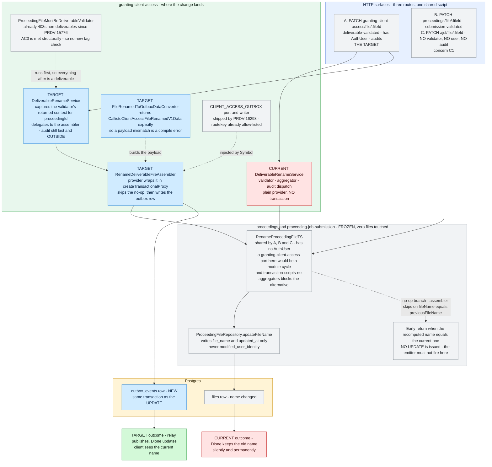
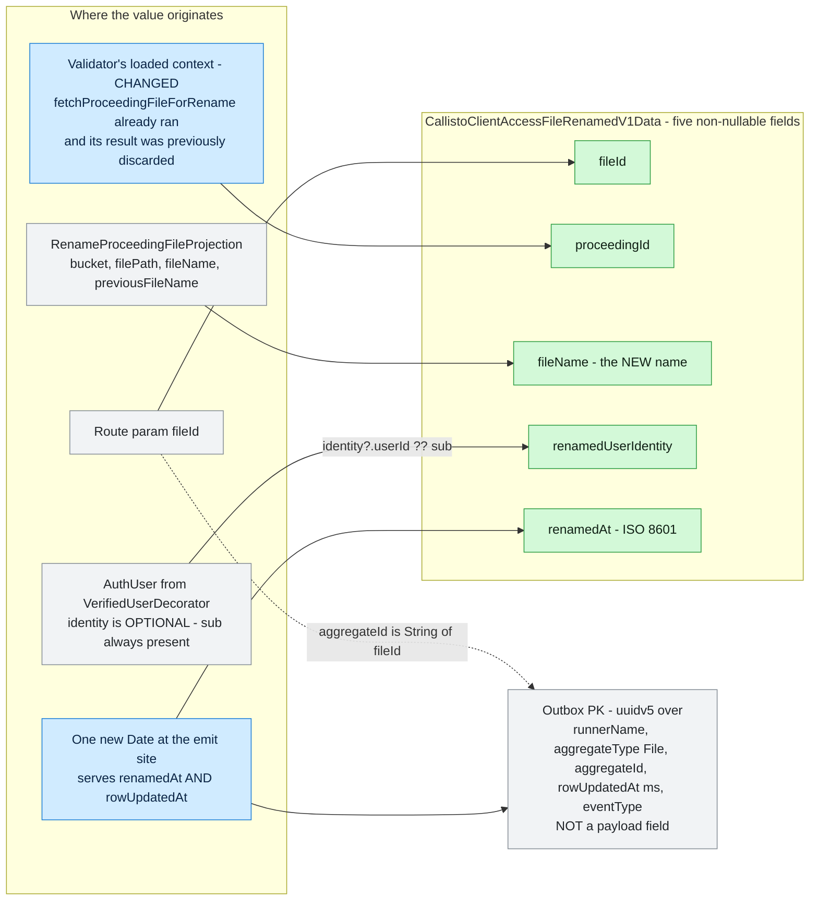
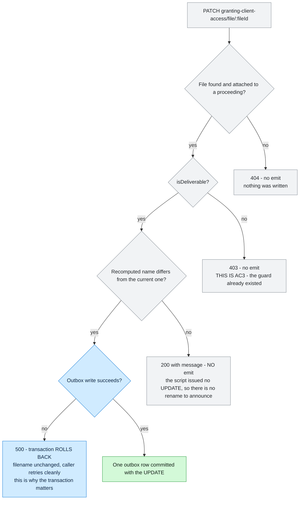
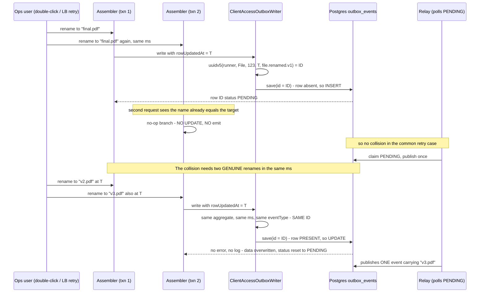
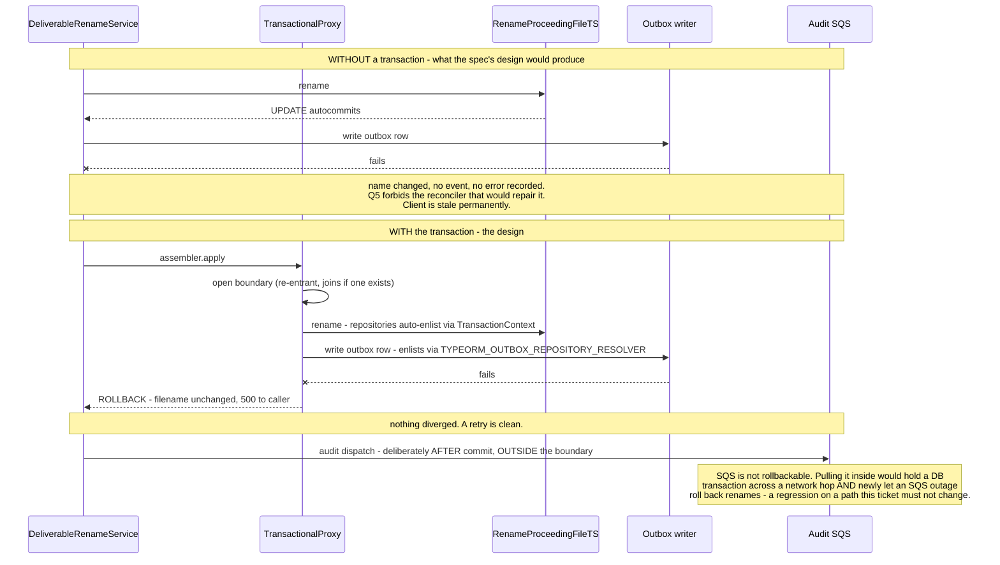

# Diagrams — atlas/PRDV-16313

> Companion to [PRDV-16313-investigation.md](./PRDV-16313-investigation.md). Each diagram states what question it answers.

## Current vs target

**What this shows:** where the emission lands, why it cannot land where the spec says, and what stays frozen. The frozen lane is the whole argument — three HTTP surfaces share one transaction script, so the emit has to sit *above* it in a module that is allowed to depend downward.

Read without the prose: the frozen lane is shared by three routes and holds no user identity, so the emit moves up into the module that owns the port; the deliverable guarantee already exists so no new check is added; and the new outbox row commits with the name change rather than after it.

## Flows

**1. Where each of the five payload fields comes from.** This is the diagram that explains why the validator's return value changed — `proceedingId` exists nowhere else at the emit site without a third query.

The two blue nodes are the entire data-plumbing delta. Everything else was already in scope at the emit site.

**2. The emission decision — three ways to not emit.** Answers "when exactly does nothing get written, and why is each case correct?"

Without the transaction, the `Q_WRITE = no` branch would instead be "200, name changed, no event, forever" — the exact defect this ticket exists to remove, reintroduced by the fix.

## Sequences

**1. The double-submit interleaving — why a duplicate event id is a silent overwrite.** The edge case worth drawing, because the failure only exists in the interleaving and produces no error anywhere.

Two things this diagram is doing. First, it shows the **retry** case is handled by the no-op guard, not by the id — which is why `rowUpdatedAt` is doing far less work here than it appears to. Second, it shows the genuine collision degrades to *one event carrying the correct final name* rather than a lost correction, and that this holds **only because the payload is a state snapshot with no `previousFileName`**. A future `v2` adding that field makes the overwrite lossy. Recorded as concern C7; the underlying `save()` behaviour is report assumption A3, confirmed directionally and still owing a real-Postgres demonstration.

**2. Atomicity — the failure window the spec did not mention.** Answers "what actually differs between emitting inside and outside the transaction?"

The audit dispatch's position is the non-obvious half: the correct answer is *not* "put everything in the transaction."

## Kinds deliberately skipped

- **A separate before/after pair for the current-vs-target picture** — N/A by convention: one figure, shared lanes, two chains.
- **A concurrency sequence for two different files renamed at once** — N/A: the deterministic id includes `aggregateId`, so different files cannot collide, and there is no shared mutable state between them.
- **A relay/dispatcher publication sequence** — N/A: RabbitMQ is descoped epic-wide and the producer's obligation ends at the `outbox_events` row. The relay appears in the collision diagram only far enough to establish that the overwrite happens before publication.
