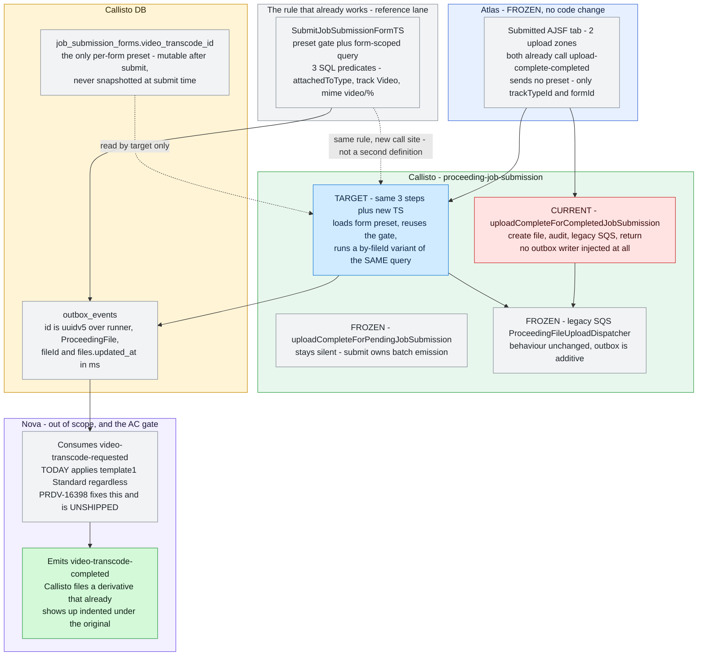
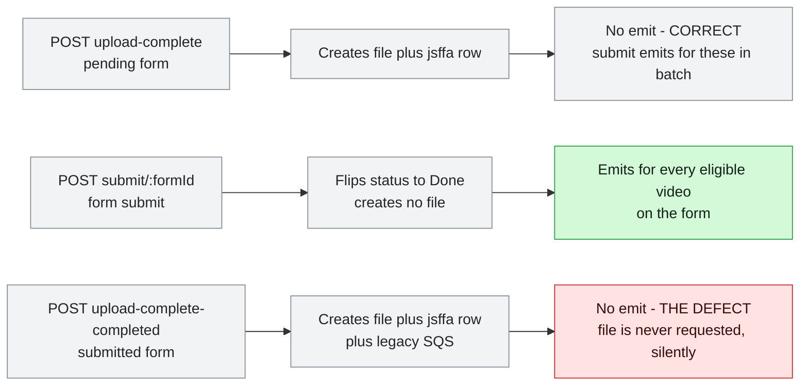
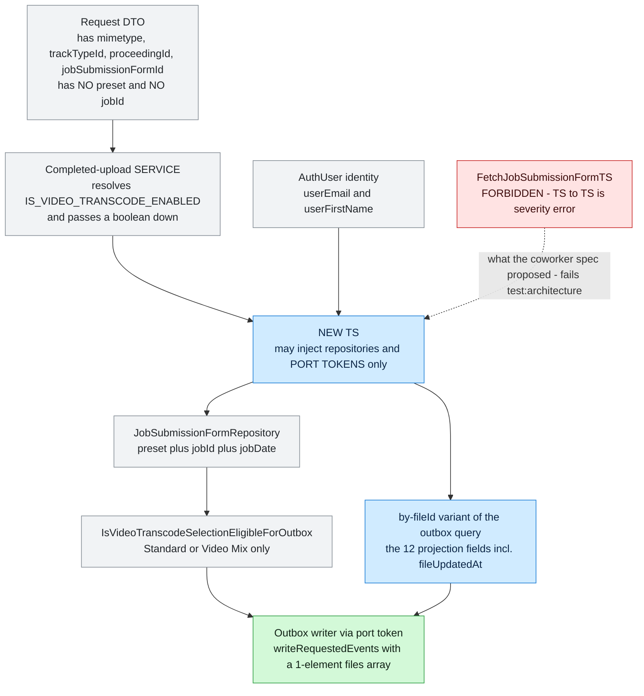
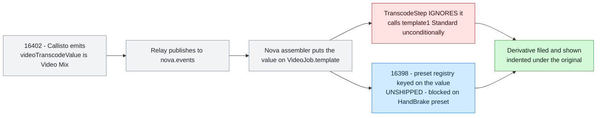
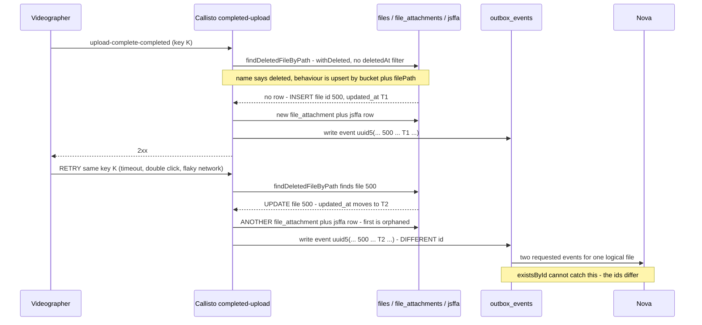
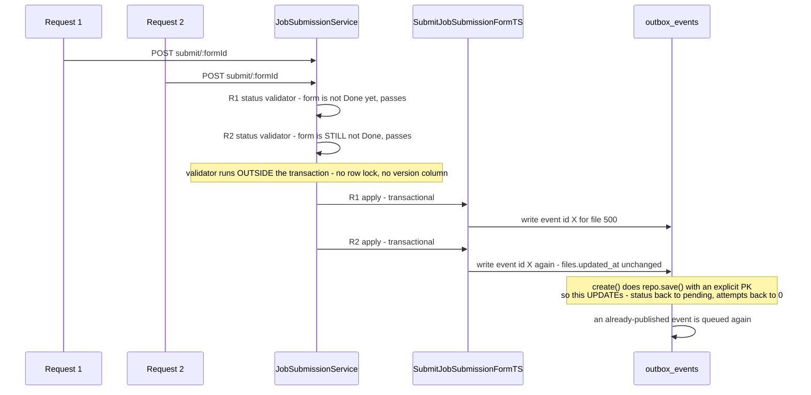
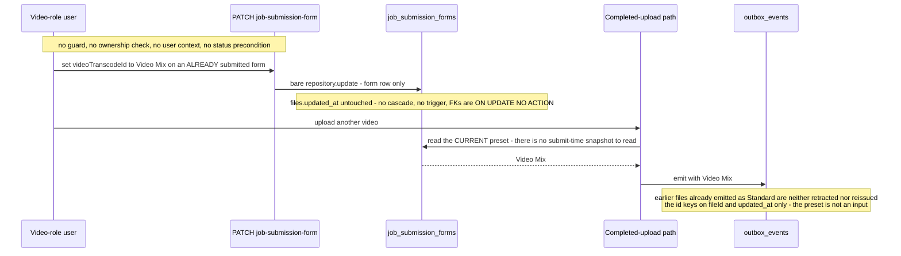
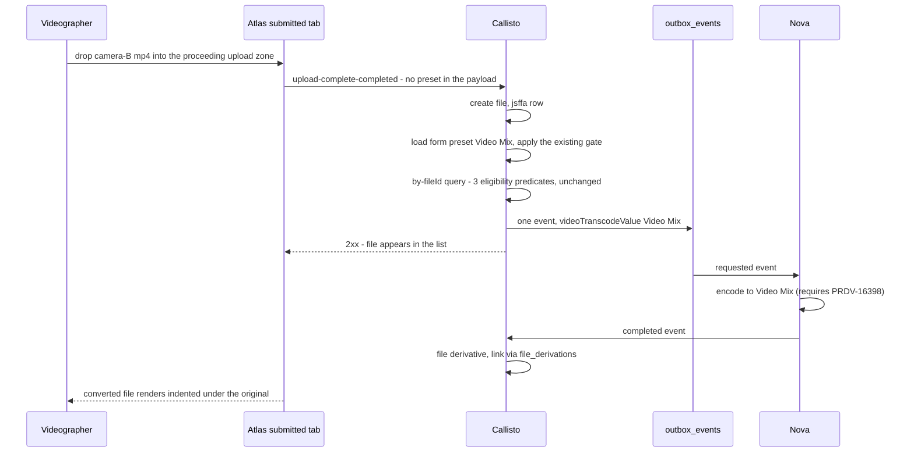

# Diagrams — atlas/PRDV-16402

> Companion to [PRDV-16402-investigation.md](./PRDV-16402-investigation.md). Each diagram states what question it answers.

## Current vs target

**Question answered:** which of the three file-creating paths emits a transcode request today, what exactly changes, and what must stay frozen? The eye should land on one lane — Callisto's completed-upload path — and on the fact that the *rule* is reused rather than rewritten.

Read without the prose: Atlas is untouched, the eligibility rule already exists and gains a call site rather than a copy, the pending path and legacy SQS are explicitly frozen, and the green outcome sits behind a lane whose label says the companion ticket is unshipped.

## Flows

**Flow 1 — the three file-creating paths and which one emits.** Question answered: why is this a coverage gap rather than a missing feature? Three paths write AJSF proceeding files; only one emits, and one of the two silent ones is *correctly* silent.

**Flow 2 — where each writer input comes from on the new path.** Question answered: what does the new transaction script actually need, and where can each value legally be read from? This is the flow that killed the coworker spec's shape — the form load must come from a repository, not from another transaction script.

**Flow 3 — the round trip, and where PRDV-16398 sits.** Question answered: why can this ticket not satisfy its own acceptance criterion?

The red node is what makes AC8 unverifiable today: 16402 gets the correct value all the way to Nova, and Nova throws it away.

## Sequences

**Sequence 1 — upload retry, the real duplicate-emission vector.** Question answered: why does an `existsById` guard not help? Because the retry changes `files.updated_at`, so the second event has a **different** id and no same-id guard can see it.

**Sequence 2 — concurrent submit, the same-id republish window.** Question answered: what is the residual risk left by the re-submit guard, and is it introduced by this ticket? It is pre-existing — the validator runs outside the transaction — and it is the interleaving where a duplicate id *does* occur, with an UPDATE that resurrects a published row.

**Sequence 3 — post-submit preset edit, and why the event id cannot see it.** Question answered: what does "matching the conversion specs from the *initial* submission" actually resolve to? To the *current* value — and a changed preset is invisible to the deterministic id, because the preset is not one of its inputs.

**Sequence 4 — the happy path, for contrast.** Question answered: what does success look like end to end, once PRDV-16398 has shipped?

