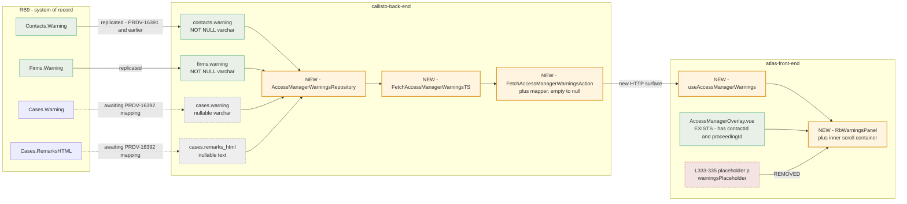
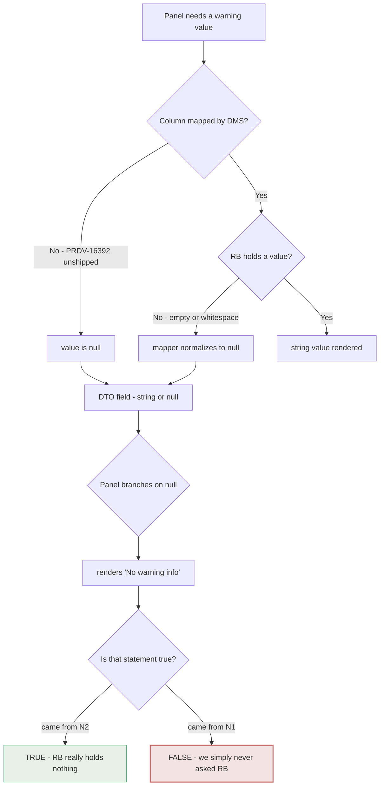
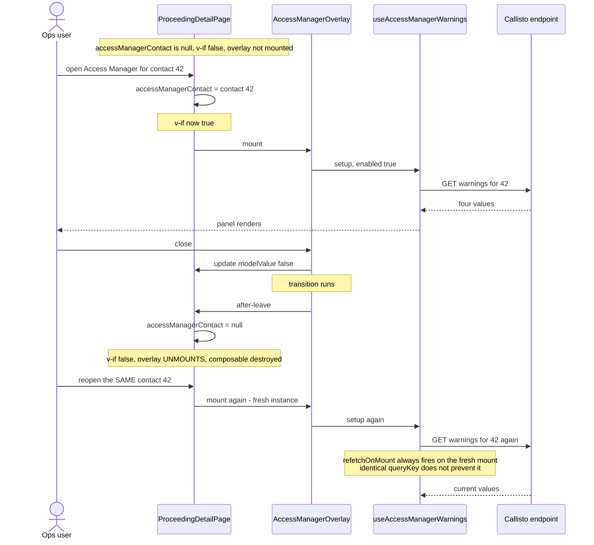

# Diagrams — atlas/PRDV-16403

Companion to [PRDV-16403-investigation.md](./PRDV-16403-investigation.md), which links here from §5 rather than embedding. Every diagram answers a named question; syntax follows the gotchas in `current-vs-target-diagram.md` (no colons in edge labels, no raw angle brackets, quoted node labels).

---

## Current vs target

**Question it answers:** what actually has to be built, given that the panel, the context and the data all already exist?

**Read it this way:** solid green already exists. Orange is the delta — five new units, and *nothing else*. Grey dashes are columns that exist but whose data has not been mapped yet (PRDV-16392). The dashed red node is the placeholder being retired, and retiring it is what breaks `AccessManagerOverlay.spec.ts` L186.

**The point of the diagram:** the delta is narrow and entirely additive on the backend. That is the visual case for the reclassification in report §1 — this is a wire, not a capability.

---

## Flows

**Question it answers:** where does a `null` come from, and can the reader of that `null` tell which cause produced it? (Finding F1.)

**Why this is the ticket's sharpest problem:** the two paths converge at `DTO` and are **indistinguishable downstream**. The panel has one branch and one string for two different truths. Until PRDV-16392 ships, every case warning and every case remark takes the left path — so the copy the request specifies asserts something false in every environment. Decision **D1** owns the fix; the structural fact that it cannot currently be told apart is settled.

---

## Sequences

**Question it answers:** does reopening the Access Manager for the same contact actually re-read RB, and which cache option is doing the work? (Finding F2.)

**What the sequence proves:** freshness is delivered by the **unmount/remount cycle**, not by cache tuning. `refetchOnMount: 'always'` fires because the mount is genuinely new, so `staleTime: 0` is redundant. The option that earns its place is **`gcTime: 0`** — without it the cached previous response can paint for a frame before the refetch resolves, which for a *warning* means briefly showing the wrong contact's caution. `gcTime` appears nowhere else in the repo, so this is the one deliberate novelty in the composable.

**Race and timing edge cases covered by this diagram:** the `after-leave` reset is asynchronous (it waits on the transition), so a fast close-then-reopen can in principle remount before the reset lands. Worth a scenario in the test plan; the `enabled` guard (`contactId != null`) is what should absorb it.

---

## Kinds not produced

- **State diagram — N/A.** Nothing here holds multi-state lifecycle worth modelling; the panel has four independent value slots, each in one of three conditions (value / empty / failed), and the flow diagram above already captures the only branch that carries risk.
- **ER / schema diagram — N/A.** The join shape (`Contact → Firm` via `account_id`; `Proceeding → Job → Case` via `job_id` / `case_id`) is three edges and is stated in prose in report §6 and coverage-ledger area 6. A diagram would restate it without adding anything.
