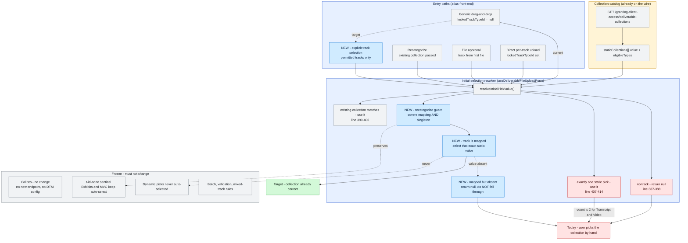
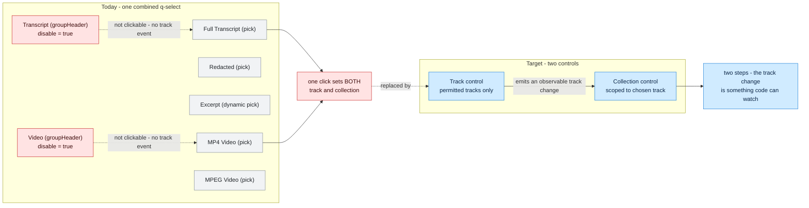
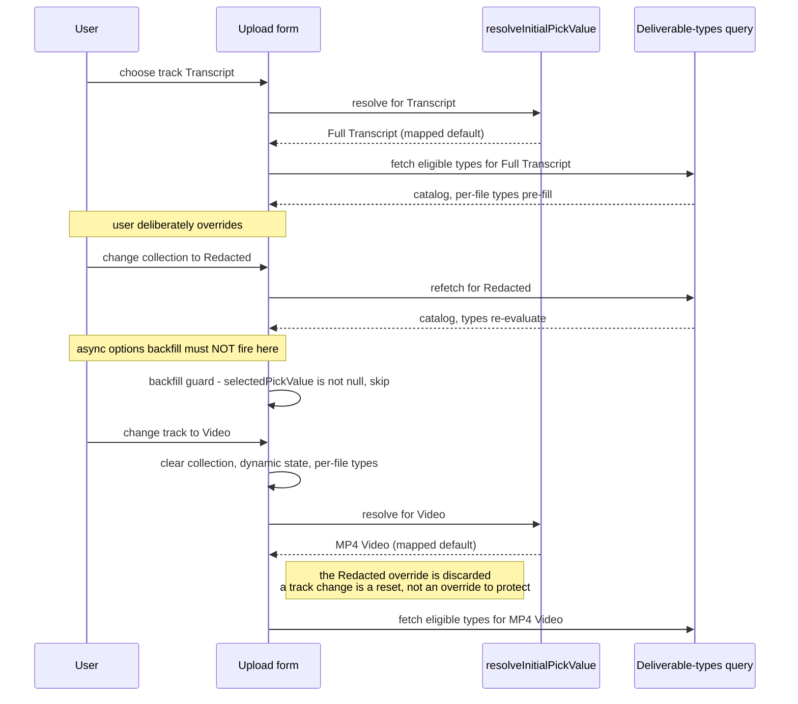

# Diagrams — atlas/PRDV-16461

> Companion to [PRDV-16461-investigation.md](./PRDV-16461-investigation.md). Each diagram states what question it answers.

## Current vs target

**Question answered:** where does a collection default come from today, why does it never appear for Transcript or Video, and which parts change versus stay frozen?

**What to read from it.** The red chain is today: a track with two static collections fails the `matches.length === 1` test and falls out to a manual pick. Generic drag-and-drop fails even earlier, at the no-track return. The blue nodes are the change — a track-selection state for drag-and-drop, a mapped lookup ahead of the singleton rule, an explicit blank on a missing mapped value, and a guard that covers both the new mapping and the pre-existing singleton rule. Everything grey is untouched, including the whole backend and the collectionless-track sentinel that Exhibits and MVC depend on.

## Flows

**Question answered:** in the current combined picker, what is actually selectable — and why is "select a track" not an event the code can observe?

**What to read from it.** Track headings exist visually but carry `disable: true`, so the only selectable rows are individual collections. Choosing one sets track and collection in the same act, which is why there is no "user selected a track" moment for a default to react to. The target splits that into two steps so the track change becomes observable.

## Sequences

**Question answered:** what is the ordering hazard when the user changes the track after the collections query has already resolved and they have made a manual override?

**What to read from it.** Two guards sit in tension and the order matters. The existing async backfill must never overwrite a deliberate choice, so it checks that nothing is selected before acting. But a **track change** must overwrite that same choice, because the override belonged to the previous track. The spec states this explicitly: preserve an override only while the track is unchanged.

**Race conditions:** N/A — this is single-user, single-tab, client-side state. There is no concurrent writer, no shared mutable server state on this path, and no retry window. The only interleaving that matters is the local one drawn above.
