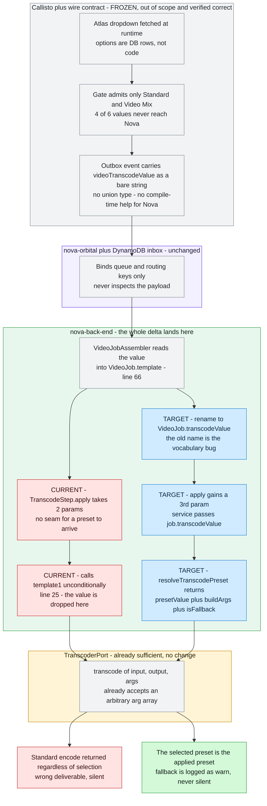
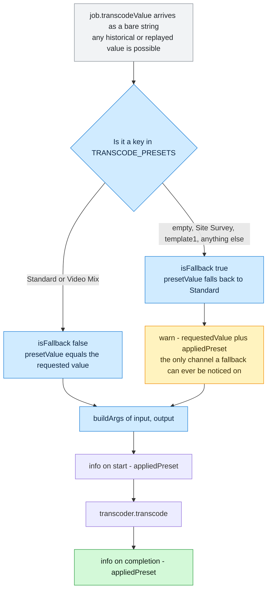
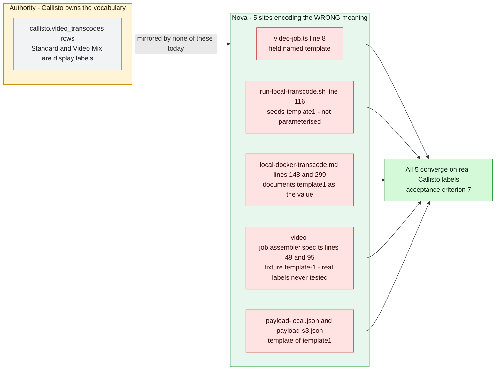

# Diagrams — nova/nova-applies-selected-transcode-preset

> Companion to [PRDV-16398-investigation.md](./PRDV-16398-investigation.md). Each diagram states what question it answers.

## Current vs target

**Question answered:** where does the customer's selection get dropped, which parts change, and which parts are frozen? One figure — Callisto and the wire contract are off-limits by scope, so the delta must land entirely inside Nova, at exactly one hop.

**Read it without the prose:** the selection survives Callisto, transport, and Nova's assembler intact — grey the whole way. It dies at one red hop. The port that would carry the fix already exists, so the blue chain adds no new boundary; it only fills the seam that was never opened.

## Flows

### 1. Resolution and fallback — the decision the code currently cannot make

**Question answered:** what exactly does the new resolution boundary decide, and where does the `warn` come from? This is the branch that does not exist today at all — `TranscodeStep` has no conditional of any kind.

**The load-bearing subtlety:** the fallback branch is currently **unreachable in production** — Callisto's gate admits only the two known values. It is built anyway because the option list is data, not code (report §8, A6): a new row in `callisto.video_transcodes` becomes selectable in Atlas with no code change in any repo. Note also that `template1` sits on the *miss* branch — that is Nova's own documented local test value, and the reason the vocabulary convergence is a correctness requirement rather than tidiness.

### 2. The vocabulary mismatch — why the class was reframed

**Question answered:** what does "contract vocabulary mismatch" mean concretely, and which sites carry the wrong meaning? This is the diagram that justifies the reclassification in report §1.

**Why this earns a diagram:** it is the difference between the assumed class and the confirmed one. Under "the consumer was never built," none of these five boxes exist as findings. Under "the consumer speaks the wrong vocabulary," they are the change set — and W2, W3, and W5 are the ones that would make the ticket's own verification pass against the wrong branch.

## Sequences

**N/A — there is no interleaving to expose.** Nova is a one-shot ECS/Fargate task: `onModuleInit` claims exactly one inbox event, transcodes one file, and calls `process.exit` (report §8, A8). One job per invocation, no concurrent access to shared state, no retry overlap inside the process, and no double-write window in the preset path. The inbox claim is already guarded by a conditional DynamoDB update (`claimDispatchedById`), and this change does not touch it. Recording the N/A explicitly rather than omitting the section, since "no race exists here" is itself a finding a reviewer should not have to re-derive.
