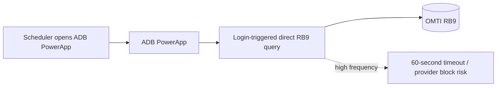
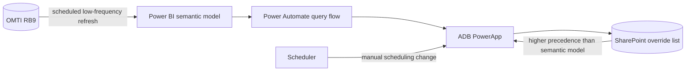
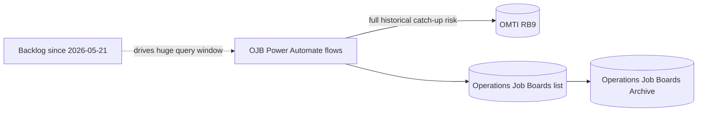
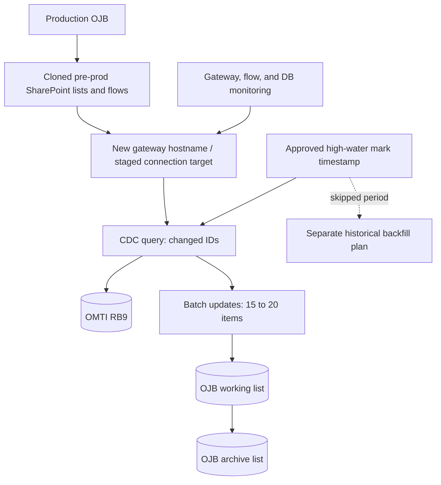
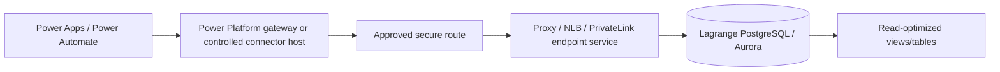
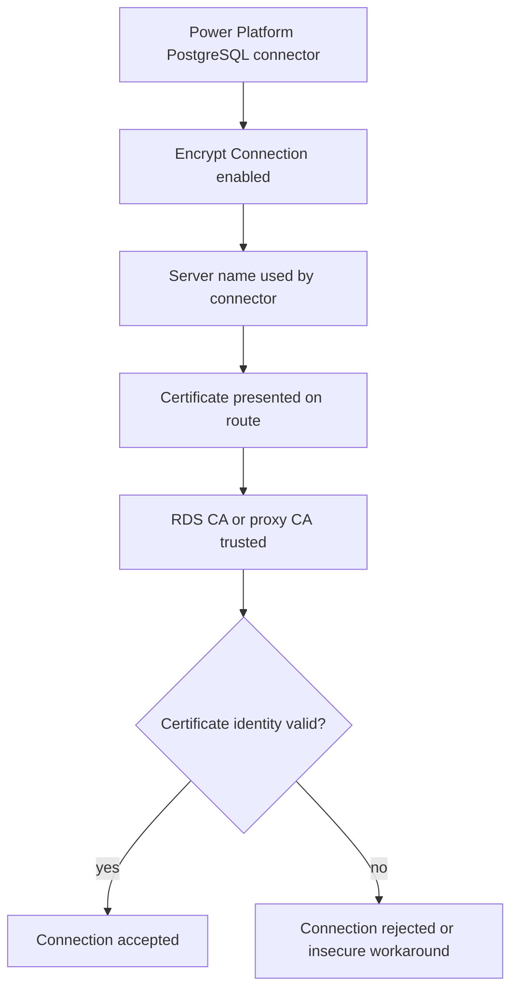

# Architecture Map

Status: Draft  
Prepared: 2026-07-06

These diagrams are text-first maps for planning. They should be validated against Power Platform, SharePoint, gateway, and AWS console state before use as final architecture.

## ADB Current Problem

Problem: ADB was tightly coupled to RB9 and could trigger expensive source queries during user interaction.

## ADB Near-Term Recovery

Key design rule: semantic model data is the base state; SharePoint overrides are immediate and win in the UI until reconciled.

## OJB Current Problem

Problem: reconnecting all flows without controlling the high-water mark can force a massive catch-up query and create a timeout loop.

## OJB Staged Recovery

Key design rule: restore forward-looking delta polling first; handle the May 21 through restoration-date gap as a separate backfill.

## Lagrange/AWS Fallback Candidate

Key design rule: no direct public inbound database exposure. The exact route remains a PoC decision.

## Lagrange TLS Decision Point

Open decision: determine whether the connector can validate the certificate identity across the selected gateway/proxy/NLB path without weakening security.

## Dependency Inventory Template

| Area | Item | Current lead | Needs confirmation |
| --- | --- | --- | --- |
| ADB source | Power BI semantic model matching `VQM jobs` and `VQM jobs tests` | Internal note | Owner, workspace, refresh schedule, fields |
| ADB override | SharePoint temporary ADB statuses/override list | Local WorkLists lead | Schema, retention rule, permissions |
| OJB lists | Operations Job Boards and Operations Job Boards Archive | Local WorkLists lead | URLs, item counts, indexed fields, views |
| OJB flows | RB Dispatcher, cleanup, and reconciliation flows | Local WorkLists lead | Trigger cadence, queries, connection refs, retry policy |
| Gateway | New hostname / staged cutover route | Internal note | Version, admins, data sources, network tests |
| Lagrange | PostgreSQL views/tables in TST | Internal note | PR status, schema, least-privilege role |
| Security | Credential rotation and connection sharing | Internal note | Actual shared users, secret locations, rotation status |
